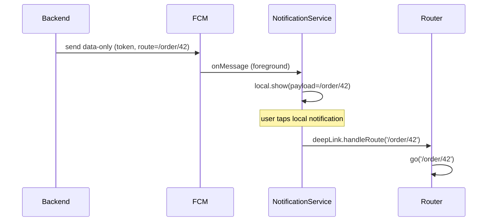

# Notifications Integration (Capstone: One Service Ties It Together)

> The maintainable shape: a single **`NotificationService`** that owns permissions, FCM setup + token sync, the three-state handlers, foreground rendering (delegating to the local-notifications plugin), and the deep-link funnel — exposing a small API (`init`, `subscribe`, entitlement/route stream) to the app while the **backend owns targeting/sending**. This unifies local + push + routing into one testable seam instead of scattered `firebase_messaging`/`flutter_local_notifications` calls.

## Introduction

This module capstone composes local notifications, FCM, message types, and deep-link handling into one architecture. Each piece is tricky alone; together they must cooperate (foreground FCM → local notification → tap → route). A `NotificationService` centralizes this so the rest of the app stays ignorant of the plumbing. This file shows the service design and the end-to-end flow.

## Why this concept exists

Notification code is stateful (permissions, tokens), multi-isolate (background handler), state-dependent (foreground/background/terminated), and cross-cutting (routing, auth). Scattering it across widgets/services makes it untestable and fragile. One service with a clean API — like repositories for data — isolates the mess behind a boundary consistent with clean architecture ([Module 40](../40%20Clean%20Architecture/README.md)).

## Real-world analogy

The `NotificationService` is the **mailroom** of the app: it handles the address book (tokens/permissions), sorts incoming mail by how it arrived (foreground/background/terminated), decides what to display (local rendering), and routes each item to the right desk (deep links). The rest of the company just says "subscribe me to deals" or "here's where a tap should go" — they don't run the mailroom.

## Problem Statement

Deliver: FCM push shown in all three states, foreground push rendered via a local notification, taps deep-linking through `go_router` (incl. cold start), topic subscription for broadcasts, scheduled local reminders, permission handling, and token sync — all behind one `NotificationService` with the backend sending. You'll compose every file in this module.

## Internal Working

```mermaid
flowchart TD
    App[App / features] --> Svc[NotificationService]
    Svc --> Perm[permissions (Android13+/iOS)]
    Svc --> FCM[firebase_messaging: token sync + 3-state handlers]
    Svc --> Local[flutter_local_notifications: render + schedule]
    Svc --> Deep[DeepLinkRouter -> go_router]
    FCM -->|foreground onMessage| Local
    FCM -->|tap / launch| Deep
    Local -->|tap| Deep
    Backend[your backend] -->|send (token/topic)| FCM
```

- **`NotificationService` responsibilities**:
  - **Permissions**: request + expose status; degrade gracefully ([27](../27%20Native%20Android/permissions_and_manifest.md)/[28](../28%20Native%20iOS/infoplist_and_permissions.md)).
  - **FCM**: `getToken`/`onTokenRefresh` → backend; register the top-level background handler before `runApp`; wire `onMessage`/`onMessageOpenedApp`/`getInitialMessage` ([fcm_push.md](fcm_push.md)).
  - **Foreground rendering**: on `onMessage`, build a **local notification** (channel + payload = route) so foreground push is visible + tappable ([local_notifications.md](local_notifications.md)).
  - **Deep links**: feed every tap into the `DeepLinkRouter` funnel with cold-start deferral → `go_router` ([handling_and_deeplinks.md](handling_and_deeplinks.md)).
  - **Topics/scheduling**: `subscribe/unsubscribe`, `scheduleReminder(...)`.
- **Backend owns sending/targeting** (data-only/hybrid, token/topic, server key) ([message_types_and_targeting.md](message_types_and_targeting.md)); the client never sends.
- **Bootstrap order**: init Firebase → register bg handler → init local plugin (+channels) → request permission → sync token → wire handlers → (later) `deepLink.attach(router)`.
- **Testability**: depend on abstractions (a messaging interface, a local-notifications interface, a router) so the service is unit-testable with fakes (assert: foreground message → local notification shown; tap → route handled).

## Memory Representation

The service holds init state, the token, permission status, and the single pending route. Background messages run in their own isolate (minimal handler). Notifications live in the OS.

## Compiler Behavior

Background handler is a top-level `@pragma('vm:entry-point')`; the service otherwise compiles against interfaces (mockable).

## Runtime Behavior

The service orchestrates async setup + event handlers; foreground push renders locally; taps route (deferring cold start). Backend fan-out is best-effort; the app reconciles important state rather than trusting a single push.

## Flutter Engine Behavior

One UI isolate (service + handlers + rendering) and one background isolate (terminated/background data handler); notifications and taps bridge native ↔ Flutter.

## Dart VM Behavior

Two isolates as in [fcm_push.md](fcm_push.md); the service's state lives only in the UI isolate.

## Examples

```dart
class NotificationService {
  final MessagingClient messaging;       // wraps firebase_messaging (mockable)
  final LocalNotifier local;             // wraps flutter_local_notifications
  final DeepLinkRouter deepLink;
  final Backend backend;
  NotificationService(this.messaging, this.local, this.deepLink, this.backend);

  Future<void> init() async {
    await local.init(onTap: deepLink.handleRoute);           // local taps -> route
    await messaging.requestPermission();                     // + handle denial
    await backend.syncToken(await messaging.getToken());
    messaging.onTokenRefresh(backend.syncToken);

    // Foreground: render a local notification (visible + tappable)
    messaging.onMessage((m) => local.show(
      title: m.title, body: m.body, payload: m.data['route']));

    // Taps: background + terminated launch -> funnel
    messaging.onMessageOpenedApp((m) => deepLink.handleRoute(m.data['route']));
    deepLink.handleRoute((await messaging.getInitialMessage())?.data['route']);
  }

  Future<void> subscribe(String topic) => messaging.subscribeToTopic(topic);
  Future<void> scheduleReminder(DateTime at, String route) =>
      local.schedule(at: at, payload: route);
}
// Bootstrap: Firebase.initializeApp -> messaging.registerBackgroundHandler(_bg) -> service.init()
// App build: deepLink.attach(router);
```

```dart
// Unit test with fakes — no device/Firebase
test('foreground push renders a local notification', () async {
  final local = FakeLocalNotifier();
  final svc = NotificationService(FakeMessaging(), local, DeepLinkRouter(), FakeBackend());
  await svc.init();
  FakeMessaging.emitForeground({'route': '/order/42'}, title: 'Shipped');
  expect(local.shown.single.payload, '/order/42');
});
```

## Diagrams



## Common Mistakes

| Mistake | Why | Fix |
|---------|-----|-----|
| Scattered messaging/local calls | Untestable, inconsistent | One `NotificationService` |
| No foreground rendering | Push invisible when app open | Render local notification on `onMessage` |
| Wrong bootstrap order | Bg handler/permission/token issues | Firebase → bg handler → local → perm → token → handlers |
| Router attached too late/never | Cold-start taps lost | `deepLink.attach(router)` on build |
| Client-side sending | Security | Backend sends; client subscribes/reports |
| No graceful denial handling | Crash/blank | Handle permission denial |
| Untestable (direct plugins) | Needs device | Depend on interfaces + fakes |

## Best Practices

- Put **all** notification concerns in **one `NotificationService`** with a small API; depend on **interfaces** (messaging/local/router) for testability.
- Follow the **bootstrap order** (Firebase → bg handler before `runApp` → local init/channels → permission → token sync → handlers → `attach` router).
- **Render foreground push locally**, funnel every tap into the **deep-link router** (cold-start deferral), and let the **backend own targeting/sending** (data-only/hybrid).
- Handle **permission denial** gracefully; **reconcile** important state in-app (don't rely on a single best-effort push); write **unit tests with fakes**.

## Performance

Push is event-driven (battery-friendly); the service adds no overhead. Keep the background handler minimal; don't over-notify (throttle/collapse). Reconcile via in-app fetches rather than depending on delivery.

## Advantages / Disadvantages

- **+** Testable, consistent, single seam for local+push+routing; permission/token/state handling in one place; backend-controlled sending.
- **−** Upfront structure/boilerplate, strict bootstrap ordering, multi-isolate constraints, best-effort delivery to design around.

## Interview Questions

1. **🟢 Why centralize notifications in one service?** — Notification code is stateful, multi-isolate, state-dependent, and cross-cutting; one service makes it consistent and testable instead of scattered plugin calls.
2. **🟢 How is a foreground push made visible and tappable?** — On `onMessage`, render a local notification whose payload carries the route; its tap feeds the deep-link router.
3. **🟡 What's the correct bootstrap order?** — Firebase init → register top-level background handler before `runApp` → init local plugin/channels → request permission → sync token → wire handlers → attach router.
4. **🟡 How do you make the service testable?** — Depend on interfaces (messaging/local/router) and inject fakes; assert foreground→local-render and tap→route.
5. **🟡 Who sends notifications and why?** — The backend (secret key, targeting); the client only subscribes to topics and reports tokens.
6. **🔴 How do all pieces cooperate for an order-shipped push?** — Backend sends data-only (route) → foreground renders local / background tray → tap funnels to `go_router` → order screen (deferred if cold start).
7. **🔴 Why reconcile state in-app rather than trust the push?** — Delivery is best-effort; the app should fetch/verify important state so a missed/late push doesn't leave stale data.

## Senior Engineer Tips

- Nail the bootstrap order and the router `attach` first — most "notifications are flaky" reports are ordering/cold-start bugs, not delivery.
- Keep the service behind interfaces so CI can test the foreground-render and tap-routing logic without a device or Firebase.
- Treat push as a hint to refresh, not a data source: reconcile in-app so best-effort delivery never corrupts state.

## Architect Perspective

Notifications integration applies the same boundary discipline as the rest of the app to an unusually stateful, multi-isolate domain: one service owns permissions, tokens, the three-state handlers, foreground rendering, and deep-link routing; the backend owns targeting/sending. This yields reliable re-engagement, a testable seam, and clean cooperation between local and push — consistent with clean architecture and the app's routing/auth infrastructure ([Module 40](../40%20Clean%20Architecture/README.md), [Module 13](../13%20Routing/README.md), [Module 17](../17%20Authentication/README.md)).

## Summary

- One `NotificationService` owns permissions, FCM token sync, three-state handlers, foreground local rendering, scheduling, topics, and the deep-link funnel.
- Backend owns targeting/sending (data-only/hybrid); client subscribes/reports tokens.
- Follow the bootstrap order, defer cold-start routing, handle denial, reconcile in-app, and test with fakes.

## Revision Notes

- Service centralizes: permissions, `getToken`/`onTokenRefresh`→backend, bg handler (top-level), `onMessage`→local render, taps→`DeepLinkRouter`, topics, scheduling.
- Bootstrap: Firebase → bg handler (before `runApp`) → local init/channels → permission → token → handlers → `deepLink.attach(router)`.
- Backend sends (data-only/hybrid, token/topic); reconcile important state in-app; interfaces + fakes for tests.

## Practice Questions

1. What does the `NotificationService` own, and what does the backend own?
2. What is the correct bootstrap order and why?
3. How do local + FCM + routing cooperate for a foreground push tap?

## Coding Questions

1. Design a `NotificationService` over messaging/local/router interfaces.
2. Implement the foreground `onMessage` → local render → tap → route path.
3. Write a unit test (fakes) asserting tap → correct route.

## Mini Project

**Unified notifications (capstone — Flutter + Firebase + backend):** Build a `NotificationService` composing FCM (token sync, three-state handlers), local notifications (foreground rendering + scheduled reminders + channels), topic subscription, and the `DeepLinkRouter` funnel into `go_router` — with the backend sending data-only/hybrid pushes by token/topic. Provide interfaces + fakes and unit tests. Acceptance: push handled in all three states; foreground rendered locally + tappable; taps deep-link (incl. cold start) to the right screen; topic broadcast + scheduled reminders work; permissions handled; backend-only sending; unit-tested with fakes; runs end-to-end on a device.
