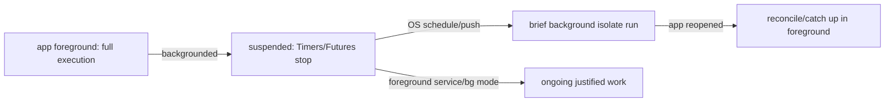

# The Background Execution Model (Why It's Restricted)

> Mobile OSes treat background execution as a **scarce, revocable privilege**, not a right: to protect battery/data/privacy they suspend apps aggressively, meter background time, and kill misbehavers. Background work runs in a **separate Dart isolate** with its own memory (no UI, no app singletons/state), timing is **best-effort** (not guaranteed), and the platforms diverge sharply — so the correct mental model is *"schedule deferrable work, keep it short, and catch up in the foreground when it inevitably doesn't run on time."*

## Introduction

Before any plugin, you must understand *why* background work is hard and what's even possible. This file covers the OS rationale (battery/doze/app standby), the background-isolate model (and its no-shared-state constraint), the spectrum from deferrable to continuous work, and the Android/iOS divergence — the foundation for every later file.

## Why this concept exists

Early mobile apps drained batteries with unrestricted background activity. OSes responded with **Doze/App Standby (Android)** and **strict background budgets (iOS)**: apps are suspended when not in use, background execution is batched/metered, and continuous work requires explicit justification (foreground service / background mode). This model exists to make phones last a day.

## Real-world analogy

Background execution is like **after-hours building access**: you don't get free rein. Most tasks go on a **"do it whenever convenient" list** the facilities team batches overnight (deferrable/WorkManager/BGTask). Truly ongoing presence (a night guard on patrol) requires a **visible, justified badge** (foreground service / background mode) — and even then security can revoke it if you abuse it (OEM battery killers).

## Problem Statement

Decide whether "sync every hour," "track a run continuously," and "process on push" are even feasible in the background, understand why a naive `Timer`/`Future` won't run when the app is killed, and design work to survive the OS's restrictions. You'll map work types to what the OS allows.

## Internal Working

```mermaid
flowchart TD
    Work{work type}
    Work -->|deferrable/periodic (sync, cleanup)| Sched[OS-batched scheduler (WorkManager / BGTaskScheduler)]
    Work -->|user-visible ongoing (tracking, playback)| FG[Android foreground service / iOS background mode]
    Work -->|trigger from server| Push[silent/data push wakes app briefly]
    Sched & Push --> Iso[runs in a SEPARATE background isolate]
    Iso --> Rules[no UI, no app singletons, own memory, short budget]
    Doze[Doze / App Standby / iOS budget] --> Sched
```

- **The OS suspends your app** when backgrounded; in-app `Timer`/`Future`/`Stream` **stop running** once suspended/killed. You cannot "just keep a loop going."
- **Background isolate**: OS-scheduled background callbacks run in a **fresh isolate** (separate entry point), with **its own memory** — **no access** to your UI, providers, or in-memory singletons ([02 · isolates](../02%20Advanced%20Dart/isolates_and_concurrency.md)). It must re-init what it needs (Firebase, DB, plugins) and communicate via **persistent storage**, not shared variables.
- **Work spectrum**:
  - **Deferrable/periodic** (sync, cache cleanup, upload) → **WorkManager (Android)** / **`BGTaskScheduler` (iOS)**: the OS decides *when* (batched, respecting Doze/budget/constraints). **Not exact.**
  - **Continuous/user-visible** (navigation, run tracking, media, calls) → **Android foreground service** (persistent notification) / **iOS background mode** (location/audio/VoIP). Justified, ongoing, but scrutinized.
  - **Server-triggered** → **silent/data push** wakes the app briefly to do a little work ([32 · fcm_push](../32%20Notifications/fcm_push.md)).
- **Timing is best-effort**: Doze, App Standby, low battery, and **OEM battery killers** (Xiaomi/Huawei/Samsung, etc.) delay or drop background work. **Never assume it ran on time** — design to reconcile/catch up when the app next opens ([Module 19](../19%20Offline%20First/README.md)).
- **iOS is stricter than Android**: iOS gives short, opportunistic windows the system learns from usage; there's no general "run every 15 min guaranteed." Android is more permissive but still Doze-gated.

## Memory Representation

The background isolate has a **separate heap**; nothing from the UI isolate is visible. Durable state must live in storage (DB/prefs/files) that both isolates read/write ([Module 15](../15%20Local%20Storage/README.md)).

## Compiler Behavior

Background entry points must be **top-level/static** and annotated `@pragma('vm:entry-point')` so AOT retains them ([32 · fcm_push](../32%20Notifications/fcm_push.md)).

## Runtime Behavior

Scheduled callbacks fire when the OS decides (subject to constraints/Doze/budget); continuous work runs only while the foreground service/background mode is active. Killed apps run **nothing** except OS-scheduled callbacks and push-triggered wakes.

## Flutter Engine Behavior

The OS spins up a **background `FlutterEngine`/isolate** to run the Dart callback, then tears it down. It's not your running app — it's a fresh, minimal engine ([10 · embedder_and_startup](../10%20Flutter%20Architecture/embedder_and_startup.md)).

## Dart VM Behavior

Two (or more) isolates with **no shared memory**; communicate via storage or platform mechanisms, not references. Keep the background isolate's work short (budgets/timeouts).

## Examples

```dart
// ANTI-PATTERN: this does NOT keep running in the background.
// Once the app is suspended/killed, the Timer stops. Do not rely on it.
Timer.periodic(const Duration(minutes: 15), (_) => sync()); // ❌ only runs while alive

// CORRECT model: hand deferrable work to the OS scheduler (see workmanager file),
// which runs it in a background isolate that re-inits its own dependencies.
@pragma('vm:entry-point')            // top-level, retained by AOT
Future<void> backgroundTask() async {
  // Fresh isolate: no UI, no app singletons. Re-init what you need:
  // await Firebase.initializeApp(); final db = await openDb();
  // Do SHORT work; persist results to storage (not memory).
  // Assume you may be killed early — make it resumable/idempotent.
}
```

```text
Feasibility cheat-sheet:
  "sync every hour"      -> deferrable/periodic; OS decides timing (NOT exact). ✅ (best-effort)
  "track a run live"     -> foreground service (Android) / location bg mode (iOS). ✅ (justified)
  "process on server event" -> silent/data push wake. ✅ (brief, best-effort)
  "run my loop forever in bg" -> ❌ not allowed; OS suspends/kills it.
```

## Diagrams



## Common Mistakes

| Mistake | Why it fails | Fix |
|---------|-------------|-----|
| Relying on `Timer`/`Future` in background | Stops when suspended/killed | Use OS scheduler / foreground service |
| Accessing app state in background isolate | Separate memory | Re-init deps; use storage to share |
| Assuming exact timing | Doze/budget/OEM killers | Best-effort; reconcile on open |
| No `@pragma('vm:entry-point')` | Entry point stripped (AOT) | Top-level/static + annotation |
| Long background work | Killed at budget/timeout | Keep short, resumable, idempotent |
| Same design both platforms | iOS far stricter | Platform-specific strategy |

## Best Practices

- Model background work as **best-effort and deferrable**; **reconcile/catch up in the foreground** — never assume it ran on time.
- Use the **OS scheduler** (WorkManager/`BGTaskScheduler`) for periodic work, a **foreground service/background mode** only for justified continuous work, and **silent push** for server triggers.
- Treat the background isolate as **isolated**: re-init dependencies, share via **storage**, keep work **short/idempotent/resumable** (top-level `@pragma('vm:entry-point')` entry).
- Plan **per-platform** (iOS stricter); account for **OEM battery killers**; degrade gracefully.

## Performance

The whole model exists for battery. Keep background work minimal (short bursts, batched, constraint-gated: charging/wifi). Continuous work (foreground service/location) is the biggest drain — justify and bound it.

## Advantages / Disadvantages

- **+** (Within limits) sync/uploads/tracking without the UI open, battery-respecting via OS scheduling, server-triggered wakes.
- **−** No guaranteed timing, isolate constraints (no shared state), strict iOS budgets, OEM unreliability, per-platform complexity.

## Interview Questions

1. **🟢 Why does a `Timer.periodic` not keep running in the background?** — The OS suspends/kills the app; in-app timers/futures stop — background work must be OS-scheduled or a foreground service.
2. **🟢 Where does background work run, and what can't it access?** — In a separate background isolate with its own memory — no UI, no app singletons/state; it re-inits deps and shares via storage.
3. **🟡 What are the three kinds of background work and their mechanisms?** — Deferrable/periodic (WorkManager/`BGTaskScheduler`), continuous/visible (foreground service/background mode), server-triggered (silent push).
4. **🟡 Why is timing not guaranteed?** — Doze/App Standby/iOS budgets and OEM battery killers batch, delay, or drop background execution.
5. **🟡 How do iOS and Android differ?** — iOS is far stricter (short, learned, opportunistic windows; no guaranteed periodic); Android (WorkManager) is more permissive but Doze-gated.
6. **🔴 How should you design a background sync given all this?** — Best-effort scheduling + short idempotent work + reconcile/catch-up in foreground; constraints (charging/wifi); per-platform.
7. **🔴 Why must background entry points be top-level `@pragma('vm:entry-point')`?** — They're invoked by a fresh engine/isolate; the annotation keeps them from being tree-shaken in AOT builds.

## Senior Engineer Tips

- Design for "it might not run" from the start: idempotent, resumable work + a foreground catch-up sync is the only reliable pattern.
- Never share memory with the background isolate — persist a work queue/outbox and have both isolates operate on storage.
- Test on real OEM devices (not just Pixel/Simulator); aggressive battery managers are where "works on my phone" background features die.

## Architect Perspective

The background model is a constraint framework, not an API: the OS owns *when*, you own *what* (short, idempotent, storage-backed). Architecting around best-effort scheduling + foreground reconciliation, with continuous work quarantined behind justified foreground services/background modes, produces features that survive Doze, budgets, and OEM killers. Every later file is a platform-specific realization of this model, and offline-first is its primary consumer ([Module 19](../19%20Offline%20First/README.md), [workmanager_and_periodic_tasks.md](workmanager_and_periodic_tasks.md), [ios_background_execution.md](ios_background_execution.md)).

## Summary

- Background execution is a metered, revocable privilege; suspended apps stop timers/futures — only OS-scheduled callbacks, foreground services/background modes, and push wakes run.
- Work runs in a separate isolate (no shared state; re-init + storage); timing is best-effort (Doze/budgets/OEM).
- Design short, idempotent, resumable work + foreground reconciliation; plan per-platform (iOS stricter).

## Revision Notes

- Suspended/killed → in-app `Timer`/`Future`/`Stream` stop; only OS scheduler, foreground service/bg mode, silent push run.
- Background isolate: separate heap, no UI/singletons; re-init deps; share via storage; top-level `@pragma('vm:entry-point')`; short/idempotent.
- Deferrable→WorkManager/`BGTaskScheduler`; continuous→foreground service/bg mode; server→silent push. Best-effort timing; reconcile in foreground; iOS stricter; OEM killers.

## Practice Questions

1. Why won't an in-app loop keep syncing after the app is killed?
2. What can and can't the background isolate access?
3. Which work types map to which OS mechanisms?

## Coding Questions

1. Write a compliant top-level background entry point that re-inits deps and persists to storage.
2. Classify a list of features by the correct background mechanism.
3. Sketch an idempotent, resumable background sync.

## Mini Project

**Background feasibility design (Flutter):** For an app needing hourly sync, live run-tracking, and push-triggered refresh, document which OS mechanism each uses, why in-app timers won't work, and how the background isolate shares state via storage. Implement a compliant top-level background entry point stub that re-inits dependencies and writes an idempotent result to storage. Acceptance: correct mechanism per feature; isolate/no-shared-state constraint addressed; best-effort + foreground reconciliation described; compliant entry point stub; per-platform differences noted.
