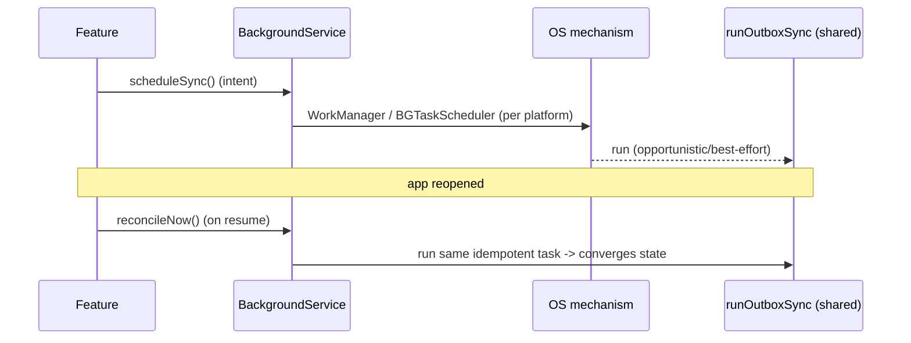

# Background Integration (Capstone: One Service, Cross-Platform Strategy)

> The maintainable design: expose a single **`BackgroundService`** whose API is stated in **app intent** ("sync eventually", "track this run"), and let a platform layer map each intent to the right mechanism — **WorkManager / foreground service (Android)**, **`BGTaskScheduler` / background mode / silent push (iOS)** — all running the **same idempotent work** the foreground uses. Because background is best-effort everywhere, the architecture's backbone is **foreground reconciliation + idempotent, storage-backed tasks**, with background as an *accelerator*, never a dependency.

## Introduction

This module capstone unifies the execution model, WorkManager, foreground services, and iOS background into one strategy. The recurring truth — *background is best-effort and platform-divergent* — means the app must never depend on it. This file shows a `BackgroundService` that expresses intent, maps per-platform, shares idempotent logic with the foreground, and reconciles on open.

## Why this concept exists

Scattering `workmanager`, foreground-service, and `BGTaskScheduler` calls across features couples them to platform quirks and makes them untestable and unreliable. One service that speaks intent and centralizes the best-effort + reconcile discipline (like a repository for data) isolates the mess and guarantees correctness via the foreground path — consistent with clean architecture ([Module 40](../40%20Clean%20Architecture/README.md)) and offline-first ([Module 19](../19%20Offline%20First/README.md)).

## Real-world analogy

`BackgroundService` is a **dispatcher**: teams (features) radio in *what* they need done ("sync the outbox", "track this run"), and the dispatcher picks the right crew for the city they're in (Android vs iOS mechanism). Critically, the **head office reconciles the books when everyone's back** (foreground) — so even if a field crew got delayed by traffic (Doze/budget), nothing is ultimately lost.

## Problem Statement

Deliver: periodic outbox sync (WorkManager/`BGTaskScheduler`) gated on connected+charging, a live run-tracking session (Android foreground service / iOS location background mode), silent-push-triggered sync, and a foreground catch-up that reconciles anything missed — all behind one intent-based `BackgroundService` with graceful degradation. You'll compose every mechanism in this module.

## Internal Working

```mermaid
flowchart TD
    Feature[features express INTENT] --> Svc[BackgroundService (intent API)]
    Svc --> Plat{platform}
    Plat -->|Android| AndroidMech[WorkManager (deferrable) / Foreground Service (continuous)]
    Plat -->|iOS| IosMech[BGTaskScheduler / background mode / silent push]
    AndroidMech & IosMech --> Work[SAME idempotent, storage-backed work (shared with foreground)]
    Foreground[app opened] --> Reconcile[foreground catch-up sync = source of truth]
    Reconcile --> Work
```

- **Intent-based API**: `scheduleSync()`, `startRunTracking()/stop()`, `syncOnPush()`, `reconcileNow()`. Features don't know the mechanism.
- **Platform mapping** (inside the service): deferrable → **WorkManager (Android)** / **`BGTaskScheduler` (iOS)**; continuous → **foreground service (Android)** / **location background mode (iOS)**; server trigger → **silent push (both)**.
- **Shared idempotent work**: the actual task (e.g., `SyncOutbox`) is **one function** invoked by the foreground, WorkManager, BGTask, and push handler alike — idempotent, resumable, storage-backed. No duplicated logic per mechanism.
- **Foreground reconciliation = source of truth**: on app open (and connectivity return — [29 · connectivity](../29%20Device%20Features/connectivity.md)), run the same sync; this guarantees correctness regardless of whether background ran. Background merely makes it *timelier*.
- **Isolate discipline**: every background entry re-inits deps and shares via **storage/ports** (no app state) — the service abstracts this.
- **Graceful degradation**: if background is denied/killed/throttled (OEM/iOS), the app still works via foreground sync; surface nothing broken to the user.
- **Testability**: the service depends on platform-mechanism interfaces (mockable) + the shared task; unit-test that intents map correctly and the shared task is idempotent.

## Memory Representation

The service holds scheduling state; the durable work queue/outbox + sync cursors live in storage shared across isolates ([Module 15](../15%20Local%20Storage/README.md)). Background isolates have separate heaps.

## Compiler Behavior

Background entry points are top-level `@pragma('vm:entry-point')`; the service otherwise compiles against interfaces (mockable).

## Runtime Behavior

The service schedules per platform; background runs opportunistically/continuously as allowed; the shared idempotent task runs in whichever context fires; foreground reconciliation converges state on open. Missed/duplicated runs are safe (idempotent).

## Flutter Engine Behavior

Multiple background engines/isolates (WorkManager, foreground service, BGTask, push) plus the UI isolate — the service centralizes their entry points; all funnel to the same task.

## Dart VM Behavior

Several isolates, no shared memory; coordination via storage. Keep background work short + idempotent so any isolate can run it safely.

## Examples

```dart
// Intent-based API — features never touch platform mechanisms
abstract class BackgroundService {
  Future<void> scheduleSync();            // deferrable/periodic
  Future<void> startRunTracking();        // continuous
  Future<void> stopRunTracking();
  Future<void> reconcileNow();            // foreground catch-up (source of truth)
}

// ONE idempotent task, shared by every trigger (fg, WorkManager, BGTask, push)
@pragma('vm:entry-point')
Future<bool> runOutboxSync() async {
  // re-init deps (isolate-safe); read outbox from storage; push each op idempotently;
  // mark synced; safe to re-run / resume. Returns success for retry semantics.
  return true;
}

// Android implementation maps intent -> mechanism
class AndroidBackgroundService implements BackgroundService {
  @override
  Future<void> scheduleSync() => workmanager.registerPeriodicTask(
        'sync', 'sync', frequency: const Duration(minutes: 15),
        constraints: Constraints(networkType: NetworkType.connected, requiresCharging: true));
  @override
  Future<void> startRunTracking() => foregroundService.start(callback: startCallback);
  @override
  Future<void> stopRunTracking() => foregroundService.stop();
  @override
  Future<void> reconcileNow() => runOutboxSync(); // same task, foreground
}
// iOS impl maps to BGTaskScheduler / background mode / silent push, same runOutboxSync().

// App bootstrap + on-resume reconcile (correctness guarantee)
// WidgetsBinding: on AppLifecycleState.resumed -> backgroundService.reconcileNow();
```

## Diagrams



## Common Mistakes

| Mistake | Why | Fix |
|---------|-----|-----|
| Depending on background running | Best-effort/throttled/OEM-killed | Foreground reconciliation as source of truth |
| Duplicated logic per mechanism | Drift/bugs | One shared idempotent task |
| Platform calls in features | Coupling, untestable | Intent API + platform mapping in service |
| Non-idempotent shared task | Duplicates on re-run/retry | Make idempotent + resumable |
| No graceful degradation | Feature "breaks" without background | Foreground fallback, silent to user |
| Same expectations both platforms | iOS far stricter | Per-platform mapping + iOS best-effort |

## Best Practices

- Expose an **intent-based `BackgroundService`**; map to platform mechanisms **inside** it (WorkManager/foreground service; `BGTaskScheduler`/background mode/silent push).
- Run **one idempotent, storage-backed task** across all triggers; make **foreground reconciliation the source of truth** (background = accelerator).
- **Degrade gracefully** (denied/killed/throttled → foreground sync); keep background work short/resumable; re-init deps in isolates.
- Depend on **interfaces** for testability; verify **intent→mechanism mapping** and **task idempotency**; set **iOS best-effort expectations**.

## Performance

Constraint-gated background (charging/wifi) + short idempotent tasks minimize battery; foreground reconciliation adds negligible cost on open. The architecture avoids wasted/duplicated work and OEM-killer fragility by never depending on background timing.

## Advantages / Disadvantages

- **+** Correct regardless of background reliability (foreground truth), testable, cross-platform, no duplicated logic, graceful degradation.
- **−** Upfront structure/boilerplate, per-platform mapping, must design idempotency + reconciliation, multi-isolate coordination.

## Interview Questions

1. **🟢 Why should background never be a dependency?** — It's best-effort and platform-divergent (Doze/budgets/OEM killers); correctness must come from foreground reconciliation, with background as an accelerator.
2. **🟢 What does an intent-based `BackgroundService` API look like?** — Methods like `scheduleSync`/`startRunTracking`/`reconcileNow` — features express *what*, the service picks the platform mechanism.
3. **🟡 Why share one idempotent task across triggers?** — To avoid logic drift and make foreground, WorkManager, BGTask, and push all converge to the same correct state safely.
4. **🟡 How do intents map per platform?** — Deferrable → WorkManager/`BGTaskScheduler`; continuous → foreground service/background mode; server → silent push.
5. **🟡 How do you guarantee correctness despite unreliable background?** — Run the same idempotent sync on app resume/connectivity return — foreground is the source of truth.
6. **🔴 How is this tested without devices?** — Interfaces for platform mechanisms + a pure idempotent task; assert intent→mechanism mapping and re-run safety with fakes.
7. **🔴 How does this integrate with offline-first?** — The shared task flushes the outbox; connectivity/foreground trigger reconciliation; background just flushes sooner ([Module 19](../19%20Offline%20First/README.md)).

## Senior Engineer Tips

- Build the shared idempotent task + foreground reconciliation first; add background triggers last as accelerators — this ordering makes the feature correct before it's optimized.
- Keep every platform call behind the service; features asking for a "foreground service" or "BGTask" directly is the smell that guarantees untestable, brittle code.
- Set explicit expectations: on iOS (and OEM-crippled Android), background "sometimes" runs — the demo of reliability is the resume-reconcile path, and that's what you test.

## Architect Perspective

Background integration is the synthesis of the module's core lesson: because the OS owns *when* and gives no guarantees, the app owns *what* (one idempotent, storage-backed task) and *correctness* (foreground reconciliation), while a thin platform layer maps intents to WorkManager/foreground-service/`BGTaskScheduler`/push. This yields features that are reliable, testable, cross-platform, and battery-respecting — background accelerates but never gates — fitting cleanly into offline-first and clean-architecture boundaries ([Module 19](../19%20Offline%20First/README.md), [Module 40](../40%20Clean%20Architecture/README.md)).

## Summary

- One intent-based `BackgroundService` maps to per-platform mechanisms; features express *what*, not *how*.
- A single idempotent, storage-backed task runs across all triggers; **foreground reconciliation is the source of truth**, background an accelerator.
- Degrade gracefully, keep tasks short/resumable, test via interfaces + idempotency; expect iOS best-effort.

## Revision Notes

- Intent API (`scheduleSync`/`startRunTracking`/`reconcileNow`); map inside service: Android WorkManager/foreground service, iOS `BGTaskScheduler`/background mode/silent push.
- Shared idempotent `runOutboxSync` for all triggers; foreground reconcile (on resume/connectivity) = source of truth; background = accelerator.
- Graceful degradation; short/resumable/storage-backed isolate work; interfaces + idempotency for tests; iOS best-effort.

## Practice Questions

1. Why is foreground reconciliation the source of truth?
2. How does one intent map to different platform mechanisms?
3. Why must the shared task be idempotent?

## Coding Questions

1. Define an intent-based `BackgroundService` + Android/iOS implementations.
2. Implement one idempotent `runOutboxSync` used by all triggers.
3. Wire foreground reconciliation on app resume + connectivity return.

## Mini Project

**Cross-platform background sync (capstone — Flutter):** Build a `BackgroundService` with an intent API (`scheduleSync`, `startRunTracking`/`stop`, `syncOnPush`, `reconcileNow`) mapping to WorkManager/foreground service (Android) and `BGTaskScheduler`/background mode/silent push (iOS), all invoking one idempotent, storage-backed `runOutboxSync`. Add foreground reconciliation on resume/connectivity as the source of truth, with graceful degradation. Provide interfaces + tests. Acceptance: features use intents only; one shared idempotent task across triggers; foreground reconciliation guarantees correctness; degrades when background is denied/killed; per-platform mapping correct; unit-tested (mapping + idempotency); documented iOS best-effort.
