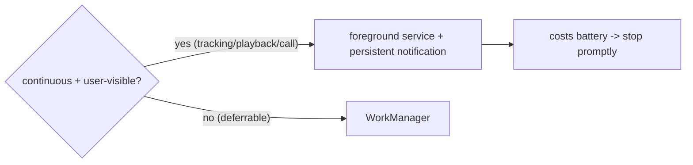

# Android Foreground Services (Ongoing, User-Visible Work)

> When Android work must run **continuously and visibly** — live location tracking, media playback, an active call, an ongoing upload — you use a **foreground service**: it shows a **mandatory persistent notification** (so the user knows it's running), is far less likely to be killed than background work, and (on Android 10+/14) requires a **declared `foregroundServiceType`** + matching runtime permissions. In Flutter this is done via a plugin (e.g. `flutter_foreground_task`). It's the *only* sanctioned way to keep running while backgrounded — but it's scrutinized and battery-costly, so use it only for genuinely ongoing, user-aware tasks.

## Introduction

Foreground services are Android's answer to "I need to keep working while the user isn't in the app, and they should know." Unlike WorkManager (deferrable), a foreground service runs *now and continuously*. This file covers when they're justified, the persistent-notification requirement, service types/permissions, and running Dart work in one via a plugin.

## Why this concept exists

Android kills background work to save battery, but some tasks legitimately must persist (a run being tracked, a song playing). A foreground service is the OS's contract: *you may keep running, but you must show a notification so the user is aware and can stop you.* Android 8+ enforces this; 10+/14 add type declarations to prevent abuse.

## Real-world analogy

A foreground service is a **visible, badged on-site contractor**: unlike an anonymous after-hours worker (background task) who gets kicked out, the contractor wears a **hi-vis badge the whole time** (persistent notification) so everyone knows they're there and why — and because they're accountable and justified, security lets them keep working. But you don't hire one to change a lightbulb (deferrable work) — only for jobs that genuinely need continuous on-site presence.

## Problem Statement

Track a user's run continuously (location every few seconds) while they switch apps or lock the screen, showing a "Tracking run — 2.4 km" notification they can stop, without the OS killing it. You'll run a foreground service hosting the location stream.

## Internal Working

```mermaid
flowchart TD
    Start[start foreground service] --> Notif[MANDATORY persistent notification]
    Notif --> Type[declared foregroundServiceType (location/mediaPlayback/...)]
    Type --> Perm[matching permissions (FOREGROUND_SERVICE + type perms)]
    Perm --> Run[service runs continuously (own isolate)]
    Run --> Update[update notification (progress) / communicate via storage or ports]
    Run --> Stop[stopForeground / user stops -> release]
```

- **When justified**: continuous, user-visible/expected work — **location tracking, media/audio playback, active phone/VoIP call, ongoing large upload/download, fitness tracking**. Not for deferrable maintenance (use WorkManager) or hidden work.
- **Mandatory notification**: a foreground service **must** post an ongoing notification (Android 8+) with a channel ([32 · local_notifications](../32%20Notifications/local_notifications.md)); update it for progress; the user can stop the service from it.
- **Service type (Android 10+, stricter in 14)**: declare `android:foregroundServiceType` (e.g., `location`, `mediaPlayback`, `dataSync`, `camera`, `microphone`) in the manifest and start with that type; **Android 14** requires the type + justification + the corresponding runtime permission (e.g., `ACCESS_FINE_LOCATION` for `location`).
- **Permissions/manifest**: `FOREGROUND_SERVICE` (+ type-specific like `FOREGROUND_SERVICE_LOCATION`) and the underlying data permission (location/mic/etc.) ([27 · permissions](../27%20Native%20Android/permissions_and_manifest.md)).
- **Flutter execution**: a plugin (`flutter_foreground_task` or similar) runs a Dart callback in the service's **background isolate**; communicate with the UI via **ports/storage** (no shared memory). You can host a location stream ([29 · geolocation](../29%20Device%20Features/geolocation.md)) there.
- **Lifecycle**: start on user action, keep the notification updated, **stop promptly** when done (`stopForeground`) — running longer than needed drains battery and annoys users.
- **iOS**: no direct equivalent — iOS uses **background modes** (location/audio) instead ([ios_background_execution.md](ios_background_execution.md)); design cross-platform accordingly.

## Memory Representation

The service runs in its own isolate/heap; share state with the UI via **send ports / storage**. The notification is OS-owned.

## Compiler Behavior

Manifest declares the service + `foregroundServiceType`; the Dart callback entry point is top-level `@pragma('vm:entry-point')`.

## Runtime Behavior

The service runs continuously while active (much harder for the OS to kill than plain background work), consuming battery (esp. location/GPS). Missing type/permission (Android 14) throws at start.

## Flutter Engine Behavior

The plugin hosts a background `FlutterEngine`/isolate for the service callback, separate from the UI engine.

## Dart VM Behavior

Separate isolate; communicate via ports/storage; keep the loop efficient (throttle location, batch writes).

## Examples

```xml
<!-- AndroidManifest.xml -->
<uses-permission android:name="android.permission.FOREGROUND_SERVICE"/>
<uses-permission android:name="android.permission.FOREGROUND_SERVICE_LOCATION"/>
<uses-permission android:name="android.permission.ACCESS_FINE_LOCATION"/>
<application>
  <service
     android:name="...ForegroundService"
     android:foregroundServiceType="location"    <!-- required (Android 10+/14) -->
     android:exported="false"/>
</application>
```

```dart
// Using a foreground-task plugin (illustrative): run location tracking in the service
@pragma('vm:entry-point')
void startCallback() {
  FlutterForegroundTask.setTaskHandler(RunTrackerHandler()); // runs in service isolate
}

class RunTrackerHandler extends TaskHandler {
  StreamSubscription? _loc;
  @override
  Future<void> onStart(DateTime ts, TaskStarter starter) async {
    _loc = geolocator.track().listen((p) {
      _appendToStore(p);                         // persist (share via storage)
      FlutterForegroundTask.updateService(       // update the persistent notification
        notificationTitle: 'Tracking run',
        notificationText: '${_distanceKm()} km',
      );
    });
  }
  @override
  Future<void> onDestroy(DateTime ts) async => _loc?.cancel(); // release on stop
}

// Start on user action (after requesting location permission):
// await FlutterForegroundTask.startService(notificationTitle: 'Tracking run', callback: startCallback);
// Stop when done: await FlutterForegroundTask.stopService();
```

## Diagrams



## Common Mistakes

| Mistake | Why | Fix |
|---------|-----|-----|
| Foreground service for deferrable work | Battery/UX abuse, rejection | Use WorkManager for deferrable |
| Missing persistent notification | Illegal (Android 8+); crash | Post an ongoing notification + channel |
| Missing `foregroundServiceType`/perms (14) | Start throws | Declare type + runtime permissions |
| Not stopping when done | Battery drain, annoyance | `stopService` promptly |
| Accessing UI state in the service | Separate isolate | Ports/storage to communicate |
| Assuming iOS parity | No FG service on iOS | Use iOS background modes |

## Best Practices

- Use a foreground service **only for genuinely continuous, user-visible work** (location/media/call/upload); use **WorkManager** for deferrable.
- Always post + update the **mandatory notification** (channel), let the user **stop** it, and **stop the service promptly** when finished.
- Declare the correct **`foregroundServiceType`** + **runtime permissions** (Android 14); communicate with the UI via **ports/storage**; throttle heavy streams (location).
- Design **cross-platform**: pair with iOS **background modes**; wrap behind a service so the app requests "track a run," not "start a service" ([background_integration.md](background_integration.md)).

## Performance

Continuous execution (esp. GPS/location) is the heaviest background battery cost. Throttle sampling (distance filter — [29 · geolocation](../29%20Device%20Features/geolocation.md)), batch persistence, and stop the service the instant the task ends.

## Advantages / Disadvantages

- **+** Reliable continuous execution (resists kill), user-visible/accountable, supports location/media/uploads while backgrounded.
- **−** Mandatory notification, heavy battery cost, Android 14 type/permission strictness, isolate comms, no iOS equivalent (background modes instead).

## Interview Questions

1. **🟢 When do you use a foreground service vs WorkManager?** — Foreground service for continuous, user-visible work (tracking/playback/call); WorkManager for deferrable/periodic maintenance.
2. **🟢 What's mandatory for a foreground service?** — An ongoing persistent notification (Android 8+) informing the user it's running.
3. **🟡 What changed for foreground services in Android 10/14?** — A declared `foregroundServiceType` (10+) and, in 14, type + justification + the matching runtime permission are required.
4. **🟡 How does the service communicate with the UI?** — Via send ports / shared storage — it runs in a separate isolate with no shared memory.
5. **🟡 Why stop the service promptly?** — Continuous execution (esp. location) drains battery and annoys users; keep it alive only while the task is active.
6. **🔴 What's the iOS equivalent?** — There isn't a foreground service; iOS uses background modes (location/audio/VoIP) with their own constraints.
7. **🔴 Why is a foreground service harder for the OS to kill?** — It's a declared, notified, accountable ongoing task — the OS treats it as user-important, unlike anonymous background work.

## Senior Engineer Tips

- Reserve foreground services for the short list Android actually blesses (location/media/call/upload); anything else risks rejection and battery complaints.
- Get the Android 14 type + permission matrix right up front — it's a hard start-time failure otherwise.
- Throttle the work inside (distance-filtered location, batched writes) and stop the instant the session ends; a leaked tracking service is a battery horror story.

## Architect Perspective

Foreground services are the "justified continuous work" branch of the background model — powerful but accountable (notification) and costly (battery). Behind a `BackgroundService`, the app expresses intent ("track this run") while the platform layer picks a foreground service on Android and a background mode on iOS, keeping the work throttled, stoppable, and permission-correct. This quarantines the OS-specific complexity and battery risk behind one seam ([background_execution_model.md](background_execution_model.md), [ios_background_execution.md](ios_background_execution.md), [background_integration.md](background_integration.md)).

## Summary

- Foreground services run continuous, user-visible work with a mandatory persistent notification, resisting OS kill.
- Android 10+/14 require `foregroundServiceType` + matching runtime permissions; communicate via ports/storage; stop promptly (battery).
- Use only when justified (location/media/call/upload); no iOS equivalent (background modes); wrap behind a cross-platform service.

## Revision Notes

- Continuous + visible → foreground service; mandatory ongoing notification (channel); user can stop.
- Manifest: `FOREGROUND_SERVICE` (+ `FOREGROUND_SERVICE_LOCATION` etc.) + `foregroundServiceType` (Android 10+/14) + data permission.
- Runs in own isolate (ports/storage to UI); throttle (location distance filter), batch writes, `stopService` promptly; iOS → background modes.

## Practice Questions

1. When is a foreground service the right tool vs WorkManager?
2. What must every foreground service display and why?
3. What does Android 14 require to start a typed foreground service?

## Coding Questions

1. Declare a `location` foreground service (manifest type + permissions).
2. Run a throttled location stream in the service and update its notification.
3. Start/stop the service on user actions and release resources.

## Mini Project

**Live run tracker (Flutter + Android):** Build a foreground-service-based run tracker: start on "Start run," track distance-filtered location in the service isolate, update a persistent "Tracking — X km" notification, persist points to storage, and stop on "Stop run" (release the stream). Declare the `location` service type + permissions (Android 14). Acceptance: tracks continuously while backgrounded/locked; persistent notification updates + stoppable; correct type/permissions; throttled + battery-conscious; stops promptly; behind a service (iOS uses background modes).
