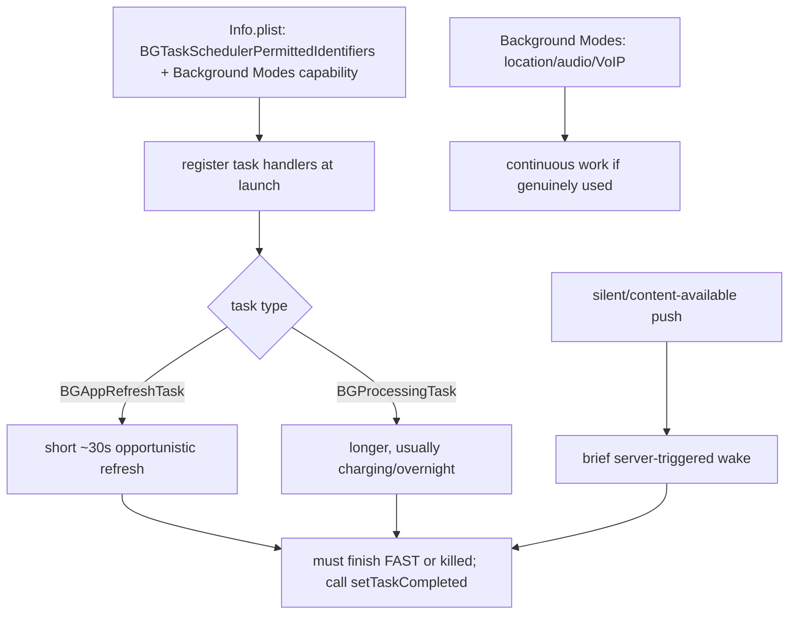

# iOS Background Execution (`BGTaskScheduler`, Fetch, Silent Push)

> iOS grants background time **grudgingly and opportunistically** — there is **no guaranteed "run every N minutes."** You get: **`BGAppRefreshTask`** (short, ~30s, opportunistic refresh the system schedules based on usage), **`BGProcessingTask`** (longer maintenance, typically overnight while charging), **silent/content-available push** (server-triggered brief wake), and continuous **background modes** (location/audio/VoIP) only if genuinely used. All require **registered task identifiers + Background Modes capability**, run in a background isolate, and must **finish fast or be killed** — so the reliable pattern is *server-triggered + best-effort + foreground catch-up.*

## Introduction

iOS background execution is the strictest part of this module. This file covers the `BGTaskScheduler` task types, silent push, continuous background modes, the setup (identifiers/capabilities), and — crucially — how little you can rely on any of it, shaping a design that leans on push + foreground reconciliation.

## Why this concept exists

Apple prioritizes battery and privacy over developer convenience: it learns app usage and grants background windows opportunistically, rather than honoring fixed schedules. `BGTaskScheduler` (iOS 13+) replaced older background-fetch APIs with a model where the **system decides timing** and enforces tight budgets. Continuous modes exist only for legitimately ongoing needs (navigation, audio).

## Real-world analogy

iOS background time is a **standby-only gig with no fixed shifts**: you can't schedule yourself. The manager (iOS) **calls you in briefly when it happens to be convenient** (`BGAppRefreshTask`), gives you **longer overnight tasks while plugged in** (`BGProcessingTask`), or a **client can page you for a quick job** (silent push). A **continuous shift** (background mode) is only for roles that truly require presence (a live navigator) — and you must clock out fast or you're sent home (killed).

## Problem Statement

Refresh content periodically on iOS, run heavier cleanup overnight while charging, trigger a sync from the server, and support continuous location during navigation — all within Apple's limits, with foreground catch-up because none of it is guaranteed. You'll register BG tasks, enable capabilities, and handle silent push.

## Internal Working



- **Setup**: add each task id to **`BGTaskSchedulerPermittedIdentifiers`** in `Info.plist`, enable the **Background Modes** capability (Background fetch / Background processing / Remote notifications / Location / Audio as needed — [28 · ios_integration](../28%20Native%20iOS/ios_integration.md)), and **register handlers at launch** (before the app finishes launching).
- **`BGAppRefreshTask`**: short (~30s), for keeping content fresh; the system schedules it **opportunistically** based on how often the user opens the app — **not** a fixed interval. You submit a request; iOS decides if/when.
- **`BGProcessingTask`**: longer-running maintenance (DB compaction, large sync); typically runs when **charging + idle** (often overnight); can request network/charging requirements.
- **Silent push** (`content-available: 1`): the server wakes the app briefly to fetch/sync ([32 · fcm_push](../32%20Notifications/fcm_push.md)); still budget-limited and **throttled** by iOS (over-use → delivery reduced). The most reliable "run something now-ish" trigger, but still best-effort.
- **Continuous background modes**: **location** (turn-by-turn), **audio** (playback), **VoIP** — allow ongoing execution **only if the app genuinely provides that feature**; claiming unused modes → **App Store rejection**.
- **Budgets + completion**: every task **must call `setTaskCompleted`** quickly (finish within the granted window) and **schedule the next one** itself; overrunning → the task is killed and future budget shrinks.
- **In Flutter**: use plugins (`workmanager` maps periodic → `BGTaskScheduler`; `background_fetch`; `firebase_messaging` for silent push) — runs in a background isolate (re-init deps, share via storage).
- **Reality**: none of this is guaranteed or periodic. **Design for "maybe, eventually" + foreground catch-up.**

## Memory Representation

Background isolate with its own heap; persist to storage. Task requests/identifiers are managed by iOS.

## Compiler Behavior

Task identifiers must be declared in `Info.plist`; handlers registered at launch; Dart entry points top-level `@pragma('vm:entry-point')`.

## Runtime Behavior

Tasks run when iOS chooses (opportunistic/overnight), within tight time budgets; must complete fast. Silent push wakes briefly but is throttled. Overuse or overrun shrinks future opportunities.

## Flutter Engine Behavior

iOS spins up a background `FlutterEngine`/isolate for the task/push handler, then suspends it ([background_execution_model.md](background_execution_model.md)).

## Dart VM Behavior

Separate isolate; no shared memory; keep work minimal and idempotent; complete before the budget expires.

## Examples

```xml
<!-- ios/Runner/Info.plist -->
<key>BGTaskSchedulerPermittedIdentifiers</key>
<array>
  <string>com.example.app.refresh</string>
  <string>com.example.app.processing</string>
</array>
<key>UIBackgroundModes</key>
<array>
  <string>fetch</string>
  <string>processing</string>
  <string>remote-notification</string>   <!-- silent push -->
  <!-- <string>location</string> only if you provide navigation/tracking -->
</array>
```

```swift
// AppDelegate: register + handle a BGAppRefreshTask (schedule the next one each run)
import BackgroundTasks
func registerBGTasks() {
  BGTaskScheduler.shared.register(forTaskWithIdentifier: "com.example.app.refresh", using: nil) { task in
    scheduleNextRefresh()                       // always reschedule
    // do SHORT work (or bridge to Flutter), then:
    task.setTaskCompleted(success: true)        // MUST complete quickly
  }
}
func scheduleNextRefresh() {
  let req = BGAppRefreshTaskRequest(identifier: "com.example.app.refresh")
  req.earliestBeginDate = Date(timeIntervalSinceNow: 15 * 60)  // hint only; iOS decides
  try? BGTaskScheduler.shared.submit(req)
}
```

```dart
// Flutter side: silent push is the most reliable "sync now-ish" trigger (still best-effort)
@pragma('vm:entry-point')
Future<void> onSilentPush(RemoteMessage m) async {
  // re-init deps; do a SHORT idempotent sync; persist to storage.
}
// Pair with a foreground catch-up sync — never rely on background alone on iOS.
```

## Diagrams

```mermaid
flowchart LR
    Need{iOS background need}
    Need -->|keep content fresh| AR[BGAppRefreshTask (~30s, opportunistic)]
    Need -->|heavy maintenance| BP[BGProcessingTask (charging/overnight)]
    Need -->|server trigger| SP[silent push (brief, throttled)]
    Need -->|navigation/audio| BM[background mode (if genuinely used)]
    AR & BP & SP --> CU[+ foreground catch-up (always)]
```

## Common Mistakes

| Mistake | Why | Fix |
|---------|-----|-----|
| Expecting fixed periodic runs | iOS is opportunistic, not scheduled | Best-effort + foreground catch-up |
| Not calling `setTaskCompleted` | Killed; future budget shrinks | Complete quickly; reschedule |
| Long tasks | Overrun budget → killed | Keep short; chunk/resume |
| Claiming unused background modes | App Store rejection | Only modes you genuinely use |
| Missing permitted identifiers/capability | Task won't run/register fails | Declare ids + enable capability |
| Over-using silent push | iOS throttles delivery | Use sparingly; reconcile in foreground |

## Best Practices

- Treat iOS background as **opportunistic/best-effort**: `BGAppRefreshTask` (short refresh), `BGProcessingTask` (charging/overnight maintenance), **silent push** (server trigger) — and **always add foreground catch-up**.
- Register handlers **at launch**, declare **permitted identifiers + Background Modes**, **`setTaskCompleted` fast**, and **reschedule** the next task each run.
- Use **continuous background modes only for genuine features** (navigation/audio) — never claim unused ones (rejection).
- Keep work **short, idempotent, storage-backed**; prefer **silent push** as the most reliable trigger but use it **sparingly** (throttling).

## Performance

iOS's whole design optimizes battery: short opportunistic windows, charging-gated heavy tasks. Respect budgets (complete fast) and use silent push sparingly; overuse/overrun reduces your future background allotment.

## Advantages / Disadvantages

- **+** Battery-safe refresh/maintenance, server-triggered wakes, continuous modes for real features — within Apple's contract.
- **−** No guaranteed timing, tight budgets, throttled silent push, rejection risk for unused modes, isolate constraints, requires foreground fallback.

## Interview Questions

1. **🟢 Is there a guaranteed periodic background task on iOS?** — No; iOS schedules `BGAppRefreshTask` opportunistically based on usage — treat all background as best-effort.
2. **🟢 What are the iOS background task types?** — `BGAppRefreshTask` (short refresh), `BGProcessingTask` (longer, charging/overnight), plus silent push and continuous background modes.
3. **🟡 What's the most reliable way to trigger background work on iOS?** — Silent/content-available push (server-triggered brief wake) — but it's throttled, so use sparingly + reconcile in foreground.
4. **🟡 What must every BG task do, and what's the risk of overrunning?** — Call `setTaskCompleted` within its budget and reschedule; overrunning gets it killed and shrinks future budget.
5. **🟡 When can you use a continuous background mode?** — Only when the app genuinely provides that feature (navigation/audio/VoIP); claiming unused modes causes rejection.
6. **🔴 How do you set up `BGTaskScheduler` in an iOS app?** — Declare identifiers in `BGTaskSchedulerPermittedIdentifiers`, enable Background Modes, register handlers at launch, submit requests, complete fast, reschedule.
7. **🔴 Why is a foreground catch-up essential on iOS?** — Background execution is unguaranteed/throttled; the app must reconcile state when opened so missed runs don't cause staleness.

## Senior Engineer Tips

- Assume iOS background "runs sometimes" and build the real reliability into silent push + foreground reconciliation; `BGAppRefreshTask` is a bonus, not a foundation.
- Register tasks at launch and always reschedule inside the handler — a task that doesn't resubmit itself runs once and never again.
- Only declare background modes you can defend in review; an unused `location`/`audio` mode is a classic rejection.

## Architect Perspective

iOS background execution is the constraint that forces the whole module's design philosophy: because nothing is guaranteed, background becomes a best-effort accelerator over a foreground-reconciled source of truth, triggered primarily by silent push. Behind a `BackgroundService`, the app requests "sync eventually" and the iOS layer maps it to `BGTaskScheduler`/push within budget — while Android gets WorkManager/foreground services. The cross-platform seam absorbs iOS's strictness without leaking it into features ([background_execution_model.md](background_execution_model.md), [workmanager_and_periodic_tasks.md](workmanager_and_periodic_tasks.md), [background_integration.md](background_integration.md)).

## Summary

- iOS background is opportunistic/best-effort: `BGAppRefreshTask` (short), `BGProcessingTask` (charging/overnight), silent push (trigger), background modes (genuine features only).
- Declare identifiers + Background Modes, register at launch, `setTaskCompleted` fast + reschedule, keep work short/idempotent.
- Nothing is guaranteed — always add foreground catch-up; silent push is the most reliable trigger (use sparingly).

## Revision Notes

- `BGTaskScheduler` (iOS 13+): `BGAppRefreshTask` (~30s opportunistic), `BGProcessingTask` (charging/overnight); + silent push (`content-available`), background modes (location/audio/VoIP — genuine only).
- Setup: `BGTaskSchedulerPermittedIdentifiers` + Background Modes capability; register at launch; `setTaskCompleted` + reschedule; short/idempotent/storage-backed isolate.
- No guaranteed periodicity; silent push best trigger (throttled); always foreground catch-up; unused modes → rejection.

## Practice Questions

1. Why can't you guarantee a periodic iOS background task?
2. What must a BG task handler do before its window ends?
3. What's the most reliable iOS background trigger and its caveat?

## Coding Questions

1. Declare permitted identifiers + Background Modes and register a `BGAppRefreshTask` that reschedules itself.
2. Handle a silent push with a short idempotent sync in Flutter.
3. Add a foreground catch-up sync that reconciles missed background runs.

## Mini Project

**iOS best-effort sync (Flutter + iOS):** Set up `BGTaskScheduler` (permitted identifiers + Background Modes), register a self-rescheduling `BGAppRefreshTask` and a charging-gated `BGProcessingTask`, handle a silent-push-triggered sync, and add a foreground catch-up that reconciles state. Keep tasks short/idempotent. Acceptance: identifiers/capabilities declared; tasks register + reschedule + complete fast; silent push triggers sync; foreground catch-up reconciles; no unused background modes; documented as best-effort; runs on device.
