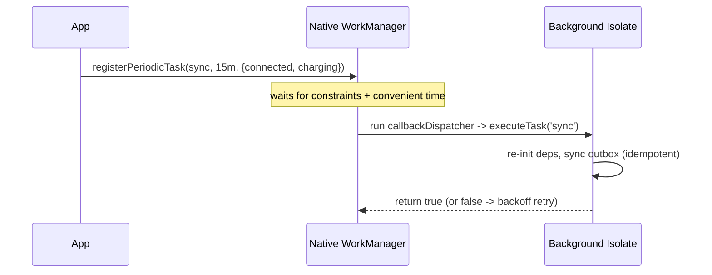

# WorkManager & Periodic Tasks (`workmanager`)

> The `workmanager` plugin schedules **deferrable, guaranteed-eventually** background work — one-off (`registerOneOffTask`) or periodic (`registerPeriodicTask`, min ~15 min) — that runs in a **background isolate** via a top-level `callbackDispatcher`, gated by **constraints** (network, charging, battery-not-low) with **backoff retries**. On Android it wraps native WorkManager (survives reboots/app-kill); on iOS it maps onto `BGTaskScheduler` (much more limited). The OS decides *when* — you get "it will run eventually when conditions are met," not exact timing.

## Introduction

`workmanager` is the go-to for periodic/deferrable background jobs like sync, uploads, and cleanup. This file covers the callback dispatcher, one-off vs periodic tasks, constraints, retry/backoff, and the platform reality (Android robust, iOS limited) — the practical realization of the "deferrable" branch of the [background model](background_execution_model.md).

## Why this concept exists

Apps need reliable *eventual* execution of maintenance work without draining battery. Native WorkManager (Android) provides constraint-based, persistent, retryable scheduling; `workmanager` exposes it to Flutter (and bridges iOS `BGTaskScheduler`). It replaces fragile timers with OS-managed jobs that respect Doze and survive restarts.

## Real-world analogy

WorkManager is a **dependable errand service with conditions**: you drop off a task ("upload these photos") with rules ("only on wifi, only when charging"). You don't pick the exact time — the service runs it **when your conditions are met and it's convenient**, retries if it fails, and remembers the task even if you (the app) leave or the phone reboots.

## Problem Statement

Sync an offline outbox roughly every 15 minutes **only when connected and charging**, retry with backoff on failure, and also run a one-off upload after the user acts — all surviving app-kill on Android. You'll set up the dispatcher, register periodic + one-off tasks with constraints, and handle results.

## Internal Working

```mermaid
flowchart TD
    Init[Workmanager().initialize(callbackDispatcher)] --> Register[register one-off / periodic + constraints]
    Register --> OS[native WorkManager (Android) / BGTaskScheduler (iOS)]
    OS -->|conditions met + convenient| Dispatch[callbackDispatcher runs in bg isolate]
    Dispatch --> Task[executeTask(name, data)]
    Task -->|return true| Done[success]
    Task -->|return false / throw| Retry[backoff retry]
```

- **`callbackDispatcher`** (top-level `@pragma('vm:entry-point')`): the single background entry point. `Workmanager().executeTask((taskName, inputData) async {...})` dispatches by task name; runs in a **fresh isolate** — re-init Firebase/DB/plugins, no app state.
- **Initialize** once at startup: `Workmanager().initialize(callbackDispatcher)`.
- **One-off**: `registerOneOffTask('upload-1', 'upload', inputData: {...}, constraints: ...)` — runs once when constraints allow.
- **Periodic**: `registerPeriodicTask('sync', 'sync', frequency: Duration(minutes: 15), constraints: ...)` — **minimum ~15 min**; the OS batches and may run **less often** (never guaranteed exact). One periodic task per unique name.
- **Constraints**: `Constraints(networkType: NetworkType.connected, requiresCharging: true, requiresBatteryNotLow: true, requiresStorageNotLow: ...)` — the OS waits until satisfied.
- **Return value = result**: return **`true`** for success; **`false`** (or throw) signals failure → **backoff retry** (`BackoffPolicy`). Make tasks **idempotent** (they can re-run).
- **Input/output**: pass small `inputData` (primitives); communicate results via **storage** (no shared memory).
- **Uniqueness/replace**: `existingWorkPolicy` (keep/replace/append) prevents duplicate scheduling.
- **Platform reality**: **Android** — robust, persists across reboot/kill, true constraints/retries. **iOS** — maps to `BGTaskScheduler`, needs registered task identifiers + background modes, and runs **rarely/opportunistically** (Apple decides); don't expect Android-like periodicity ([ios_background_execution.md](ios_background_execution.md)).

## Memory Representation

Task metadata/queue is persisted by native WorkManager (survives restarts). The isolate has its own heap — share via storage. `inputData` is a small primitive map.

## Compiler Behavior

`callbackDispatcher` must be top-level `@pragma('vm:entry-point')` (AOT retention).

## Runtime Behavior

Tasks fire when constraints are met and the OS schedules them (batched, Doze-aware) — periodic is a *floor* frequency, not exact. Failures back off and retry. Killed/rebooted apps still run persisted tasks (Android).

## Flutter Engine Behavior

Native WorkManager spins up a background `FlutterEngine` to run the dispatcher, then tears it down ([background_execution_model.md](background_execution_model.md)).

## Dart VM Behavior

Fresh isolate per run; no shared memory; keep work short (WorkManager expects tasks to finish within a limited window).

## Examples

```dart
import 'package:workmanager/workmanager.dart';

// Single background entry point — runs in a fresh isolate
@pragma('vm:entry-point')
void callbackDispatcher() {
  Workmanager().executeTask((taskName, inputData) async {
    // Re-init deps here (no app singletons): Firebase/DB/etc.
    switch (taskName) {
      case 'sync':
        final ok = await _syncOutbox();     // idempotent!
        return ok;                          // false -> backoff retry
      case 'upload':
        return _upload(inputData?['path'] as String?);
    }
    return true;
  });
}

Future<void> initBackground() async {
  await Workmanager().initialize(callbackDispatcher);

  // Periodic sync: >=15 min, only connected + charging (best-effort timing)
  await Workmanager().registerPeriodicTask(
    'sync', 'sync',
    frequency: const Duration(minutes: 15),
    constraints: Constraints(
      networkType: NetworkType.connected,
      requiresCharging: true,
    ),
    existingWorkPolicy: ExistingWorkPolicy.keep,
    backoffPolicy: BackoffPolicy.exponential,
  );
}

// One-off upload triggered by user action
Future<void> scheduleUpload(String path) => Workmanager().registerOneOffTask(
      'upload-$path', 'upload',
      inputData: {'path': path},
      constraints: Constraints(networkType: NetworkType.connected),
    );
```

## Diagrams



## Common Mistakes

| Mistake | Why | Fix |
|---------|-----|-----|
| Expecting exact periodic timing | OS batches; ~15min floor, best-effort | Design best-effort; reconcile in foreground |
| Non-idempotent tasks | Retries/re-runs duplicate effects | Make tasks idempotent |
| Accessing app state in dispatcher | Separate isolate | Re-init deps; share via storage |
| `callbackDispatcher` not top-level/`vm:entry-point` | Not invoked | Top-level + annotation |
| Ignoring return value | No retry on failure | Return true/false correctly |
| Expecting iOS to behave like Android | iOS `BGTaskScheduler` runs rarely | iOS-specific expectations ([ios file](ios_background_execution.md)) |
| Long-running tasks | Killed at window limit | Keep short, chunk/resume |

## Best Practices

- One top-level **`callbackDispatcher`** (`@pragma('vm:entry-point')`) dispatching by task name; **re-init deps**, share via **storage**, keep tasks **short + idempotent**.
- Use **constraints** (connected/charging/battery-not-low) so work runs cheaply; return **true/false** for success/retry with **backoff**.
- Treat periodic as a **best-effort floor** (~15 min min), not exact — **reconcile in the foreground**; use `existingWorkPolicy` to avoid duplicates.
- Expect **iOS to run rarely** (`BGTaskScheduler` semantics — [ios_background_execution.md](ios_background_execution.md)); degrade to foreground sync; wrap behind a service.

## Performance

Constraints (charging/wifi) keep background work off battery/data budgets. Short, batched, idempotent tasks are OS-friendly; long/frequent tasks get throttled or killed. This is battery-optimal *if* you respect the constraint model.

## Advantages / Disadvantages

- **+** Reliable eventual execution, constraint-based, retry/backoff, persists across reboot/kill (Android), battery-respecting.
- **−** No exact timing (~15 min floor), iOS severely limited, isolate constraints, must be idempotent, short-task requirement.

## Interview Questions

1. **🟢 What is `workmanager` for?** — Scheduling deferrable one-off/periodic background work (sync/upload/cleanup) that runs eventually under constraints, surviving app-kill (Android).
2. **🟢 What's the minimum periodic frequency and is timing guaranteed?** — ~15 minutes minimum, and no — the OS batches/defers; treat it as a best-effort floor.
3. **🟡 Why must tasks be idempotent?** — They can be retried (on failure/backoff) or re-run; effects must be safe to repeat.
4. **🟡 How does the dispatcher access app state?** — It can't — it runs in a fresh isolate; re-init dependencies and share via storage.
5. **🟡 How are constraints and retries expressed?** — `Constraints(networkType/requiresCharging/...)` and the task's return value (`true` success / `false` retry) with a `BackoffPolicy`.
6. **🔴 How does `workmanager` differ across platforms?** — Android wraps native WorkManager (robust, persistent, true constraints); iOS maps to `BGTaskScheduler` and runs rarely/opportunistically — don't expect periodicity.
7. **🔴 Why keep tasks short?** — The OS grants a limited execution window; long tasks get killed — chunk and make resumable.

## Senior Engineer Tips

- Make every task idempotent and resumable, and always pair background sync with a foreground catch-up — background alone is never reliable enough.
- Gate with constraints (charging/wifi) both to respect battery and to increase the odds the OS actually runs it.
- Set iOS expectations explicitly with stakeholders: `workmanager` periodic ≈ "sometimes" on iOS; if you need iOS reliability, lean on silent push + foreground sync.

## Architect Perspective

`workmanager` operationalizes the deferrable-work branch of the background model: constraint-gated, retryable, idempotent tasks the OS runs when convenient. Architecturally it's a scheduling adapter behind your `BackgroundService`, feeding the same idempotent sync logic the foreground uses — so background is a best-effort accelerator, not a dependency. Its platform asymmetry (robust Android, limited iOS) makes a cross-platform strategy (+ foreground reconciliation) essential ([background_execution_model.md](background_execution_model.md), [background_integration.md](background_integration.md), [Module 19](../19%20Offline%20First/README.md)).

## Summary

- `workmanager`: top-level `callbackDispatcher` (isolate) dispatching one-off/periodic tasks under constraints with backoff retries; Android-robust, iOS-limited.
- Periodic ≥ ~15 min, best-effort (not exact); tasks must be short + idempotent; share via storage; return true/false.
- Reconcile in foreground; set iOS expectations; wrap behind a service.

## Revision Notes

- `Workmanager().initialize(callbackDispatcher)`; `registerOneOffTask` / `registerPeriodicTask(frequency ≥15min)`; dispatch via `executeTask((name,data){})`.
- `callbackDispatcher` top-level `@pragma('vm:entry-point')`; fresh isolate → re-init deps, storage-shared, short + idempotent.
- `Constraints(networkType/requiresCharging/...)`; return true/false + `BackoffPolicy`; `existingWorkPolicy`; Android native WM (persistent) vs iOS `BGTaskScheduler` (rare).

## Practice Questions

1. Why is periodic timing not exact, and what's the minimum?
2. How does the dispatcher get its dependencies?
3. What does returning `false` from a task do?

## Coding Questions

1. Write a `callbackDispatcher` dispatching `sync` + `upload` tasks (idempotent).
2. Register a periodic sync with connected+charging constraints and backoff.
3. Register a one-off upload with input data on a user action.

## Mini Project

**Constraint-based background sync (Flutter):** Implement a `callbackDispatcher` with an idempotent outbox `sync` task and a one-off `upload` task, register periodic sync (≥15 min, connected+charging, exponential backoff) and one-off uploads, re-initializing deps in the isolate and sharing via storage. Add a foreground catch-up sync. Acceptance: dispatcher top-level/`vm:entry-point`; tasks idempotent + short; constraints + backoff applied; survives app-kill on Android; foreground reconciliation present; iOS limitations documented.
