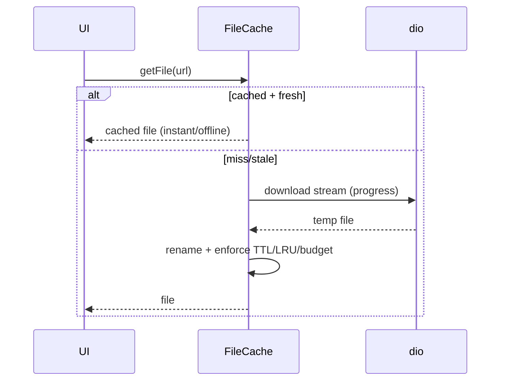

# Downloads & Caching (Streamed Downloads, Eviction, Cleanup)

> Download files by **streaming the response to disk** (via `dio`'s `download`/response stream — never buffer a large file fully in memory), store them in a **cache directory** keyed by a stable id (URL hash), serve from cache on subsequent requests (cache-first), and **evict** by **TTL / LRU / size budget** with periodic cleanup — because the OS can clear the cache anytime, so cached files must always be **re-fetchable**, never the source of truth.

## Introduction

Caching downloaded files (images, PDFs, media) avoids re-downloading and enables offline viewing, but an unmanaged cache grows unbounded and stores things it shouldn't. This file covers streamed downloads with progress, cache keys/lookup, eviction policies, and cleanup — the disciplined version of "download and keep."

## Why this concept exists

Re-downloading wastes data/battery/time; caching to disk fixes that. But device storage is finite and the OS reclaims caches, so you need a **bounded, evictable, re-fetchable** cache — not an ever-growing pile. Streaming exists so large downloads don't OOM. (For image widgets, `cached_network_image` does much of this; this file is the general-file version.)

## Real-world analogy

A file cache is a **local pantry** stocking items from the store (server): you check the pantry first (cache-first), only shop when it's empty/expired (fetch), and you **rotate stock** — toss expired items (TTL), remove the least-used when it's full (LRU/size budget). And since a power cut could spoil the pantry (OS clears cache), you never store your **only** copy of anything there.

## Problem Statement

Download PDFs/images with a progress bar, serve repeat requests from cache (offline-capable), cap the cache at, say, 200 MB with a 7-day TTL, and clean up stale/oversized entries — without blocking the UI or OOM-ing on big files. You'll stream downloads and implement eviction.

## Internal Working

```mermaid
flowchart TD
    Req[request file by URL] --> Key[cacheKey = hash(URL)]
    Key --> Lookup{in cache and fresh?}
    Lookup -->|yes| Serve[return cached file]
    Lookup -->|no| Download[dio.download -> stream to temp]
    Download --> Atomic[rename temp -> cache/key (atomic)]
    Atomic --> Meta[record size + timestamp in index]
    Meta --> Serve
    Cleanup[periodic: TTL + LRU + size budget] --> Evict[delete stale/LRU until under budget]
```

- **Cache key**: a **stable id** from the URL (e.g., SHA-1 hash) + extension → filename in the cache dir ([app_directories_and_paths.md](app_directories_and_paths.md)). Deterministic lookup, no collisions.
- **Streamed download**: `dio.download(url, savePath, onReceiveProgress: (r, t) => ...)` streams to disk with **progress** (never loads the whole file in memory) ([Module 16](../16%20Networking/README.md)); write to a **temp file then rename** into place (atomic — [reading_writing_files.md](reading_writing_files.md)) so a partial download isn't served.
- **Cache-first**: check cache (and freshness) before downloading; return the cached file if present + fresh → offline-capable, fast.
- **Freshness/validation**: TTL (age), and optionally HTTP validators (**ETag**/`Last-Modified` + conditional GET / `If-None-Match`) so unchanged files aren't re-downloaded (304).
- **Eviction policies** (combine):
  - **TTL**: delete entries older than N (stale).
  - **LRU**: track last-access; evict least-recently-used first.
  - **Size budget**: keep total under a cap; evict (LRU) until under it.
- **Index/metadata**: keep a small index (JSON/DB) of key → {size, createdAt, lastAccess} to drive eviction without stat-ing every file constantly.
- **OS may clear cache**: entries can vanish → always able to **re-fetch**; never store non-re-fetchable data in cache ([app_directories_and_paths.md](app_directories_and_paths.md)).
- **Concurrency/dedupe**: coalesce concurrent requests for the same URL into one download (avoid duplicate fetches).

## Memory Representation

Only a chunk is in memory during streaming. The index (key→metadata) is small and in memory/DB; files live on disk. Total on-disk size is what you bound.

## Compiler Behavior

Not applicable.

## Runtime Behavior

Cache hits are instant/offline; misses stream from network (progress). Cleanup runs periodically (on launch/idle) to enforce TTL/LRU/budget. The OS may clear the whole cache under storage pressure.

## Flutter Engine Behavior

Not applicable; networking/file I/O are `dio`/`dart:io`.

## Dart VM Behavior

Streaming uses the I/O pool; hashing/large processing can be offloaded to an isolate if heavy.

## Examples

```dart
import 'package:dio/dio.dart';
import 'package:crypto/crypto.dart';
import 'dart:convert';
import 'dart:io';
import 'package:path/path.dart' as p;

class FileCache {
  final Dio _dio;
  final Directory _cacheDir;
  final Duration ttl;
  final int maxBytes;
  FileCache(this._dio, this._cacheDir, {this.ttl = const Duration(days: 7), this.maxBytes = 200 << 20});

  String _keyFor(String url) => sha1.convert(utf8.encode(url)).toString();

  // Cache-first: serve fresh cache, else stream-download (atomic), then serve
  Future<File> getFile(String url, {void Function(int, int)? onProgress}) async {
    final file = File(p.join(_cacheDir.path, _keyFor(url)));
    if (await file.exists() && await _isFresh(file)) {
      await file.setLastAccessed(DateTime.now());        // for LRU
      return file;
    }
    final tmp = '${file.path}.tmp';
    await _dio.download(url, tmp, onReceiveProgress: onProgress); // streamed, progress
    await File(tmp).rename(file.path);                    // atomic swap
    await _enforceBudget();
    return file;
  }

  Future<bool> _isFresh(File f) async =>
      DateTime.now().difference(await f.lastModified()) < ttl;

  // Evict stale (TTL) + LRU until under the size budget
  Future<void> _enforceBudget() async {
    final files = (await _cacheDir.list().toList()).whereType<File>().toList();
    // delete stale
    for (final f in files) {
      if (!await _isFresh(f)) { await f.delete(); }
    }
    var live = (await _cacheDir.list().toList()).whereType<File>().toList();
    var total = 0;
    for (final f in live) { total += await f.length(); }
    if (total <= maxBytes) return;
    live.sort((a, b) => a.statSync().accessed.compareTo(b.statSync().accessed)); // LRU first
    for (final f in live) {
      if (total <= maxBytes) break;
      total -= await f.length();
      await f.delete();
    }
  }
}
```

## Diagrams



## Common Mistakes

| Mistake | Why | Fix |
|---------|-----|-----|
| Buffering whole file in memory | OOM on large downloads | Stream to disk (`dio.download`) |
| Serving a partial download | Corruption on interrupt | temp + rename (atomic) |
| Unbounded cache | Fills storage | TTL + LRU + size budget |
| Storing only copy in cache | OS clears it | Cache must be re-fetchable |
| No dedupe of concurrent fetches | Duplicate downloads | Coalesce by key |
| Ignoring ETag/Last-Modified | Re-downloads unchanged files | Conditional GET (304) |
| Stat-ing all files constantly | Slow cleanup | Maintain a metadata index |

## Best Practices

- **Stream downloads to disk** (progress via `dio.download`), write **atomically** (temp + rename); key the cache by a **stable URL hash**.
- Serve **cache-first** (offline-capable) with **TTL** freshness (and **ETag/Last-Modified** conditional GETs to skip unchanged files).
- **Bound the cache** (TTL + LRU + size budget) with periodic cleanup; keep a **metadata index**; **dedupe** concurrent fetches.
- Treat cache as **re-fetchable** (never the only copy — OS clears it); wrap behind a repository ([file_integration.md](file_integration.md)).

## Performance

Streaming caps memory; cache-first turns repeat loads into instant disk reads (and enables offline). Bounded eviction keeps storage/backups sane. Conditional GETs save bandwidth. The whole point is spending disk to save network/battery — within a budget.

## Advantages / Disadvantages

- **+** Fast repeat access, offline viewing, bandwidth/battery savings, progress UX, bounded storage.
- **−** Eviction/index complexity, must handle OS cache clearing + partial downloads + dedupe, cache invalidation subtleties.

## Interview Questions

1. **🟢 Why stream downloads instead of loading them into memory?** — Large files would OOM; streaming to disk holds only a chunk at a time (and enables progress).
2. **🟢 What directory do cached downloads go in and why?** — A cache/temporary directory — they're re-fetchable; the OS may clear it, so never store the only copy there.
3. **🟡 How do you key and look up cached files?** — By a stable hash of the URL (deterministic filename), checking existence + freshness before downloading (cache-first).
4. **🟡 What eviction policies keep a file cache bounded?** — TTL (age), LRU (least-recently-used), and a total size budget — combined, with periodic cleanup.
5. **🟡 How do you avoid re-downloading unchanged files?** — HTTP validators (ETag/`Last-Modified`) via conditional GET → 304 Not Modified.
6. **🔴 How do you prevent serving a partially downloaded file?** — Download to a temp file and atomically rename into place only on success.
7. **🔴 How do you handle concurrent requests for the same file?** — Coalesce/dedupe them into a single in-flight download keyed by the cache key.

## Senior Engineer Tips

- Always stream + atomic-rename downloads; the two classic bugs are OOM on big files and serving a truncated file after an interrupted download.
- Bound the cache from day one (size budget + TTL + LRU) and keep a metadata index — an unbounded cache is a slow-burning storage/backup problem.
- Lean on `cached_network_image` for image widgets; build this general cache only for non-image files, and dedupe concurrent fetches.

## Architect Perspective

A file cache is a bounded, re-fetchable performance layer between the app and the network. Encapsulating streamed download + atomic write + cache-first lookup + TTL/LRU/budget eviction behind a `FileCache`/repository gives fast, offline-capable, storage-safe file access — the same cache-first discipline as data caching, applied to binary files, and a building block for offline-first and media features ([Module 19](../19%20Offline%20First/README.md), [Module 16](../16%20Networking/README.md), [file_integration.md](file_integration.md)).

## Summary

- Stream downloads to disk (progress) with atomic writes; key cache by URL hash; serve cache-first (offline).
- Freshness via TTL (+ ETag/Last-Modified conditional GET); bound with TTL + LRU + size budget + periodic cleanup + metadata index.
- Cache is re-fetchable (OS clears it) — never the only copy; dedupe concurrent fetches; behind a repository.

## Revision Notes

- `dio.download(url, tempPath, onReceiveProgress)` → atomic rename; cacheKey = hash(URL); cache-first lookup + TTL freshness (+ ETag/Last-Modified 304).
- Eviction: TTL + LRU + size budget; metadata index; periodic cleanup; dedupe concurrent fetches.
- Cache dir (OS may clear) → always re-fetchable; wrap behind repository; use `cached_network_image` for images.

## Practice Questions

1. Why must downloads stream and write atomically?
2. What three signals bound a file cache?
3. How do you skip re-downloading an unchanged file?

## Coding Questions

1. Implement cache-first `getFile(url)` with streamed download + atomic write.
2. Implement TTL + LRU + size-budget eviction.
3. Add ETag/Last-Modified conditional GET to skip unchanged files.

## Mini Project

**Bounded file cache (Flutter):** Build a `FileCache` that streams downloads (progress) to a cache dir keyed by URL hash, writes atomically, serves cache-first (offline-capable), and evicts by TTL + LRU + a size budget with a metadata index and concurrent-fetch dedupe. Acceptance: large downloads stream (no OOM) + show progress; partial downloads never served (atomic); repeat/offline requests hit cache; cache stays under budget (TTL/LRU eviction); concurrent same-URL fetches coalesced; behind a repository.
