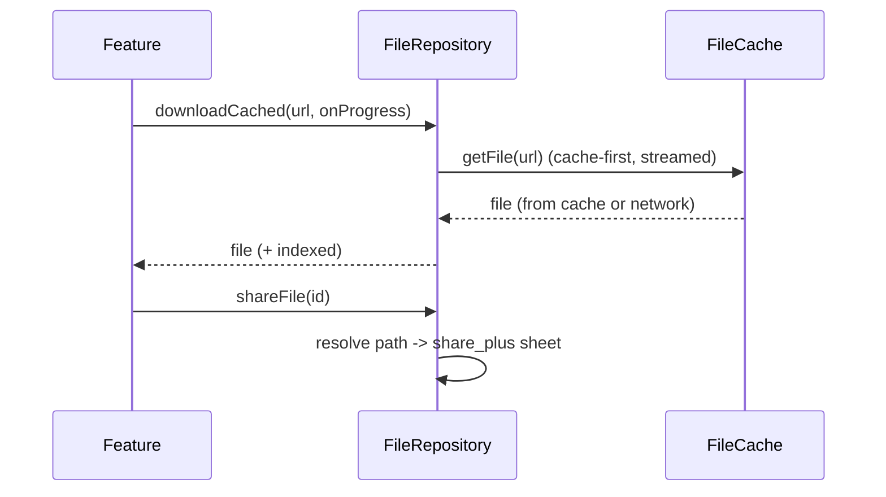

# File Integration (Capstone: A File Repository & Lifecycle Strategy)

> The maintainable shape: a single **`FileRepository`** that hides `path_provider`, `dart:io`, `file_picker`, `share_plus`, and the download cache behind an **intent-based API** (`saveDocument`, `readIndex`, `importAttachment`, `downloadCached`, `shareFile`, `evictCache`), enforcing one **directory & lifecycle strategy** (persistent vs cache), **atomic + async + streamed** I/O, and **cleanup** — so features never touch raw paths or worry about where data lives, backup bloat, corruption, or OOM.

## Introduction

This module capstone composes directories, read/write, picking/sharing, and downloads/caching into one architecture. Scattered file code drifts into inconsistent directory choices, unsafe writes, and leaked temp files. A `FileRepository` centralizes the policy so the app expresses *what* it wants stored, not *how/where*. This file shows that design and an end-to-end document-manager flow.

## Why this concept exists

File handling has many cross-cutting rules (correct directory per intent, atomic writes, streaming large files, persisting picks, bounded cache, cleanup, platform quirks). Left to each feature, they're applied inconsistently → data loss, jank, bloat. One repository — like data/network repositories — isolates these rules behind a boundary consistent with clean architecture ([Module 40](../40%20Clean%20Architecture/README.md)).

## Real-world analogy

`FileRepository` is the **records department**: teams submit requests ("archive this document", "fetch that report", "shred old temp files") and the department applies **filing policy** (which cabinet, backup rules, retention/shredding schedule) uniformly. No employee decides on their own to stuff tax records in the recycling bin — the department enforces the rules.

## Problem Statement

Build a document manager: save user documents (persistent), maintain a JSON index (atomic), import picked attachments (persist copies), download report PDFs with progress into a bounded cache, stream/parse large imports off the UI thread, share files, and evict stale cache — all behind one repository with a clear directory & lifecycle strategy. You'll compose every file in this module.

## Internal Working

```mermaid
flowchart TD
    Feature[features (intent)] --> Repo[FileRepository]
    Repo --> Dirs[AppPaths (documents/support/cache) — path_provider]
    Repo --> IO[safe I/O: atomic writes, streaming, isolates — dart:io]
    Repo --> Pick[import/share — file_picker/share_plus]
    Repo --> Cache[FileCache: streamed downloads + TTL/LRU/budget — dio]
    Repo --> Index[JSON index of managed files]
    Repo --> Clean[lifecycle: cleanup/eviction]
```

- **Intent-based API**: `saveDocument(name, bytes)`, `readIndex()/writeIndex()`, `importAttachment()`, `downloadCached(url, onProgress)`, `shareFile(id)`, `evictCache()`, `deleteDocument(id)`. Features never see paths.
- **Directory strategy (one place)**: persistent user data → **documents**; internal index/config → **application support**; downloads/thumbnails → **cache**; scratch → **temp** ([app_directories_and_paths.md](app_directories_and_paths.md)). Backup-aware (avoid large blobs in iOS documents).
- **Safe I/O**: **atomic writes** (temp+rename), **async** everywhere, **streaming** for large files, **isolate** offload for heavy parse ([reading_writing_files.md](reading_writing_files.md)).
- **Import/share**: pick → **copy into app storage** → index; share via **`share_plus`** ([file_picker_and_sharing.md](file_picker_and_sharing.md)).
- **Cache**: streamed, bounded, cache-first `FileCache` for downloads ([downloads_and_caching.md](downloads_and_caching.md)); re-fetchable, evictable.
- **Index + lifecycle**: a small JSON/DB index of managed files (id → path/dir/metadata) drives listing, sharing, deletion, and cleanup; run **eviction/cleanup** on launch/idle.
- **Testability**: depend on abstractions (paths, cache, picker, sharer); unit-test the repository with a temp dir + fakes (no device).

## Memory Representation

The repository holds cached directories + the file index (small). Files live on disk in their strategy-assigned dirs; streaming/isolates keep memory bounded during large ops.

## Compiler Behavior

Compiles against abstractions (paths/cache/picker) — mockable; isolate entry points top-level where needed.

## Runtime Behavior

The repository routes each intent to the right directory + safe I/O path; downloads stream + cache; cleanup enforces retention/budget; imports persist copies. Cache/temp may be cleared by the OS (re-fetchable), documents/support persist.

## Flutter Engine Behavior

Not applicable beyond the plugins (path_provider/file_picker/share) bridging natively.

## Dart VM Behavior

Heavy parsing offloaded to isolates; I/O async on the I/O pool; index kept in the UI isolate.

## Examples

```dart
// Intent-based repository — features never touch paths/plugins
abstract class FileRepository {
  Future<ManagedFile> saveDocument(String name, List<int> bytes);   // persistent
  Future<Map<String, dynamic>> readIndex();
  Future<void> writeIndex(Map<String, dynamic> index);              // atomic
  Future<ManagedFile?> importAttachment();                          // pick + persist
  Future<File> downloadCached(String url, {void Function(int,int)? onProgress}); // cached
  Future<void> shareFile(String id);
  Future<void> evictCache();                                        // TTL/LRU/budget
}

class FileRepositoryImpl implements FileRepository {
  final AppPaths paths;        // documents/support/cache (path_provider)
  final FileCache cache;       // streamed downloads + eviction (dio)
  final Picker picker; final Sharer sharer;
  FileRepositoryImpl(this.paths, this.cache, this.picker, this.sharer);

  @override
  Future<ManagedFile> saveDocument(String name, List<int> bytes) async {
    final file = await paths.documentFile(name);       // persistent dir (strategy)
    await _atomicWriteBytes(file, bytes);              // safe write
    return _index(file);                               // record in index
  }

  @override
  Future<ManagedFile?> importAttachment() async {
    final picked = await picker.pickFile();            // system picker
    if (picked == null) return null;
    final dest = await paths.documentFile(p.basename(picked.path));
    await File(picked.path).copy(dest.path);           // persist the pick
    return _index(dest);
  }

  @override
  Future<File> downloadCached(String url, {void Function(int,int)? onProgress}) =>
      cache.getFile(url, onProgress: onProgress);      // cache-first, streamed, bounded

  // ... readIndex/writeIndex (atomic), shareFile (share_plus), evictCache (cache)
}
```

```dart
// Unit test with a temp dir + fakes — no device
test('saveDocument persists + indexes', () async {
  final repo = FileRepositoryImpl(FakePaths(tempDir), FakeCache(), FakePicker(), FakeSharer());
  final f = await repo.saveDocument('a.txt', utf8.encode('hi'));
  expect(await File(f.path).readAsString(), 'hi');
  expect((await repo.readIndex()).containsKey(f.id), isTrue);
});
```

## Diagrams



## Common Mistakes

| Mistake | Why | Fix |
|---------|-----|-----|
| Paths/plugins in features | Inconsistent, untestable | Intent-based repository |
| Inconsistent directory choices | Data loss/backup bloat | One directory strategy |
| Non-atomic/blocking writes | Corruption/jank | Atomic + async + streaming |
| Not persisting picked files | Broken references | Copy into app storage + index |
| Unbounded cache / no cleanup | Storage bloat | TTL/LRU/budget + scheduled eviction |
| No index of managed files | Can't list/delete/clean | Maintain a file index |
| Untestable (real device) | Slow/fragile | Temp dir + fakes |

## Best Practices

- Expose an **intent-based `FileRepository`**; enforce **one directory & lifecycle strategy** (persistent vs cache, backup-aware) inside it.
- Use **atomic + async + streamed** I/O and **isolate** offload; **persist picked files** (copy + index); **share** via the OS sheet.
- Keep a **file index** driving listing/deletion/cleanup; run **eviction** (cache) and **cleanup** (temp) on launch/idle.
- Depend on **abstractions** (paths/cache/picker/sharer) for **testability** (temp dir + fakes); document the strategy.

## Performance

The repository centralizes the performance-critical choices (streaming, async, isolates, bounded cache) so they're applied consistently. Correct directory strategy avoids re-fetch/backup costs; cleanup keeps storage bounded. No overhead beyond the underlying I/O.

## Advantages / Disadvantages

- **+** Consistent, safe, testable file access; one place for directory/lifecycle policy; features stay simple; no data loss/bloat/corruption.
- **−** Upfront structure/boilerplate, index maintenance, requires discipline to route everything through the repository.

## Interview Questions

1. **🟢 Why wrap file handling in a repository?** — To enforce one directory/lifecycle strategy, safe I/O, and cleanup consistently, keeping paths/plugins out of features and enabling tests.
2. **🟢 What does an intent-based file API look like?** — Methods like `saveDocument`/`importAttachment`/`downloadCached`/`shareFile`/`evictCache` — features express *what*, not *where/how*.
3. **🟡 How is the directory strategy applied?** — Persistent user data → documents, internal → support, downloads → cache, scratch → temp; centralized and backup-aware.
4. **🟡 How do you keep the repository testable?** — Depend on abstractions (paths/cache/picker/sharer) and inject fakes + a temp directory — no device needed.
5. **🟡 Why maintain a file index?** — To list, share, delete, and clean up managed files without scanning the filesystem, and to store per-file metadata.
6. **🔴 How do all pieces cooperate for a downloaded, shareable report?** — `downloadCached` streams into the bounded cache (cache-first) → indexed → `shareFile` resolves the path → share sheet; eviction reclaims space later.
7. **🔴 Where are correctness/performance concerns handled?** — In the repository: atomic writes (correctness), async/streaming/isolates (performance), TTL/LRU/budget (storage) — applied uniformly.

## Senior Engineer Tips

- Route *all* file access through the repository and write the directory strategy down; the moment features call `path_provider` directly, consistency erodes.
- Keep an index + scheduled cleanup from day one; retrofitting retention onto an unmanaged pile of files is painful.
- Make the repository testable with a temp dir + fakes so file logic runs in CI — file bugs are otherwise device-only and slow to catch.

## Architect Perspective

File integration applies the app's boundary discipline to the filesystem: one repository owns directory policy, safe/efficient I/O, import/share, bounded caching, and cleanup, exposing intent to features. This eliminates the whole class of file bugs (lost data, backup bloat, corruption, OOM, leaks), stays testable in CI, and composes with offline-first, media, and export features — the same clean-architecture seam used for data and networking ([Module 40](../40%20Clean%20Architecture/README.md), [Module 19](../19%20Offline%20First/README.md), [Module 15](../15%20Local%20Storage/README.md)).

## Summary

- One intent-based `FileRepository` enforces the directory & lifecycle strategy and safe/efficient I/O; features never touch paths/plugins.
- Atomic + async + streamed I/O (+ isolates), persist picks, bounded cache, file index, scheduled cleanup.
- Depend on abstractions for testability; document the strategy; composes with offline/media/export.

## Revision Notes

- `FileRepository` intent API (`saveDocument`/`importAttachment`/`downloadCached`/`shareFile`/`evictCache`); directory strategy centralized (documents/support/cache/temp), backup-aware.
- Atomic + async + streamed I/O + isolate offload; persist picked files (copy+index); share via OS sheet; bounded `FileCache`.
- File index drives list/delete/cleanup; eviction/cleanup on launch/idle; abstractions + temp dir + fakes for tests.

## Practice Questions

1. What belongs in the file repository vs the feature?
2. How is the directory strategy kept consistent?
3. How do you make file logic testable in CI?

## Coding Questions

1. Design a `FileRepository` interface + impl over paths/cache/picker/sharer.
2. Implement `saveDocument` (atomic) + `importAttachment` (persist pick) + index.
3. Unit-test the repository with a temp dir + fakes.

## Mini Project

**Document manager (capstone — Flutter):** Build a `FileRepository` composing `AppPaths` (directory strategy), safe I/O (atomic/streamed/isolate), `file_picker`/`share_plus` (import/share), and a bounded `FileCache` (downloads) behind an intent API, maintaining a JSON file index and running eviction/cleanup. Provide abstractions + fakes and unit tests (temp dir). Acceptance: features use intents only; correct directory per file type (backup-aware); atomic/async/streamed I/O; picked files persisted + indexed; downloads cached + bounded; share works; cleanup enforced; unit-tested in CI (no device); runs end-to-end on device.
