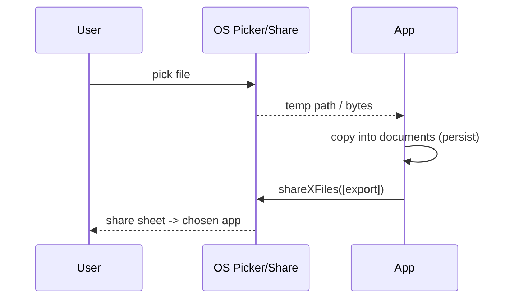

# Picking & Sharing Files (`file_picker`, `share_plus`)

> Let users bring files **in** with **`file_picker`** (system picker → returns a path/bytes; may be a temp copy you must persist) and send files **out** with **`share_plus`** (the native share sheet). Key gotchas: a picked file often lives in a **temporary location** (copy it into app storage if you need it later), pickers respect **scoped storage** (no raw filesystem browsing), and you should **share via the OS share sheet**, not by exposing raw sandbox paths (which other apps can't read).

## Introduction

Import/export is how files cross the app boundary. `file_picker` opens the OS document/media picker; `share_plus` opens the native share sheet. This file covers picking (single/multiple, type filters, bytes vs path), persisting picked files, saving files out, and sharing — the user-facing edges of file handling.

## Why this concept exists

Sandboxing means apps can't freely browse the device or hand files to each other by path. The OS provides pickers (user grants access to a specific file) and share sheets (OS mediates file hand-off). These plugins wrap those native flows so users can attach documents and share exports safely.

## Real-world analogy

`file_picker` is the **reception desk** where a visitor hands you a **photocopy** of a document (a temp copy) — if you want to keep it, you must **file it in your own cabinet** (copy to app storage), because the original stays with them. `share_plus` is the **mailroom's outgoing tray**: you drop a file there and the OS decides which courier (app) delivers it — you don't hand your private cabinet key to strangers.

## Problem Statement

Let the user attach a PDF/image (pick, then keep it across launches), export a generated report to share via WhatsApp/email/Drive, and let them save a file where they choose. You'll use `file_picker` (+ persist), `share_plus`, and a save dialog.

## Internal Working

```mermaid
flowchart TD
    Pick[FilePicker.pickFiles(type, allowMultiple)] --> Result{path or bytes}
    Result -->|path (temp)| Persist[copy into app storage if keeping]
    Result -->|bytes (web/small)| Save[write bytes to app storage]
    Share[Share.shareXFiles([XFile])] --> Sheet[native share sheet -> chosen app]
    SaveDlg[FilePicker.saveFile / platform save] --> UserDir[user-chosen location]
```

- **Picking** (`file_picker`): `FilePicker.platform.pickFiles(type: FileType.custom, allowedExtensions: ['pdf'], allowMultiple: false)` → `FilePickerResult?` (null if cancelled) with `files` each exposing `path` (mobile/desktop) and/or `bytes` (web/`withData: true`).
- **Temp-copy gotcha**: on many platforms the picked file's `path` points to a **temporary/cache copy** the OS may clear. To use it later, **copy it into your documents/support dir** ([app_directories_and_paths.md](app_directories_and_paths.md)) and store *that* path — don't persist the picker's path.
- **Type filters/size**: filter by extension/media type; validate size/type after picking (don't trust the extension alone for security). Use `withData: true` when you need bytes (web) — heavy for large files.
- **Sharing** (`share_plus`): `Share.shareXFiles([XFile(path)], text: ...)` opens the native sheet; also `Share.share(text)` for text/links. On iPad, provide `sharePositionOrigin` (popover anchor) or it throws.
- **Saving out**: `FilePicker.platform.saveFile(...)` (desktop/Android) lets the user choose a destination; on iOS, "saving" is typically done via the **share sheet → Save to Files**.
- **Permissions**: modern pickers/share **don't need broad storage permissions** (the picker grants scoped access) — prefer them over requesting full storage access ([27 · permissions](../27%20Native%20Android/permissions_and_manifest.md)).
- **Cleanup**: delete temp copies you created; don't leak duplicates.

## Memory Representation

`path`-based results reference a file on disk (possibly temp); `bytes`-based results load content into memory (avoid for large files). Persisted copies live in your chosen app directory.

## Compiler Behavior

Not applicable.

## Runtime Behavior

Pickers/share sheets are native modal flows (app pauses while shown). A picked temp file may be cleared later — hence the copy-to-persist rule.

## Flutter Engine Behavior

Pickers/share sheets are native UI over Flutter (platform channels — [26](../26%20Platform%20Channels/README.md)); `shareXFiles` hands file URIs to the OS.

## Dart VM Behavior

Not applicable.

## Examples

```dart
import 'package:file_picker/file_picker.dart';
import 'package:share_plus/share_plus.dart';
import 'package:path/path.dart' as p;
import 'package:path_provider/path_provider.dart';
import 'dart:io';

// Pick a PDF and PERSIST it into app storage (picker path may be temporary)
Future<File?> pickAndKeepPdf() async {
  final result = await FilePicker.platform.pickFiles(
    type: FileType.custom, allowedExtensions: ['pdf'], allowMultiple: false,
  );
  final picked = result?.files.single.path;
  if (picked == null) return null;                     // cancelled
  final dir = await getApplicationDocumentsDirectory();
  final saved = File(p.join(dir.path, p.basename(picked)));
  return File(picked).copy(saved.path);                // keep our own copy
}

// Share a file via the native share sheet
Future<void> shareReport(File report) async {
  await Share.shareXFiles([XFile(report.path)], text: 'Here is your report');
  // iPad: pass sharePositionOrigin to avoid a crash.
}
```

## Diagrams



## Common Mistakes

| Mistake | Why | Fix |
|---------|-----|-----|
| Persisting the picker's temp path | OS clears it → broken reference | Copy into app storage; store that path |
| `withData: true` for large files | High memory | Use `path`; stream if needed |
| Trusting extension for type/security | Spoofable | Validate content/size after pick |
| Sharing raw sandbox path | Other apps can't read it | Use `shareXFiles` (OS mediates) |
| iPad share without origin | Throws | Provide `sharePositionOrigin` |
| Requesting broad storage perms | Unnecessary/rejected | Pickers grant scoped access |
| Leaking temp copies | Storage bloat | Clean up copies you make |

## Best Practices

- After picking, **copy the file into your app directory** and store that path — never rely on the picker's (often temporary) path.
- Filter by type and **validate content/size** after picking; use **`path`** over `bytes` for large files (bytes only when needed, e.g., web).
- **Share via `share_plus`** (`shareXFiles`), not raw paths; on **iPad** set `sharePositionOrigin`; for save-out use `saveFile`/share-to-Files.
- Prefer **system pickers** (scoped access) over broad storage permissions; **clean up** temp copies you create.

## Performance

Pickers/share are lightweight (native). The cost is loading `bytes` for large files (avoid) and leaking copies (clean up). Copying a picked file is a normal I/O cost — stream if very large ([reading_writing_files.md](reading_writing_files.md)).

## Advantages / Disadvantages

- **+** User-friendly import/export, scoped (no broad permissions), native share targets, type filtering.
- **−** Temp-copy persistence gotcha, memory risk with `bytes`, iPad share origin, must validate/clean up, scoped-storage limits.

## Interview Questions

1. **🟢 What does `file_picker` return and what's the catch?** — A path and/or bytes; the path is often a temporary copy — persist it into app storage if you need it later.
2. **🟢 How do you share a file from a Flutter app?** — `Share.shareXFiles([XFile(path)])` (share_plus) opens the native share sheet; don't expose raw sandbox paths.
3. **🟡 Why copy a picked file into your app directory?** — The picker's temp location can be cleared by the OS; a persisted copy under documents/support survives.
4. **🟡 When would you use `bytes` vs `path`?** — `bytes` for web or small in-memory needs; `path` for mobile/desktop and large files (avoid loading big files into memory).
5. **🟡 Why prefer system pickers over storage permissions?** — Pickers grant scoped access to the chosen file without requesting broad, often-rejected storage permissions.
6. **🔴 What's the iPad share gotcha?** — `shareXFiles` needs a `sharePositionOrigin` (popover anchor) on iPad or it throws.
7. **🔴 Why not trust the picked file's extension for security?** — Extensions are spoofable; validate content/size (and scan if untrusted) after picking.

## Senior Engineer Tips

- Make "pick → copy into app storage → return our path" a single helper; the temp-path bug is the most common file-picker regression.
- Use `path` and stream-copy large picks; loading `bytes` for a big attachment is a silent memory spike.
- Always share through the OS sheet and set the iPad origin; and validate type/size on import rather than trusting the source.

## Architect Perspective

Picking/sharing are the app's file boundary with the OS and other apps — inherently scoped and mediated. Encapsulating "pick-and-persist" and "share" in the file repository (with validation, copy-to-app-storage, cleanup, and iPad handling) keeps features simple and safe, and integrates with generated exports (PDF/Excel) and attachments feeding uploads/offline ([Module 35](../35%20PDF/README.md), [Module 36](../36%20Excel/README.md), [file_integration.md](file_integration.md)).

## Summary

- `file_picker`: system picker → path/bytes; **persist by copying into app storage** (picker path is often temporary); validate type/size; `bytes` only when needed.
- `share_plus`: `shareXFiles` via the native sheet (not raw paths); iPad needs `sharePositionOrigin`; save-out via `saveFile`/share-to-Files.
- Prefer scoped pickers over storage permissions; clean up temp copies.

## Revision Notes

- `FilePicker.platform.pickFiles(type, allowedExtensions, allowMultiple, withData)` → `FilePickerResult?` (null = cancel); copy path into documents/support to persist.
- `Share.shareXFiles([XFile(path)], text:)` / `Share.share(text)`; iPad `sharePositionOrigin`; `saveFile` for save-out.
- `path` vs `bytes` (memory); validate type/size; scoped access (no broad perms); clean up copies.

## Practice Questions

1. Why must you copy a picked file into app storage?
2. How do you share a generated file, and what's the iPad caveat?
3. When do you use `bytes` vs `path` from the picker?

## Coding Questions

1. Implement `pickAndKeepPdf()` that persists the pick into documents.
2. Share a generated report via `share_plus` (handle iPad).
3. Validate a picked file's size/type before accepting it.

## Mini Project

**Attach & share (Flutter):** Build import/export: `pickAndKeep` (pick a PDF/image, validate size/type, copy into documents, return the persisted path), and `share` (share a file via `share_plus`, iPad-safe). Clean up temp copies and avoid broad storage permissions. Acceptance: picked files persist across launches (copied); validation enforced; sharing works via the native sheet (iPad origin set); no broad permissions; temp copies cleaned up.
