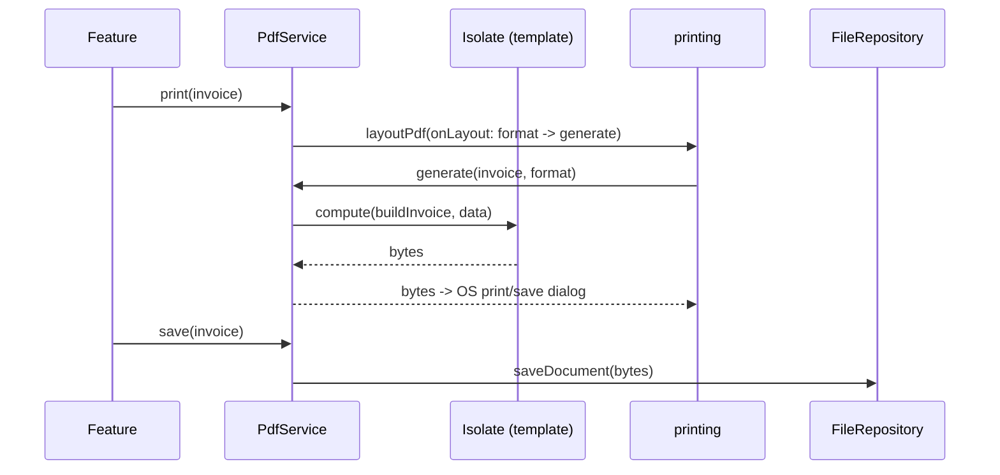

# PDF Integration (Capstone: A Document Service)

> The maintainable shape: a **`PdfService`** (or `DocumentService`) that sits between features and both packages — features pass a **domain model + an action** (`generate`, `preview`, `print`, `share`, `save`), and the service composes **pure templates** (`pdf`/`pw.*`) with **presentation** (`printing`) and **persistence** (file repository — [Module 34](../34%20File%20Handling/README.md)), offloading heavy generation to an **isolate** and honoring the chosen **paper format**. Features never touch `pw.*`, `Printing`, or file paths — they say "give me the invoice, printed."

## Introduction

This module capstone unifies generation, layouts, presentation, and data-driven templates into one service. Scattering `pdf`/`printing`/file calls across widgets couples features to document internals and duplicates isolate/format handling. A `PdfService` centralizes it, exposing intent. This file shows the service design and an end-to-end invoice flow.

## Why this concept exists

Document features cut across generation (pure templates), presentation (preview/print/share), persistence (save/cache), performance (isolate), and formatting (paper size/locale). Left in widgets, these tangle and drift. One service — like repositories for data — isolates them behind an intent API, consistent with clean architecture ([Module 40](../40%20Clean%20Architecture/README.md)).

## Real-world analogy

`PdfService` is the **print shop**: you bring an order form (domain model) and say what you want ("print two copies", "email me a PDF", "just show me a proof"). The shop runs the press (generation), handles paper size, and routes the output to the counter/mailroom/preview — you don't operate the machinery yourself.

## Problem Statement

Deliver an invoice feature: generate a branded, paginated invoice from an `Invoice` model, let the user preview it, print/save-as-PDF via the OS dialog, share it, and persist a copy to the file repository — with heavy generation off the UI thread and correct paper format — all behind one `PdfService`. You'll compose every file in this module.

## Internal Working

```mermaid
flowchart TD
    Feature[feature: model + action] --> Svc[PdfService]
    Svc --> Gen[pure template buildInvoice (pdf/pw.*)]
    Gen -->|heavy| Iso[isolate (compute)]
    Svc --> Present[printing: preview / layoutPdf / sharePdf]
    Svc --> Persist[FileRepository.saveDocument (Module 34)]
    Svc --> Format[honor PdfPageFormat / locale]
```

- **Intent API**: `Future<Uint8List> generate(Invoice, {format})`, `preview(Invoice)`, `print(Invoice)`, `share(Invoice)`, `save(Invoice)` (or an `Action` enum). Features pass a **model**, not `pw.*`.
- **Generation**: delegates to **pure templates** ([04_data_driven_documents.md](04_data_driven_documents.md)); **offloads** large docs to an isolate (`compute`), passing serializable model data.
- **Presentation**: uses **`printing`** — `PdfPreview`/`layoutPdf`/`sharePdf` — honoring the passed `PdfPageFormat` ([03_viewing_and_printing.md](03_viewing_and_printing.md)).
- **Persistence**: hands bytes to the **`FileRepository`** to save into the right directory (documents) and index/share ([Module 34](../34%20File%20Handling/README.md)); may **cache** generated bytes keyed by model hash to avoid regeneration.
- **Format/locale**: the service owns paper-format + locale handling so templates stay pure and features stay simple.
- **Testability**: depend on abstractions (a template function, a presenter interface, the file repo); unit-test that `generate` returns valid bytes and that actions route correctly with fakes — no device.
- **Separation recap**: `pdf` (generate) + `printing` (present) + file repo (persist), orchestrated by the service.

## Memory Representation

The service holds no document state (optionally a small bytes cache keyed by model hash). Bytes flow generate → present/persist. Isolate generation keeps large-doc memory off the UI isolate.

## Compiler Behavior

Compiles against template/presenter/file abstractions (mockable); isolate entry points serializable.

## Runtime Behavior

`generate` builds (isolate for heavy) → bytes; `preview`/`print`/`share`/`save` route bytes to the right sink honoring format. Regeneration per format handled centrally; optional caching avoids repeat work.

## Flutter Engine Behavior

`PdfPreview` rasterizes in-Flutter; print/share dialogs are native; generation is pure Dart (isolate).

## Dart VM Behavior

Heavy generation on a background isolate; the service coordinates on the UI isolate.

## Examples

```dart
// Intent-based service — features never touch pw.*, Printing, or file paths
abstract class PdfService {
  Future<Uint8List> generate(Invoice inv, {PdfPageFormat format});
  Future<void> preview(BuildContext context, Invoice inv);
  Future<void> print(Invoice inv);          // OS print/save dialog
  Future<void> share(Invoice inv);          // share sheet
  Future<ManagedFile> save(Invoice inv);    // persist via FileRepository
}

class PdfServiceImpl implements PdfService {
  final FileRepository files;
  PdfServiceImpl(this.files);

  @override
  Future<Uint8List> generate(Invoice inv, {PdfPageFormat format = PdfPageFormat.a4}) =>
      compute(_generateInvoice, _InvoiceArgs(inv, format)); // pure template, isolate

  @override
  Future<void> print(Invoice inv) => Printing.layoutPdf(
      onLayout: (format) => generate(inv, format: format));  // honor chosen format

  @override
  Future<void> share(Invoice inv) async =>
      Printing.sharePdf(bytes: await generate(inv), filename: 'invoice-${inv.id}.pdf');

  @override
  Future<ManagedFile> save(Invoice inv) async =>
      files.saveDocument('invoice-${inv.id}.pdf', await generate(inv)); // Module 34
}

// Top-level, serializable-args isolate entry (pure buildInvoice from data_driven_documents)
Future<Uint8List> _generateInvoice(_InvoiceArgs a) => buildInvoice(a.inv, format: a.format);
```

```dart
// Feature usage — pure intent
// await pdfService.print(order.toInvoice());
// await pdfService.share(order.toInvoice());
// final saved = await pdfService.save(order.toInvoice());
```

## Diagrams



## Common Mistakes

| Mistake | Why | Fix |
|---------|-----|-----|
| `pdf`/`printing`/file calls in widgets | Coupled, duplicated, untestable | One `PdfService` intent API |
| Generation on UI thread | Jank on large docs | Isolate via the service |
| Ignoring chosen paper format | Wrong output size | Service honors `PdfPageFormat` |
| Duplicating isolate/format logic per feature | Drift | Centralize in service |
| Impure templates (I/O/globals) | Isolate-unsafe/untestable | Pure `data → bytes` templates |
| No persistence strategy | Lost/misplaced files | Route saves via `FileRepository` |
| Untestable (real device) | Slow/fragile | Abstractions + fakes |

## Best Practices

- Expose an **intent-based `PdfService`** (`generate`/`preview`/`print`/`share`/`save`); keep `pdf`/`printing`/file details **inside** it.
- Delegate to **pure templates**, **offload** heavy generation to an isolate, and **honor the paper format/locale** centrally.
- Route **persistence via the `FileRepository`** ([Module 34](../34%20File%20Handling/README.md)); optionally **cache** bytes by model hash; keep features model-only.
- Depend on **abstractions** for **testability** (template/presenter/file fakes); unit-test generation + action routing.

## Performance

The service centralizes the performance levers (isolate generation, format regeneration, optional caching) so they apply uniformly. Features get responsive document actions; large docs never jank the UI; caching avoids redundant regeneration.

## Advantages / Disadvantages

- **+** Clean separation (generate/present/persist), testable, consistent, features stay simple, centralized isolate/format/cache handling.
- **−** Upfront service/abstraction design, requires discipline to route all document ops through it.

## Interview Questions

1. **🟢 Why wrap PDF work in a service?** — To hide `pdf`/`printing`/file details behind an intent API, centralize isolate/format/persistence handling, and keep features testable and simple.
2. **🟢 What does the intent API look like?** — `generate`/`preview`/`print`/`share`/`save` taking a domain model — features pass data + action, not `pw.*`.
3. **🟡 How does the service keep the UI responsive?** — It offloads heavy generation to an isolate (`compute`) with serializable data.
4. **🟡 How is the paper format handled?** — Centrally: presentation callbacks pass a `PdfPageFormat`, and the service regenerates at that size.
5. **🟡 How does persistence work?** — The service routes bytes to the `FileRepository` (correct directory + index), reusing the file layer.
6. **🔴 How do generation, presentation, and persistence separate?** — `pdf`/pure templates generate bytes; `printing` presents; `FileRepository` persists — the service orchestrates all three.
7. **🔴 How do you test the service?** — With template/presenter/file fakes: assert `generate` returns valid bytes and that each action routes to the right collaborator — no device.

## Senior Engineer Tips

- Route every document operation through the service; the moment a widget calls `Printing` or `pw.*` directly, format/isolate/persistence handling starts drifting.
- Centralize isolate + format handling once so templates stay pure and features stay trivial; add a bytes cache keyed by model hash if the same doc is regenerated often.
- Keep the three concerns cleanly split (generate/present/persist) — it's what makes document features testable in CI and easy to extend (new doc types reuse the pipeline).

## Architect Perspective

PDF integration is the orchestration seam for documents: pure templates (generation), `printing` (presentation), and the file repository (persistence), unified behind an intent-based service that owns isolate/format/cache concerns. This mirrors the app's other boundaries (data/network/files), keeps document features simple and CI-testable, and scales to new document types by reusing the pipeline — completing the generation→presentation→persistence story ([04_data_driven_documents.md](04_data_driven_documents.md), [03_viewing_and_printing.md](03_viewing_and_printing.md), [Module 34](../34%20File%20Handling/README.md), [Module 40](../40%20Clean%20Architecture/README.md)).

## Summary

- One intent-based `PdfService` composes pure templates (`pdf`), presentation (`printing`), and persistence (`FileRepository`); features pass model + action.
- Centralizes isolate generation, paper-format handling, and optional caching; keeps `pw.*`/`Printing`/paths out of features.
- Depend on abstractions for testability; clean generate/present/persist separation scales to new document types.

## Revision Notes

- `PdfService`: `generate`/`preview`/`print`/`share`/`save`(model); generation via pure templates + `compute` (isolate); honor `PdfPageFormat`.
- Present via `printing` (`PdfPreview`/`layoutPdf`/`sharePdf`); persist via `FileRepository` (Module 34); optional bytes cache by model hash.
- Abstractions + fakes for tests; separation: `pdf` (generate) / `printing` (present) / file repo (persist).

## Practice Questions

1. What belongs in the `PdfService` vs the feature/template?
2. How are isolate offloading and paper format handled centrally?
3. How do generation, presentation, and persistence separate?

## Coding Questions

1. Design a `PdfService` interface + impl composing template/printing/file repo.
2. Implement `print` honoring the format and `save` via the file repository.
3. Unit-test action routing + generation with fakes.

## Mini Project

**Invoice generator service (capstone — Flutter):** Build a `PdfService` that generates a branded invoice from an `Invoice` model via a pure template (isolate-offloaded), and exposes `preview` (`PdfPreview`), `print` (`layoutPdf`, format-honoring), `share` (`sharePdf`), and `save` (via `FileRepository`, Module 34). Depend on abstractions; add unit tests. Acceptance: features pass model + action only (no `pw.*`/`Printing`/paths); generation off the UI thread; paper format honored; preview/print/share/save all work; saved copy persisted + indexed; unit-tested with fakes; runs end-to-end on device.
