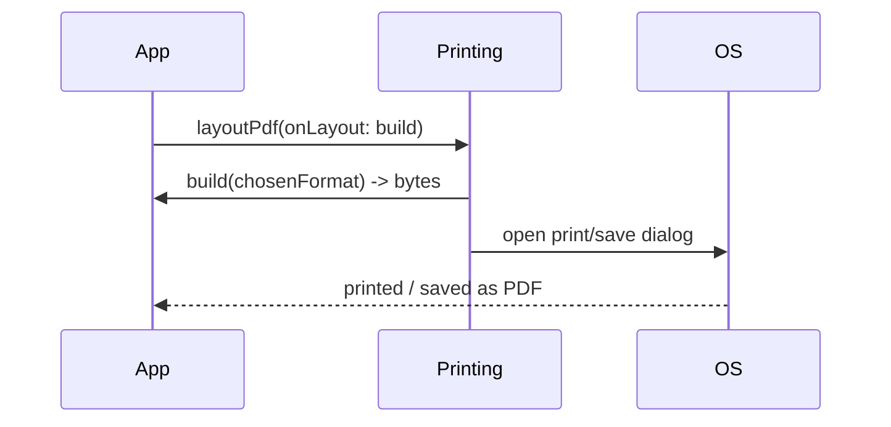

# Viewing & Printing (`printing` Package)

> The `printing` package turns PDF bytes into user actions: **`Printing.layoutPdf`** (opens the OS print/preview dialog — print or save-as-PDF), the **`PdfPreview`** widget (an in-app preview with print/share/download buttons), **`Printing.sharePdf`** (native share sheet), and **`Printing.convertHtml`** (render simple HTML → PDF). It's the presentation half that complements the `pdf` package's generation half — plus it can fetch Google Fonts and raster pages to images.

## Introduction

Once you have PDF bytes ([pdf_generation_basics.md](pdf_generation_basics.md)), users want to preview, print, share, or save them. The `printing` package provides the dialogs/widgets for all of these cross-platform. This file covers each entry point, the preview widget, HTML-to-PDF, and when to use which.

## Why this concept exists

Generating bytes isn't enough — users expect the familiar OS print dialog (with "Save as PDF"), an in-app preview, and share targets. `printing` wraps the divergent platform print/preview/share APIs (Android print framework, iOS `UIPrintInteractionController`, etc.) into one Dart API so you don't implement each natively.

## Real-world analogy

If the `pdf` package is the **printing press** (makes the document), `printing` is the **front office**: the **print counter** (send to a printer or save as PDF), the **preview window** on the wall (`PdfPreview`), and the **outgoing mail tray** (share). Same document, different ways to hand it to the user or a device.

## Problem Statement

Let the user preview a generated invoice in-app, print it (or save-as-PDF) via the OS dialog, and share it — plus generate a quick PDF from an HTML string for a simple case. You'll use `PdfPreview`, `layoutPdf`, `sharePdf`, and `convertHtml`.

## Internal Working

```mermaid
flowchart TD
    Bytes[PDF bytes (or a builder)] --> Choose{how to present?}
    Choose -->|OS print/save dialog| Layout[Printing.layoutPdf(onLayout: ...)]
    Choose -->|in-app preview + actions| Preview[PdfPreview(build: ...)]
    Choose -->|share sheet| Share[Printing.sharePdf(bytes, filename)]
    Html[HTML string] --> Convert[Printing.convertHtml(html) -> PDF bytes]
```

- **`Printing.layoutPdf`**: `Printing.layoutPdf(onLayout: (format) async => bytes)` opens the **OS print dialog** — the user picks a printer or **"Save as PDF"**. The `onLayout` callback receives the target `PdfPageFormat` (so you can regenerate for the chosen paper size). Fully cross-platform.
- **`PdfPreview`** widget: drops an in-app preview into your UI with built-in **print/share/download** actions; `build: (format) => bytes`. Good for a preview screen; customize toolbar/actions.
- **`Printing.sharePdf`**: `sharePdf(bytes: ..., filename: 'invoice.pdf')` opens the native **share sheet** (email, Drive, WhatsApp) — like `share_plus` but PDF-specific ([Module 34](../34%20File%20Handling/README.md)).
- **`Printing.convertHtml`**: `convertHtml(format:, html:)` renders **simple HTML/CSS → PDF** — handy when you already have HTML, but the supported HTML/CSS subset is **limited** (no full browser); for complex/branded docs, build with `pw.*` instead.
- **Extras**: `Printing.raster(bytes)` rasterizes pages to images (thumbnails/preview images); `PdfGoogleFonts` fetches web fonts for embedding ([layouts_tables_and_assets.md](layouts_tables_and_assets.md)); check `Printing.info()` for platform capabilities.
- **Regeneration on format**: the `onLayout`/`build` callbacks pass the chosen format so you can generate at the correct page size (e.g., A4 vs Letter).

## Memory Representation

You hold the PDF bytes; preview/print may raster pages (extra memory for images). Regenerating per format rebuilds the document.

## Compiler Behavior

Not applicable.

## Runtime Behavior

`layoutPdf`/preview may call your builder multiple times (e.g., per format change). `sharePdf`/`layoutPdf` present native modals. `convertHtml` runs an HTML→PDF conversion (heavier, limited fidelity).

## Flutter Engine Behavior

`PdfPreview` renders rasterized pages within Flutter; print/share dialogs are native UI over Flutter (platform channels — [26](../26%20Platform%20Channels/README.md)).

## Dart VM Behavior

Not applicable beyond generation (offload heavy builds to isolates — [pdf_generation_basics.md](pdf_generation_basics.md)).

## Examples

```dart
import 'package:printing/printing.dart';
import 'package:pdf/pdf.dart';
import 'dart:typed_data';

// OS print/save-as-PDF dialog (regenerate for the chosen paper format)
Future<void> printInvoice(Future<Uint8List> Function(PdfPageFormat) build) async {
  await Printing.layoutPdf(onLayout: (format) => build(format));
}

// Share the PDF via the native share sheet
Future<void> shareInvoice(Uint8List bytes) async {
  await Printing.sharePdf(bytes: bytes, filename: 'invoice.pdf');
}

// Quick HTML -> PDF (LIMITED HTML/CSS subset; use pw.* for complex docs)
Future<Uint8List> htmlToPdf(String html) =>
    Printing.convertHtml(format: PdfPageFormat.a4, html: html);
```

```dart
import 'package:flutter/material.dart';
import 'package:printing/printing.dart';

// In-app preview screen with built-in print/share/download actions
class InvoicePreviewScreen extends StatelessWidget {
  final Future<Uint8List> Function(PdfPageFormat) build;
  const InvoicePreviewScreen({super.key, required this.build});
  @override
  Widget build(BuildContext context) => Scaffold(
        appBar: AppBar(title: const Text('Invoice')),
        body: PdfPreview(build: (format) => this.build(format)), // preview + actions
      );
}
```

## Diagrams



## Common Mistakes

| Mistake | Why | Fix |
|---------|-----|-----|
| Expecting `convertHtml` to render full HTML/CSS | Limited subset | Use `pw.*` for complex/branded docs |
| Ignoring the format in `onLayout`/`build` | Wrong paper size | Regenerate for the passed `PdfPageFormat` |
| Building heavy PDF synchronously in callback | Jank | Offload generation to an isolate |
| Reimplementing print natively | Wasted effort | Use `printing` (cross-platform) |
| Using `sharePdf` when print/save is wanted | Wrong UX | Match action to intent |
| Not checking platform capabilities | Feature unavailable | `Printing.info()` |

## Best Practices

- Match the action to intent: **`layoutPdf`** (print/save-as-PDF via OS), **`PdfPreview`** (in-app preview + actions), **`Printing.sharePdf`** (share sheet).
- **Regenerate for the passed `PdfPageFormat`** in `onLayout`/`build` (correct paper size); **offload heavy generation** to an isolate.
- Use **`convertHtml`** only for simple HTML (limited fidelity) — build complex/branded docs with **`pw.*`** ([pdf_generation_basics.md](pdf_generation_basics.md)).
- Use `PdfGoogleFonts`/`raster` as needed; check `Printing.info()` for capabilities; wrap behind a service ([pdf_integration.md](pdf_integration.md)).

## Performance

Preview/print rasterizes pages (memory) — fine for typical docs. The main cost is generation (isolate it). `convertHtml` is heavier and lower fidelity. Regeneration per format is cheap for small docs, notable for large ones (cache if needed).

## Advantages / Disadvantages

- **+** Cross-platform print/preview/share/save with little code, OS-native dialogs, HTML-to-PDF option, font/raster helpers.
- **−** `convertHtml` limited, regeneration-per-format nuance, native modal behavior, still need `pdf` for real generation.

## Interview Questions

1. **🟢 What does `Printing.layoutPdf` do?** — Opens the OS print dialog where the user can print or "Save as PDF"; the `onLayout` callback supplies bytes for the chosen format.
2. **🟢 How do you show a PDF in-app?** — The `PdfPreview` widget (built-in print/share/download actions) with a `build: (format) => bytes` callback.
3. **🟡 How do you share a generated PDF?** — `Printing.sharePdf(bytes:, filename:)` opens the native share sheet.
4. **🟡 When is `convertHtml` appropriate?** — Only for simple HTML/CSS (limited subset); complex/branded documents should be built with `pw.*`.
5. **🟡 Why do the callbacks pass a `PdfPageFormat`?** — So you regenerate the document at the paper size the user selected (A4/Letter/etc.).
6. **🔴 How does `printing` relate to the `pdf` package?** — `pdf` generates bytes; `printing` presents them (preview/print/share/save) — generation vs presentation.
7. **🔴 What extra utilities does `printing` offer?** — `raster` (pages → images), `PdfGoogleFonts` (fetch fonts), `Printing.info()` (capabilities).

## Senior Engineer Tips

- Always honor the `PdfPageFormat` in the layout/build callback; hardcoding A4 gives wrong output when a user picks Letter.
- Prefer `pw.*` generation over `convertHtml` for anything branded — HTML-to-PDF fidelity will bite you on real invoices.
- Offload generation inside the callback to an isolate so preview/print dialogs stay responsive on large docs.

## Architect Perspective

`printing` is the presentation boundary for documents — the counterpart to `pdf`'s generation. Behind a `PdfService` exposing `preview`/`print`/`share`/`save`, features request an action and the service coordinates generation (isolate) + presentation, keeping paper-format handling and platform quirks in one place. This clean split (generate vs present) makes document features testable and consistent ([pdf_generation_basics.md](pdf_generation_basics.md), [pdf_integration.md](pdf_integration.md), [Module 34](../34%20File%20Handling/README.md)).

## Summary

- `printing`: `layoutPdf` (OS print/save), `PdfPreview` (in-app preview + actions), `sharePdf` (share sheet), `convertHtml` (simple HTML→PDF).
- Regenerate for the passed `PdfPageFormat`; offload heavy generation; use `pw.*` for complex docs (not `convertHtml`).
- Presentation half complementing `pdf`'s generation; behind a service.

## Revision Notes

- `Printing.layoutPdf(onLayout: (format)→bytes)` (print/save-as-PDF); `PdfPreview(build: (format)→bytes)`; `Printing.sharePdf(bytes, filename)`; `Printing.convertHtml(format, html)` (limited).
- Honor `PdfPageFormat` in callbacks; isolate generation; `pw.*` for complex/branded; `raster`/`PdfGoogleFonts`/`Printing.info()`.
- Generation (`pdf`) vs presentation (`printing`); wrap behind a `PdfService`.

## Practice Questions

1. Which `printing` API for print vs preview vs share?
2. Why do the callbacks provide a `PdfPageFormat`?
3. When should you avoid `convertHtml`?

## Coding Questions

1. Wire an OS print/save dialog with `layoutPdf` honoring the format.
2. Build a preview screen with `PdfPreview` + actions.
3. Share a generated PDF via `sharePdf`.

## Mini Project

**Preview, print & share (Flutter):** Given a PDF builder `(PdfPageFormat) => Future<Uint8List>`, build an invoice preview screen (`PdfPreview` with actions), an OS print/save dialog (`layoutPdf` honoring the chosen format), and a share action (`sharePdf`) — with generation offloaded to an isolate. Acceptance: preview shows in-app with print/share/download; OS dialog prints or saves-as-PDF at the correct paper size; share sheet works; heavy generation off the UI thread; behind a service.
