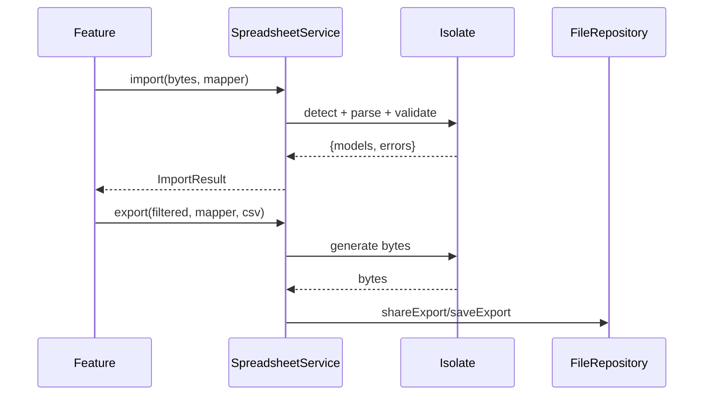

# Excel Integration (Capstone: A Spreadsheet Service)

> The maintainable shape: a **`SpreadsheetService`** exposing an **intent + model** API (`importProducts(bytes) → {models, errors}`, `exportProducts(models, {format}) → bytes`), hiding the chosen library (`excel`/Syncfusion/`csv`), the **format detection** (xlsx vs csv), the **mapping + validation** pipeline, and **isolate/streaming** offloading — so features pass domain data and get domain data back, never touching workbook APIs, cell types, CSV quoting, or file paths. It complements the PDF service ([Module 35](../35%20PDF/pdf_integration.md)) as the app's data-file boundary.

## Introduction

This module capstone unifies package choice, cells/formulas, CSV, and import/export-at-scale into one service. Scattering `excel`/`csv` calls across features couples them to library quirks and duplicates mapping/isolate logic. A `SpreadsheetService` centralizes it behind intent. This file shows the design and an end-to-end import→validate→export flow.

## Why this concept exists

Spreadsheet features span library choice, format handling, cell typing, CSV edge cases, validation, and performance — all cross-cutting. Left in widgets they tangle and drift. One service — like repositories for data — isolates them behind a `List<Model> ⇄ bytes` API, consistent with clean architecture ([Module 40](../40%20Clean%20Architecture/README.md)).

## Real-world analogy

`SpreadsheetService` is the **data import/export department**: teams hand it a file ("load these products") or a dataset ("export these to Excel"), and it runs the customs/manifest process (mapping + validation), picks the right machinery (xlsx vs csv), and returns clean records or a finished file — teams never operate the spreadsheet machinery themselves.

## Problem Statement

Deliver a product data manager: import a picked XLSX/CSV (detect format, map + validate, return models + row errors), export a filtered dataset to styled XLSX and to CSV, handle large files off the UI thread with progress, and share/save results — all behind one `SpreadsheetService`. You'll compose every file in this module.

## Internal Working

```mermaid
flowchart TD
    Feature[feature: bytes/models + intent] --> Svc[SpreadsheetService]
    Svc --> Detect[detect format: xlsx / csv]
    Svc --> Parse[parse: excel (isolate) / csv (stream)]
    Parse --> Pipeline[mapping + coerce + validate -> {models, errors}]
    Svc --> Gen[generate: styled xlsx / csv (isolate/stream)]
    Gen --> Files[FileRepository share/save (Module 34)]
    Svc --> Progress[progress for large jobs]
```

- **Intent API**: `Future<ImportResult<T>> import<T>(Uint8List bytes, Mapper<T>)`, `Future<Uint8List> export<T>(List<T>, Mapper<T>, {Format})`, plus `shareExport`/`saveExport`. Features pass **models/bytes + a mapper**, never library types.
- **Format detection**: sniff extension/magic bytes → route to `excel` (xlsx) or `csv`; pick the export format by request.
- **Mapping + validation pipeline**: one **`Mapper`** (columns↔fields) used both directions; per-cell coerce/validate collecting **row errors** → `{models, errors}` ([import_export_large_datasets.md](import_export_large_datasets.md)).
- **Library encapsulation**: `excel`/Syncfusion/`csv` live **inside** the service; swapping libraries (e.g., to Syncfusion for charts) doesn't touch features.
- **Performance**: **isolate** XLSX parse/generate, **stream** large CSV, **report progress**; heavy work never on the UI isolate ([02 · isolates](../02%20Advanced%20Dart/isolates_and_concurrency.md)).
- **Persistence/share**: hand bytes to the **`FileRepository`** ([Module 34](../34%20File%20Handling/README.md)) for save/share/pick.
- **Testability**: pure mapping/validation + service over abstractions → unit-test import (valid + messy inputs → models + errors) and export (models → bytes) without a device.

## Memory Representation

The service holds no data (optionally progress state); models/bytes flow through. Streaming/isolates bound memory for large files. `ImportResult` carries models + a small errors list.

## Compiler Behavior

Compiles against a `Mapper`/library-adapter abstraction (mockable); isolate entry points serializable.

## Runtime Behavior

Import: detect → parse (isolate/stream) → map/validate → `{models, errors}`. Export: models → rows → generate (isolate/stream) → bytes → share/save. Progress reported for long jobs.

## Flutter Engine Behavior

None; pure Dart. UI stays responsive because heavy work is offloaded.

## Dart VM Behavior

Parse/generate/validate on isolates; UI isolate coordinates + shows progress; streaming caps memory.

## Examples

```dart
// Intent-based service — features pass models/bytes + a mapper, not library types
typedef Mapper<T> = ({T Function(Map<String, dynamic> row) fromRow,
                      Map<String, Object?> Function(T) toRow, List<String> columns});

abstract class SpreadsheetService {
  Future<ImportResult<T>> import<T>(Uint8List bytes, Mapper<T> mapper); // xlsx/csv auto
  Future<Uint8List> export<T>(List<T> items, Mapper<T> mapper, {SheetFormat format});
  Future<void> shareExport(Uint8List bytes, String filename);
  Future<ManagedFile> saveExport(Uint8List bytes, String filename);
}

class SpreadsheetServiceImpl implements SpreadsheetService {
  final FileRepository files;
  SpreadsheetServiceImpl(this.files);

  @override
  Future<ImportResult<T>> import<T>(Uint8List bytes, Mapper<T> m) =>
      compute(_parseAndValidate, _ImportArgs(bytes, m));   // detect + parse + validate (isolate)

  @override
  Future<Uint8List> export<T>(List<T> items, Mapper<T> m, {SheetFormat format = SheetFormat.xlsx}) =>
      compute(_generate, _ExportArgs(items.map(m.toRow).toList(), m.columns, format)); // isolate

  @override
  Future<void> shareExport(Uint8List b, String name) => files.shareBytes(b, name); // Module 34
  @override
  Future<ManagedFile> saveExport(Uint8List b, String name) => files.saveDocument(name, b);
}
```

```dart
// Feature usage — pure intent, domain in/out
// final result = await sheets.import(pickedBytes, productMapper);
// showErrors(result.errors); save(result.models);
// final bytes = await sheets.export(filtered, productMapper, format: SheetFormat.csv);
// await sheets.shareExport(bytes, 'products.csv');
```

## Diagrams



## Common Mistakes

| Mistake | Why | Fix |
|---------|-----|-----|
| Library calls in features | Coupled, duplicated | One `SpreadsheetService` intent API |
| Duplicated mapping per feature | Drift between import/export | One `Mapper` both directions |
| Parse/generate on UI thread | Freeze on large files | Isolate/stream in the service |
| No error reporting | Users can't fix bad files | Return `{models, errors}` |
| Format handling in widgets | Scattered detection | Centralize detection in service |
| No persistence route | Lost files | Route via `FileRepository` |
| Untestable (device-only) | Slow/fragile | Pure pipeline + abstractions |

## Best Practices

- Expose an **intent + model `SpreadsheetService`** (`import`/`export`/`shareExport`/`saveExport`); keep library/format/CSV details **inside** it.
- Use **one `Mapper`** (columns↔fields) for both directions; return **`{models, errors}`**; **isolate/stream** heavy work with **progress**.
- **Encapsulate the library** (swap `excel`↔Syncfusion↔`csv` without touching features); route **persistence via `FileRepository`**.
- Keep the **mapping/validation pure** and **unit-test** import/export (valid + messy inputs) without a device.

## Performance

The service centralizes the levers (isolate, streaming, progress) so they apply uniformly; features get responsive import/export at any scale. Library encapsulation lets you switch to a faster/streaming backend (Syncfusion/CSV) without feature changes.

## Advantages / Disadvantages

- **+** Clean `List<Model> ⇄ bytes` boundary, library-swappable, robust (row errors), scalable (isolate/stream), testable, consistent with PDF service.
- **−** Upfront service/mapper/abstraction design, discipline to route all spreadsheet ops through it.

## Interview Questions

1. **🟢 Why wrap spreadsheet work in a service?** — To hide library/format/CSV details behind a `List<Model> ⇄ bytes` intent API, centralize mapping/validation/isolate handling, and keep features testable.
2. **🟢 What does the intent API look like?** — `import(bytes, mapper) → {models, errors}` and `export(models, mapper, {format}) → bytes`, plus share/save — features pass domain data + a mapper.
3. **🟡 Why one `Mapper` for both directions?** — To keep import (columns→fields) and export (fields→columns) consistent and avoid drift.
4. **🟡 How does the service stay responsive on large files?** — It isolates XLSX parse/generate, streams large CSV, and reports progress — off the UI isolate.
5. **🟡 How does library encapsulation help?** — Features are decoupled from `excel`/Syncfusion/`csv`, so you can swap backends (e.g., Syncfusion for charts) without touching them.
6. **🔴 How does import surface data-quality problems?** — It returns `{models, errors}` with per-row errors so the UI can show fixable issues rather than crashing.
7. **🔴 How does this relate to the PDF service?** — Both are data-file boundaries behind intent services (generate/present/persist for PDF; import/export for spreadsheets), reusing the `FileRepository`.

## Senior Engineer Tips

- Route every spreadsheet operation through the service and keep the library behind it; the day you need Syncfusion (or to drop it), only the service changes.
- Share one `Mapper` and return `{models, errors}` everywhere; consistent round-trips and good error reporting are what make import/export trustworthy.
- Bake in isolate/stream/progress from the start; spreadsheet features are the classic "fine in demo, freezes on the customer's real file" trap.

## Architect Perspective

Excel integration is the app's tabular data-file boundary, mirroring the PDF service: one intent-based service encapsulates library choice, format handling, a shared mapping/validation pipeline, and isolate/streaming performance, exposing `List<Model> ⇄ bytes`. This keeps features simple, backends swappable, imports robust, and everything CI-testable — the same clean-architecture seam used for data, files, and documents ([Module 35](../35%20PDF/pdf_integration.md), [Module 34](../34%20File%20Handling/README.md), [Module 40](../40%20Clean%20Architecture/README.md)).

## Summary

- One intent + model `SpreadsheetService` (`import`/`export`/`share`/`save`) hides library/format/CSV and mapping/validation/isolate details.
- One `Mapper` both directions; `{models, errors}`; isolate/stream + progress; library encapsulated; persistence via `FileRepository`.
- Pure, testable pipeline; complements the PDF service as the data-file boundary.

## Revision Notes

- `SpreadsheetService`: `import(bytes, mapper)→{models,errors}`, `export(models, mapper, {format})→bytes`, share/save via `FileRepository`.
- One `Mapper` (columns↔fields); format detection + library (`excel`/Syncfusion/`csv`) inside; isolate XLSX, stream CSV, progress.
- Pure mapping/validation + abstractions → unit-test; complements PDF service (Module 35); clean-architecture boundary.

## Practice Questions

1. What belongs in the service vs the feature/mapper?
2. How does one mapper serve both import and export?
3. How is large-file performance handled centrally?

## Coding Questions

1. Design a `SpreadsheetService` interface + impl with a `Mapper` and format detection.
2. Implement `import` (isolate, `{models, errors}`) and `export` (isolate/stream).
3. Unit-test import/export with valid + messy inputs (no device).

## Mini Project

**Product data manager (capstone — Flutter):** Build a `SpreadsheetService` with `import(bytes, mapper) → {models, errors}` (auto-detect xlsx/csv, isolate/stream, row errors), `export(models, mapper, {format})` to styled XLSX + CSV (isolate/stream), and share/save via `FileRepository` — using one `Mapper` both directions and reporting progress. Depend on abstractions; add unit tests. Acceptance: features pass models/bytes + mapper only (no library types); import returns models + fixable row errors; export produces styled XLSX + Excel-correct CSV; large files handled off the UI thread with progress; library encapsulated (swappable); unit-tested; runs end-to-end on device.
