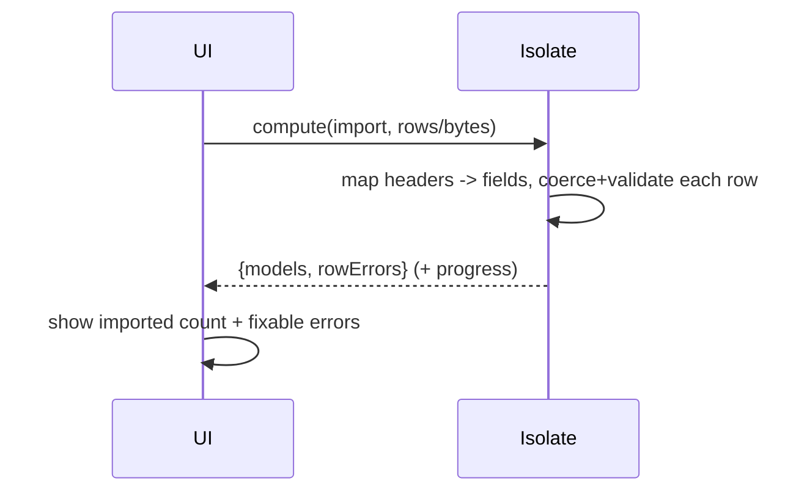

# Import/Export & Large Datasets

> Import/export is a **mapping + validation** problem: define an explicit **column ↔ model-field** mapping, **coerce and validate every cell** (collecting per-row errors rather than crashing on the first bad value), and for **large datasets** avoid loading everything into memory — **stream CSV row-by-row** and **offload heavy XLSX parse/generate to an isolate** (or paginate/stream via Syncfusion). The goal: a robust `List<Model> ⇄ bytes` pipeline that survives messy real-world files and doesn't freeze or OOM.

## Introduction

This file connects spreadsheets to your app's data: turning uploaded files into validated models and models into exports, at scale. It covers the mapping/coercion/validation layer, error reporting, and the memory/performance techniques for large files — the difference between a toy importer and one that handles a 200k-row upload.

## Why this concept exists

Real imports are messy (missing columns, wrong types, blank rows, bad dates); crashing on the first bad cell is unacceptable. And large files OOM or freeze the UI if loaded whole. A deliberate mapping + validation + streaming pipeline makes import/export robust, informative (row errors), and performant.

## Real-world analogy

Importing is **customs inspection at a port**: each container (row) is checked against a manifest (mapping) — items that don't match (bad types/missing fields) are **flagged with a report**, not thrown overboard, and the rest pass. For a huge shipment you **process containers as they come off the ship** (streaming) rather than piling them all on the dock (loading into memory).

## Problem Statement

Import a user-uploaded XLSX/CSV of products (mapping columns → a `Product` model), validating each row and returning both the parsed models **and** a list of row errors (so the user can fix them), then export a filtered dataset to XLSX/CSV — handling a 200k-row file without freezing or OOM. You'll build the mapping/validation pipeline + streaming/isolate handling.

## Internal Working

```mermaid
flowchart TD
    File[picked file bytes] --> Detect{format}
    Detect -->|xlsx| XlsxRead[parse in isolate -> rows]
    Detect -->|csv| CsvStream[stream row-by-row]
    XlsxRead & CsvStream --> Map[map columns -> model fields]
    Map --> Validate[coerce + validate per cell]
    Validate -->|ok| Models[List<Model>]
    Validate -->|bad| Errors[row errors (row #, column, message)]
    Export[List<Model> + filter] --> Gen[generate xlsx/csv (isolate/stream)] --> Bytes[bytes -> share/save]
```

- **Explicit mapping**: define column → field (by **header name**, not fragile position) — build a header→index map from the first row, so column reorder/extra columns don't break it. Document required vs optional columns.
- **Coerce + validate per cell**: parse strings → typed values (int/double/date/bool), trim, handle blanks/defaults, validate ranges/enums/required. Do **not** throw on the first error — **collect** `(rowIndex, column, message)` and continue, returning `{models, errors}` so the user sees all problems.
- **Row-level resilience**: skip/flag blank rows, tolerate extra/missing columns, handle date **serials** (XLSX) and **locale decimals** (CSV) ([cells_styles_and_formulas.md](cells_styles_and_formulas.md), [csv_and_data_interchange.md](csv_and_data_interchange.md)).
- **Large files — memory**:
  - **CSV**: **stream** the file and convert **row-by-row** (bounded memory) — ideal for huge datasets ([Module 34](../34%20File%20Handling/README.md)).
  - **XLSX**: `excel` loads the **whole workbook** (memory-heavy) → **isolate** it, or prefer **CSV** / **Syncfusion streaming** for very large data.
- **Offload**: run parse/validate and generation in an **isolate** (`compute`) so the UI stays responsive; pass **serializable** data (bytes/lists), report **progress** for long jobs.
- **Export**: filter/transform models → rows via the same mapping (inverse), generate XLSX (typed/styled) or CSV, hand bytes to share/save.
- **Idempotent/large export**: for very large exports, stream CSV rather than build a giant workbook.

## Memory Representation

Streaming holds one row at a time; whole-workbook parsing holds all cells. Errors are a small list of records. Models are your domain objects. Keep the largest intermediate bounded (stream/isolate).

## Compiler Behavior

Not applicable.

## Runtime Behavior

Import parses → maps → validates → yields models + errors; large XLSX parse is slow/heavy (isolate). Export generates bytes (isolate for big/styled). Progress reported for long operations.

## Flutter Engine Behavior

None; keep the UI isolate free by offloading — otherwise a big import visibly freezes the app.

## Dart VM Behavior

Heavy CPU/memory on the parse/generate isolate; UI isolate coordinates + shows progress. Streaming caps memory; `compute` moves work off the UI isolate.

## Examples

```dart
// Import result: models + collected per-row errors (don't crash on first bad cell)
class ImportResult<T> {
  final List<T> models;
  final List<RowError> errors;
  ImportResult(this.models, this.errors);
}
class RowError { final int row; final String column, message;
  RowError(this.row, this.column, this.message); }

// Header-based mapping + per-cell validation (runs in an isolate for big files)
ImportResult<Product> importProducts(List<List<dynamic>> rows) {
  final header = {for (var i = 0; i < rows.first.length; i++) '${rows.first[i]}'.trim(): i};
  int col(String name) => header[name] ?? (throw FormatException('missing column: $name'));
  final models = <Product>[]; final errors = <RowError>[];

  for (var r = 1; r < rows.length; r++) {
    final row = rows[r];
    if (row.every((c) => '$c'.trim().isEmpty)) continue;    // skip blank rows
    try {
      final price = double.tryParse('${row[col('Price')]}'.trim());
      if (price == null || price < 0) { errors.add(RowError(r, 'Price', 'invalid price')); continue; }
      models.add(Product(
        name: '${row[col('Name')]}'.trim(),
        price: price,
        // coerce date/qty/etc. with the same guarded pattern...
      ));
    } catch (e) {
      errors.add(RowError(r, '-', '$e'));                    // collect, keep going
    }
  }
  return ImportResult(models, errors);
}

// Offload the heavy work; report both models and errors to the UI
// final result = await compute(importProducts, parsedRows);
```

## Diagrams



## Common Mistakes

| Mistake | Why | Fix |
|---------|-----|-----|
| Position-based column mapping | Breaks on reorder/extra cols | Map by header name |
| Throwing on first bad cell | User can't fix in bulk | Collect per-row errors, continue |
| Loading huge XLSX on UI thread | Freeze/OOM | Isolate; prefer CSV/streaming |
| No validation/coercion | Corrupt models | Coerce + validate per cell |
| Ignoring date serials / locale decimals | Wrong values | Convert serials; handle locale |
| Building giant workbook for export | OOM | Stream CSV for very large exports |
| No progress for long jobs | Feels frozen | Report progress from isolate |

## Best Practices

- Map **by header name** (resilient to reorder/extra columns); **coerce + validate each cell**, **collecting per-row errors** and returning `{models, errors}` (never crash on the first bad value).
- **Stream large CSVs** row-by-row and **isolate** large XLSX parse/generate; prefer **CSV/streaming/Syncfusion** for very large datasets over loading a whole `excel` workbook.
- Handle **date serials, blanks, locale decimals, missing/extra columns**; **report progress** for long jobs.
- Reuse **one mapping** for import (columns→fields) and export (fields→columns); hand bytes to share/save; wrap behind a service.

## Performance

Streaming (CSV) bounds memory; isolates keep the UI responsive; header-based mapping avoids re-scans. XLSX is the heavy case — isolate or avoid for huge data. Progress reporting maintains UX during long jobs. The pipeline turns "freezes on big files" into "handles 200k rows smoothly."

## Advantages / Disadvantages

- **+** Robust to messy files (row errors), scales to large datasets (streaming/isolate), reusable mapping, responsive UI.
- **−** More code (mapping/validation/error model), memory/isolate discipline, format-specific edge cases (serials/locale).

## Interview Questions

1. **🟢 Why map columns by header name instead of position?** — Position breaks when columns are reordered or extra ones added; header mapping is resilient.
2. **🟢 How should you handle a bad cell during import?** — Collect a per-row error and continue, returning models + all errors so the user can fix them in bulk — don't crash on the first.
3. **🟡 How do you import a huge file without freezing/OOM?** — Stream CSV row-by-row and/or run parsing in an isolate; prefer CSV/streaming/Syncfusion over loading a whole `excel` workbook.
4. **🟡 What format-specific pitfalls must import handle?** — XLSX date serials, blanks/missing/extra columns, and CSV locale decimal separators/quoting.
5. **🟡 How do you keep the UI responsive during a long import/export?** — Offload to an isolate (`compute`) and report progress back to the UI.
6. **🔴 How do import and export share logic?** — One column↔field mapping used forward (import) and inverse (export), keeping them consistent.
7. **🔴 When would you stream a CSV export instead of building a workbook?** — For very large exports, to bound memory (a giant in-memory workbook would OOM).

## Senior Engineer Tips

- Return `{models, errors}` from every importer and surface fixable row errors to the user — bulk imports live or die on good error reporting, not on the happy path.
- Map by header and keep one mapping for both directions; it eliminates a whole class of column-drift bugs and keeps round-trips consistent.
- Assume 100k+ rows: stream CSV, isolate XLSX, report progress — the demo works on 20 rows, production sends you a spreadsheet that OOMs.

## Architect Perspective

Import/export is a data-boundary pipeline: messy external files ⇄ validated domain models, made robust by explicit mapping + per-cell validation with error collection, and scalable by streaming/isolates. Encapsulating this (one mapping, an `ImportResult`, isolate offloading) behind the spreadsheet service gives features a clean, resilient `List<Model> ⇄ bytes` API — the same validation/boundary discipline as networking/forms, applied to spreadsheets ([excel_integration.md](excel_integration.md), [02 · json_serialization](../02%20Advanced%20Dart/json_and_serialization.md)).

## Summary

- Import/export = explicit header-based mapping + per-cell coercion/validation collecting row errors (never crash on first bad value).
- Large files: stream CSV, isolate XLSX (or use Syncfusion/streaming); handle serials/blanks/locale; report progress.
- Reuse one mapping both directions; return `{models, errors}`; bytes → share/save; behind a service.

## Revision Notes

- Map by header name (resilient); coerce+validate each cell → `{models, errors}` (RowError: row/column/message); continue on error.
- Large: stream CSV row-by-row, isolate XLSX parse/generate (or Syncfusion streaming); handle date serials, blanks, missing/extra cols, locale decimals; progress.
- One mapping for import + export; bytes → file layer (Module 34); wrap behind service.

## Practice Questions

1. Why collect row errors instead of throwing on the first bad cell?
2. How do you import a 200k-row file without freezing/OOM?
3. Why map by header name rather than column position?

## Coding Questions

1. Build a header-mapped `importProducts` returning `{models, errors}`.
2. Stream a large CSV import row-by-row with validation.
3. Export filtered models via the inverse mapping to XLSX/CSV in an isolate.

## Mini Project

**Robust import/export pipeline (Flutter):** Build a `Product` import/export: header-based column mapping, per-cell coercion + validation returning `{models, errors}` (row-level), streaming for large CSV and isolate offloading for XLSX, handling serials/blanks/locale, with progress reporting; export a filtered dataset via the inverse mapping to XLSX + CSV. Acceptance: bad rows reported (not crashing); column reorder tolerated (header mapping); 100k+ rows handled without freeze/OOM (stream/isolate); serials/locale handled; one mapping both directions; progress shown; behind the service.
