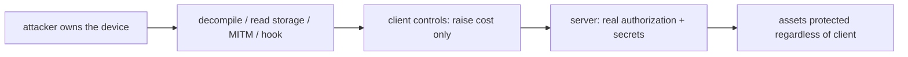

# The Security Model & OWASP MASVS

> The foundational truth: **the client is untrusted and fully inspectable** — anything shipped in the app (code, secrets, logic) can be read, modified, and replayed by an attacker on their own device. So security is **defense-in-depth guided by a threat model**: keep **trust and secrets on the server**, enforce authorization **server-side**, and use client-side measures (secure storage, pinning, obfuscation, integrity checks) to **raise attacker cost**, not as guarantees. **OWASP MASVS/MASTG** is the industry checklist that structures this across storage, crypto, network, auth, platform, code, and resilience.

## Introduction

Before any specific control, you must adopt the right mental model: what you're defending, against whom, and where trust can live. This file covers the untrusted-client principle, threat modeling, defense-in-depth, and the OWASP MASVS structure — the frame that makes every later control a deliberate choice rather than security theater.

## Why this concept exists

Developers instinctively treat "their" app as trusted, then hide secrets in it or enforce rules only client-side — both fatal on a device the attacker owns. The security model corrects this: assume compromise, minimize what the client holds, and layer defenses. OWASP MASVS exists to turn "be secure" into a concrete, auditable set of requirements and verification levels.

## Real-world analogy

Shipping an app is like **handing a burglar a full copy of your house** — blueprints, keys taped inside, and time to study it in their own workshop. Hiding a key under the doormat (a secret in the binary) is useless. Real security is **keeping the valuables in a bank vault you control** (server), putting **multiple locks** on the house (defense-in-depth) to slow them down, and knowing exactly **which burglars you're defending against** (threat model) — you can't stop everyone, so you make it expensive.

## Problem Statement

For a banking-adjacent app, decide what may live on the client vs the server, identify the top threats (network interception, storage extraction, tampering, reverse-engineering), and choose a layered set of controls mapped to OWASP MASVS — without falling for client-side "security" that a rooted device defeats. You'll produce a threat model + control map.

## Internal Working

```mermaid
flowchart TD
    Truth[client is untrusted + inspectable] --> Principle[keep trust/secrets on server]
    Principle --> Threat[threat model: assets, adversaries, attack surfaces]
    Threat --> DiD[defense-in-depth layers]
    DiD --> Storage[secure storage + encryption]
    DiD --> Network[TLS + pinning]
    DiD --> Secrets[no shipped secrets]
    DiD --> Hardening[obfuscation + integrity checks]
    DiD --> Server[server-side authz (the backstop)]
    MASVS[OWASP MASVS/MASTG] --> Audit[structured requirements + verification]
```

- **Untrusted client**: the binary can be **decompiled** (Dart AOT can be reverse-engineered), storage **read** (esp. rooted/jailbroken), traffic **intercepted** (attacker-controlled proxy + CA), and behavior **modified** (Frida/hooking). Treat everything shipped as public and mutable.
- **Server-as-source-of-truth**: **authorization, sensitive business rules, price/entitlement, and secrets** live server-side (echoing payments — [Module 31](../31%20Payments/README.md)). The client renders and requests; the server decides and enforces. Client-side checks are UX/cost, not security.
- **Threat modeling**: enumerate **assets** (tokens, PII, keys, money), **adversaries** (network MITM, device thief, malware, reverse-engineer), **attack surfaces** (storage, network, IPC, binary), and **impact**; pick controls proportional to risk. Don't defend everything equally.
- **Defense-in-depth**: layer independent controls so one failure isn't catastrophic — secure storage **and** encryption **and** TLS+pinning **and** server authz. No single client control is sufficient.
- **Client-side measures raise cost, don't guarantee**: obfuscation, pinning, root detection **slow/deter** attackers and stop the low-effort ones, but a determined attacker on their own device can bypass client-only controls — so they **supplement**, never replace, server enforcement.
- **OWASP MASVS**: the **Mobile Application Security Verification Standard** — requirement groups (Storage, Crypto, Auth, Network, Platform, Code quality, Resilience) with verification levels; **MASTG** is the testing guide. Use it as the checklist for the rest of this module.
- **Least privilege / minimize surface**: request minimal permissions, ship minimal secrets/data, log no sensitive data.

## Memory Representation

Not a data-structure topic. The key modeling artifact: a **threat model** (assets × adversaries × surfaces → controls) and a **control map** to MASVS — living documents, not code.

## Compiler Behavior

AOT compilation is **not obfuscation** — symbols/strings remain recoverable unless you obfuscate ([04_code_hardening_and_integrity.md](04_code_hardening_and_integrity.md)).

## Runtime Behavior

On a rooted/jailbroken or instrumented device, client-side protections can be observed/bypassed at runtime — assume the runtime is hostile.

## Flutter Engine Behavior

The Dart AOT snapshot and assets ship in the app bundle and are extractable; platform-channel/native code is likewise inspectable.

## Dart VM Behavior

Not applicable beyond "AOT ≠ secure."

## Examples

```text
Threat model (excerpt) for a finance app:
  Asset            Adversary            Surface        Control (defense-in-depth)
  -----            ---------            -------        ------------------------
  Auth token       device thief/malware storage        secure storage + short-lived tokens + server revoke
  API traffic      network MITM         network        TLS 1.2+ + certificate pinning
  Business rules   tampered client      binary/runtime SERVER-SIDE authorization (backstop)
  API "secret"     reverse-engineer     binary         DON'T ship it; server proxy / per-user tokens
  App integrity    repackager           binary         obfuscation + signature/integrity checks (cost-raising)
```

```dart
// ANTI-PATTERN: "security" that a rooted device / decompiler defeats
const apiSecret = 'sk_live_123...';           // ❌ shipped secret = public
if (user.isAdmin) showAdminPanel();           // ❌ client-side authz only
// CORRECT: server holds the secret + enforces authz; client just reflects server decisions.
```

## Diagrams



## Common Mistakes

| Mistake | Why it's fatal | Fix |
|---------|---------------|-----|
| Hardcoding secrets/keys in the app | Extractable from the binary | Server-side secrets / per-user tokens |
| Client-side-only authorization | Bypassed on a tampered client | Enforce authz server-side |
| Treating obfuscation/pinning as guarantees | Bypassable on owned devices | Use as cost-raising layers + server backstop |
| No threat model | Random/uneven controls | Model assets/adversaries → proportional controls |
| Single control (no depth) | One failure = breach | Layer independent defenses |
| Logging tokens/PII | Leaks via logs | Never log sensitive data |
| Assuming AOT = obfuscated | Symbols recoverable | Explicitly obfuscate |

## Best Practices

- Treat the **client as untrusted and inspectable**; keep **authorization, secrets, and sensitive logic on the server** — client controls **raise cost**, not guarantee.
- **Threat-model** (assets × adversaries × surfaces) and apply **proportional defense-in-depth**; use **OWASP MASVS/MASTG** as the requirement checklist.
- **Never ship secrets** or rely on client-side authz; **minimize** permissions/data/logs (least privilege); assume rooted/instrumented runtimes.
- Layer **secure storage + encryption + TLS/pinning + obfuscation/integrity + server enforcement**; document the model as a living artifact.

## Performance

Not a perf topic. The cost is engineering discipline; the payoff is not leaking data/credentials/money. Over-defending low-risk assets wastes effort — proportionality (via the threat model) is the efficiency lever.

## Advantages / Disadvantages

- **+** Correct posture (server-enforced, layered), auditable against MASVS, resilient to single-control failure, focused effort via threat modeling.
- **−** Requires a backend + discipline, client controls are only cost-raising, ongoing threat-model maintenance, no absolute guarantees.

## Interview Questions

1. **🟢 Why is the mobile client considered untrusted?** — The attacker owns the device: they can decompile the binary, read storage, intercept traffic, and modify runtime behavior — nothing shipped is secret or tamper-proof.
2. **🟢 Where must authorization and secrets live?** — On the server; the client requests and renders, the server decides and enforces — client-side checks are UX/cost, not security.
3. **🟡 What is defense-in-depth and why?** — Layering independent controls (storage, network, hardening, server authz) so one failure isn't a breach.
4. **🟡 What is a threat model and how does it guide controls?** — Enumerating assets, adversaries, and attack surfaces to choose controls proportional to risk, rather than defending everything equally.
5. **🟡 What is OWASP MASVS/MASTG?** — The Mobile App Security Verification Standard (requirement groups + levels) and its testing guide — the industry checklist for mobile security.
6. **🔴 Why aren't obfuscation/pinning/root-detection "guarantees"?** — On a device the attacker controls they can be bypassed at runtime; they raise cost and stop low-effort attacks but must be backed by server enforcement.
7. **🔴 Why is a hardcoded API secret a critical bug?** — The binary is extractable, so the secret is effectively public; use server-side secrets or per-user tokens instead.

## Senior Engineer Tips

- Start every security discussion with "assume the attacker has a rooted device and a decompiler" — it instantly rules out shipped secrets and client-side authz.
- Write a one-page threat model and map controls to MASVS; it turns vague "make it secure" into a prioritized, auditable plan.
- Put the real enforcement server-side and treat all client hardening as cost-raising layers — that framing prevents the most dangerous false sense of security.

## Architect Perspective

The security model is the architecture: trust boundaries (server authoritative, client untrusted), a threat model driving proportional defense-in-depth, and MASVS as the verification spec. Every later control (storage, network, hardening) is an implementation of these principles, and the server-as-source-of-truth boundary is the same one payments and auth rely on. Architecting from this frame prevents the catastrophic-but-common mistakes (shipped secrets, client authz) and makes security auditable ([02_secure_storage_and_encryption.md](02_secure_storage_and_encryption.md), [03_network_security_and_pinning.md](03_network_security_and_pinning.md), [Module 31](../31%20Payments/README.md), [Module 17](../17%20Authentication/README.md)).

## Summary

- The client is untrusted/inspectable; keep authorization, secrets, and sensitive logic on the server — client controls only raise cost.
- Threat-model (assets × adversaries × surfaces) and apply proportional defense-in-depth; verify against OWASP MASVS/MASTG.
- Never ship secrets or rely on client-side authz; layer storage/network/hardening/server controls; assume hostile runtimes.

## Revision Notes

- Untrusted client: decompilable, readable storage, interceptable traffic, modifiable runtime (esp. rooted/jailbroken). AOT ≠ obfuscated.
- Server = source of truth (authz/secrets/rules); client controls (secure storage, pinning, obfuscation, root detection) raise cost, not guarantee.
- Threat model (assets/adversaries/surfaces → proportional controls); defense-in-depth; OWASP MASVS/MASTG checklist; least privilege; no shipped secrets; no sensitive logs.

## Practice Questions

1. Why can't a secret shipped in the app be kept secret?
2. What does "defense-in-depth" protect against that a single control doesn't?
3. How does a threat model make security more effective?

## Coding Questions

1. Identify and fix two anti-patterns (shipped secret + client-side authz).
2. Write a threat model table (assets/adversaries/surfaces/controls) for a given app.
3. Map a set of controls to OWASP MASVS groups.

## Mini Project

**Threat model & control map (Flutter + backend):** For a chosen app (e.g., finance/health), write a one-page threat model (assets × adversaries × attack surfaces), map proportional defense-in-depth controls to OWASP MASVS groups, and identify what must be server-side vs client-side. Refactor two anti-patterns (a shipped secret and client-side authorization) to the correct server-enforced design. Acceptance: threat model with proportional controls; MASVS mapping; clear server-vs-client trust boundary; anti-patterns fixed; client controls framed as cost-raising, not guarantees.
