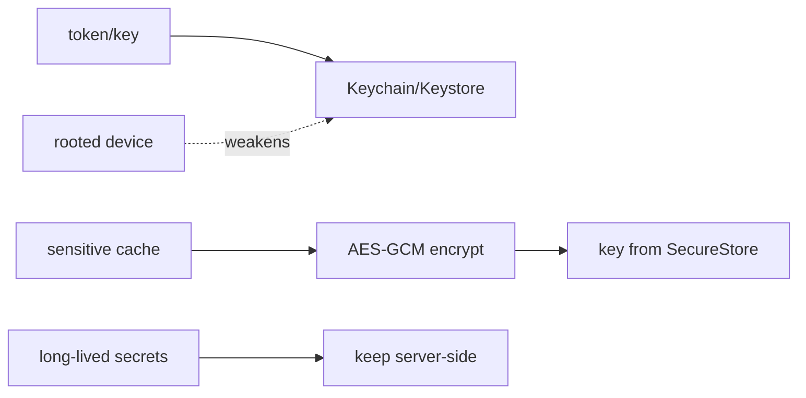

# Secure Storage & Encryption at Rest

> Sensitive data (tokens, keys, PII) must **not** sit in plain `SharedPreferences`/files — use **`flutter_secure_storage`**, which stores values in the **iOS Keychain** and **Android Keystore/EncryptedSharedPreferences** (hardware-backed where available). For larger sensitive data (a cached DB/file), **encrypt at rest** with a strong algorithm (AES-GCM) whose **key lives in secure storage/Keystore** — never in code. And know the limit: on a **rooted/jailbroken** device even Keychain/Keystore protections weaken, so keep truly sensitive secrets **server-side** and store only **short-lived, revocable** tokens locally.

## Introduction

This file covers where and how to store secrets locally: the platform secure enclaves via `flutter_secure_storage`, encrypting larger data at rest, correct key management, and the realistic limits. It's the storage layer of defense-in-depth ([01_security_model_and_owasp.md](01_security_model_and_owasp.md)), extending secure-storage basics ([15 · secure_storage](../15%20Local%20Storage/README.md)).

## Why this concept exists

Tokens/keys in plain prefs or files are trivially extracted (backup, rooted device, file access). The OS provides hardware-backed secure stores (Keychain/Keystore) with OS-enforced access control and (often) a hardware key that never leaves the secure element. Encryption at rest protects bulk data; proper key management is what makes it meaningful (an encrypted blob with the key next to it is not secure).

## Real-world analogy

`flutter_secure_storage` is a **safe deposit box at the bank** (Keychain/Keystore) — the OS guards access, and on good hardware the box's key is in a **tamper-resistant vault** (secure element). Encrypting a large file with a key from that box is like **locking a filing cabinet and keeping its key in the safe deposit box** — not taped to the cabinet. But if someone **owns the building** (rooted device), even the safe is less safe — so keep the crown jewels **off-site** (server).

## Problem Statement

Store an auth token and an encryption key securely, encrypt a sensitive local cache (AES-GCM) with that key, and ensure nothing sensitive lands in plain prefs/logs/backups — while accepting that a rooted device weakens local protection. You'll use `flutter_secure_storage` + a vetted crypto lib.

## Internal Working

```mermaid
flowchart TD
    Secret[token / key] --> SS[flutter_secure_storage]
    SS --> iOS[iOS Keychain (Secure Enclave where available)]
    SS --> Android[Android Keystore / EncryptedSharedPreferences]
    Bulk[large sensitive data] --> Enc[encrypt at rest: AES-GCM]
    Enc --> KeyFrom[key from Keystore/secure storage (NOT in code)]
    Root[rooted/jailbroken] --> Weaken[protections weaken -> keep crown jewels server-side]
```

- **`flutter_secure_storage`**: `write/read/delete` key-value secrets into **Keychain (iOS)** / **Keystore-backed EncryptedSharedPreferences (Android)**. Configure options (Android `EncryptedSharedPreferences`, iOS `accessibility` like `first_unlock_this_device`) — pick accessibility to match your needs (e.g., not `always`). Use for **tokens, keys, small secrets** — not bulk data.
- **Encryption at rest for bulk data**: for a cached DB/file too big for secure storage, **encrypt the data** with **AES-GCM** (authenticated encryption — confidentiality + integrity) and **store the AES key in secure storage/Keystore**. Some DBs support this directly (SQLCipher/Drift+cipher, Hive with an encryption key from secure storage — [Module 20](../20%20Database/README.md)).
- **Key management (the crux)**: the key **must not** be in code/assets/constants (extractable). Generate a random key, store it in Keystore/secure storage; on Android prefer a **Keystore-generated key** that never leaves the secure hardware. **Encrypted data + key-in-code = not secure.**
- **Crypto do's/don'ts**: use vetted libraries (`cryptography`, platform crypto) and **authenticated encryption (AES-GCM)** with a **unique nonce/IV per encryption** (never reuse a nonce with GCM); don't roll your own crypto, don't use ECB, don't hardcode IVs/keys, don't use weak hashes for passwords (use a KDF like Argon2/PBKDF2 server-side).
- **Rooted/jailbroken reality**: Keychain/Keystore raise the bar but **aren't absolute** on compromised devices — so store only **short-lived, revocable tokens** locally, keep long-lived secrets **server-side**, and pair with integrity checks ([04_code_hardening_and_integrity.md](04_code_hardening_and_integrity.md)).
- **Backups/logs**: ensure secrets aren't in backups (Keychain/Keystore handle this; plain files may be backed up) or **logs** (never log tokens/keys/PII).

## Memory Representation

Secrets live in OS-managed secure stores (often backed by hardware keys). Decrypted data exists in memory only transiently — minimize its lifetime; clear buffers where practical. Encrypted blobs on disk are opaque without the key.

## Compiler Behavior

Hardcoded keys/strings survive into the binary (extractable) — never embed secrets. Obfuscation doesn't make an embedded key safe.

## Runtime Behavior

Secure storage access may require device unlock (per accessibility setting). Encryption/decryption is CPU work (offload large data). On rooted devices, runtime hooking can intercept decrypted values.

## Flutter Engine Behavior

`flutter_secure_storage` bridges to native Keychain/Keystore via platform channels ([26](../26%20Platform%20Channels/README.md)).

## Dart VM Behavior

Not applicable; crypto runs in Dart/native — offload heavy encryption to an isolate.

## Examples

```dart
import 'package:flutter_secure_storage/flutter_secure_storage.dart';
import 'package:cryptography/cryptography.dart';
import 'dart:convert';
import 'dart:typed_data';

class SecureVault {
  final _storage = const FlutterSecureStorage(
    aOptions: AndroidOptions(encryptedSharedPreferences: true),
    iOptions: IOSOptions(accessibility: KeychainAccessibility.first_unlock_this_device),
  );

  // Small secrets -> Keychain/Keystore
  Future<void> saveToken(String token) => _storage.write(key: 'auth_token', value: token);
  Future<String?> readToken() => _storage.read(key: 'auth_token');
  Future<void> clear() => _storage.deleteAll(); // e.g., on logout

  // Encryption key: generated once, kept in secure storage (NEVER in code)
  Future<SecretKey> _key() async {
    var b64 = await _storage.read(key: 'enc_key');
    if (b64 == null) {
      final key = await AesGcm.with256bits().newSecretKey();
      b64 = base64Encode(await key.extractBytes());
      await _storage.write(key: 'enc_key', value: b64);
    }
    return SecretKey(base64Decode(b64));
  }

  // AES-GCM: authenticated, unique nonce per encryption
  Future<Uint8List> encrypt(List<int> data) async {
    final algo = AesGcm.with256bits();
    final box = await algo.encrypt(data, secretKey: await _key()); // fresh nonce internally
    return Uint8List.fromList(box.concatenation());                 // nonce+cipher+mac
  }
}
```

## Diagrams



## Common Mistakes

| Mistake | Why | Fix |
|---------|-----|-----|
| Tokens/keys in `SharedPreferences`/files | Trivially extracted | `flutter_secure_storage` (Keychain/Keystore) |
| Encryption key in code/assets | Key is public → encryption pointless | Key in Keystore/secure storage |
| Reusing a nonce/IV with GCM | Breaks confidentiality | Unique nonce per encryption |
| Rolling your own crypto / ECB | Broken/weak | Vetted lib + AES-GCM |
| Long-lived secrets stored locally | Extractable on rooted device | Short-lived revocable tokens; server-side secrets |
| Logging secrets / plaintext backups | Leaks | No sensitive logs; secure-store handles backup |
| Assuming Keystore = unbreakable | Weakens on rooted devices | Layer + server enforcement |

## Best Practices

- Store **tokens/keys/small secrets** in **`flutter_secure_storage`** (Keychain/Keystore, sensible accessibility); never in prefs/files/code.
- **Encrypt bulk sensitive data** with **AES-GCM** (authenticated, unique nonce), key from **Keystore/secure storage** (never embedded); use **vetted crypto libs** only.
- Keep only **short-lived, revocable tokens** locally; keep **long-lived secrets server-side**; assume **rooted devices weaken** local protection.
- **Never log** secrets/PII, keep them out of **backups**, clear plaintext promptly, and **offload heavy encryption** to an isolate.

## Performance

Secure-storage access is cheap; encryption scales with data size — isolate large encrypt/decrypt to avoid jank. Prefer DB-level encryption (SQLCipher) for large stores over manual field encryption. Minimize plaintext lifetime.

## Advantages / Disadvantages

- **+** Hardware-backed secret storage, authenticated encryption at rest, OS-enforced access, backup-safe.
- **−** Not absolute on rooted devices, key-management discipline required, crypto pitfalls (nonce reuse), CPU cost for large data.

## Interview Questions

1. **🟢 Where should auth tokens be stored, and why not `SharedPreferences`?** — In `flutter_secure_storage` (Keychain/Keystore); plain prefs/files are easily extracted (backups, rooted devices).
2. **🟢 What backs `flutter_secure_storage` on each platform?** — iOS Keychain (Secure Enclave where available) and Android Keystore/EncryptedSharedPreferences (hardware-backed where available).
3. **🟡 How do you encrypt a large sensitive cache correctly?** — AES-GCM (authenticated) with a key stored in Keystore/secure storage and a unique nonce per encryption — never a key embedded in code.
4. **🟡 Why is "encrypted data with the key in code" not secure?** — The key is extractable from the binary, so the encryption provides no real protection.
5. **🟡 Why must GCM nonces be unique?** — Reusing a nonce with the same key breaks GCM's confidentiality (and integrity) guarantees.
6. **🔴 What's the limitation of Keychain/Keystore on rooted devices?** — Protections weaken; a compromised device can access/hook secrets — so store only short-lived revocable tokens and keep crown-jewel secrets server-side.
7. **🔴 What are core crypto don'ts?** — Don't roll your own, don't use ECB, don't reuse IVs/nonces, don't hardcode keys, don't use weak password hashing (use a KDF) — use vetted libraries.

## Senior Engineer Tips

- Put all secret access behind a `SecureVault` and forbid `SharedPreferences` for anything sensitive in review — plain-prefs tokens are the most common mobile leak.
- Generate encryption keys at runtime into the Keystore and treat "key in code/assets" as a build-blocker; encrypted-with-embedded-key is a false sense of security.
- Store only short-lived, server-revocable tokens locally; that way a device compromise is contained by server-side revocation rather than being catastrophic.

## Architect Perspective

Secure storage + encryption is the at-rest layer of defense-in-depth: hardware-backed secret storage, authenticated encryption for bulk data, and disciplined key management — all behind a `SecureVault` service. Its realistic limits (rooted devices) reinforce the model's core: keep long-lived secrets server-side and store only revocable tokens locally, so at-rest protection is a cost-raising layer atop server enforcement ([01_security_model_and_owasp.md](01_security_model_and_owasp.md), [Module 17](../17%20Authentication/README.md), [Module 20](../20%20Database/README.md)).

## Summary

- Store tokens/keys/small secrets in `flutter_secure_storage` (Keychain/Keystore); never plain prefs/files/code.
- Encrypt bulk data with AES-GCM (unique nonce), key from Keystore/secure storage; use vetted crypto; no embedded keys.
- Rooted devices weaken local protection → short-lived revocable tokens locally, long-lived secrets server-side; no sensitive logs/backups.

## Revision Notes

- `flutter_secure_storage` → Keychain (iOS)/Keystore+EncryptedSharedPreferences (Android); set accessibility; small secrets only.
- Bulk: AES-GCM (authenticated, unique nonce), key in Keystore/secure storage (never code); vetted libs; DB-level (SQLCipher) for large stores.
- Rooted weakens Keystore → short-lived revocable tokens local, long-lived secrets server-side; no secret logs/backups; isolate heavy crypto.

## Practice Questions

1. Why store tokens in secure storage instead of prefs?
2. How do you correctly manage the key for at-rest encryption?
3. Why is Keychain/Keystore not absolute on rooted devices?

## Coding Questions

1. Build a `SecureVault` for token read/write/clear via `flutter_secure_storage`.
2. Encrypt/decrypt a blob with AES-GCM using a Keystore-stored key.
3. Enforce unique nonces and reject embedded keys.

## Mini Project

**Secure vault + at-rest encryption (Flutter):** Build a `SecureVault` storing tokens/keys in `flutter_secure_storage` (correct accessibility), and encrypt a sensitive local cache with AES-GCM using a runtime-generated key kept in secure storage (unique nonce per op), offloading large crypto to an isolate. Ensure no secrets in code/logs/backups and store only short-lived tokens. Acceptance: secrets in Keychain/Keystore (not prefs); AES-GCM with Keystore-held key + unique nonce; no embedded keys/secret logs; short-lived tokens locally; heavy crypto off the UI thread; rooted-device limitation documented.
