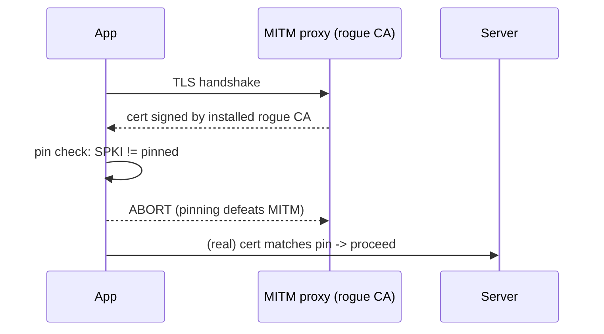

# Network Security & Certificate Pinning

> Enforce **TLS everywhere** (HTTPS-only, TLS 1.2+, no cleartext) so traffic is encrypted in transit — but standard TLS trusts any CA the device trusts, which an attacker can abuse (installed root CA / corporate proxy). **Certificate/public-key pinning** hardens this by trusting **only your server's key/cert**, defeating most MITM interception — at the cost of a **rotation strategy** (pin the wrong thing and an update bricks connectivity). And **secrets don't belong in the app**: no hardcoded API keys/tokens in the binary — proxy through your server or use per-user tokens.

## Introduction

This file covers securing data in transit: TLS enforcement, certificate/public-key pinning (how, and the rotation gotcha), and secrets/API-key management. It's the network layer of defense-in-depth ([security_model_and_owasp.md](security_model_and_owasp.md)), building on networking/interceptors ([Module 16](../16%20Networking/README.md)).

## Why this concept exists

TLS protects traffic from passive eavesdropping, but active MITM is possible if the attacker can get the client to trust a rogue CA (a real risk on managed/compromised devices, or via user-installed proxies for reverse-engineering). Pinning removes that trust flexibility to stop interception. Secrets-in-binary exists because devs treat the app as trusted — it isn't ([security_model_and_owasp.md](security_model_and_owasp.md)) — so shipped keys leak.

## Real-world analogy

TLS is a **sealed, tamper-evident envelope** — but the postal system delivers to anyone with a **valid-looking ID** (any trusted CA), and a fraudster can forge one. **Pinning** is telling the courier "**only accept mail sealed with *my* specific wax stamp**" — forged IDs no longer work. But if you change your stamp (rotate certs) without telling the courier, they reject all your real mail too (bricked app) — so you register the **new stamp in advance** (backup pins).

## Problem Statement

Ensure all API traffic is HTTPS/TLS 1.2+, pin the API so a proxy-based MITM (even with an installed root CA) fails, plan cert rotation so pinning doesn't break the app, and remove a hardcoded third-party API key. You'll configure TLS, add pinning with backup pins, and move the secret server-side.

## Internal Working

```mermaid
flowchart TD
    TLS[HTTPS + TLS 1.2+ (no cleartext)] --> Trust{whose cert to trust?}
    Trust -->|default| AnyCA[any device-trusted CA -> MITM via rogue CA possible]
    Trust -->|pinned| Only[only YOUR key/cert -> MITM fails]
    Only --> Rotate[rotation: backup pins + overlap or config update]
    Secret[API key/secret] -->|NEVER in app| Server[server proxy / per-user token]
```

- **TLS enforcement**: HTTPS-only, **TLS 1.2+**, disable cleartext (Android `usesCleartextTraffic=false` / network security config; iOS ATS on). Reject invalid certs (never disable verification in release). Validate hostname.
- **Certificate pinning**: pin **your server's certificate** or, better, its **public key (SPKI) hash** — the client accepts the connection **only** if the presented cert/key matches. Defeats MITM via rogue/installed CAs (common in reverse-engineering setups). Implement via `dio`/`http` `SecurityContext`/`badCertificateCallback` checking the fingerprint, or a plugin.
- **Public-key vs cert pinning**: **public-key (SPKI) pinning** survives cert renewal if the key is reused → fewer breakages; **cert pinning** breaks on every renewal. Prefer SPKI.
- **Rotation strategy (critical)**: pinning **bricks the app** if the pinned cert/key changes and the app wasn't updated. Mitigate with **backup pins** (pin current + next key), **overlapping validity**, or **remotely-updatable pins** (fetched over an already-pinned/trusted channel). Never ship a single pin with no fallback.
- **Secrets/API keys**: **do not ship secrets** in the app (extractable — [security_model_and_owasp.md](security_model_and_owasp.md)). For third-party APIs, **proxy through your backend** (which holds the secret) or issue **per-user, scoped, revocable tokens**. Client-visible keys (e.g., Firebase config, Maps keys) must be **restricted** (by app id/referrer/API) — treat them as public and limit blast radius.
- **Interceptors**: attach auth tokens via an interceptor ([Module 16](../16%20Networking/README.md)); refresh/rotate on 401; never log Authorization headers/bodies with secrets.
- **Limits**: on a **rooted/instrumented** device, pinning can be bypassed (hooking) — so pinning **raises cost**; server-side authz remains the backstop.

## Memory Representation

Pins (cert/SPKI hashes) are small constants/config. Tokens live in secure storage ([secure_storage_and_encryption.md](secure_storage_and_encryption.md)). No secrets in the binary.

## Compiler Behavior

Any embedded key/pin string is extractable — pins are fine to ship (public info); secrets are not.

## Runtime Behavior

Pinning validates on TLS handshake; a mismatch (rogue CA or rotated cert without update) **fails the connection**. Cleartext/invalid certs rejected. Hooked runtimes may bypass pinning.

## Flutter Engine Behavior

TLS/pinning happen in `dart:io`/native networking; not engine-specific.

## Dart VM Behavior

Not applicable.

## Examples

```dart
import 'package:dio/dio.dart';
import 'package:dio/io.dart';
import 'dart:io';
import 'package:crypto/crypto.dart';

// Public-key (SPKI) pinning with BACKUP pins (rotation-safe)
final _pinnedSpki = <String>{
  'sha256/AAAAAAAAAAAAAAAAAAAAAAAAAAAAAAAAAAAAAAAAAAA=', // current key
  'sha256/BBBBBBBBBBBBBBBBBBBBBBBBBBBBBBBBBBBBBBBBBBB=', // next key (backup)
};

Dio buildPinnedDio() {
  final dio = Dio(BaseOptions(baseUrl: 'https://api.example.com')); // HTTPS only
  (dio.httpClientAdapter as IOHttpClientAdapter).createHttpClient = () {
    final client = HttpClient();
    client.badCertificateCallback = (X509Certificate cert, String host, int port) {
      final spki = 'sha256/${base64Encode(sha256.convert(cert.der).bytes)}'; // simplified
      return _pinnedSpki.contains(spki);   // accept ONLY pinned key(s)
    };
    return client;
  };
  return dio;
}
// NOTE: no API secret here. Third-party keys stay on the server; client uses per-user tokens.
```

```dart
// Auth token via interceptor (from secure storage); never log it
dio.interceptors.add(InterceptorsWrapper(onRequest: (o, h) async {
  final token = await vault.readToken();
  if (token != null) o.headers['Authorization'] = 'Bearer $token';
  h.next(o);
}));
```

## Diagrams



## Common Mistakes

| Mistake | Why | Fix |
|---------|-----|-----|
| Disabling cert verification / allowing cleartext | Total MITM exposure | HTTPS + TLS 1.2+, verify certs |
| Single pin, no backup | App bricks on rotation | Backup pins + rotation plan |
| Cert pinning (not SPKI) | Breaks every renewal | Pin public key (SPKI) |
| Hardcoding API secrets | Extractable → leaked | Server proxy / per-user tokens |
| Unrestricted client-visible keys | Abuse/quota theft | Restrict by app id/referrer/API |
| Logging Authorization/secret bodies | Leaks | Redact sensitive logs |
| Treating pinning as unbreakable | Bypassable on rooted devices | Cost-raising layer + server authz |

## Best Practices

- Enforce **HTTPS-only, TLS 1.2+, no cleartext**, verify certs/hostnames; never disable verification in release.
- **Pin the public key (SPKI)** with **backup pins + a rotation strategy** (overlap / remotely-updatable) to avoid bricking; prefer SPKI over cert pinning.
- **Never ship secrets** — proxy third-party APIs via your backend or use **per-user scoped revocable tokens**; **restrict** any client-visible keys.
- Attach tokens via **interceptors** (from secure storage), **redact** sensitive logs, and treat pinning as **cost-raising** atop **server-side authz**.

## Performance

TLS/pinning add negligible per-handshake cost. The real "cost" is operational: a botched rotation causes outages — hence backup pins. Interceptors are cheap. No runtime perf concern.

## Advantages / Disadvantages

- **+** Encrypted transit (TLS) + MITM resistance (pinning), no leaked secrets (server proxy), reduced interception/reverse-engineering.
- **−** Pinning rotation risk (bricking), operational overhead, bypassable on rooted devices, requires backend for secret proxying.

## Interview Questions

1. **🟢 Why isn't plain TLS enough against a determined attacker?** — Standard TLS trusts any device-trusted CA; an attacker with an installed/rogue CA can MITM — pinning restricts trust to your key/cert.
2. **🟢 What is certificate pinning?** — Accepting a TLS connection only if the server's cert/public key matches a pinned value, defeating rogue-CA MITM.
3. **🟡 Public-key (SPKI) vs certificate pinning?** — SPKI pinning survives cert renewal if the key is reused (fewer breakages); cert pinning breaks on each renewal — prefer SPKI.
4. **🟡 What's the danger of pinning, and how do you mitigate it?** — A rotated cert/key with no app update bricks connectivity; mitigate with backup pins, overlapping validity, or remotely-updatable pins.
5. **🟡 Why can't you ship an API secret in the app?** — The binary is extractable; the secret leaks — proxy via your backend or use per-user revocable tokens.
6. **🔴 How do you handle client-visible keys (Firebase/Maps)?** — Treat them as public and restrict by app id/referrer/API to limit abuse — they can't be truly hidden.
7. **🔴 What's the limit of pinning?** — On rooted/instrumented devices it can be hooked/bypassed; it raises cost but server-side authorization remains the backstop.

## Senior Engineer Tips

- Pin the SPKI with at least one backup pin and a documented rotation plan before shipping pinning — a single pin is an outage waiting for the next cert renewal.
- Never let a secret reach the client: if a feature "needs" a third-party key, put a thin proxy on your backend; client keys must be restricted and treated as public.
- Redact Authorization headers and sensitive bodies in all logging/interceptors; leaked tokens in logs are a silent, common breach.

## Architect Perspective

Network security is the in-transit layer of defense-in-depth: TLS for confidentiality, SPKI pinning (with rotation) to resist MITM, and a strict no-secrets-in-client policy backed by server proxying. Encapsulating this in the HTTP client/service (pinned `Dio`, token interceptor, redacted logging) keeps the policy consistent and rotation-safe, while server-side authz remains the ultimate enforcement — the same untrusted-client model applied to the wire ([security_model_and_owasp.md](security_model_and_owasp.md), [Module 16](../16%20Networking/README.md), [Module 17](../17%20Authentication/README.md)).

## Summary

- Enforce HTTPS/TLS 1.2+ (no cleartext, verify certs); pin the **public key (SPKI)** with **backup pins + rotation** to resist MITM without bricking.
- Never ship secrets — proxy via backend or use per-user revocable tokens; restrict client-visible keys.
- Attach tokens via interceptors from secure storage, redact logs; pinning is cost-raising atop server-side authz (bypassable on rooted devices).

## Revision Notes

- TLS 1.2+, HTTPS-only, no cleartext, verify certs/hostname; never disable verification in release.
- SPKI pinning (survives renewal) > cert pinning; **backup pins + rotation plan** (overlap / remote-update) to avoid bricking; bypassable on rooted devices.
- No secrets in app → server proxy / per-user tokens; restrict client-visible keys; token interceptor from secure storage; redact sensitive logs.

## Practice Questions

1. How does pinning stop a rogue-CA MITM that plain TLS doesn't?
2. Why prefer SPKI pinning and always ship backup pins?
3. How should a third-party API secret be handled?

## Coding Questions

1. Build a `Dio` client with SPKI pinning + backup pins.
2. Add a token interceptor reading from secure storage (redacted logs).
3. Refactor a hardcoded API key to a server-proxied call.

## Mini Project

**Hardened networking (Flutter + backend):** Build a pinned `Dio` client (HTTPS/TLS 1.2+, SPKI pinning with a backup pin + documented rotation), a token interceptor sourcing from secure storage with redacted logging, and refactor a hardcoded third-party API key to a backend proxy. Acceptance: cleartext/invalid certs rejected; MITM via installed rogue CA fails (pinning); backup pin + rotation plan present (no bricking); no secrets in the app (proxied); tokens attached from secure storage, not logged; pinning documented as cost-raising with server authz backstop.
