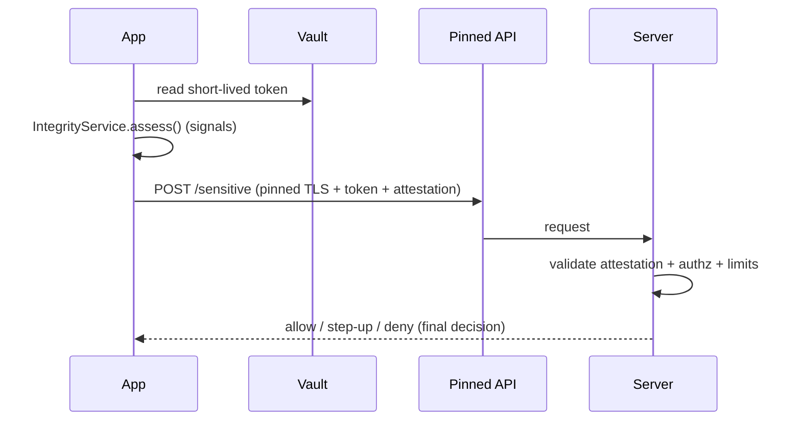

# Security Integration (Capstone: Layered, Threat-Driven Defense)

> The maintainable shape: security is **not one service** but a **threat-driven, layered posture** wired consistently — a `SecureVault` (storage/encryption), a **pinned HTTP client + token interceptor** (network), **obfuscated builds + an `IntegrityService`** (hardening), and **server-side authorization + attestation validation** (the backstop) — each mapped to **OWASP MASVS** and chosen by the **threat model**. The unifying rule from every file: **the server enforces; client layers raise cost.** This capstone shows how the layers compose into one coherent, auditable defense.

## Introduction

This module capstone assembles the security model, storage/encryption, network/pinning, and hardening into a single layered architecture. Security fails when controls are ad hoc, uneven, or mistaken for guarantees. Here they're composed deliberately — threat-model → layered controls → MASVS verification → server enforcement — so the whole is coherent and auditable. This file shows the composition and an end-to-end high-risk-action flow.

## Why this concept exists

Individual controls (secure storage, pinning, obfuscation) are necessary but insufficient alone; real security is their **coordinated composition** with server enforcement, driven by a threat model and verified against a standard. Without integration you get gaps (secure storage but unpinned network), redundancy, or false confidence. One coherent posture — like clean architecture for correctness — is what actually protects users.

## Real-world analogy

A secure building isn't one lock — it's **coordinated layers**: vault for valuables (server), safe deposit boxes (secure storage), sealed tamper-evident doors (pinning/integrity), removed labels (obfuscation), and **guards who make the real decisions** (server authz), all designed against a **specific threat assessment** and inspected to a **code (MASVS)**. Any single layer can be beaten; together, and with the guards, the valuables stay safe.

## Problem Statement

Deliver a hardened high-risk feature (e.g., viewing/using stored credentials or making a payment): tokens in secure storage, sensitive cache encrypted, API pinned, no shipped secrets, obfuscated build, integrity signals feeding server risk decisions, and **server-side authorization** as the final gate — all threat-driven and MASVS-mapped. You'll compose every layer from this module.

## Internal Working

```mermaid
flowchart TD
    Threat[threat model + MASVS] --> Layers
    subgraph Layers [defense-in-depth]
      Store[SecureVault: Keychain/Keystore + AES-GCM at rest]
      Net[pinned Dio + token interceptor (SPKI + backup pins)]
      Hard[obfuscated build + IntegrityService signals]
    end
    Store & Net & Hard --> Signals[integrity + auth to server]
    Signals --> Server[SERVER: authorization + attestation validation + limits]
    Server --> Decision[allow / step-up / deny]
    Decision --> Feature[high-risk action proceeds only if server allows]
```

- **Layer 1 — Storage** ([secure_storage_and_encryption.md](secure_storage_and_encryption.md)): tokens/keys in `SecureVault` (Keychain/Keystore); sensitive cache AES-GCM-encrypted with a Keystore-held key; only **short-lived revocable** tokens local.
- **Layer 2 — Network** ([network_security_and_pinning.md](network_security_and_pinning.md)): HTTPS/TLS 1.2+, **SPKI pinning + backup pins + rotation**, token interceptor from the vault, **no shipped secrets** (server-proxied), redacted logs.
- **Layer 3 — Hardening** ([code_hardening_and_integrity.md](code_hardening_and_integrity.md)): `--obfuscate --split-debug-info` (mapping archived), stripped logs, `IntegrityService` (root/jailbreak/hook + attestation) producing **signals**.
- **Layer 4 — Server (the backstop)**: enforces **authorization**, validates **attestation**, applies **rate limits / anomaly detection**, and revokes tokens — **decides** allow/step-up/deny. Client signals are advisory (spoofable).
- **Threat-driven + MASVS**: each control is chosen for a modeled threat and mapped to a MASVS group; coverage is **audited** against the standard ([security_model_and_owasp.md](security_model_and_owasp.md)).
- **Composition rule**: layers are **independent** (one failing doesn't collapse the rest) and **server-anchored** (the real gate). High-risk actions require the **server's** yes, informed by client signals.
- **Observability**: security events (pin failures, integrity flags, auth anomalies) are logged (redacted) and monitored ([Module 52](../52%20Monitoring/README.md)) — detection matters as much as prevention.

## Memory Representation

No new structures — each layer's artifacts (vault entries, pins, integrity signals) as in their files. The integration is a **posture**: a threat model + control-to-MASVS map + server-enforcement contract.

## Compiler Behavior

Release obfuscated with archived mapping; no embedded secrets; pins are shippable (public).

## Runtime Behavior

Each layer operates continuously; high-risk actions collect signals and require server authorization; a single client-layer bypass still hits the server gate. Rotations/attestation handled as designed.

## Flutter Engine Behavior

As per each layer (AOT snapshot obfuscated, native Keychain/Keystore/attestation, TLS in `dart:io`).

## Dart VM Behavior

Heavy crypto offloaded to isolates; otherwise per-layer behavior.

## Examples

```dart
// A high-risk action gated by ALL layers, with the server as the final authority
class SecureActionService {
  final SecureVault vault;            // storage/encryption
  final Dio pinnedApi;                // pinned network + token interceptor
  final IntegrityService integrity;   // hardening signals
  SecureActionService(this.vault, this.pinnedApi, this.integrity);

  Future<Result> performSensitive(SensitiveRequest req) async {
    final token = await vault.readToken();                 // secure storage
    if (token == null) return Result.needsAuth;

    final risk = await integrity.assess();                 // root/hook/attestation -> server
    // Client may DEGRADE UX on high risk, but does NOT self-authorize:
    final resp = await pinnedApi.post('/sensitive',        // pinned + TLS + Bearer token
        data: req.toJson(),
        options: Options(headers: {'X-Integrity': risk.attestationToken}));
    // SERVER validated attestation + authorization + limits and DECIDED:
    return Result.fromServer(resp.data);                   // allow / step-up / deny
  }
}
```

```text
Control -> MASVS -> Threat (audit map, excerpt):
  SecureVault (Keychain/Keystore, AES-GCM)   -> MASVS-STORAGE/CRYPTO -> storage extraction
  SPKI pinning + backup pins                 -> MASVS-NETWORK        -> MITM via rogue CA
  No shipped secrets / server proxy          -> MASVS-CRYPTO/CODE    -> secret extraction
  Obfuscation + integrity signals            -> MASVS-RESILIENCE     -> reverse-engineering/tamper
  Server authz + attestation validation      -> MASVS-AUTH          -> tampered client / replay
```

## Diagrams



## Common Mistakes

| Mistake | Why | Fix |
|---------|-----|-----|
| Uneven layers (e.g., secure storage but no pinning) | Gap defeats the chain | Cover all modeled threats/MASVS groups |
| Client self-authorizes high-risk actions | Bypassable | Server decides; client only requests/degrades |
| Ad hoc controls (no threat model) | Wrong/uneven coverage | Threat-driven, MASVS-mapped posture |
| Treating any client layer as a guarantee | False confidence | Cost-raising layers + server backstop |
| No security observability | Attacks undetected | Log (redacted) + monitor security events |
| Shipping secrets despite other layers | One leak undoes it | Never ship secrets (server proxy) |
| Coupled/scattered security code | Inconsistent, untestable | Encapsulate each layer as a service |

## Best Practices

- Compose **independent, server-anchored layers** (storage, network, hardening) driven by a **threat model** and mapped to **OWASP MASVS**; audit for gaps.
- Make the **server the final authority** for high-risk actions (authz + attestation validation + limits); client layers **raise cost + provide signals + degrade UX**, never self-authorize.
- Encapsulate each layer as a **service** (`SecureVault`, pinned client, `IntegrityService`) for consistency/testability; **redact** and **monitor** security events.
- Keep the posture a **living artifact** (threat model + control/MASVS map + rotation/attestation plans); ship **no secrets**.

## Performance

Negligible runtime cost; the investment is design/ops (threat model, rotation, mapping management, monitoring). Proportional, threat-driven layering avoids wasting effort on low-risk assets while covering high-risk ones.

## Advantages / Disadvantages

- **+** Coherent, auditable, resilient (no single point of failure), server-anchored, MASVS-verifiable, monitorable.
- **−** Requires backend + discipline + ongoing maintenance (threat model, rotations, attestation), no absolute guarantees, cross-team effort.

## Interview Questions

1. **🟢 Why is security a layered posture rather than a single control?** — Any one control is bypassable; independent layers + server enforcement mean one failure isn't a breach, and coverage is driven by the threat model.
2. **🟢 What decides a high-risk action, and why?** — The server (authz + attestation validation + limits); the client can be tampered, so it requests/degrades but never self-authorizes.
3. **🟡 How do you ensure coverage isn't uneven?** — Map each control to a modeled threat and an OWASP MASVS group, then audit for gaps.
4. **🟡 How do client integrity signals fit in?** — As advisory input to server-side risk decisions (validated attestation), not as client gates — client signals are spoofable.
5. **🟡 How do you keep security code consistent and testable?** — Encapsulate each layer as a service (`SecureVault`, pinned client, `IntegrityService`) with clear contracts and fakes.
6. **🔴 Compose the layers for a payment/credential action end-to-end.** — Token from secure storage → pinned TLS request with attestation → server validates attestation + authz + limits → server decides allow/step-up/deny; client degrades UX on high risk.
7. **🔴 Why is observability part of security?** — Prevention isn't perfect; logging (redacted) and monitoring security events (pin failures, integrity flags, anomalies) enables detection and response.

## Senior Engineer Tips

- Drive the whole posture from a threat model + MASVS map and review it periodically; it's how you catch the uneven-layer gaps (secure storage but unpinned, etc.).
- Anchor every high-risk decision on the server and feed it client signals as advisory; that single rule prevents the most dangerous class of "we secured the client" mistakes.
- Encapsulate each layer as a service and instrument security events; consistent, observable layers are both testable and detectable when something's off.

## Architect Perspective

Security integration is the architecture-level realization of the module's thesis: coordinated, independent, server-anchored layers, chosen by threat model and verified against MASVS, with observability for detection. It mirrors the app's other boundaries (server-as-truth from payments/auth) and clean-architecture encapsulation (each layer a service), producing a defense that's coherent, auditable, and resilient — where the server, not any hardened client layer, remains the real protection ([security_model_and_owasp.md](security_model_and_owasp.md), [Module 31](../31%20Payments/README.md), [Module 17](../17%20Authentication/README.md), [Module 52](../52%20Monitoring/README.md)).

## Summary

- Security = threat-driven, MASVS-mapped, **independent server-anchored layers** (storage, network, hardening) composed coherently — not one control.
- The **server decides** high-risk actions (authz + attestation + limits); client layers raise cost, provide signals, and degrade UX — never self-authorize.
- Encapsulate layers as services, redact + monitor security events, keep the posture a living artifact, ship no secrets.

## Revision Notes

- Layers: `SecureVault` (storage/AES-GCM), pinned `Dio` + token interceptor (SPKI + backup pins, no secrets), obfuscated build + `IntegrityService` (signals), **server authz + attestation + limits** (backstop).
- Threat-model-driven + MASVS-mapped; independent layers; server = final authority; client signals advisory/spoofable; redact + monitor.
- High-risk action: vault token → pinned TLS + attestation → server validates + decides; client degrades on risk, never self-authorizes; living posture, no shipped secrets.

## Practice Questions

1. Why must security layers be independent and server-anchored?
2. What is the client's role vs the server's for a high-risk action?
3. How do you audit that your controls cover the real threats?

## Coding Questions

1. Compose `SecureVault` + pinned client + `IntegrityService` into a `SecureActionService`.
2. Gate a high-risk action on a server decision informed by client signals.
3. Produce a control→MASVS→threat audit map for the app.

## Mini Project

**Layered security posture (capstone — Flutter + backend):** Implement a `SecureActionService` composing `SecureVault` (tokens + AES-GCM cache), a pinned `Dio` (SPKI + backup pins, token interceptor, no shipped secrets), and an `IntegrityService` (root/hook + attestation signals), gating a high-risk action on a **server** decision (authz + attestation validation + limits) — with obfuscated release, redacted logs, and security-event monitoring. Produce a threat model + control→MASVS map. Acceptance: all layers present + independent; server is the final authority (client never self-authorizes); no shipped secrets; pinning with rotation; obfuscated build + integrity signals reported; security events monitored; threat/MASVS audit documented; runs end-to-end.
