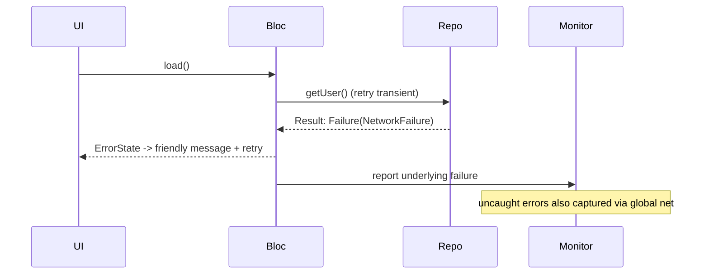

# Error Integration (Capstone: A Layered Error Strategy)

> The maintainable shape: error handling is a **layered strategy**, not scattered `try/catch` — the **data layer** converts exceptions to typed `Result`/`Failure` at the boundary, the **domain** maps/propagates them, the **presentation** (bloc/state) turns failures into explicit **error states**, the **UI** renders them with recovery (retry/degrade/message), and a **global safety net** (`FlutterError.onError` + `PlatformDispatcher.onError`/zone) captures anything uncaught and reports it to monitoring. Each layer has one job; together they make failure explicit, contained, recoverable, observable, and testable.

## Introduction

This module capstone composes the errors/exceptions distinction, `Result`/`Either`, global handling, and recovery/UX into one coherent strategy mapped to your architecture. Ad hoc error handling drifts into inconsistency and silent failures; a layered strategy makes failure a designed, first-class concern. This file shows the per-layer responsibilities and an end-to-end failure flow.

## Why this concept exists

Error handling touches every layer (I/O, domain, state, UI, observability) and every layer has a *different* right answer (convert, map, model, render, capture). Without a strategy, teams mix concerns (try/catch in UI, exceptions leaking to users, silent swallows, unreported crashes). A layered assignment of responsibilities — like clean architecture for correctness — makes failure handling consistent, testable, and observable ([Module 40](../40%20Clean%20Architecture/README.md)).

## Real-world analogy

A resilient organization handles problems in layers: the **front line** converts raw incidents into standard reports (data→`Result`), **operations** routes and interprets them (domain), the **service desk** decides the customer response (state), the **customer-facing staff** communicate clearly with a next step (UI), and a **central incident log** records everything even if it slipped past the process (global capture + monitoring). Each role does its part; nothing is silently dropped, and the customer always gets a clear answer.

## Internal Working

```mermaid
flowchart TD
    Data[data layer: convert exceptions -> Result/Failure at boundary] --> Domain[domain: map/propagate typed failures]
    Domain --> State[presentation: failures -> explicit error states]
    State --> UI[UI: render error + recovery (retry/degrade/message)]
    Global[global net: FlutterError.onError + PlatformDispatcher.onError/zone] --> Monitor[log + crash reporter]
    UI -. underlying failure .-> Monitor
    Escaped[uncaught anywhere] --> Global
```

- **Data layer** ([02_result_and_either.md](02_result_and_either.md)): the *only* place with `try/catch` around I/O; converts exceptions → **typed `Failure`** and returns **`Result<T>`**. Inner layers stay throw-free for expected failures.
- **Domain**: composes/maps `Result`s (network `Failure` → domain `Failure`), applies business-rule failures; no UI concerns.
- **Presentation (bloc/state)** ([Module 11](../11%20State%20Management/README.md)): consumes `Result`, emits **explicit states** (loading/data/empty/error(failure)); decides **retry/degradation** policy ([04_recovery_and_user_errors.md](04_recovery_and_user_errors.md)).
- **UI**: renders each state; error state = **friendly mapped message + retry/next step**; **no infinite spinner**, no raw exceptions; scoped **error boundary** contains widget build errors ([03_global_error_handling.md](03_global_error_handling.md)).
- **Global safety net**: `FlutterError.onError` + `PlatformDispatcher.onError` (and/or `runZonedGuarded`) capture **anything uncaught** → **logging + crash reporter** ([Module 52](../52%20Monitoring/README.md)). Bugs (`Error`s) crash in dev, are captured in prod.
- **Observability everywhere**: even recovered failures are **logged/reported** ([Module 39](../39%20Logging/README.md)) — user UX and telemetry are separate.
- **Classification discipline** ([01_errors_vs_exceptions.md](01_errors_vs_exceptions.md)): expected → `Result` + recover; bugs → crash/capture; never silent swallow.
- **Testability**: because failures are typed values flowing through layers, you **unit-test failure paths** (repo returns `Failure` → state → error UI) without real I/O.

## Memory Representation

Failures are typed values (`Result`/`Failure`) flowing up; error states hold the failure; global handlers hold the reporter. No hidden control flow — the failure is data.

## Compiler Behavior

Sealed `Result`/`Failure` + `switch` give **exhaustive** handling (can't forget a case). Bugs still throw as `Error`s.

## Runtime Behavior

Expected failures flow as values → error states → recovery UI; uncaught errors hit the global net → reported. Retries/degradation happen at the presentation layer; nothing crashes silently.

## Flutter Engine Behavior

Framework/async errors route to the global hooks; widget build errors to the error boundary — as per [03_global_error_handling.md](03_global_error_handling.md).

## Dart VM Behavior

`Result` avoids unwinding for expected failures; isolates handle their own errors + report.

## Examples

```dart
// DATA: convert exceptions -> typed Result at the boundary
class UserRepository {
  Future<Result<User>> getUser(String id) async {
    try {
      final res = await api.get('/users/$id');
      if (res.statusCode == 404) return Failure(NotFoundFailure('user'));
      return Success(User.fromJson(res.data));
    } on SocketException { return Failure(NetworkFailure()); }
  }
}

// PRESENTATION: Result -> explicit states, with retry policy
class UserBloc {
  Future<void> load(String id) async {
    emit(Loading());
    final r = await retryIdempotent(() => repo.getUser(id)); // backoff for transient
    emit(switch (r) {
      Success(:final value) => Data(value),
      Failure(:final error) => ErrorState(error),           // typed failure
    });
  }
}

// UI: friendly message + retry; no raw exceptions / infinite spinner
Widget build(BuildContext c) => switch (state) {
  Loading() => const CenteredSpinner(),
  Data(:final user) => Profile(user),
  ErrorState(:final failure) => ErrorView(message: messageFor(failure), onRetry: () => bloc.load(id)),
};

// GLOBAL: capture anything uncaught -> monitoring
void main() {
  FlutterError.onError = (d) { FlutterError.presentError(d); crash.record(d.exception, d.stack); };
  PlatformDispatcher.instance.onError = (e, s) { crash.record(e, s); return true; };
  runApp(const MyApp());
}
```

```dart
// Testable failure path — no real I/O
test('offline -> error state -> friendly message', () async {
  final bloc = UserBloc(FakeRepo(returns: Failure(NetworkFailure())));
  await bloc.load('1');
  expect(bloc.state, isA<ErrorState>());
  expect(messageFor((bloc.state as ErrorState).failure), contains('offline'));
});
```

## Diagrams



## Common Mistakes

| Mistake | Why | Fix |
|---------|-----|-----|
| `try/catch` scattered across layers | Mixed concerns, inconsistent | Convert at data boundary; `Result` inward |
| Exceptions leaking to UI/users | Crashes / cryptic text | Typed failures → mapped messages |
| No global net | Uncaught errors silent/crash | `FlutterError` + `PlatformDispatcher` → monitor |
| Recovered failures not reported | Blind telemetry | Log/report even on graceful recovery |
| Swallowing bugs as "handled" | Hides defects | Bugs crash (dev) / captured (prod) |
| Untested failure paths | Regressions | Unit-test repo→state→UI failure flow |
| Inconsistent error strategy | Drift, confusion | One documented layered convention |

## Best Practices

- Assign **one job per layer**: data **converts** exceptions → typed `Result`/`Failure`; domain **maps**; presentation **models** error states + retry/degradation; UI **renders** friendly messages + recovery; global net **captures** the rest.
- Keep **`try/catch` at the data boundary** (inner layers throw-free for expected failures); **bugs crash/capture**, expected failures flow as **typed values**.
- **Report every failure** (even recovered) to logging/monitoring; **never** leak raw exceptions to users or leave infinite spinners.
- Make failure **testable** (typed values → unit-test each layer's failure path); document the **one** strategy and apply it consistently.

## Performance

The strategy adds no runtime cost (typed values are cheap; global handlers fire only on errors) and improves resilience/perceived performance (retry, degradation, no hangs). The investment is design consistency; the payoff is fewer crashes, better UX, and visible telemetry.

## Advantages / Disadvantages

- **+** Consistent, layered, testable failure handling; explicit + recoverable; nothing silent (observable); clean happy path; friendly UX.
- **−** Upfront convention/boilerplate (`Result`, states, mapping), discipline to keep `try/catch` at the boundary, cross-layer coordination.

## Interview Questions

1. **🟢 What's each layer's error-handling job?** — Data converts exceptions→`Result`; domain maps; presentation models error states + retry; UI renders friendly messages + recovery; global net captures the rest.
2. **🟢 Where should `try/catch` live?** — At the data boundary (I/O); inner layers stay throw-free for expected failures, which flow as typed `Result`s.
3. **🟡 How do you ensure no failure is silent?** — A global net (`FlutterError.onError` + `PlatformDispatcher.onError`/zone) reports uncaught errors, and even recovered failures are logged to monitoring.
4. **🟡 How do bugs vs expected failures flow differently?** — Expected failures become typed `Result`s handled/recovered; bugs (`Error`s) crash in dev and are captured in prod — not swallowed.
5. **🟡 Why does this make failure testable?** — Failures are typed values flowing through layers, so you can unit-test repo→state→UI failure paths without real I/O.
6. **🔴 How do retry/degradation fit the layers?** — At the presentation layer, deciding policy over the `Result` (retry transient/idempotent, degrade to cache) before emitting the error state.
7. **🔴 Why report failures you've recovered from?** — User UX and telemetry are separate concerns; you still need visibility into failure rates/causes.

## Senior Engineer Tips

- Write the error strategy down (one page: which layer does what) and enforce "`try/catch` only at the data boundary" in review — it's the single rule that keeps error handling from sprawling.
- Wire the global net + monitoring first so you have visibility from day one; then layer typed failures + recovery UX on top.
- Test the unhappy paths explicitly (offline, 404, 500, timeout) as first-class cases — they're where real apps break and where most bugs hide.

## Architect Perspective

Error integration is the correctness-and-resilience counterpart to clean architecture: failure is a designed, typed concern with a clear per-layer responsibility, contained by boundaries and a global net, made visible by monitoring, and recoverable in the UI. This turns "the app crashes / spins / shows cryptic errors" into "failures are explicit, handled at the right layer, observed, and communicated" — the same layered discipline the whole handbook applies to structure, now applied to failure ([Module 40](../40%20Clean%20Architecture/README.md), [Module 11](../11%20State%20Management/README.md), [Module 52](../52%20Monitoring/README.md)).

## Summary

- Layer the strategy: data converts exceptions→typed `Result`; domain maps; presentation models error states + retry/degradation; UI renders friendly recovery; global net captures the rest → monitoring.
- `try/catch` at the boundary; bugs crash/capture, expected failures flow as typed values; report even recovered failures; never leak exceptions or hang.
- Failure becomes explicit, contained, recoverable, observable, and testable; document + apply one convention.

## Revision Notes

- Layers: data → `Result`/`Failure` (only `try/catch` here); domain → map; presentation → error states + retry/degrade; UI → friendly message + recovery; global → `FlutterError`+`PlatformDispatcher`/zone → monitor.
- Bugs crash (dev)/capture (prod); expected failures = typed values; report even recovered; no raw exceptions/infinite spinners.
- Testable failure paths (repo→state→UI); one documented convention; observability everywhere.

## Practice Questions

1. What is each layer responsible for in the error strategy?
2. Why keep `try/catch` only at the data boundary?
3. How do you guarantee no failure is silent?

## Coding Questions

1. Wire a full path: repo `Result` → bloc error state → UI message + retry.
2. Add the global net reporting to monitoring.
3. Unit-test the offline/404/500 failure paths across layers.

## Mini Project

**Layered error strategy (capstone — Flutter):** For a feature, implement the full strategy: data layer returns typed `Result`/`Failure` (converting exceptions at the boundary), presentation maps to loading/data/empty/error states with retry/degradation, UI renders friendly messages (no raw exceptions/infinite spinner), a global net (`FlutterError.onError`+`PlatformDispatcher.onError`) reports uncaught errors + a scoped error boundary contains widget crashes, and all failures (even recovered) go to a (stub) monitor. Add unit tests for offline/404/500 paths. Acceptance: `try/catch` only at the data boundary; typed failures flow to explicit states + friendly UI; retry/degradation applied; uncaught errors captured + reported; widget errors contained; failure paths unit-tested; one consistent documented strategy.
