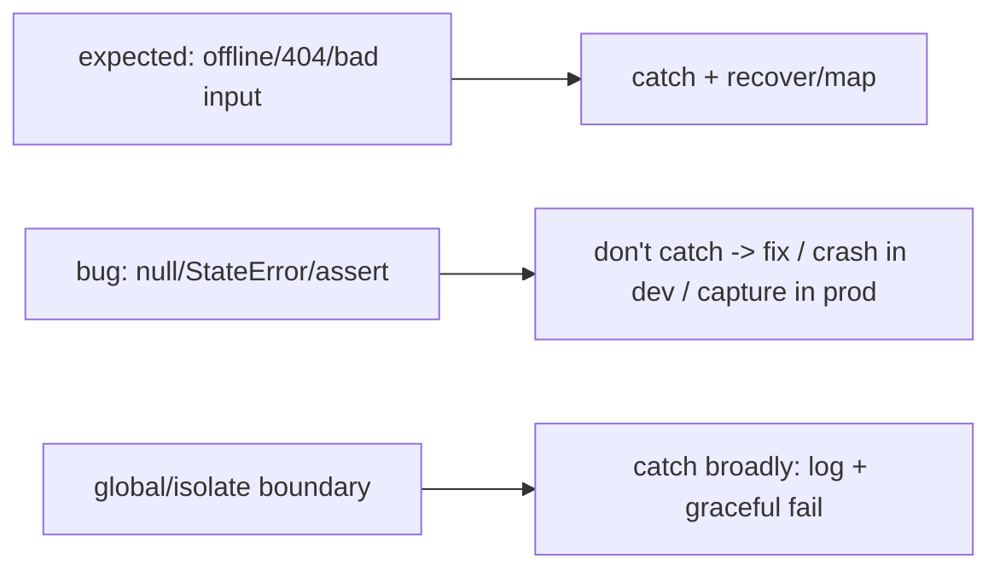

# Errors vs Exceptions (What to Catch, What to Fix)

> Dart splits failures into two intents: **`Error`** signals a **programming bug** (a broken contract — `assert` failure, null deref, `StateError`, `ArgumentError`) that you should **fix, not catch**; **`Exception`** signals an **expected runtime condition** (network down, file missing, bad input) that you **should** handle. Both can be `throw`n and `catch`-caught (they implement `Throwable`-like behavior via `Object`), but the **convention** guides you: catch exceptions and recover; let errors crash in dev so you find the bug, and capture them globally in prod ([global_error_handling.md](global_error_handling.md)).

## Introduction

Before choosing a strategy, you must know *what kind* of failure you're dealing with. This file covers Dart's `Error`/`Exception` distinction, `throw`/`catch`/`on`/`finally`, custom exceptions, and the crucial judgment of **when to catch vs when to let it crash** — the semantic foundation for everything else.

## Why this concept exists

Not all failures are equal. A `null` where you assumed non-null is a **bug** — swallowing it hides the defect and corrupts state. A failed HTTP call is a **normal condition** — crashing on it is user-hostile. Dart encodes this intent in two base types so code (and reviewers) can tell "fix this" from "handle this," preventing the twin anti-patterns of catching bugs and crashing on conditions.

## Real-world analogy

An **`Exception`** is a **flat tire on a road trip** — expected enough that you carry a spare and handle it (retry, reroute). An **`Error`** is the **engine was assembled wrong at the factory** — you don't "handle" it on the roadside; you fix the manufacturing defect. Wrapping the whole trip in "ignore all problems and keep driving" (catch-all that swallows) means you drive on a seized engine and crash worse later.

## Problem Statement

For a data-fetch function, decide which failures to catch (timeout, 404, offline) and which to let propagate (a null you assumed present, a programmer misuse), define a meaningful custom exception, and use `try/on/catch/finally` correctly. You'll classify failures and write disciplined handling.

## Internal Working

```mermaid
flowchart TD
    Fail{failure kind}
    Fail -->|programming bug (broken contract)| Err[Error: StateError/ArgumentError/assert/null]
    Fail -->|expected runtime condition| Exc[Exception: SocketException/FormatException/custom]
    Err --> Fix[FIX the bug; don't catch; crash in dev; capture in prod]
    Exc --> Handle[catch + recover / map to user error]
```

- **`Error`** (bugs): `StateError`, `ArgumentError`, `RangeError`, `TypeError`, `UnimplementedError`, `AssertionError`. These mean **the code is wrong** — throwing them is a signal to fix the caller/logic. **Generally don't catch** them; let them surface (in prod, capture globally + report — [Module 52](../52%20Monitoring/README.md)). Catching to "recover" usually hides a defect.
- **`Exception`** (conditions): `SocketException`, `TimeoutException`, `FormatException`, `HttpException`, and **your custom exceptions**. These are **expected** — **catch and handle** (retry, fallback, user message).
- **`throw`/`catch`**: `throw` any object (idiomatically an `Exception`/`Error`). `try { } on FooException catch (e) { } on Exception catch (e) { } catch (e, st) { }` — catch **specific** types first; `catch (e, st)` gets the stack trace. **`finally`** runs regardless (cleanup: close files/sinks/controllers).
- **`rethrow`**: preserve the original stack when re-throwing after partial handling (`catch (e) { log(e); rethrow; }`).
- **Custom exceptions**: implement `Exception`, add fields + a `toString()`; model domain failures (`NetworkException`, `NotFoundException`, `ValidationException`) so callers can branch and map to UX ([recovery_and_user_errors.md](recovery_and_user_errors.md)).
- **When to catch**: catch **exceptions you can act on** at the level that can act; **don't** catch-all-and-swallow (hides bugs), and **don't** catch `Error`s to "handle" a bug. Catch broadly **only** at boundaries (a global handler / an isolate entry) to log + fail gracefully.
- **Async**: `Future` errors propagate to `await` (catch with try/catch) or `.catchError`; **stream** errors go to `onError`. Uncaught async errors need zone/global handling ([global_error_handling.md](global_error_handling.md)).

## Memory Representation

Exceptions/errors are objects with a message + (when caught with `catch (e, st)`) a `StackTrace`. `finally` guarantees cleanup runs. `rethrow` keeps the original stack; `throw e` inside a catch loses it.

## Compiler Behavior

Dart has **no checked exceptions** — the compiler doesn't force you to declare/handle throwables; discipline (or `Result` types — [result_and_either.md](result_and_either.md)) is on you. `assert`s are **debug-only** (stripped in release).

## Runtime Behavior

An uncaught exception/error on the current call stack propagates up; if never caught it reaches the zone/global handler (or crashes). `finally` runs during unwinding. Async errors surface at the await/listen point.

## Flutter Engine Behavior

Uncaught errors during build/layout/paint go to `FlutterError.onError`; uncaught async/platform errors go to `PlatformDispatcher.onError`/zone ([global_error_handling.md](global_error_handling.md)).

## Dart VM Behavior

Errors/exceptions unwind the stack of the current isolate; an unhandled one in a background isolate terminates that isolate (not the app) unless handled.

## Examples

```dart
// Custom exception (expected condition) — model domain failures
class NotFoundException implements Exception {
  final String resource;
  NotFoundException(this.resource);
  @override
  String toString() => '$resource not found';
}

Future<User> fetchUser(String id) async {
  try {
    final res = await api.get('/users/$id');
    if (res.statusCode == 404) throw NotFoundException('user $id');
    return User.fromJson(res.data);
  } on SocketException {
    throw NetworkException('offline');          // condition -> handle upstream
  } on FormatException catch (e, st) {
    log('bad JSON', error: e, stackTrace: st);  // condition (bad response)
    rethrow;                                     // preserve stack
  } finally {
    // cleanup that must always run (e.g., close a resource)
  }
}

// BUG (Error): don't "handle" it — fix the caller. Let it crash in dev.
int lastOf(List<int> xs) {
  if (xs.isEmpty) throw StateError('lastOf on empty list'); // programmer contract
  return xs.last;
}
// Anti-pattern: try { risky(); } catch (_) {}  // swallows bugs AND conditions silently
```

## Diagrams



## Common Mistakes

| Mistake | Why it's bad | Fix |
|---------|-------------|-----|
| `catch (_) {}` swallowing everything | Hides bugs + conditions; silent failure | Catch specific types; act or rethrow |
| Catching `Error`s to "recover" | Masks a defect, corrupts state | Fix the bug; don't catch |
| Crashing on expected conditions | User-hostile | Catch exceptions + handle |
| `throw e` in a catch | Loses original stack | `rethrow` |
| No `finally` for cleanup | Leaks (files/sinks/controllers) | `finally` or try-with-cleanup |
| Assuming checked exceptions | Dart has none | Discipline / `Result` types |
| Ignoring async/stream errors | Uncaught → crash | try/catch await, stream `onError`, zones |

## Best Practices

- **Classify** failures: **catch `Exception`s** you can act on (offline/404/bad input); **don't catch `Error`s** — fix the bug (crash in dev, capture in prod).
- Catch **specific types first**; use **`catch (e, st)`** for stack traces, **`rethrow`** to preserve them, and **`finally`** for cleanup.
- Model **custom exceptions** for domain failures (with `toString`) so callers branch + map to UX; **never `catch (_) {}` silently**.
- Handle **async/stream** errors (await try/catch, stream `onError`); catch **broadly only at boundaries** (global/isolate) to log + degrade gracefully.

## Performance

Throwing/catching is cheap relative to I/O but **not free** — don't use exceptions for **normal control flow** in hot paths (prefer `Result` / nullable returns — [result_and_either.md](result_and_either.md)). `finally` is negligible.

## Advantages / Disadvantages

- **+** Clear intent (bug vs condition), stack traces, cleanup via `finally`, custom domain modeling, propagation.
- **−** No compiler enforcement (easy to forget), easy to misuse (swallow/over-catch), exceptions-as-control-flow is a smell, async error handling has extra rules.

## Interview Questions

1. **🟢 What's the difference between `Error` and `Exception` in Dart?** — `Error` signals a programming bug (fix it, don't catch); `Exception` signals an expected condition (catch and handle).
2. **🟢 Should you catch `Error`s?** — Generally no — catching a bug hides the defect; let it crash in dev and capture globally in prod.
3. **🟡 Why is `catch (_) {}` an anti-pattern?** — It silently swallows both bugs and conditions, hiding failures; catch specific types and act or `rethrow`.
4. **🟡 `throw e` vs `rethrow` in a catch?** — `rethrow` preserves the original stack trace; `throw e` resets it.
5. **🟡 Does Dart have checked exceptions?** — No — the compiler doesn't force handling; you rely on discipline or `Result` types.
6. **🔴 When is a broad catch-all appropriate?** — Only at boundaries (global handler, isolate entry) to log and fail gracefully — not sprinkled through business logic.
7. **🔴 Why avoid exceptions for normal control flow?** — They're costlier than returns and obscure the happy path; use `Result`/nullable for expected outcomes.

## Senior Engineer Tips

- Treat `catch (_) {}` as a code-review blocker — silent catches are where bugs go to hide and users get stuck spinners.
- Let programming errors crash loudly in development (asserts, no catch); you want to *find* them, not paper over them, and prod captures them globally.
- Use `rethrow` + logging when you handle partially, and always `finally` your cleanup; lost stack traces and leaked resources are the recurring pain points.

## Architect Perspective

The error/exception distinction is the vocabulary the whole strategy is built on: it decides what's modeled as recoverable (exceptions → `Result`/UX) vs what's a defect (errors → crash/capture). Getting this classification right at each layer — and forbidding silent catches — is what lets a codebase handle failure deliberately rather than accidentally, feeding the explicit-failure modeling and global handling that follow ([result_and_either.md](result_and_either.md), [global_error_handling.md](global_error_handling.md)).

## Summary

- `Error` = bug (fix, don't catch; crash dev, capture prod); `Exception` = condition (catch + handle).
- Catch specific types first, `catch (e, st)` for stacks, `rethrow` to preserve, `finally` for cleanup; never `catch (_) {}` silently.
- Model custom exceptions; handle async/stream errors; broad catch only at boundaries; don't use exceptions for normal control flow.

## Revision Notes

- `Error` (StateError/ArgumentError/assert/null) = programming bug → don't catch; `Exception` (Socket/Timeout/Format/custom) = condition → catch.
- `try { } on T catch (e, st) { } catch (e, st) { } finally { }`; `rethrow` preserves stack; `catch (_) {}` = anti-pattern.
- No checked exceptions; async → await try/catch, stream `onError`, uncaught → zone/global; don't use exceptions as control flow.

## Practice Questions

1. Which failures in a fetch should you catch vs let crash?
2. Why use `rethrow` instead of `throw e`?
3. Why is exceptions-as-control-flow discouraged?

## Coding Questions

1. Write a custom `Exception` + a function that throws it on a 404.
2. Use `on`/`catch`/`finally` to handle offline + cleanup correctly.
3. Fix a `catch (_) {}` anti-pattern into specific handling + rethrow.

## Mini Project

**Disciplined try/catch (Flutter):** Refactor a data function to classify failures — catch `SocketException`/`TimeoutException`/404 into typed custom exceptions (handled upstream), let programmer errors propagate, use `rethrow` + `finally` correctly, and remove any silent `catch (_) {}`. Acceptance: exceptions vs errors correctly classified; specific `on` clauses; stack traces preserved (`rethrow`/`catch (e, st)`); cleanup in `finally`; no silent catches; async errors handled.
