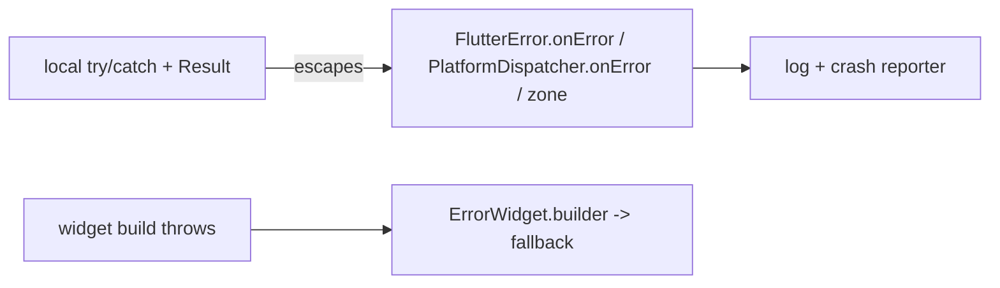

# Global Error Handling (Catch-All Safety Nets)

> No matter how careful your local handling, some errors slip through — so install **global catch-alls**: **`FlutterError.onError`** (errors inside the framework: build/layout/paint/gesture callbacks), **`PlatformDispatcher.instance.onError`** (uncaught async/platform errors), and optionally wrap `runApp` in **`runZonedGuarded`** (catches uncaught errors in that zone). Route all of them to your **logging/crash reporter** ([Module 52](../52%20Monitoring/README.md)) so nothing fails silently. Separately, use a **widget `ErrorWidget.builder`/error boundary** so a single widget's build error shows a fallback instead of crashing the whole screen.

## Introduction

Global handlers are the safety net beneath local `try/catch` and `Result`s. This file covers the three Flutter/Dart global hooks, how they differ, wiring them to crash reporting, and widget-level error boundaries — ensuring uncaught errors are captured, reported, and (where possible) contained rather than crashing or vanishing.

## Why this concept exists

Local handling can't cover everything — a bug in a build method, an unawaited future's error, a platform callback failure. Without global hooks these either crash the app (bad UX, if uncaught) or disappear silently (worse — you never learn about them). Flutter/Dart provide layered hooks so **every** uncaught error is caught somewhere, logged, and reported.

## Real-world analogy

Local `try/catch` is each worker handling problems at their station. Global handlers are the **building's fire alarm + sprinklers + security desk**: if something gets past everyone, the alarm still logs it and the sprinklers contain the damage. The widget error boundary is a **firebreak wall** — a fire in one room (widget) doesn't burn down the whole floor (screen); that room shows "under maintenance" instead.

## Problem Statement

Ensure that a build-method exception, an unawaited failing future, and a platform-channel error are all **captured and reported** (not silently lost or crashing), and that one broken widget shows a friendly fallback instead of a red screen taking down the page. You'll wire `FlutterError.onError`, `PlatformDispatcher.onError`, `runZonedGuarded`, and `ErrorWidget.builder`.

## Internal Working

```mermaid
flowchart TD
    App[runZonedGuarded(() => runApp(...))] --> Zone[zone: catches uncaught (esp. async) errors]
    Framework[framework errors: build/layout/paint/gestures] --> FlutterErr[FlutterError.onError]
    AsyncPlat[uncaught async / platform errors] --> Dispatcher[PlatformDispatcher.onError]
    Zone & FlutterErr & Dispatcher --> Report[log + crash reporter (Module 52)]
    Build[widget build throws] --> Boundary[ErrorWidget.builder -> fallback UI]
```

- **`FlutterError.onError`**: called for errors **within the Flutter framework** — exceptions in `build`/layout/paint, gesture handlers, etc. Default prints to console (red screen in debug). Override to **forward to your reporter** (call `FlutterError.presentError` in debug to keep the console output). This is the **framework** channel.
- **`PlatformDispatcher.instance.onError`**: the top-level hook for **uncaught async errors and platform-dispatched errors** (Flutter 3.3+). Return `true` to mark handled. Simpler than a zone for many cases; covers errors the framework hook doesn't.
- **`runZonedGuarded`**: run `runApp` inside a zone whose `onError` catches **any uncaught error in that zone** (including some async). Historically the way to catch everything; still used, but ensure **`WidgetsFlutterBinding.ensureInitialized()`** is inside the same zone and don't double-report (pick a consistent combo — commonly `PlatformDispatcher.onError` + `FlutterError.onError`, or the zone).
- **Wire to reporting**: all three should funnel to **logging + a crash reporter** (Crashlytics/Sentry — [Module 52](../52%20Monitoring/README.md)) with the error + stack, so production failures are visible.
- **Widget error boundary** (`ErrorWidget.builder`): override to render a **friendly fallback** instead of the default red error box; scope-limited boundaries (a wrapper widget catching build errors of a subtree) prevent one widget from crashing the whole screen. In release, the default is a grey box — customize it.
- **Isolates**: background isolates need their **own** error handling (`Isolate.addErrorListener` / handle in the entry) — the main zone doesn't catch them ([02 · isolates](../02%20Advanced%20Dart/isolates_and_concurrency.md)).
- **Don't swallow**: global handlers **log/report and (optionally) show a friendly screen** — they're a net, not an excuse to ignore local handling.

## Memory Representation

Handlers are callbacks holding references to the reporter/logger. Errors arrive as `(error, stackTrace)`. No persistent state beyond what you log/report.

## Compiler Behavior

Not applicable.

## Runtime Behavior

Uncaught framework errors → `FlutterError.onError`; uncaught async/platform → `PlatformDispatcher.onError` (or the zone); a build throw → red/grey box or your `ErrorWidget.builder`. In debug, framework errors also show the red screen (keep `presentError`).

## Flutter Engine Behavior

The engine/binding routes framework errors to `FlutterError.onError` and platform/async errors to `PlatformDispatcher.onError`; `ErrorWidget` is substituted into the tree where a build fails.

## Dart VM Behavior

Zones (`runZonedGuarded`) intercept uncaught errors in their execution context; each isolate has independent error handling.

## Examples

```dart
import 'dart:async';
import 'package:flutter/material.dart';

void main() {
  // Framework errors (build/layout/paint/gestures) -> reporter (+ console in debug)
  FlutterError.onError = (FlutterErrorDetails details) {
    FlutterError.presentError(details);            // keep debug red screen
    crashReporter.record(details.exception, details.stack); // Module 52
  };

  // Uncaught async / platform errors -> reporter
  PlatformDispatcher.instance.onError = (error, stack) {
    crashReporter.record(error, stack);
    return true;                                    // handled
  };

  // Friendly fallback instead of the default error box
  ErrorWidget.builder = (FlutterErrorDetails details) => const _FallbackTile();

  runApp(const MyApp());
}

// Alternative/complement: catch everything in a guarded zone
// runZonedGuarded(() {
//   WidgetsFlutterBinding.ensureInitialized();     // inside the same zone
//   runApp(const MyApp());
// }, (error, stack) => crashReporter.record(error, stack));
```

```dart
// Scoped widget error boundary: contain a subtree's build error to a fallback
class ErrorBoundary extends StatelessWidget {
  final Widget child; final Widget fallback;
  const ErrorBoundary({super.key, required this.child, required this.fallback});
  @override
  Widget build(BuildContext context) {
    ErrorWidget.builder = (_) => fallback;          // (illustrative; real impls wrap build)
    return child;
  }
}
```

## Diagrams



## Common Mistakes

| Mistake | Why | Fix |
|---------|-----|-----|
| No global handler | Errors crash or vanish silently | Wire `FlutterError.onError` + `PlatformDispatcher.onError` |
| Not reporting to a crash tool | Prod failures invisible | Funnel handlers to Crashlytics/Sentry |
| `ensureInitialized` outside the zone | Zone doesn't catch startup errors | Put it inside `runZonedGuarded` |
| Double-reporting (zone + hooks) | Duplicate reports | Pick a consistent combo |
| Default red/grey error box in prod | Ugly UX | Custom `ErrorWidget.builder` |
| Ignoring isolate errors | Uncaught in background | Handle per-isolate |
| Treating global as a substitute for local | Loses context/recovery | Global is a net, not primary handling |

## Best Practices

- Install **`FlutterError.onError`** (framework) + **`PlatformDispatcher.onError`** (async/platform), and/or **`runZonedGuarded`** — a **consistent** combo (avoid double-reporting), with `ensureInitialized` inside the zone if used.
- **Funnel all** uncaught errors to **logging + a crash reporter** ([Module 52](../52%20Monitoring/README.md)) with stack traces; keep `presentError` for the debug red screen.
- Provide a **custom `ErrorWidget.builder`** / scoped **error boundaries** so one widget's build error shows a fallback, not a crashed screen.
- Handle **isolate** errors separately; treat global handlers as a **safety net**, not a replacement for local handling/`Result`.

## Performance

Negligible — handlers only fire on errors. Reporting is async/batched by the crash tool. Error boundaries add a trivial wrapper. The value is visibility + containment, not runtime cost.

## Advantages / Disadvantages

- **+** No silent/uncaught crashes, production visibility (crash reports), contained widget failures, better UX on error.
- **−** Setup nuance (which hook, zone vs dispatcher, double-reporting), isolates need separate handling, not a substitute for local handling.

## Interview Questions

1. **🟢 What does `FlutterError.onError` catch?** — Errors inside the Flutter framework (build/layout/paint, gesture callbacks) — the framework channel.
2. **🟢 What's `PlatformDispatcher.instance.onError` for?** — A top-level hook for uncaught async and platform-dispatched errors (return `true` when handled).
3. **🟡 What does `runZonedGuarded` add?** — It runs `runApp` in a zone that catches uncaught errors (incl. some async) in that zone — ensure `ensureInitialized` is inside it.
4. **🟡 How do you avoid double-reporting?** — Choose a consistent combination of hooks/zone rather than reporting the same error from multiple handlers.
5. **🟡 What is `ErrorWidget.builder` for?** — Customizing the fallback UI shown when a widget's `build` throws (instead of the default red/grey box).
6. **🔴 Why must background isolates handle their own errors?** — The main zone/handlers don't catch them; use `Isolate.addErrorListener`/handle in the entry.
7. **🔴 Are global handlers a replacement for local handling?** — No — they're a safety net for what escapes; local handling/`Result` keeps context and enables recovery.

## Senior Engineer Tips

- Wire all global hooks to your crash reporter on day one; the worst production state is failures you never hear about because nothing was capturing them.
- Pick one consistent capture strategy (commonly `FlutterError.onError` + `PlatformDispatcher.onError`) and keep `presentError` in debug — juggling a zone on top often causes double reports or missed startup errors.
- Add a branded `ErrorWidget.builder` and scoped boundaries around risky subtrees; a contained "something went wrong, retry" beats a dead screen every time.

## Architect Perspective

Global handling is the observability + resilience backstop of the error strategy: it guarantees no uncaught error is silent (reported to monitoring) and, via error boundaries, that failures are contained. It sits beneath local `try/catch` and `Result` (which handle expected failures with context) and feeds monitoring/logging — completing the layered defense so the app degrades gracefully and you *learn* about every failure ([result_and_either.md](result_and_either.md), [Module 52](../52%20Monitoring/README.md), [Module 39](../39%20Logging/README.md)).

## Summary

- Install `FlutterError.onError` (framework) + `PlatformDispatcher.onError` (async/platform), and/or `runZonedGuarded`, in a consistent combo; funnel to logging + crash reporter.
- Customize `ErrorWidget.builder` / use scoped error boundaries so a widget error shows a fallback, not a crash.
- Handle isolate errors separately; global handlers are a net, not a substitute for local handling/`Result`.

## Revision Notes

- `FlutterError.onError` = framework errors (build/layout/paint/gestures; keep `presentError` in debug); `PlatformDispatcher.instance.onError` = uncaught async/platform (return true).
- `runZonedGuarded(() { ensureInitialized(); runApp(); }, onError)` — inside-zone init; avoid double-reporting; funnel all → crash reporter (Module 52).
- `ErrorWidget.builder` / scoped boundary = fallback UI (not red/grey box); isolates handle own errors; global = safety net, not primary handling.

## Practice Questions

1. Which hook catches a build-method exception vs an unawaited future error?
2. How do you avoid duplicate crash reports?
3. How do you keep one broken widget from crashing the screen?

## Coding Questions

1. Wire `FlutterError.onError` + `PlatformDispatcher.onError` to a crash reporter.
2. Add a custom `ErrorWidget.builder` fallback.
3. Set up `runZonedGuarded` with in-zone initialization (no double-report).

## Mini Project

**Global safety net (Flutter):** Wire `FlutterError.onError` + `PlatformDispatcher.onError` (and/or `runZonedGuarded`) to a (stub) crash reporter, keep the debug red screen, add a branded `ErrorWidget.builder`, and wrap a risky subtree in a scoped error boundary. Verify a build exception, an unawaited failing future, and a deliberate widget error are all captured/contained. Acceptance: all three uncaught cases captured + reported (no silent loss/crash); debug red screen preserved; friendly fallback for widget errors; consistent combo (no double-report); isolate handling noted.
