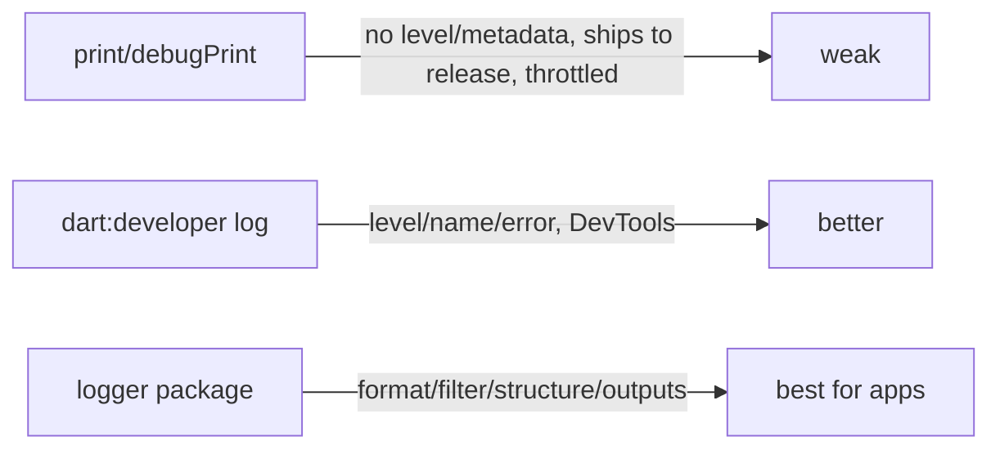

# Logging Fundamentals (Levels, Structure, `print` vs `log`)

> Logging is deliberate, **leveled**, **structured** visibility — not scattered `print`s. Use **severity levels** (trace/debug/info/warning/error/fatal) so you can filter noise from signal, and prefer **structured logs** (event + key/value fields) over freeform strings so logs are searchable/parseable at scale. In Flutter, **`print`/`debugPrint` are for throwaway debugging** (they ship to release and can be throttled/dropped); **`dart:developer`'s `log()`** is better (level, name, error/stack, DevTools integration); a **logging package** ([logger_package_and_setup.md](logger_package_and_setup.md)) is best for real apps.

## Introduction

Before any package, you need the concepts: why log at all, what the levels mean, why structure beats strings, and the difference between `print`, `debugPrint`, and `dart:developer`'s `log`. This file establishes the vocabulary the rest of the module builds on.

## Why this concept exists

In production you can't attach a debugger — logs are your only window into behavior. But logs are useless if everything is the same severity (can't filter), unstructured (can't search/aggregate), or done with `print` (ships to release, no metadata, throttled). Levels + structure + the right API turn logging from noise into a diagnostic tool.

## Real-world analogy

Logging is a **flight data recorder**: it must record the right events at the right **severity** (a routine altitude reading vs an engine-fire alarm) in a **structured, machine-readable** format so investigators can search and reconstruct what happened — not a pilot scribbling random notes on napkins (`print`) that get lost.

## Problem Statement

Instrument a feature so you can trace normal flow, spot warnings, and capture errors — filterable by severity and searchable by fields (user action, screen, duration) — without using `print` or logging noise. You'll pick levels, structure events, and use `dart:developer`/a logger.

## Internal Working

```mermaid
flowchart TD
    Event[something happens] --> Level{severity}
    Level --> Trace[trace/debug: fine detail (dev)]
    Level --> Info[info: notable events]
    Level --> Warn[warning: recoverable/unexpected]
    Level --> Error[error/fatal: failures]
    Event --> Struct[structured: event + fields (k/v)]
    Struct --> Sink[filter by level -> console / DevTools / remote]
```

- **Log levels** (severity, low→high): **trace/verbose** (very fine detail), **debug** (dev diagnostics), **info** (notable events: login, screen view), **warning** (unexpected but recoverable), **error** (failures), **fatal** (crash-worthy). Levels let you set a **threshold** (e.g., info+ in prod, debug+ in dev) to separate signal from noise.
- **Structured logging**: log an **event + key/value fields** (`event: 'checkout', step: 'payment', amountCents: 1499, durationMs: 320`) rather than a freeform sentence. Structured logs are **searchable, filterable, aggregatable** by machines (remote sinks/observability — [remote_logging_and_observability.md](remote_logging_and_observability.md)); string logs aren't.
- **`print` / `debugPrint`**: `print` writes to stdout — **ships to release**, no level/metadata, and platform consoles may **throttle/drop** high-volume output; `debugPrint` throttles to avoid loss but is still for **temporary** debugging. **Don't build real logging on `print`.**
- **`dart:developer` `log()`**: `log(message, level:, name:, error:, stackTrace:, time:)` — has **levels, logger names, error/stack**, integrates with **DevTools/observatory**, and can be filtered. A solid built-in step up from `print`.
- **Logging package** (`logger`, etc.): pretty dev output, filters, multiple outputs, structure — the practical choice for apps ([logger_package_and_setup.md](logger_package_and_setup.md)).
- **What to log**: notable state transitions, decisions, external calls (metadata, not bodies), errors with context — **enough to reconstruct behavior**, not everything (noise + cost + PII risk — [production_logging_and_redaction.md](production_logging_and_redaction.md)).
- **Consistency**: consistent event names/fields/levels make logs analyzable; ad hoc strings don't.

## Memory Representation

A log record is (level, message/event, fields, timestamp, optional error/stack, logger name). Structured records serialize to JSON for remote sinks; console logs are formatted strings.

## Compiler Behavior

`print`/`debugPrint` calls remain in release unless stripped/guarded; wrap dev-only logs behind `kDebugMode`/build config or a no-op prod logger ([logger_package_and_setup.md](logger_package_and_setup.md)).

## Runtime Behavior

Below-threshold logs are filtered cheaply; high-volume `print` can be throttled/dropped by the platform console. Structured logs are emitted to sinks (console/DevTools/remote).

## Flutter Engine Behavior

`dart:developer` `log` integrates with DevTools' logging view (filter by level/name); `print` goes to the raw console.

## Dart VM Behavior

`log` records carry structured metadata the VM/DevTools understand; guarding by `kDebugMode` lets the compiler tree-shake dev-only logging.

## Examples

```dart
import 'dart:developer' as dev;
import 'package:flutter/foundation.dart';

// ANTI-PATTERN: print() for real logging (ships to release, no level, may be dropped)
// print('user ${user.email} logged in');   // ❌ also logs PII!

// Better: dart:developer log with level, name, error/stack
void logLogin(String userId) {
  dev.log('login', name: 'auth', level: 800 /* INFO */); // structured-ish, filterable
}

// Structured event (searchable fields) — no PII
void logCheckoutStep(String step, int amountCents, int durationMs) {
  dev.log(
    'checkout',
    name: 'checkout',
    level: 800,
    // in a real logger, pass fields as a map; here shown inline
    error: null,
  );
  // logger.i('checkout', {'step': step, 'amountCents': amountCents, 'durationMs': durationMs});
}

// Error with context (level ERROR + stack)
void logFailure(Object e, StackTrace st) =>
    dev.log('fetch_failed', name: 'data', level: 1000, error: e, stackTrace: st);

// Dev-only diagnostic (tree-shaken in release)
if (kDebugMode) dev.log('cache miss for key', name: 'cache', level: 500 /* DEBUG */);
```

## Diagrams



## Common Mistakes

| Mistake | Why it's bad | Fix |
|---------|-------------|-----|
| `print` everywhere for logging | Ships to release, no levels, throttled/dropped | Use `dart:developer`/a logger |
| No log levels | Can't filter signal from noise | Use severity levels + threshold |
| Freeform string logs | Not searchable/aggregatable | Structured event + fields |
| Logging everything | Noise, cost, PII risk | Log enough to reconstruct behavior |
| Logging PII/secrets | Security/compliance breach | Redact ([production file](production_logging_and_redaction.md)) |
| Dev logs shipped to release | Bloat/perf/leak | Guard with `kDebugMode`/prod no-op |
| Inconsistent event names/levels | Unanalyzable | Consistent conventions |

## Best Practices

- Log with **severity levels** and a **threshold** (verbose in dev, info+ in prod) to separate signal from noise; use **consistent** event names/levels.
- Prefer **structured logs** (event + key/value fields) over freeform strings for searchability/aggregation.
- Don't build logging on **`print`** — use **`dart:developer` `log`** or a **logging package**; **guard dev-only logs** (`kDebugMode`/prod no-op).
- Log **enough to reconstruct behavior** (transitions, decisions, external calls' metadata, errors + context) — **never PII/secrets** ([production_logging_and_redaction.md](production_logging_and_redaction.md)).

## Performance

Below-threshold logs should be cheap (guard expensive message construction behind the level check / `kDebugMode`). `print` at volume is throttled/dropped (and slow). Structured logging adds minor serialization cost — worth it for searchability; sample high-volume logs in prod ([production_logging_and_redaction.md](production_logging_and_redaction.md)).

## Advantages / Disadvantages

- **+** Production visibility, filterable by severity, searchable (structured), reconstruct behavior without a debugger.
- **−** Overhead if overdone, PII/security risk, `print` misuse, requires discipline (levels/structure/consistency).

## Interview Questions

1. **🟢 Why not use `print` for real logging?** — It ships to release, has no levels/metadata, and platform consoles may throttle/drop it; use `dart:developer` `log` or a logging package.
2. **🟢 What are log levels for?** — Severity (trace→fatal) lets you filter and set a threshold, separating signal from noise (verbose dev, info+ prod).
3. **🟡 Why structured over string logs?** — Event + key/value fields are searchable, filterable, and aggregatable by machines (remote/observability); freeform strings aren't.
4. **🟡 What does `dart:developer`'s `log` add over `print`?** — Levels, logger names, error/stack, timestamps, and DevTools integration.
5. **🟡 What should you log (and not)?** — Enough to reconstruct behavior (transitions, decisions, external-call metadata, errors + context); never PII/secrets, never "everything."
6. **🔴 How do you keep dev-only logs out of release?** — Guard with `kDebugMode`/build config (tree-shaken) or route through a prod no-op logger.
7. **🔴 How do you keep below-threshold logging cheap?** — Guard expensive message/field construction behind the level check so it isn't computed when filtered out.

## Senior Engineer Tips

- Ban `print` in review and standardize on a logger with levels + structured fields; consistent event names are what make logs analyzable later.
- Guard expensive log-message construction behind the level/`kDebugMode` check — building a big string only to drop it is a silent perf cost.
- Decide what's worth logging by "could I reconstruct this incident from the logs?" — not "log everything," which just creates noise, cost, and PII risk.

## Architect Perspective

Logging fundamentals set the contract for observability: leveled, structured, consistent events that machines and humans can filter and search. Choosing the right API (`log`/package over `print`) and conventions up front — behind a facade ([logging_integration.md](logging_integration.md)) — makes production debugging possible without leaking data or degrading performance, and feeds directly into remote sinks and crash correlation ([remote_logging_and_observability.md](remote_logging_and_observability.md), [Module 52](../52%20Monitoring/README.md)).

## Summary

- Log with severity levels + a threshold (verbose dev, info+ prod) and structured events (fields), consistently.
- Don't use `print` for logging — use `dart:developer` `log` or a package; guard dev-only logs.
- Log enough to reconstruct behavior; never PII/secrets; keep below-threshold logging cheap.

## Revision Notes

- Levels: trace/debug/info/warning/error/fatal → filter by threshold (dev verbose, prod info+); structured event + k/v fields (searchable).
- `print`/`debugPrint` = temporary only (ships to release, throttled); `dart:developer` `log(msg, level, name, error, stackTrace)` = levels/DevTools; package = best.
- Log transitions/decisions/external-call metadata/errors+context; never PII/secrets; guard dev logs (`kDebugMode`); keep below-threshold cheap.

## Practice Questions

1. Why are log levels essential for production?
2. What makes a log "structured," and why does it matter?
3. When is `print` acceptable, and when is it not?

## Coding Questions

1. Replace `print`s with leveled `dart:developer` `log` calls (with name/level).
2. Emit a structured event with fields (no PII).
3. Guard a dev-only debug log with `kDebugMode`.

## Mini Project

**Leveled, structured logging (Flutter):** Instrument a feature with `dart:developer` `log` (or a logger) using severity levels and structured events (event + fields), a dev/prod threshold, guarded dev-only logs, and no `print`/PII. Acceptance: levels used + filterable; events structured with fields; dev-only logs guarded (`kDebugMode`); no `print`; no PII/secrets; enough logged to reconstruct the feature's flow.
