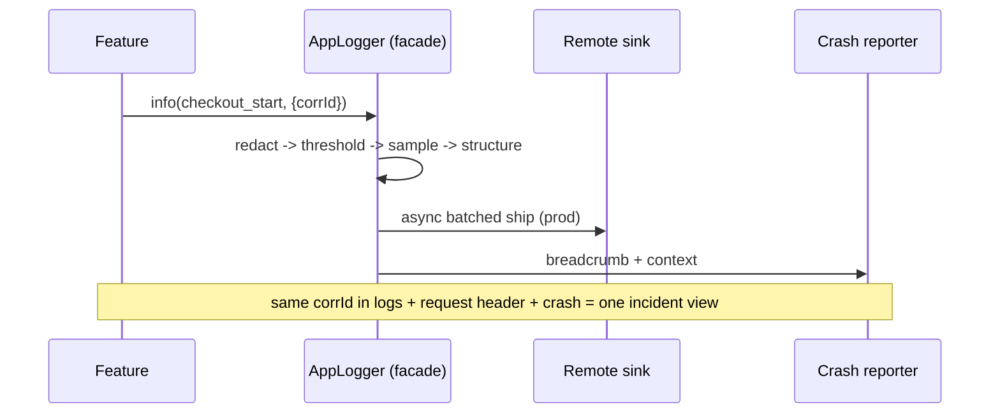

# Logging Integration (Capstone: One Facade Across Environments)

> The maintainable shape: **one `AppLogger` facade**, injected via DI, that the whole app depends on — behind it, **environment-specific pipelines**: dev = pretty console + verbose; prod = **redact → threshold → sample → structured → async remote + crash breadcrumbs**, with **correlation ids** threading logs/requests/crashes. App code just calls `logger.info(event, fields)`; the facade owns levels, structure, redaction, sampling, environment selection, and remote/observability wiring. Logging becomes consistent, safe, cheap, correlated, and testable — the observability complement to the error strategy ([Module 38](../38%20Error%20Handling/README.md)).

## Introduction

This module capstone composes fundamentals, the `logger` setup, production redaction, and remote observability into one coherent logging architecture. Scattered `print`/`Logger()` calls with per-site formatting/redaction are inconsistent and dangerous; one facade centralizes every concern. This file shows the composition and an end-to-end logged-and-correlated flow.

## Why this concept exists

Logging spans levels, structure, environment differences, redaction, sampling, performance, remote shipping, and correlation — all cross-cutting. Left ad hoc, you get leaks, noise, cost, and inconsistency. One facade with a layered pipeline (like a repository for data) makes logging a single, governed capability, consistent with clean architecture and DI ([Module 40](../40%20Clean%20Architecture/README.md), [Module 14](../14%20Dependency%20Injection/README.md)).

## Real-world analogy

The facade is the **newsroom's single editorial desk**: reporters (features) submit stories the same way, and the desk applies house style (structure/levels), **redacts sensitive info** (legal), decides what runs and how prominently (threshold/sampling), and routes it to the right outlet (console in the newsroom, wire service in prod) with a **story slug** (correlation id) so follow-ups line up. No reporter self-publishes raw to the wire.

## Problem Statement

Deliver production-grade logging: a DI-injected `AppLogger` used everywhere (with a `dio` request logger), dev pretty console + verbose, prod redacted/sampled/structured/async-remote with crash breadcrumbs and correlation ids stitching client+server+crash, and a fake for tests — all consistent and PII-safe. You'll compose every file in this module.

## Internal Working

```mermaid
flowchart TD
    App[app + dio interceptor] --> Facade[AppLogger (DI-injected)]
    Facade --> Pipe{environment}
    Pipe -->|dev| Dev[PrettyPrinter + console + debug]
    Pipe -->|prod| Prod[redact -> threshold -> sample -> structured -> async remote]
    Prod --> Crash[crash reporter: breadcrumbs + context]
    Facade --> Corr[correlation id -> logs + request header + crash]
    Facade --> Test[Fake AppLogger (assert events)]
```

- **Single facade** ([logger_package_and_setup.md](logger_package_and_setup.md)): `AppLogger` interface (`debug/info/warn/error`, event + fields), the **only** logging dependency in app code; injected via DI as one instance.
- **Environment pipelines**: **dev** = PrettyPrinter/console/debug (verbose, readable); **prod** = the ordered pipeline **redact → threshold(info+) → sample → structured(JSON) → async batched remote** + crash breadcrumbs — selected by build mode/flavor.
- **Redaction always in the facade** ([production_logging_and_redaction.md](production_logging_and_redaction.md)): allowlist + scrub before anything is emitted/shipped — no call site can leak.
- **Correlation + observability** ([remote_logging_and_observability.md](remote_logging_and_observability.md)): a correlation id per action threads through logs, `dio` request headers, and crash context; breadcrumbs + context (version/session/screen) give crashes a narrative.
- **Cross-layer use**: data/domain/presentation log through the facade; a **`dio` interceptor** logs request **metadata** (never bodies/auth) with the correlation id; error handling ([Module 38](../38%20Error%20Handling/README.md)) logs failures (even recovered) via the facade.
- **Performance**: below-threshold dropped cheaply, async/batched remote, guarded construction, sampling — logging never janks or blows up cost.
- **Testability**: inject a **fake `AppLogger`** and assert emitted events/levels/fields (redacted) without console/network.

## Memory Representation

One facade instance; a bounded async buffer for remote; correlation ids threaded through calls; breadcrumb ring buffer in the crash tool. Only redacted, allowlisted fields persist.

## Compiler Behavior

Dev config/logs tree-shaken in release (build-mode branches); the facade indirection is free.

## Runtime Behavior

Each call: redact → threshold → sample → format → (console dev / async remote prod) + breadcrumb; correlation id flows client→server; failures reported to crash tooling. Offline logs queue.

## Flutter Engine Behavior

Console output in dev tooling; remote shipping is network I/O; crash breadcrumbs via the crash SDK.

## Dart VM Behavior

Async batching + guarded construction keep logging off the critical path; dev branches tree-shaken.

## Examples

```dart
// Everything goes through ONE injected facade — dev vs prod pipeline chosen at composition
final AppLogger logger = getIt<AppLogger>();       // dev pretty | prod redact→sample→remote

// Cross-layer + correlation: one action, stitched across client/server/crash
Future<void> checkout(Cart cart) async {
  final corrId = newCorrelationId();
  logger.info('checkout_start', {'correlationId': corrId, 'itemCount': cart.items.length});
  try {
    final res = await api.post('/checkout',
        options: Options(headers: {'X-Correlation-Id': corrId})); // server logs same id
    logger.info('checkout_ok', {'correlationId': corrId, 'statusCode': res.statusCode});
  } catch (e, st) {
    logger.error('checkout_failed', error: e, stack: st, fields: {'correlationId': corrId});
    crashReporter.setKey('correlationId', corrId);  // stitch crash to logs/trace
    rethrow;                                          // error strategy handles UX (Module 38)
  }
}

// dio interceptor: metadata only (never bodies/auth), via the facade
dio.interceptors.add(InterceptorsWrapper(
  onResponse: (r, h) { logger.info('http', {
    'endpoint': r.requestOptions.path, 'statusCode': r.statusCode,
    'correlationId': r.requestOptions.headers['X-Correlation-Id'] }); h.next(r); },
));
```

```dart
// Testable: inject a fake facade and assert redacted events
test('logs checkout without PII', () async {
  final fake = FakeAppLogger();
  await Checkout(fake, FakeApi()).run(sampleCart);
  expect(fake.events.map((e) => e.name), contains('checkout_start'));
  expect(fake.events.every((e) => !containsPii(e.fields)), isTrue); // redaction holds
});
```

## Diagrams



## Common Mistakes

| Mistake | Why | Fix |
|---------|-----|-----|
| `print`/`Logger()` scattered | Inconsistent, unsafe, untestable | One DI-injected `AppLogger` |
| Per-site redaction/format | Missed leaks, drift | Centralize in the facade |
| Same dev+prod pipeline | Noisy/leaky or unreadable | Environment-specific pipelines |
| No correlation id | Can't stitch incidents | Thread id through logs/requests/crash |
| Sync remote shipping | Jank | Async + batched |
| Logging bodies/auth/PII | Breach | Metadata only + redaction |
| Can't fake logging | Untestable | Facade → fake impl |

## Best Practices

- Route **all** logging through **one DI-injected `AppLogger`**; centralize **levels, structure, redaction, sampling, environment selection, remote/crash wiring** in it.
- **Dev**: pretty/verbose console; **prod**: redact → threshold → sample → structured → async remote + breadcrumbs (chosen by build mode/flavor).
- Thread a **correlation id** through logs → request headers → crash context; log **metadata only** (never bodies/auth/PII); log **failures via the facade** ([Module 38](../38%20Error%20Handling/README.md)).
- Keep logging **cheap/async**; provide a **fake** for tests; treat the facade as the single governed logging capability.

## Performance

Centralization lets you apply threshold/sampling/async/guarded-construction uniformly, so logging never janks or overruns cost. Dev-only config is tree-shaken. Correlation is nearly free; the facade indirection is negligible.

## Advantages / Disadvantages

- **+** Consistent, safe (redacted), cheap (sampled/async), correlated (observability), environment-aware, testable — one governed capability.
- **−** Upfront facade/pipeline design + DI wiring; discipline to route everything through it; per-environment config to maintain.

## Interview Questions

1. **🟢 Why centralize all logging behind one facade?** — To apply levels, structure, redaction, sampling, environment behavior, and remote/crash wiring consistently and safely from one place — and to make it swappable/testable.
2. **🟢 How does dev vs prod behavior differ in the facade?** — Dev: pretty/verbose console; prod: redact → threshold → sample → structured → async remote + crash breadcrumbs, selected by build mode/flavor.
3. **🟡 Why must redaction live in the facade?** — So no call site can leak PII/secrets — every log passes through one redaction step before emission/shipping.
4. **🟡 How does correlation make logging observability?** — A shared id across client logs, request headers, and crash context stitches an incident together across client and server.
5. **🟡 How do logging and error handling integrate?** — Failures (even recovered) are logged/reported via the facade with context, so the error strategy and observability share one pipeline.
6. **🔴 How do you keep centralized logging performant?** — Threshold + sampling + async batching + guarded construction, uniformly applied in the facade; dev config tree-shaken.
7. **🔴 How is the whole thing testable?** — Inject a fake `AppLogger` and assert emitted (redacted) events/levels/fields without console or network.

## Senior Engineer Tips

- Make `AppLogger` the only logging dependency and wire the prod pipeline (redact→threshold→sample→async remote→breadcrumbs) once; every later concern (a new PII field, a remote vendor, sampling change) is then a single edit.
- Thread a correlation id from the first user action and propagate it to backend headers + crash context; it's the highest-leverage debugging investment you can make.
- Provide a fake logger and assert "no PII in emitted events" in tests; it turns redaction from a hope into a guarantee.

## Architect Perspective

Logging integration makes observability a first-class, governed capability: one facade owns the pipeline (structure, redaction, sampling, environment, remote, correlation), app code stays trivial, and everything is safe, cheap, correlated, and testable. It mirrors the app's other boundaries (repositories, error strategy) and closes the observability loop with error handling and monitoring — so production incidents are diagnosable without leaking data or degrading performance ([Module 38](../38%20Error%20Handling/README.md), [Module 52](../52%20Monitoring/README.md), [Module 14](../14%20Dependency%20Injection/README.md)).

## Summary

- One DI-injected `AppLogger` facade owns levels/structure/redaction/sampling/environment/remote/correlation; app code just logs events + fields.
- Dev = pretty/verbose console; prod = redact→threshold→sample→structured→async remote + crash breadcrumbs; correlation ids stitch client+server+crash.
- Metadata only (no bodies/auth/PII), cheap/async, log failures via the facade, fake for tests — one governed, observable, testable capability.

## Revision Notes

- Single `AppLogger` via DI; centralize levels/structure/redaction/sampling/env-select/remote/crash; dev pretty/console, prod redact→threshold→sample→structured→async remote + breadcrumbs.
- Correlation id → logs + request header + crash context; metadata only; log failures via facade (Module 38); cheap/async; fake for tests.
- Environment by build mode/flavor (dev tree-shaken); one governed observability capability integrating with monitoring (Module 52).

## Practice Questions

1. What does the facade centralize, and why does that matter?
2. How does dev vs prod logging differ in one facade?
3. How do correlation ids turn logs into observability?

## Coding Questions

1. Compose the full `AppLogger` (dev + prod pipeline) and register via DI.
2. Add a `dio` interceptor + correlation id threaded to crash context.
3. Test with a fake asserting redacted events (no PII).

## Mini Project

**Unified logging capability (capstone — Flutter):** Build one DI-injected `AppLogger` facade with a dev pipeline (pretty/console/verbose) and a prod pipeline (redact → threshold → sample → structured → async remote + crash breadcrumbs), a `dio` interceptor logging metadata only, correlation ids threaded through logs → request headers → crash context, and a fake for tests. Use it across layers + error handling. Acceptance: app depends only on `AppLogger` (no `print`/`Logger()`); env-specific pipelines; redaction centralized (no PII, metadata-only network); correlation stitches client+server+crash; async/cheap + sampled; failures logged via facade; fake-based tests assert redacted events; runs in dev + release.
