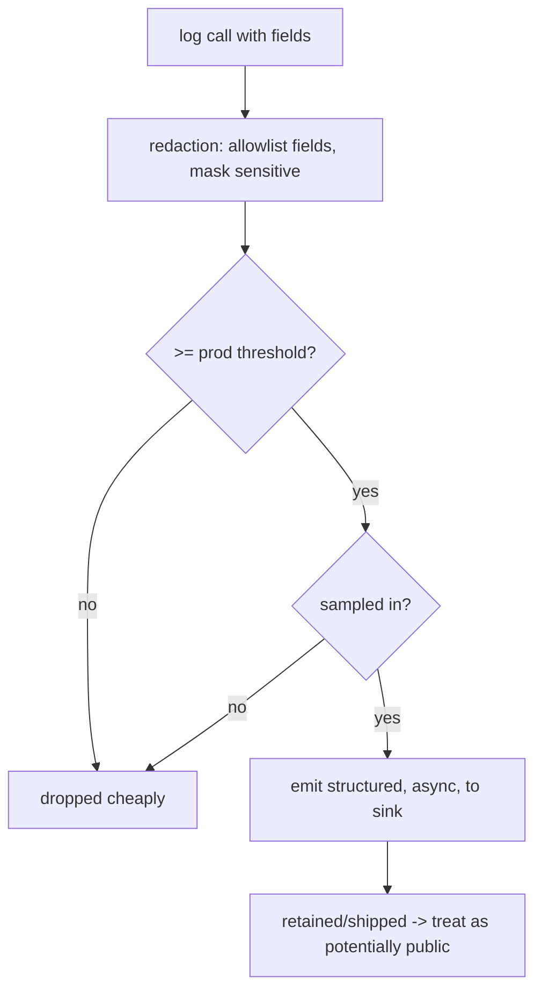

# Production Logging & Redaction

> In production, logging is a **liability as much as an asset**: logs frequently end up on servers, in crash reports, and in third-party tools, so **logging PII/secrets (tokens, passwords, emails, card/health data) is a security and compliance breach** (GDPR/PCI/HIPAA). The rules: **redact/omit sensitive fields** (allowlist what you log, don't blocklist), **raise the level threshold** (info/warning+), **sample** high-volume logs, keep logging **cheap and async**, and **never log request/response bodies or auth headers** verbatim. Treat every log line as potentially public.

## Introduction

This file covers making logging safe and sustainable in production: what you must never log, how to redact, sampling, performance, and the compliance stakes. It's where logging meets security ([Module 37](../37%20Security/README.md)) — the discipline that separates helpful telemetry from a data breach.

## Why this concept exists

Dev logging is verbose and freewheeling; production logging is shipped off-device to systems (and vendors) you don't fully control, retained, and searchable. A single `log('user $email token $token')` can leak credentials/PII into logs that persist for years — a reportable breach. Production logging must be deliberately minimal, redacted, and controlled.

## Real-world analogy

Production logs are like **security-camera footage that gets archived and shared with contractors**: useful for investigations, but if you record people's **PINs and ID cards** (PII/secrets) on tape, you've created a liability that outlives the incident. You **blur faces/mask numbers** (redact), **only keep relevant angles** (allowlist), and **don't record every second** in full (sample) — because the footage will be seen by others and kept for a long time.

## Problem Statement

Make your prod logs safe: ensure tokens/passwords/emails/PANs never appear, log only allowlisted non-sensitive fields, cut noise via threshold + sampling, keep logging off the critical path, and log request/response **metadata** (status, duration, endpoint) — never bodies/auth headers. You'll add redaction, an allowlist, and sampling to the logging facade.

## Internal Working



- **Never log** (hard rule): passwords, tokens/keys/secrets, full card numbers/CVV, government ids, health data, precise location, full emails/phones (unless required + consented), auth headers, request/response **bodies** with PII. These persist and are seen by others.
- **Redaction by allowlist (not blocklist)**: log only an **explicit set** of safe fields; mask/omit everything else. Allowlisting fails safe (a new PII field isn't logged by default); blocklisting fails open (you forget one). Mask partial values where useful (`****1234`), hash identifiers if you must correlate without exposing them.
- **Centralized redaction**: put redaction **in the logging facade** ([logger_package_and_setup.md](logger_package_and_setup.md)) so every log passes through it — not per call site. Redact known-sensitive keys and scrub values matching patterns (emails, long digit strings, JWTs) as a backstop.
- **Threshold + sampling**: prod filters at **info/warning+**; for high-volume events, **sample** (log 1-in-N or on error) to control cost/noise/PII exposure. Always log errors/warnings; sample debug/trace to zero in prod.
- **Performance**: logging must be **cheap + async** — don't block the UI/hot paths; guard expensive field construction behind the level check; batch remote shipping ([remote_logging_and_observability.md](remote_logging_and_observability.md)). Excessive logging is a real perf + battery + cost drain.
- **Networking logs**: log **metadata** (method, endpoint, status, duration, correlation id) — **never** bodies or `Authorization` headers ([Module 16](../16%20Networking/README.md)); redact query params with secrets/tokens.
- **Compliance**: GDPR/PCI/HIPAA/CCPA constrain what you may log/retain about users; document a **data-handling policy** for logs (what, why, retention). Treat logs as regulated data.
- **Retention/access**: minimize retention, restrict who can read prod logs; assume vendors/tools can see them.

## Memory Representation

Redaction transforms records before emission (masked/omitted fields). Sampling drops records probabilistically. Only allowlisted, safe fields reach the sink; nothing sensitive is retained.

## Compiler Behavior

Dev-only verbose logs stripped in release; redaction/sampling run at runtime in the prod facade.

## Runtime Behavior

Each prod log passes redaction → threshold → sampling → async emit. Below-threshold/sampled-out logs are dropped cheaply. Errors always emitted (+ reported to crash tooling — [Module 52](../52%20Monitoring/README.md)).

## Flutter Engine Behavior

Not applicable.

## Dart VM Behavior

Async emission keeps logging off the critical path; guarded construction avoids wasted work.

## Examples

```dart
// Redaction in the facade: ALLOWLIST safe fields; mask/scrub the rest
const _allowed = {'event', 'screen', 'durationMs', 'statusCode', 'endpoint', 'correlationId'};

Map<String, Object?> _redact(Map<String, Object?> fields) {
  final out = <String, Object?>{};
  for (final e in fields.entries) {
    if (!_allowed.contains(e.key)) continue;          // allowlist: drop unknown keys
    out[e.key] = _scrub(e.value);                     // backstop pattern scrub
  }
  return out;
}
Object? _scrub(Object? v) {
  final s = '$v';
  if (RegExp(r'[\w.+-]+@[\w-]+\.\w+').hasMatch(s)) return '[email]';  // mask emails
  if (RegExp(r'\b\d{12,19}\b').hasMatch(s)) return '[card]';          // mask PAN-like
  if (s.startsWith('eyJ')) return '[jwt]';                            // mask tokens
  return v;
}

// Sampling high-volume events (always keep errors)
bool _sampledIn(Level level, int oneInN, int counter) =>
    level.index >= Level.warning.index || counter % oneInN == 0;

// Networking: log METADATA only — never bodies or Authorization
void logHttp(String method, String endpoint, int status, int ms, String corrId) {
  logger.info('http', {'endpoint': endpoint, 'statusCode': status, 'durationMs': ms, 'correlationId': corrId});
  // NEVER: {'headers': req.headers, 'body': res.data}  // leaks tokens/PII
}
```

## Diagrams

```mermaid
flowchart LR
    Fields[fields] --> Allow[allowlist safe keys]
    Allow --> Mask[mask/scrub values (backstop)]
    Mask --> Thresh[threshold info+]
    Thresh --> Samp[sample high-volume]
    Samp --> Async[async emit -> sink]
```

## Common Mistakes

| Mistake | Why it's a breach/bug | Fix |
|---------|----------------------|-----|
| Logging tokens/passwords/PII | Security + compliance breach | Never log; redact/omit |
| Logging request/response bodies | Leaks PII/secrets | Log metadata only |
| Logging `Authorization` headers | Token leak | Redact headers |
| Blocklist redaction | Fails open (forget a field) | Allowlist safe fields |
| Verbose prod logging | Noise, cost, PII exposure, perf | Threshold + sampling |
| Synchronous/hot-path logging | Jank/battery | Async + guarded + batched |
| No retention/access policy | Compliance risk | Minimize retention, restrict access |

## Best Practices

- **Never log** secrets/PII (tokens, passwords, PAN/CVV, health, precise location, auth headers, PII bodies); treat every log line as **potentially public**.
- **Redact by allowlist** (log only explicit safe fields) with a **pattern-scrub backstop**, **centralized in the facade**; mask/hash where correlation is needed.
- Prod **threshold info/warning+** + **sample** high-volume logs (always keep errors); keep logging **cheap, async, batched**.
- Log **network metadata only** (never bodies/auth); follow **compliance** (GDPR/PCI/HIPAA) with a documented **retention/access** policy.

## Performance

Redaction/sampling/threshold keep prod logging lean; async + batching keep it off the critical path; guarded construction avoids wasted work. Over-logging costs CPU, battery, bandwidth, and vendor bills — sampling is the main lever.

## Advantages / Disadvantages

- **+** Safe, compliant, affordable production telemetry; incident-debuggable without leaking data; controlled volume/cost.
- **−** Requires disciplined redaction (allowlist upkeep), sampling can hide rare events, compliance overhead, less raw detail than dev.

## Interview Questions

1. **🟢 Why is logging PII/secrets in production dangerous?** — Logs are shipped, retained, and seen by systems/vendors you don't fully control; leaking tokens/PII is a security and compliance (GDPR/PCI/HIPAA) breach.
2. **🟢 What must you never log?** — Passwords, tokens/keys, full card numbers/CVV, health/gov ids, auth headers, and request/response bodies with PII.
3. **🟡 Why allowlist rather than blocklist fields?** — Allowlisting fails safe (new sensitive fields aren't logged by default); blocklisting fails open (you forget one).
4. **🟡 How do you log network calls safely?** — Metadata only (method, endpoint, status, duration, correlation id) — never bodies or `Authorization` headers.
5. **🟡 How do you control log volume/cost in prod?** — Raise the threshold (info/warning+) and sample high-volume events (always keeping errors), async + batched.
6. **🔴 Where should redaction live and why?** — Centralized in the logging facade, so every log passes through it — not scattered per call site (which you'll miss).
7. **🔴 How do you correlate a user without exposing them?** — Log a hashed/opaque id (or correlation id), never the raw email/phone/PII.

## Senior Engineer Tips

- Put redaction in the facade with an allowlist + a pattern-scrub backstop, and treat "does this log contain PII?" as a review checklist item — leaks happen one careless `log(user)` at a time.
- Never log request/response bodies or auth headers, even in dev habits that leak into prod; log metadata + a correlation id instead.
- Sample aggressively in prod (keep errors, sample the rest); the cost and PII exposure of full-volume logging sneaks up on you at scale.

## Architect Perspective

Production logging is a security/compliance surface as much as an observability tool. Centralizing redaction (allowlist + scrub), threshold, and sampling in the logging facade makes safety the default — no call site can leak — while keeping telemetry useful and affordable. This is the logging counterpart to the untrusted-client/least-data discipline of security, and it's what makes remote shipping and crash correlation safe to enable ([Module 37](../37%20Security/README.md), [remote_logging_and_observability.md](remote_logging_and_observability.md), [Module 52](../52%20Monitoring/README.md)).

## Summary

- Treat prod logs as potentially public: never log secrets/PII/bodies/auth headers; redact by allowlist (+ scrub backstop), centralized in the facade.
- Threshold info/warning+ and sample high-volume logs (keep errors); log network metadata only; keep logging cheap/async/batched.
- Follow compliance (GDPR/PCI/HIPAA) with minimal retention + restricted access.

## Revision Notes

- Never log: passwords/tokens/keys, PAN/CVV, health/gov ids, precise location, auth headers, PII bodies; treat logs as public.
- Redact by allowlist (fail safe) + pattern scrub (email/PAN/JWT) centralized in facade; mask/hash for correlation.
- Prod threshold info/warning+; sample high-volume (keep errors); async/batched/guarded; network metadata only; compliance + retention/access policy.

## Practice Questions

1. Why is allowlist redaction safer than blocklist?
2. What can and can't you log about a network request?
3. How do threshold + sampling protect cost and privacy?

## Coding Questions

1. Add allowlist + pattern-scrub redaction to the logging facade.
2. Implement level-threshold + sampling for prod (always keep errors).
3. Write a safe HTTP logger (metadata only, no bodies/auth).

## Mini Project

**Safe production logging (Flutter):** Extend the logging facade with centralized redaction (allowlist safe fields + scrub emails/PAN/JWT), a prod info/warning+ threshold, sampling of high-volume events (always keeping errors), async emission, and a network logger that records metadata only. Verify no PII/secrets/bodies/auth headers appear. Acceptance: redaction allowlist + scrub in the facade; no secrets/PII/bodies/auth logged; threshold + sampling applied (errors always kept); async/cheap; network metadata only; retention/compliance noted.
