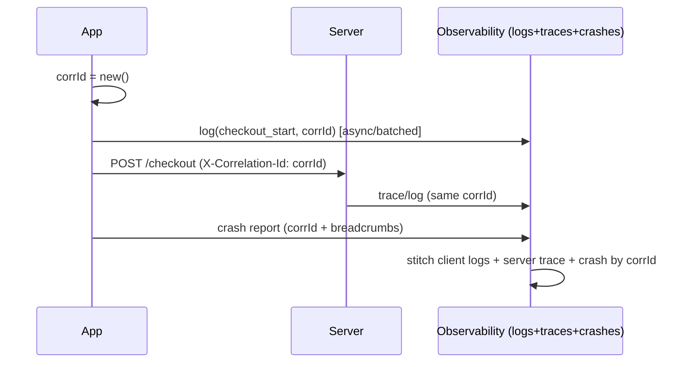

# Remote Logging & Observability

> On-device logs are invisible in production — so ship logs/events to a **remote sink** (Crashlytics/Sentry breadcrumbs, a logging backend, or your own endpoint) and turn them into **observability**: attach a **correlation/trace id** to tie together the logs, crash reports, and backend traces for a single user action; record **breadcrumbs** leading up to errors; and add **context** (session, app version, screen). Ship **async + batched** (never block the UI), respect **redaction** ([production_logging_and_redaction.md](production_logging_and_redaction.md)), and integrate with your **crash reporter** so a crash arrives with the story of what led to it.

## Introduction

This file elevates logging from "text on a device" to **observability**: remote sinks, crash-report integration, correlation/trace ids, breadcrumbs, and context — so you can diagnose production incidents across client and server. It's the remote/observability layer over the facade ([logger_package_and_setup.md](logger_package_and_setup.md)) and pairs with monitoring ([Module 52](../52%20Monitoring/README.md)).

## Why this concept exists

A crash report saying "null in X" is far less useful than one preceded by "user tapped checkout → payment API 500 → retry → crash," correlated with the exact backend request. Observability — logs + traces + context, correlated by ids — is how you reconstruct and fix production incidents you can't reproduce. Remote shipping makes on-device logs visible; correlation makes them actionable.

## Real-world analogy

Local logs are a **black box that stays in the wreckage** — useless if you can't reach it. Remote logging **transmits the flight data live** to ground control. **Breadcrumbs** are the sequence of events before the incident; a **correlation id** is the **flight number** that lets ground control line up the cockpit recorder (client logs), the tower's records (backend traces), and the incident report (crash) for the *same* flight.

## Problem Statement

Make production incidents diagnosable: ship logs/breadcrumbs to a remote sink + crash reporter, tag every log/request/crash for one user action with a shared **correlation id** (so client + server line up), attach context (version/session/screen), and do it **async/batched/redacted** without blocking the UI. You'll add a remote output, correlation ids, and crash integration.

## Internal Working

```mermaid
flowchart TD
    Log[log/event (redacted)] --> Buffer[async buffer/batch]
    Buffer --> Remote[remote sink: logging backend / Sentry / custom endpoint]
    Log --> Crumbs[breadcrumbs -> crash reporter]
    Action[user action] --> CorrId[correlation/trace id]
    CorrId --> ClientLogs[client logs] & Request[API request header] & Crash[crash report]
    Request --> ServerTrace[backend trace w/ same id]
    Crash & ServerTrace & ClientLogs --> Diagnose[correlated incident view]
```

- **Remote sink**: a custom `LogOutput` that **buffers + batches** records and ships them **async** to a backend (your endpoint, a logging service) or into a crash tool as **breadcrumbs**. Never block the UI; drop/limit on backpressure; retry with backoff; respect offline (queue).
- **Crash-report integration** ([Module 52](../52%20Monitoring/README.md)): forward logs as **breadcrumbs** so a crash arrives with the trail of events before it; report errors/fatals with the current context. The logging facade and crash reporter share one pipeline.
- **Correlation/trace id**: generate an id per **user action/request** (or per session), **attach it to every log**, **send it as a request header** (so the backend logs/traces carry the same id), and **include it in crash reports**. This is what lets you **stitch client logs + server traces + crash** for one action — the core of distributed tracing.
- **Context/breadcrumbs**: attach **app version, build, session id, screen/route, user (opaque id), device** to logs/reports; record breadcrumbs (navigation, taps, network results) so errors have a **narrative**.
- **Structured + redacted**: ship **structured** records (JSON) with **redaction applied first** ([production_logging_and_redaction.md](production_logging_and_redaction.md)) — remote logs are the *most* exposed, so PII discipline is non-negotiable.
- **Sampling/volume**: sample high-volume logs, cap batch size/frequency, and prioritize errors — control cost and bandwidth ([production_logging_and_redaction.md](production_logging_and_redaction.md)).
- **Observability trio**: logs (events), **traces** (correlated spans across client/server via the id), and metrics/crashes — together they answer "what happened, where, and why" ([Module 52](../52%20Monitoring/README.md)).

## Memory Representation

A bounded async buffer holds pending records until flushed/batched to the sink (dropped/capped on overflow). Correlation ids are short strings threaded through logs/requests/crash context. Breadcrumbs are a rolling buffer in the crash tool.

## Compiler Behavior

Not applicable.

## Runtime Behavior

Logs are buffered and shipped async/batched; correlation ids flow client→server via headers; crashes arrive with breadcrumbs + context + id. Offline logs queue and flush on reconnect; backpressure drops lowest-priority records.

## Flutter Engine Behavior

Not applicable; remote shipping is network I/O.

## Dart VM Behavior

Async batching keeps shipping off the critical path; heavy serialization can be minimized/offloaded.

## Examples

```dart
// Correlation id per user action, threaded through logs + request + crash
final corrId = _newCorrelationId();            // e.g., per checkout tap
logger.info('checkout_start', {'correlationId': corrId, 'screen': 'cart'});
final res = await dio.post('/checkout',
    options: Options(headers: {'X-Correlation-Id': corrId}));  // server logs same id
logger.info('checkout_result', {'correlationId': corrId, 'statusCode': res.statusCode});
// On crash: crashReporter.setCustomKey('correlationId', corrId);  // stitch it all together
```

```dart
// Remote LogOutput: async, batched, redacted, offline-queued
class RemoteLogOutput extends LogOutput {
  final _buffer = <Map<String, Object?>>[];
  @override
  void output(OutputEvent event) {
    _buffer.add(_redact(_toStructured(event)));   // redact BEFORE shipping
    if (_buffer.length >= 20) _flush();            // batch
  }
  Future<void> _flush() async {
    final batch = List.of(_buffer); _buffer.clear();
    try { await api.postLogs(batch); }             // async; retry/backoff; queue if offline
    catch (_) { /* re-queue or drop on backpressure */ }
  }
}

// Breadcrumbs feed the crash reporter (Module 52)
void breadcrumb(String event, Map<String, Object?> fields) {
  logger.debug(event, fields);
  crashReporter.addBreadcrumb(event, _redact(fields)); // trail before a crash
}
```

## Diagrams



## Common Mistakes

| Mistake | Why | Fix |
|---------|-----|-----|
| Synchronous remote shipping | Blocks UI/jank | Async + batched buffer |
| No correlation id | Can't stitch client+server+crash | Thread an id through logs/requests/crash |
| Shipping unredacted logs | Worst-case PII leak (remote/retained) | Redact BEFORE shipping |
| No breadcrumbs/context | Crashes lack narrative | Breadcrumbs + version/session/screen |
| Unbounded buffer | Memory/backpressure issues | Bounded buffer, drop/cap on overflow |
| Ignoring offline | Logs lost | Queue + flush on reconnect |
| No sampling/caps | Cost/bandwidth blowout | Sample + batch caps (keep errors) |

## Best Practices

- Ship logs **async + batched** to a **remote sink** and integrate with the **crash reporter** (breadcrumbs + context); **bound** the buffer, **queue offline**, retry with backoff.
- Thread a **correlation/trace id** through **logs → request headers → crash reports** so client logs, server traces, and crashes stitch together per action.
- Attach **context** (version/build/session/screen/opaque user) and **breadcrumbs** so errors have a narrative; ship **structured + redacted** records.
- **Sample + cap** volume (keep errors); make it part of the **observability trio** (logs/traces/crashes) ([Module 52](../52%20Monitoring/README.md)); apply **redaction before shipping**.

## Performance

Async batching + caps keep remote logging off the critical path and control bandwidth/cost. A bounded buffer prevents memory growth; offline queuing avoids loss without blocking. Sampling is the main cost lever. Correlation ids are tiny.

## Advantages / Disadvantages

- **+** Production visibility, correlated client+server+crash diagnosis, breadcrumbs/context, faster incident resolution.
- **−** Infra + cost, PII risk if unredacted, buffering/backpressure/offline complexity, sampling can miss rare events.

## Interview Questions

1. **🟢 Why ship logs remotely?** — On-device logs are invisible in production; remote shipping (+ crash breadcrumbs) makes production behavior diagnosable.
2. **🟢 What is a correlation/trace id for?** — To stitch together client logs, backend traces, and the crash report for a single user action (thread it through logs, request headers, and crash context).
3. **🟡 How should remote shipping be done to avoid jank?** — Async + batched via a bounded buffer, with offline queuing and backoff retry — never synchronously on the UI thread.
4. **🟡 What are breadcrumbs and why do they matter?** — The trail of events (navigation/taps/network) before an error, giving crash reports a narrative to reconstruct the incident.
5. **🟡 What must you do before shipping logs remotely?** — Redact PII/secrets — remote/retained logs are the most exposed surface.
6. **🔴 How do logs, traces, and crashes fit into observability?** — Together (correlated by ids) they answer what happened (logs), where across systems (traces), and why (crashes + context) — the observability trio.
7. **🔴 How do you control remote-logging cost and volume?** — Sample high-volume logs (keep errors), cap batch size/frequency, and bound the buffer.

## Senior Engineer Tips

- Introduce a correlation id per user action and propagate it to the backend header + crash context from day one; retrofitting cross-system correlation later is painful, and it's the single biggest debugging multiplier.
- Ship async/batched with a bounded buffer and offline queue, and redact before shipping; the two classic failures are UI jank from sync shipping and PII leaked into a remote store.
- Treat logs, traces, and crashes as one correlated system (breadcrumbs + context + id), not separate tools — that's what turns "it crashed" into "here's exactly what happened."

## Architect Perspective

Remote logging + observability is where logging becomes an operational capability: correlated, contextual, redacted telemetry shipped safely and stitched across client and server. Built on the facade (structured + redacted) and integrated with crash reporting, it closes the loop from error handling ([Module 38](../38%20Error%20Handling/README.md)) to production diagnosis — the observability backbone that lets teams find and fix what they can't reproduce ([Module 52](../52%20Monitoring/README.md), [production_logging_and_redaction.md](production_logging_and_redaction.md)).

## Summary

- Ship logs async/batched to a remote sink + crash reporter (breadcrumbs, context), bounded + offline-queued + redacted.
- Thread a correlation/trace id through logs → request headers → crash reports to stitch client + server + crash per action.
- Add context/breadcrumbs, sample/cap volume; logs + traces + crashes = the observability trio.

## Revision Notes

- Remote `LogOutput`: async, batched, bounded buffer, offline queue, backoff; feed crash reporter as breadcrumbs; redact BEFORE shipping.
- Correlation/trace id per action → logs + request header (`X-Correlation-Id`) + crash context → stitch client+server+crash.
- Context (version/session/screen/opaque user) + breadcrumbs; sample/cap (keep errors); observability trio (logs/traces/crashes — Module 52).

## Practice Questions

1. How does a correlation id help diagnose an incident across client and server?
2. Why must remote shipping be async/batched and redacted?
3. What do breadcrumbs add to a crash report?

## Coding Questions

1. Implement a batched, bounded, offline-queued `RemoteLogOutput` (redacted).
2. Thread a correlation id through a log, a request header, and crash context.
3. Feed breadcrumbs + context to a (stub) crash reporter.

## Mini Project

**Observability pipeline (Flutter):** Extend the logging facade with a `RemoteLogOutput` (async, batched, bounded, offline-queued, redacted), integrate a (stub) crash reporter with breadcrumbs + context (version/session/screen), and thread a correlation id through logs → request headers → crash context for a user action. Add sampling/caps. Acceptance: logs ship async/batched (no UI block) + redacted; correlation id stitches client logs + request + crash; breadcrumbs + context attached; offline queued; volume sampled/capped (errors kept).
