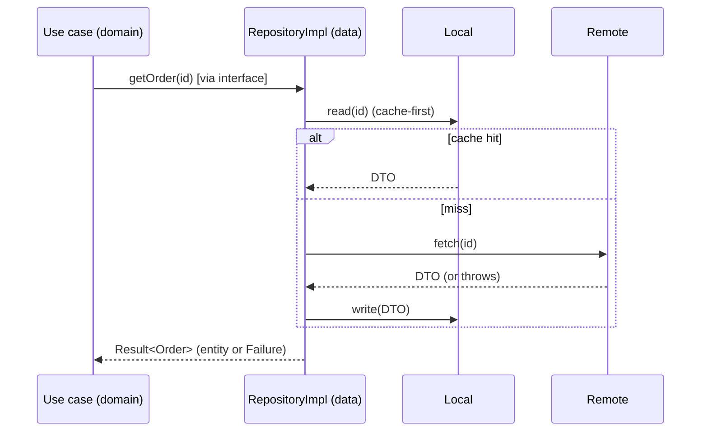

# The Data Layer (Repositories, Data Sources, DTOs, Mapping)

> The data layer **implements the domain's repository interfaces** using concrete details: **data sources** (remote/`dio`, local/`sqflite`/secure storage), **DTOs** (data-transfer objects that mirror the wire/DB shape and handle JSON/columns), and **mappers** (DTO ↔ domain entity) — coordinating sources (cache-first, offline fallback), converting exceptions into typed **`Result`/`Failure`s** at the boundary, and returning **entities** (never DTOs) upward. It's the only layer allowed to know about HTTP, SQL, and JSON; it satisfies the domain's needs without the domain ever knowing *how*.

## Introduction

This file covers the outward-facing layer that turns the domain's abstract needs into real I/O: repository implementations, data sources, DTOs vs entities, mapping, source coordination, and error conversion. It's the concrete side of the interfaces defined in the domain ([02_domain_layer.md](02_domain_layer.md)).

## Why this concept exists

The domain declares *what* it needs (interfaces) but must stay pure. Something has to actually fetch/persist data — that's the data layer. Keeping DTOs and I/O here (behind the interface) means the domain is insulated from API/DB shape changes: rename a JSON field or swap `sqflite` for Drift, and only the data layer's mappers/sources change. It's the Repository pattern ([Module 05](../05%20Design%20Patterns/README.md)) realizing Dependency Inversion.

## Real-world analogy

The data layer is the **warehouse + shipping department**: the domain (store) orders "one Order entity"; the department knows the messy details — which supplier (remote API), which shelf (local DB), the packing format (DTO/JSON) — and **unpacks it into the clean product** (entity) the store expects. The store never sees the packing slips (DTOs) or supplier contracts (HTTP); it just receives the product.

## Problem Statement

Implement `OrderRepository`: fetch from a remote API (DTO ↔ entity), cache locally, serve cache-first with offline fallback, and convert network/DB exceptions into typed `Failure`s — returning `Result<Order>` (entities) to the domain. You'll build data sources, DTOs, mappers, and the repository impl.

## Internal Working

```mermaid
flowchart TD
    Repo[RepositoryImpl (implements domain interface)] --> Coord[coordinate sources: cache-first / fallback]
    Coord --> Remote[RemoteDataSource (dio): returns DTOs]
    Coord --> Local[LocalDataSource (sqflite/secure): DTOs/rows]
    Remote & Local --> DTO[DTOs: JSON/columns <-> fields]
    DTO --> Map[mapper: DTO -> Entity]
    Repo --> Convert[catch exceptions -> typed Failure]
    Map & Convert --> Result[return Result<Entity> upward]
```

- **Repository implementation**: implements the **domain interface**; it's the coordinator — decides **cache-first vs network-first**, **offline fallback**, write-through, and combines sources. Returns **`Result<Entity>`**; the domain never sees sources/DTOs.
- **Data sources** (single-responsibility): **RemoteDataSource** (talks `dio`/GraphQL — [Module 16](../16%20Networking/README.md)) and **LocalDataSource** (`sqflite`/Drift/Hive/secure storage — [Module 20](../20%20Database/README.md)/[Module 15](../15%20Local%20Storage/README.md)). Each returns **DTOs/raw**; they don't coordinate or map to entities (the repo does).
- **DTOs (data transfer objects)**: classes mirroring the **wire/DB shape** with `fromJson`/`toJson`/`fromRow` — they absorb API/DB quirks (naming, nullability, nesting). **Keep DTOs separate from entities**: the entity is the clean domain shape; the DTO is the serialization shape. Coupling them makes the domain fragile to API changes.
- **Mapping (DTO ↔ Entity)**: explicit **mappers** convert at the boundary (`dto.toEntity()`, `entity.toDto()`). This is where wire/DB representation → domain representation; the domain gets only entities.
- **Error conversion at the boundary**: the data layer is where I/O **throws** (`DioException`, `SocketException`, DB errors) — **catch here** and convert to **typed `Failure`s** (`NetworkFailure`, `NotFoundFailure`, `CacheFailure`), returning `Result` ([Module 38](../38%20Error%20Handling/README.md)). Domain/UI stay `try/catch`-free.
- **Source coordination patterns**: cache-first (return cache, refresh in background), network-first with cache fallback, write-through (write local + remote), offline outbox ([Module 19](../19%20Offline%20First/README.md)). The repo owns this policy.
- **Swappability**: because the repo implements a domain interface, you can swap remote↔GraphQL, `sqflite`↔Drive, or add caching, without touching the domain.

## Memory Representation

DTOs hold serialization-shaped data (may differ from entities — extra/nested/nullable fields); entities are the clean domain shape. Mappers produce entities from DTOs. The repo may hold source references + cache handles.

## Compiler Behavior

The data layer imports frameworks (`dio`/`sqflite`) freely — it's the outer layer. It depends **inward** on the domain interface it implements; the domain doesn't import it.

## Runtime Behavior

The repo coordinates async source calls (cache-first/fallback), maps DTOs→entities, and converts exceptions→`Failure`. Cache hits are fast/offline; misses hit the network; failures become typed results.

## Flutter Engine Behavior

None directly (pure Dart + plugins); networking/DB via their plugins.

## Dart VM Behavior

Async I/O on the I/O pool; heavy mapping/parsing can be isolate-offloaded for large payloads ([Module 02](../02%20Advanced%20Dart/04_isolates.md)).

## Examples

```dart
// DTO — mirrors the API shape (JSON quirks live here), separate from the entity
class OrderDto {
  final String id; final List<Map<String, dynamic>> line_items;
  OrderDto(this.id, this.line_items);
  factory OrderDto.fromJson(Map<String, dynamic> j) =>
      OrderDto(j['id'] as String, (j['line_items'] as List).cast<Map<String, dynamic>>());
  Order toEntity() => Order(id, line_items                    // MAP DTO -> Entity
      .map((m) => LineItem(m['product_id'], m['qty'], m['unit_price_cents']))
      .toList());
}

// Data sources — single responsibility, return DTOs/raw
abstract class OrderRemote { Future<OrderDto> fetch(String id); }   // dio inside impl
abstract class OrderLocal { Future<OrderDto?> read(String id); Future<void> write(OrderDto d); }

// Repository impl — coordinate, map, convert errors -> Result<Entity>
class OrderRepositoryImpl implements OrderRepository {          // domain interface
  final OrderRemote remote; final OrderLocal local;
  OrderRepositoryImpl(this.remote, this.local);

  @override
  Future<Result<Order>> getOrder(String id) async {
    final cached = await local.read(id);                       // cache-first
    if (cached != null) return Success(cached.toEntity());
    try {
      final dto = await remote.fetch(id);                      // network
      await local.write(dto);                                  // write-through cache
      return Success(dto.toEntity());                          // map -> entity
    } on DioException catch (e) {
      if (e.response?.statusCode == 404) return Failure(NotFoundFailure('order'));
      return Failure(NetworkFailure());                        // convert exception -> Failure
    }
  }
}
```

## Diagrams



## Common Mistakes

| Mistake | Why | Fix |
|---------|-----|-----|
| Returning DTOs to the domain | Leaks wire/DB shape inward | Map DTO→entity; return entities |
| One class = entity + DTO | API change breaks domain | Separate DTO from entity |
| Letting exceptions escape to domain/UI | Breaks `Result`/purity | Convert to `Failure` at the boundary |
| Data sources coordinating/mapping | Muddled responsibilities | Sources return raw; repo coordinates/maps |
| Business logic in the repository | Belongs in domain | Keep repo to coordination/mapping/errors |
| No cache/offline policy | Poor UX/perf | Repo owns cache-first/fallback |
| Repo depends on concrete domain | Wrong direction | Repo implements the domain interface |

## Best Practices

- Repository impls **implement domain interfaces**, **coordinate sources** (cache-first/fallback/write-through), **map DTO↔entity**, **convert exceptions → typed `Failure`s**, and return **`Result<Entity>`**.
- Keep **DTOs separate from entities** (DTO = wire/DB shape); keep **data sources single-responsibility** (return raw/DTOs, no coordination/mapping).
- Put **no business logic** in the data layer (that's the domain) — only I/O, mapping, and source-policy; **offload heavy parsing** to isolates.
- Make sources **swappable** (remote↔GraphQL, `sqflite`↔Drift) behind the interface; own **offline/caching** policy here ([Module 19](../19%20Offline%20First/README.md)).

## Performance

Cache-first serves fast/offline; write-through keeps cache warm; isolate heavy JSON/DB mapping for large payloads. The repo's source-policy is the main perf lever (avoid redundant network). Mapping overhead is negligible vs I/O.

## Advantages / Disadvantages

- **+** Domain insulated from API/DB changes, swappable sources, centralized caching/offline/error-conversion, testable (fake sources).
- **−** DTO/entity duplication + mapping boilerplate, more classes, discipline to keep logic out and errors converted.

## Interview Questions

1. **🟢 What does the data layer do?** — Implements domain repository interfaces using concrete data sources, mapping DTOs↔entities and converting exceptions to typed `Result`/`Failure`.
2. **🟢 Why keep DTOs separate from entities?** — DTOs mirror the volatile wire/DB shape; separating them means API/DB changes don't ripple into the domain.
3. **🟡 Where are exceptions converted to failures, and why there?** — At the data boundary (repo/sources), so the domain/UI stay `try/catch`-free and work with `Result`.
4. **🟡 What's the difference between a data source and a repository?** — Data sources do single-responsibility I/O (return raw/DTOs); the repository coordinates sources, maps to entities, and applies cache/offline policy.
5. **🟡 Why does the repo implement the domain interface (not vice versa)?** — To keep dependencies pointing inward (DIP) — the domain defines the need, the data layer satisfies it.
6. **🔴 How does this layer enable swapping the backend/DB?** — Because it hides sources behind the domain interface, swapping remote/local implementations doesn't touch the domain.
7. **🔴 Should the repository contain business rules?** — No — only coordination/mapping/error-conversion/caching; business rules belong in the domain (entities/use cases).

## Senior Engineer Tips

- Always return entities (never DTOs) from repositories and convert exceptions to `Failure` at the boundary — those two rules keep the domain pure and the UI simple.
- Keep DTOs and entities separate even when they look identical today; the day the API adds a field or renames one, you'll be glad the domain didn't move.
- Let the repository own cache/offline policy and keep data sources dumb (raw I/O); muddling coordination into sources is where data layers rot.

## Architect Perspective

The data layer is the adapter between the pure domain and the messy outside world — the Repository pattern realizing Dependency Inversion. By hiding sources/DTOs/errors behind domain interfaces and returning entities/`Result`, it makes the backend/DB/caching a swappable detail and keeps the domain stable and testable. It's where offline-first, caching, and error-conversion policies live, feeding clean results inward ([02_domain_layer.md](02_domain_layer.md), [Module 19](../19%20Offline%20First/README.md), [Module 38](../38%20Error%20Handling/README.md)).

## Summary

- Data layer implements domain interfaces: coordinate sources (cache-first/fallback), map DTO↔entity, convert exceptions→typed `Failure`, return `Result<Entity>`.
- DTOs (wire/DB shape) separate from entities; data sources single-responsibility (raw I/O); no business logic here.
- Swappable sources behind the interface; owns caching/offline; heavy parsing → isolate.

## Revision Notes

- RepositoryImpl implements domain interface; coordinates Remote/Local sources; maps DTO→entity; converts exceptions→`Failure`; returns `Result<Entity>`.
- DTO ≠ entity (DTO = JSON/DB shape, `fromJson`/`toEntity`); sources return raw/DTOs (no coordination); no business logic in data layer.
- Boundary = error conversion + mapping; cache-first/fallback/write-through/outbox here; swappable behind interface; isolate heavy parse.

## Practice Questions

1. Why return entities, not DTOs, from a repository?
2. Where and why do you convert exceptions to failures?
3. What's the division of labor between data sources and the repository?

## Coding Questions

1. Implement a repository over remote + local sources with DTO→entity mapping.
2. Add cache-first with write-through and offline fallback.
3. Convert `DioException`/DB errors into typed `Failure`s returning `Result`.

## Mini Project

**Data layer slice (Flutter):** Implement a domain repository interface with a `RepositoryImpl` coordinating a remote (`dio`) and local (`sqflite`/secure) source, separate DTOs with `fromJson`/`toEntity`, cache-first + write-through + offline fallback, and exception→`Failure` conversion returning `Result<Entity>`. Unit-test with fake sources. Acceptance: implements the domain interface (dependency inward); DTOs separate from entities + mapped at boundary; exceptions converted to typed failures; cache/offline policy in the repo; no business logic in data; sources single-responsibility; unit-tested with fakes.
