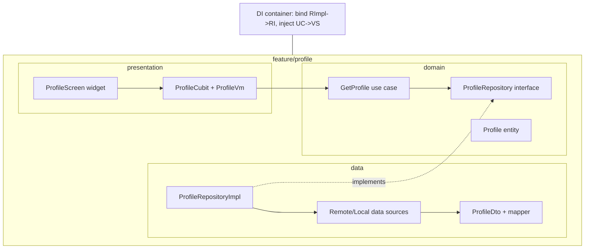
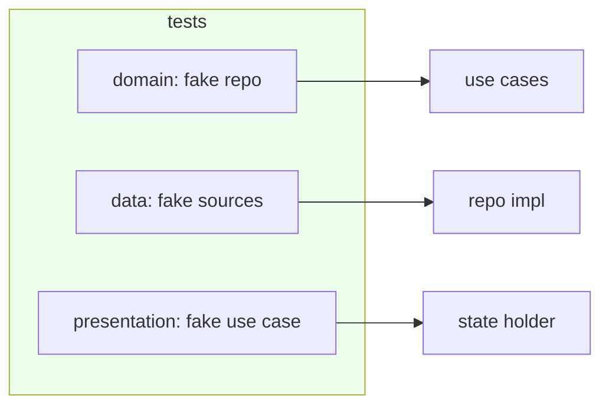

# Clean Architecture Integration (Capstone: A Full Vertical Slice)

> Put it together as a **vertical slice per feature**: `domain/` (entities, use cases, repository interfaces) + `data/` (DTOs, data sources, repository impls) + `presentation/` (state holders, view models, widgets), wired by **DI** that binds concrete data impls to domain interfaces and injects use cases into state holders — so a request flows **widget → state holder → use case → repository interface → impl → data source**, and every layer is **unit-testable in isolation** with fakes. Organize **by feature, not by layer-across-the-app**, and **right-size** the ceremony to the app's complexity.

## Introduction

This module capstone assembles the domain, data, and presentation layers into one working, testable feature slice, wired by DI, with an honest tradeoff discussion. It shows the folder structure, the wiring, the end-to-end flow, and how to test each layer — the practical payoff of the dependency rule.

## Why this concept exists

Understanding layers individually isn't enough; the value appears when they compose into a slice where dependencies point inward, DI supplies details, and each layer is independently testable. Organizing **by feature** (not global `data/`/`domain/` folders) keeps related code together and slices independently evolvable — the bridge to feature-first/modular architecture ([Module 44](../44%20Feature%20First%20Architecture/README.md)/[Module 45](../45%20Modular%20Architecture/README.md)).

## Real-world analogy

A vertical slice is a **fully-staffed department for one product line**: it has its own strategy (domain), suppliers/warehouse (data), and storefront (presentation), plus a **switchboard (DI)** connecting them. You can inspect/replace any part (test a layer with a stand-in) without shutting the company, and each department is organized around *its product*, not around "all strategy teams in one building."

## Internal Working



- **Folder structure (feature-first)**: group by **feature**, each with `domain/`, `data/`, `presentation/` subfolders. Shared/cross-cutting (core `Result`, DI, theming) lives in a `core/`/`shared/` module. This keeps a slice cohesive and independently evolvable ([Module 44](../44%20Feature%20First%20Architecture/README.md)).
- **DI wiring** ([Module 14](../14%20Dependency%20Injection/README.md)): register data sources → repository impl **bound to the domain interface** → use cases → state holder. Presentation gets **use cases** (not repos/sources); the domain interface is the seam. `get_it`/`injectable`/`riverpod` providers.
- **Request flow (runtime)**: widget event → state holder → **use case** → **repository interface** → **impl** (coordinate sources, map DTO→entity, convert errors → `Result`) → back up → state holder maps entity→view model → widget renders. **Dependencies** (compile-time) point inward throughout.
- **Testing per layer** (the payoff — [Module 49](../49%20Testing/README.md)):
  - **Domain**: use cases with **fake repositories** (pure Dart, fastest).
  - **Data**: repository impl with **fake data sources** (mapping/coordination/error-conversion).
  - **Presentation**: state holder with **fake use cases** (state-sequence); widget tests per state.
  - Each isolated, no device/network needed until integration tests.
- **Tradeoffs / right-sizing (be honest)**: this structure shines for **complex, long-lived, team** apps (testability, swap details, parallel work). For **small/prototype** apps it's **over-engineering** — collapse layers (e.g., skip use cases, repo returns directly) and grow into it. Avoid **anemic use cases** (pure pass-throughs) and **ceremony without payoff**.
- **Consistency**: one slice's structure is the template for all — predictable navigation, onboarding, and review.

## Memory Representation

At runtime: the DI container holds singletons/factories; a slice's objects (sources, repo, use cases, state holder) are wired per the graph. Compile-time: the source-dependency graph is strictly inward.

## Compiler Behavior

Domain compiles pure (no framework); data/presentation import frameworks but depend inward on domain interfaces/use cases. Import boundaries can be linted per feature.

## Runtime Behavior

DI resolves the graph on startup/first use; requests flow outward→inward and results inward→outward; failures surface as `Result`→view state. Swapping a bound implementation (e.g., a fake in tests) changes behavior without touching callers.

## Flutter Engine Behavior

Only presentation touches the engine; domain/data are plain Dart, so most tests run without the widget binding.

## Dart VM Behavior

Domain/data/state-holder tests are fast pure-Dart; only widget tests use the Flutter test binding.

## Examples

```dart
// DI wiring (get_it): bind impl -> domain interface; inject use case -> state holder
final getIt = GetIt.instance;
void registerProfileFeature() {
  getIt.registerLazySingleton<ProfileRemote>(() => ProfileRemoteImpl(getIt()));   // data source
  getIt.registerLazySingleton<ProfileLocal>(() => ProfileLocalImpl(getIt()));
  getIt.registerLazySingleton<ProfileRepository>(                                  // interface <- impl
      () => ProfileRepositoryImpl(getIt(), getIt()));
  getIt.registerFactory(() => GetProfile(getIt<ProfileRepository>()));             // use case
  getIt.registerFactory(() => ProfileCubit(getIt<GetProfile>()));                  // state holder
}
// Presentation depends on GetProfile only; never on ProfileRepositoryImpl/sources.
```

```dart
// Per-layer tests — each layer isolated with fakes, no device
test('use case: maps repo result', () async {
  final uc = GetProfile(FakeRepo(Success(Profile('1', 'Ada'))));
  expect(await uc('1'), isA<Success>());
});
test('repo: converts 404 -> NotFoundFailure', () async {
  final repo = ProfileRepositoryImpl(FakeRemote(throws404: true), FakeLocal());
  expect(await repo.getProfile('x'), isA<Failure>());
});
blocTest<ProfileCubit, ProfileState>('cubit: loading -> data',
  build: () => ProfileCubit(FakeGetProfile(Success(Profile('1','Ada')))),
  act: (c) => c.load('1'),
  expect: () => [isA<ProfileLoading>(), isA<ProfileData>()]);
```

## Diagrams



## Common Mistakes

| Mistake | Why | Fix |
|---------|-----|-----|
| Organizing by layer across the whole app | Slices tangle; poor cohesion | Feature-first (domain/data/presentation per feature) |
| Presentation depending on data/impl | Violates dependency rule | Inject use cases; bind impl→interface in DI |
| Anemic pass-through use cases | Ceremony without value | Add real orchestration or collapse layers |
| Full ceremony on a tiny app | Over-engineering | Right-size; grow into it |
| Skipping per-layer tests | Loses the main payoff | Test each layer with fakes |
| Inconsistent slice structure | Hard to navigate/onboard | One template for all features |
| Business logic in data/presentation | Untestable, tangled | Rules in domain only |

## Best Practices

- Organize **by feature** (each with `domain/`/`data/`/`presentation/`) + a shared `core/`; keep the **slice structure consistent** across features.
- **Wire via DI**: bind data impls to **domain interfaces**, inject **use cases** into state holders; presentation never sees repos/sources.
- **Unit-test each layer in isolation** with fakes (domain/data pure Dart; presentation with fake use cases) — the concrete payoff of the dependency rule.
- **Right-size** the ceremony to complexity (collapse layers for simple apps; avoid anemic use cases); keep **business rules in the domain** only.

## Performance

No runtime overhead beyond negligible DI/indirection. The payoff is engineering velocity: fast isolated tests, safe swaps, parallel team work. Right-sizing avoids paying boilerplate cost where it doesn't return value.

## Advantages / Disadvantages

- **+** Fully testable slices (per-layer, no device), swappable details, feature cohesion, team-scalable, consistent + evolvable.
- **−** Boilerplate/mapping/DI wiring, more files, over-engineering risk on small apps, discipline to keep boundaries clean.

## Interview Questions

1. **🟢 How do you organize a Clean Architecture Flutter app?** — By feature (each with domain/data/presentation) + a shared core, wired via DI — not global layer folders.
2. **🟢 What does DI bind in a slice?** — Data impls to domain repository interfaces, and use cases into state holders — so presentation depends only on the domain.
3. **🟡 Trace a request through the layers.** — Widget event → state holder → use case → repository interface → impl (coordinate/map/convert) → `Result` back → state holder maps to view model → widget renders.
4. **🟡 How is each layer tested in isolation?** — Domain with fake repos, data with fake sources, presentation with fake use cases — mostly pure Dart, no device.
5. **🟡 Why feature-first over layer-first folders?** — Cohesion and independent evolvability of slices; the bridge to feature-first/modular architecture.
6. **🔴 When is this structure over-engineering, and what do you do?** — For small/short-lived apps; collapse layers (skip use cases, repo returns directly) and grow into it — right-size to complexity.
7. **🔴 What's an anemic use case and why avoid it?** — A pure pass-through with no orchestration/rules — ceremony without value; add real logic or remove the layer.

## Senior Engineer Tips

- Build one exemplary slice end-to-end (domain→data→presentation + DI + per-layer tests) and use it as the template; consistency is what makes a Clean codebase navigable and onboardable.
- Bind implementations to interfaces in DI and inject use cases into state holders; if presentation can see a repository impl or data source, the wiring leaked.
- Be ruthless about right-sizing: collapse layers for simple features and expand for complex ones — the goal is testable, evolvable software, not maximal layering.

## Architect Perspective

The vertical slice is Clean Architecture made real: the dependency rule enforced by DI, each layer independently testable, organized by feature for cohesion and evolvability. It's the foundation the rest of the architecture band refines — MVVM plugs into presentation, feature-first/modular scales the slicing, DDD deepens the domain — all sharing this boundary discipline. Right-sized, it yields software that teams can build in parallel, test thoroughly, and evolve for years ([Module 43](../43%20MVVM/README.md), [Module 44](../44%20Feature%20First%20Architecture/README.md), [Module 46](../46%20Domain%20Driven%20Design/README.md), [Module 49](../49%20Testing/README.md)).

## Summary

- A feature is a vertical slice: `domain/` (entities/use cases/interfaces) + `data/` (DTOs/sources/impls) + `presentation/` (state holders/view models/widgets), wired by DI.
- DI binds impls→domain interfaces and injects use cases into state holders; requests flow outward→inward; dependencies point inward.
- Each layer unit-tested with fakes (the payoff); organize feature-first; right-size ceremony to complexity.

## Revision Notes

- Structure: feature-first, each with domain/data/presentation + shared core; DI binds data impl → domain interface, injects use cases → state holders.
- Flow: widget → state holder → use case → repo interface → impl (coordinate/map/convert→`Result`) → view model → widget; deps inward.
- Test per layer with fakes (domain/data pure Dart; presentation fake use cases); right-size (collapse for simple apps); no anemic use cases; rules in domain only.

## Practice Questions

1. How does DI enforce the dependency rule in a slice?
2. How do you test each layer without a device?
3. When would you collapse layers, and how?

## Coding Questions

1. Wire a full slice via DI (sources → repo impl → interface → use case → state holder).
2. Write per-layer tests with fakes (domain, data, presentation).
3. Refactor an over-layered simple feature to a right-sized version.

## Mini Project

**Full vertical slice (capstone — Flutter):** Build a feature (e.g., "profile") end-to-end: `domain/` (entity + `GetProfile` use case + `ProfileRepository` interface), `data/` (DTO + remote/local sources + `ProfileRepositoryImpl` with mapping + `Result`), `presentation/` (cubit + view model + thin widget with loading/data/error+retry), wired via DI (impl→interface, use case→cubit), organized feature-first. Unit-test each layer with fakes and write a tradeoff note on right-sizing. Acceptance: dependency rule holds (domain pure; presentation depends on use cases only); DI binds impl→interface; request flows correctly; each layer unit-tested with fakes (no device); feature-first structure; tradeoffs/right-sizing documented; runs end-to-end.
