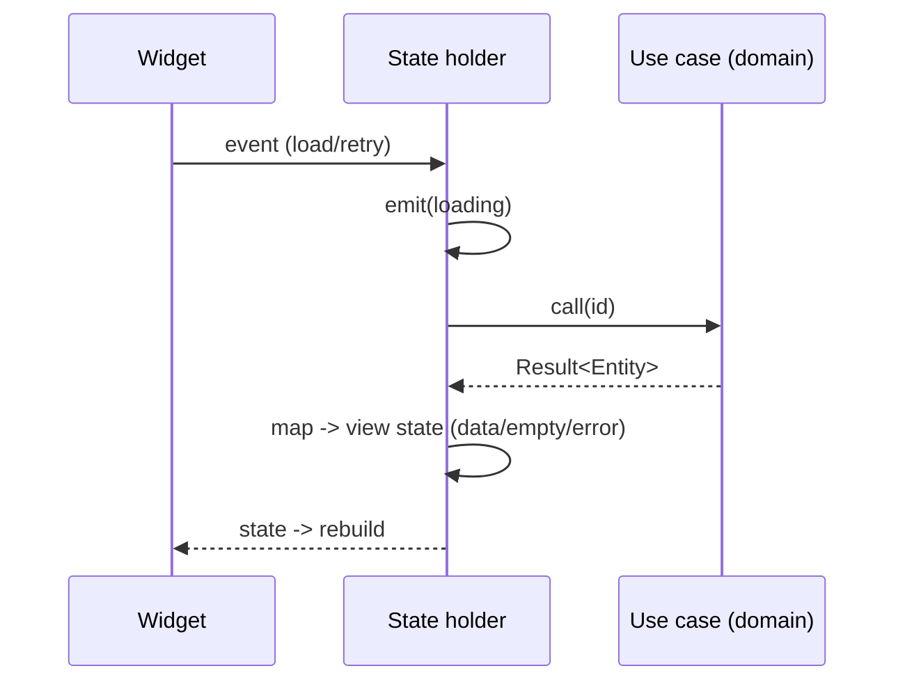

# The Presentation Layer (State, View Models, Domain→UI Mapping)

> The presentation layer is the outermost ring facing the user: **state holders** (bloc/cubit/notifier/view model) **call use cases**, receive domain **entities/`Result`s**, and **map them to immutable view state** (loading/data/empty/error + display-formatted fields) that **widgets render**. Widgets stay dumb (render state, emit events); the state holder holds no business rules (those are in the domain) and no I/O (that's in data) — it **orchestrates use cases and translates domain → UI**. This keeps UI swappable, testable without a device, and free of tangled logic.

## Introduction

This file covers the UI-facing layer: how state holders call use cases, map domain results to view state, keep widgets thin, and handle errors/loading — closing the loop from domain ([domain_layer.md](domain_layer.md)) and data ([data_layer.md](data_layer.md)) to the screen. State-management mechanics are in [Module 11](../11%20State%20Management/README.md); here we focus on its role in Clean Architecture.

## Why this concept exists

Widgets are volatile and hard to test; business rules and I/O must not live in them. The presentation layer provides a **thin translation layer** between the pure domain and the framework UI: it invokes application actions (use cases) and shapes their results into exactly what the view needs. This makes the UI a replaceable detail and the logic testable, upholding the dependency rule (presentation depends on domain, not vice versa).

## Real-world analogy

The state holder is a **translator + stage manager**: the audience (widgets) only sees the polished performance (view state). The manager takes the script's outcomes (domain results), decides what the audience sees at each moment (loading/data/error), and translates domain language into the audience's language (formatted strings, display models) — but never rewrites the script (business rules stay in the domain).

## Problem Statement

Wire a screen: a state holder calls `GetProfile`, maps the `Result` to view state (loading → data with formatted fields / empty / error with a message + retry), and a thin widget renders it — with the state holder testable without a device and containing no business rules or I/O. You'll build the state holder + view state + widget.

## Internal Working

```mermaid
flowchart TD
    Widget[Widget: renders state, emits events] --> Holder[State holder: bloc/cubit/notifier]
    Holder --> UC[call use case]
    UC -->|Result<Entity>| Holder
    Holder --> Map[map: entity/Result -> immutable view state]
    Map --> States[loading / data(view model) / empty / error(message)]
    States --> Widget
```

- **State holder** (bloc/cubit/riverpod notifier/VM): depends on **use cases** (injected via DI — [Module 14](../14%20Dependency%20Injection/README.md)), **calls** them on events, and **emits immutable view state**. It's the seam between domain and UI. It holds **no business rules** (domain) and **no I/O** (data) — only orchestration + mapping.
- **Domain → view state mapping**: convert **entities/`Result`** into **exactly what the UI needs** — often a **view model** with **display-formatted** fields (currency/date via `intl`, computed labels) and explicit **UI states** (loading/data/empty/error). Don't render entities directly if the view needs formatting/derived fields; don't leak `Result`/`Failure` types into widgets — map failures to **messages** ([Module 38](../38%20Error%20Handling/README.md)).
- **Thin widgets**: widgets **render state** and **emit events/intents** — no logic, no use-case calls, no formatting decisions beyond layout. Every async view handles **loading/data/empty/error** ([Module 38](../38%20Error%20Handling/README.md)).
- **Events → use cases**: user intents (tap/submit) become events the state holder handles by invoking the right **use case**, then mapping the result to new state. Retry re-invokes the use case.
- **Immutability**: view state is immutable (copyWith) so rebuilds are predictable and diffable ([Module 11](../11%20State%20Management/README.md)).
- **Testability**: the state holder is unit-tested by injecting **fake use cases** and asserting the **state sequence** (loading → data/error) — no widgets/device needed. Widget tests verify rendering per state.
- **View model vs entity**: entities are domain shape; **view models** are UI shape (formatted, presentation-only fields). Keep them distinct so the UI's needs don't pollute the domain.

## Memory Representation

The state holder keeps the current immutable view state (+ references to injected use cases). View models hold display-ready, presentation-only data derived from entities. Widgets hold no logic state beyond ephemeral UI.

## Compiler Behavior

Presentation imports Flutter + domain (use cases/entities) but **not** the data layer directly (it gets use cases via DI). Dependency points inward (presentation → domain).

## Runtime Behavior

Event → state holder calls use case → maps `Result` → emits state → widget rebuilds. Loading shown while awaiting; errors mapped to messages; retry re-runs the use case.

## Flutter Engine Behavior

Only this layer touches the engine (widgets/build/rebuild). State changes trigger rebuilds of listening widgets ([Module 07](../07%20Widgets/README.md)/[Module 11](../11%20State%20Management/README.md)).

## Dart VM Behavior

State-holder logic is plain Dart (testable without binding); only widget tests need the Flutter test binding.

## Examples

```dart
// Immutable view state (UI shape) + presentation-only formatting
sealed class ProfileState {}
class ProfileLoading extends ProfileState {}
class ProfileData extends ProfileState { final ProfileVm vm; ProfileData(this.vm); }
class ProfileError extends ProfileState { final String message; ProfileError(this.message); }

class ProfileVm {                                   // view model: display-formatted, UI-only
  final String name; final String joinedLabel;
  ProfileVm(this.name, this.joinedLabel);
  factory ProfileVm.from(Profile p) =>              // map ENTITY -> view model
      ProfileVm(p.name, 'Joined ${DateFormat.yMMM().format(p.joinedAt)}');
}

// State holder (cubit): calls the USE CASE, maps Result -> state; no rules/IO
class ProfileCubit extends Cubit<ProfileState> {
  final GetProfile getProfile;                      // injected domain use case
  ProfileCubit(this.getProfile) : super(ProfileLoading());

  Future<void> load(String id) async {
    emit(ProfileLoading());
    final result = await getProfile(id);            // domain call
    emit(switch (result) {
      Success(:final value) => ProfileData(ProfileVm.from(value)),
      Failure(:final error) => ProfileError(messageFor(error)),   // failure -> message
    });
  }
}
```

```dart
// Thin widget: renders state, emits events (retry) — no logic
BlocBuilder<ProfileCubit, ProfileState>(builder: (c, s) => switch (s) {
  ProfileLoading() => const CenteredSpinner(),
  ProfileData(:final vm) => ProfileView(vm),        // renders view model
  ProfileError(:final message) =>
      ErrorView(message: message, onRetry: () => c.read<ProfileCubit>().load(id)),
});
```

## Diagrams



## Common Mistakes

| Mistake | Why | Fix |
|---------|-----|-----|
| Business logic in widgets/state holder | Untestable, tangled | Rules in domain; holder only orchestrates/maps |
| I/O in the state holder | Wrong layer | Call use cases; I/O in data |
| Rendering entities directly (need formatting) | Domain shape ≠ UI needs | Map to a view model |
| Leaking `Result`/`Failure` into widgets | Couples UI to domain internals | Map failures to messages/state |
| Fat widgets with logic | Untestable, rebuild-heavy | Thin widgets: render + emit events |
| Missing loading/empty/error states | Poor UX / infinite spinner | Handle all UI states + retry |
| State holder depends on data layer | Violates dependency rule | Depend on use cases (domain) via DI |

## Best Practices

- State holders **call use cases** and **map domain results → immutable view state**; hold **no business rules** (domain) and **no I/O** (data).
- Map **entities → view models** (display-formatted, UI-only) and **failures → messages/states**; don't leak `Result`/`Failure`/entities' raw shape into widgets when the UI needs formatting.
- Keep **widgets thin** (render state, emit events); handle **loading/data/empty/error + retry**; use **immutable** view state.
- **Inject use cases via DI**; depend inward on the **domain**, not the data layer; **unit-test** the state holder with fake use cases (state-sequence assertions).

## Performance

Immutable state + granular rebuilds keep the UI efficient ([Module 11](../11%20State%20Management/README.md)/[Module 21](../21%20Performance/README.md)). Mapping is cheap. The thin-widget/state-holder split localizes rebuilds and keeps logic off the widget tree. No architectural runtime cost.

## Advantages / Disadvantages

- **+** Testable UI logic (no device), swappable UI/state lib, thin reusable widgets, clean loading/error UX, domain insulated from UI.
- **−** Mapping/view-model boilerplate, more files, discipline to keep logic out of widgets/holders.

## Interview Questions

1. **🟢 What is the presentation layer's job?** — Call use cases, map domain results to immutable view state, and render it via thin widgets — no business rules or I/O.
2. **🟢 Why map entities to view models?** — The UI often needs formatted/derived fields; a view model shapes data for the view without polluting the domain entity.
3. **🟡 Why shouldn't widgets call use cases or hold logic?** — Widgets are volatile/hard to test; keeping them thin (render + emit events) makes logic testable and UI swappable.
4. **🟡 How do you handle failures in the UI?** — Map `Result`/`Failure` to a message/error state in the state holder (don't leak domain failure types into widgets); render error state + retry.
5. **🟡 What does the state holder depend on, and why?** — Use cases (domain), injected via DI — dependencies point inward; it must not depend on the data layer.
6. **🔴 How do you test the presentation layer without a device?** — Unit-test the state holder with fake use cases, asserting the emitted state sequence (loading→data/error); widget tests cover rendering.
7. **🔴 Where does formatting (currency/date) belong?** — In the presentation mapping (view model), not the domain — the domain holds raw values; the view shapes them.

## Senior Engineer Tips

- Keep the state holder a thin translator (use case → view state) and widgets dumb; the instant business logic or `dio` creeps into either, testability and swappability erode.
- Map failures to messages and entities to view models at this boundary so widgets never import domain/data types — that keeps the UI a true, replaceable detail.
- Test state holders by asserting the state sequence with fake use cases; it's fast, device-free, and catches the loading/error regressions users actually hit.

## Architect Perspective

The presentation layer completes the dependency-rule loop: it depends inward on the domain (use cases), translating pure results into UI state while widgets stay a replaceable detail. This makes the UI swappable (Material↔Cupertino, bloc↔riverpod) and the logic testable, and it's where the app's chosen state-management pattern (MVVM etc.) plugs in — the same domain/data underneath ([Module 11](../11%20State%20Management/README.md), [Module 43](../43%20MVVM/README.md), [clean_architecture_integration.md](clean_architecture_integration.md)).

## Summary

- Presentation = state holders calling use cases and mapping domain results → immutable view state; thin widgets render + emit events.
- Map entities→view models (formatted) and failures→messages; handle loading/data/empty/error + retry; no rules/I/O here.
- Inject use cases via DI (depend inward); unit-test the state holder with fakes (state-sequence).

## Revision Notes

- State holder (bloc/cubit/notifier/VM) calls use cases → maps `Result`/entity → immutable view state (loading/data/empty/error); no business rules/IO.
- Entity → view model (display-formatted, UI-only); failure → message; widgets thin (render + events); handle all UI states + retry.
- Inject use cases via DI (depend on domain, not data); unit-test holder with fake use cases (assert state sequence).

## Practice Questions

1. What belongs in the state holder vs the widget vs the domain?
2. Why map entities to view models and failures to messages?
3. How do you test presentation logic without a device?

## Coding Questions

1. Build a cubit/notifier calling a use case and emitting loading/data/error state.
2. Map an entity to a formatted view model and a failure to a message.
3. Unit-test the state holder with a fake use case (assert state sequence).

## Mini Project

**Presentation slice (Flutter):** Build a state holder (cubit/notifier) that calls `GetProfile`, maps the `Result` to immutable view state (loading/data(view model)/empty/error(message)) with `intl` formatting, and a thin widget rendering each state with retry. Inject the use case via DI; unit-test the state holder with a fake use case. Acceptance: holder only orchestrates/maps (no rules/IO); entity→view model + failure→message mapping; thin widget with all UI states + retry; depends inward on domain via DI; state-sequence unit-tested without a device.
