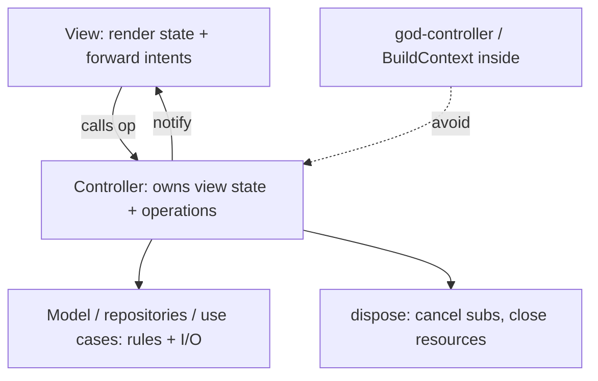
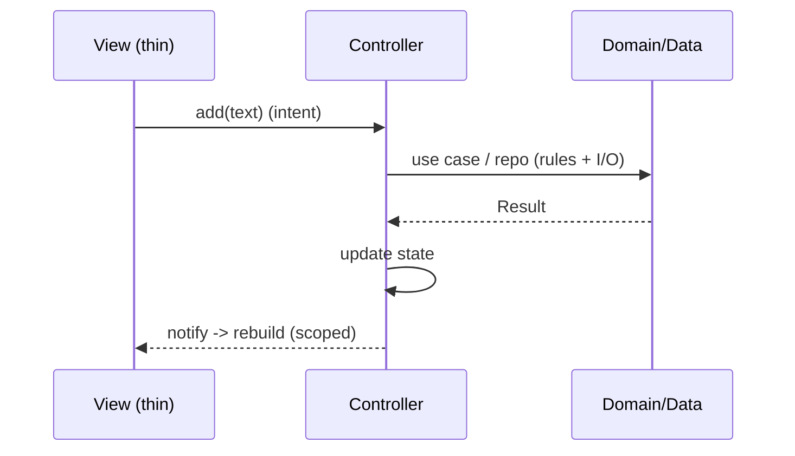

# Controllers & Thin Views

> Whatever you call the pattern, the durable discipline is: **thin views + focused controllers**. The **view** only renders state and forwards intents (no business logic, no I/O, no state ownership); the **controller** owns view state, exposes operations, delegates rules to the Model/domain, and notifies the view — staying **plain Dart, per-feature, and UI-free** so it's unit-testable. Controllers must not become **god-objects** (grab-bags of unrelated logic) or hold `BuildContext`/framework handles that couple them to the UI.

## Introduction

This file is the practical craft of the controller/view split that "Flutter MVC" (really MVVM) relies on: what the controller owns, how to keep views thin, change notification, lifecycle/disposal, and avoiding the god-controller. It applies regardless of whether you label it MVC or MVVM.

## Why this concept exists

The value of any presentation pattern is realized only if the view stays dumb and the controller stays focused. Fat views scatter untestable logic across the widget tree; god controllers become unmaintainable dumping grounds. Disciplined thin views + lean controllers deliver the testability and maintainability the pattern promises.

## Real-world analogy

The controller is a **department manager**: it makes decisions and holds the plan (state), delegates specialized work to experts (Model/repositories), and reports status (notifies). The view is the **reception desk**: it shows the current status and passes requests to the manager — it doesn't make decisions or do the work. A manager who also does accounting, HR, and shipping (god-controller) burns out; a receptionist who starts making policy (fat view) causes chaos.

## Problem Statement

Design a feature's controller so it owns view state + operations and delegates rules to the domain, keep the view purely presentational, wire proper change notification + disposal, and avoid a god-controller. You'll define controller responsibilities and a thin view.

## Internal Working



- **Controller owns**: the feature's **view state** (loading/data/error + fields), **operations** the view calls (`load`, `add`, `submit`), and **change notification**. It **delegates** business rules to the **Model/domain** and I/O to **repositories/use cases** — it orchestrates, it doesn't implement rules or fetch directly ([Module 40](../40%20Clean%20Architecture/README.md)).
- **Controller must NOT**: import Flutter UI / hold `BuildContext` (couples to the tree, leaks, untestable), contain business rules (Model's job), do raw I/O (data layer's job), or accumulate unrelated concerns (god-object).
- **Thin view**: renders from controller state and **forwards intents**; no logic beyond layout, no state ownership, no direct model/repo calls. Handles **loading/data/empty/error** ([Module 38](../38%20Error%20Handling/README.md)). It observes the controller (`ListenableBuilder`/`Consumer`/`Obx`).
- **Change notification**: mutate state then **notify** (`notifyListeners`/reactive); prefer **immutable** state snapshots so rebuilds are predictable; **scope** rebuilds to what changed ([Module 21](../21%20Performance/README.md)).
- **Lifecycle/disposal**: controllers holding subscriptions/streams/controllers must **dispose** them (`dispose()`); tie to the widget/DI lifecycle so nothing leaks ([Module 08](../08%20Widget%20Lifecycle/README.md)).
- **Avoiding god-controllers**: **one controller per feature/screen** with a single responsibility; extract shared logic into use cases/services; if a controller grows unrelated methods, split it.
- **Testability**: because the controller is plain Dart with injected dependencies, unit-test its **state transitions** (call op → assert state) with fakes — no widgets/device.
- **Passing context safely**: if the view needs navigation/snackbars from a controller result, the **view** reacts to state/events (it has context) — the controller emits an event/state, it doesn't hold context.

## Memory Representation

Controller holds current (ideally immutable) view state + listener list + injected deps (+ any subscriptions to dispose). Views hold references to the controller (observe) but no logic state.

## Compiler Behavior

A UI-free controller compiles without Flutter widget imports (only `foundation` for `ChangeNotifier` is fine) — a checkable purity boundary that enables plain-Dart tests.

## Runtime Behavior

Intent → controller op → (delegate to domain) → mutate state → notify → view rebuilds (scoped). Dispose cancels subscriptions. God-controllers cause tangled updates + wide rebuilds.

## Flutter Engine Behavior

Scoped notifications rebuild only listening subtrees; unscoped notifications rebuild broadly ([Module 09](../09%20Rendering%20Pipeline/README.md)).

## Dart VM Behavior

Controller logic is plain Dart (fast tests); subscriptions must be cancelled to avoid leaks/background work.

## Examples

```dart
import 'package:flutter/foundation.dart'; // ChangeNotifier only — NO material/widgets

// CONTROLLER — owns view state + ops; delegates rules/IO; UI-free; disposable
class TasksController extends ChangeNotifier {
  final AddTask addTask;          // use case (domain) — injected
  final LoadTasks loadTasks;
  TasksController(this.addTask, this.loadTasks);

  TasksViewState state = const TasksViewState.loading(); // immutable snapshot

  Future<void> load() async {
    state = const TasksViewState.loading(); notifyListeners();
    final r = await loadTasks();                 // delegate I/O to domain/data
    state = r is Success ? TasksViewState.data(r.value) : const TasksViewState.error('Failed');
    notifyListeners();
  }
  Future<void> add(String text) async {          // op the view calls
    await addTask(text);                         // rule enforced in the use case/model
    await load();
  }
  // No BuildContext, no dio, no business rules here.
}
```

```dart
// THIN VIEW — render + forward intents; observe controller; handle states
ListenableBuilder(
  listenable: controller,
  builder: (context, _) => switch (controller.state) {
    Loading() => const CenteredSpinner(),
    Data(:final tasks) => TaskList(tasks, onAdd: controller.add), // forward intent
    Error(:final msg) => ErrorView(message: msg, onRetry: controller.load),
  },
);
```

## Diagrams



## Common Mistakes

| Mistake | Why | Fix |
|---------|-----|-----|
| `BuildContext` inside the controller | Couples to UI, leaks, untestable | View reacts to state/events; no context in controller |
| Business rules/I/O in the controller | Wrong layer, untestable | Delegate to Model/use cases/repos |
| Fat view with logic/state | Untestable, tangled | Thin view: render + forward intents |
| God-controller | Unmaintainable grab-bag | One per feature; split; extract services |
| Not disposing subscriptions | Leaks/background work | `dispose()` tied to lifecycle |
| Mutable shared state without notify | Stale UI | Immutable snapshots + notify |
| Unscoped notifications | Wide rebuilds/jank | Scope listeners |

## Best Practices

- Controller **owns view state + operations + notification**, stays **plain Dart (no `BuildContext`/UI imports)**, and **delegates rules to the Model/domain and I/O to repositories/use cases**.
- Keep the **view thin** (render + forward intents, handle loading/data/empty/error); observe the controller; **scope rebuilds**.
- **One focused controller per feature** (avoid god-objects); **dispose** subscriptions/resources; use **immutable state snapshots** + notify.
- For navigation/snackbars, have the **view react to state/events** (it has context) — never hold context in the controller; **unit-test** state transitions with fakes.

## Performance

Scoped notifications + immutable snapshots keep rebuilds minimal ([Module 21](../21%20Performance/README.md)). God-controllers and unscoped notifies cause wide rebuilds. Disposal prevents leaked subscriptions doing background work. Controller logic is cheap plain Dart.

## Advantages / Disadvantages

- **+** Testable controllers (plain Dart), thin reusable views, clear ownership, scoped rebuilds, no context-leak.
- **−** Requires discipline (no context/rules/I/O in controller), disposal management, splitting to avoid god-objects, state-snapshot boilerplate.

## Interview Questions

1. **🟢 What does the controller own vs delegate?** — Owns view state/operations/notification; delegates business rules to the Model/domain and I/O to repositories/use cases.
2. **🟢 What must a controller never hold?** — `BuildContext`/UI imports, business rules, or raw I/O — those couple it to the UI or belong in other layers.
3. **🟡 How does the view stay thin?** — It only renders controller state and forwards intents (handling loading/data/empty/error); no logic/state ownership.
4. **🟡 How does navigation/snackbar happen without context in the controller?** — The controller emits state/events; the view (which has context) reacts.
5. **🟡 How do you avoid a god-controller?** — One focused controller per feature; extract shared logic into services/use cases; split when it grows unrelated concerns.
6. **🔴 Why keep the controller UI-free, and how does it help testing?** — It's plain Dart, so you unit-test state transitions (call op → assert state) with fakes, no widgets/device.
7. **🔴 What lifecycle concern must controllers handle?** — Disposing subscriptions/streams/resources (`dispose()`) tied to the widget/DI lifecycle to avoid leaks.

## Senior Engineer Tips

- Ban `BuildContext` from controllers; emit state/events and let the view handle navigation/snackbars — context in a controller is the top source of leaks and untestable code.
- Keep controllers per-feature and UI-free, delegating rules/IO downward; the moment a controller does everything, it's a god-object and your tests die.
- Use immutable state snapshots + scoped listeners; it makes rebuilds predictable, cheap, and easy to assert in tests.

## Architect Perspective

Thin views + focused controllers are the transferable discipline beneath MVC/MVP/MVVM: presentation logic lives in a testable, UI-free controller that owns view state and delegates downward, while views are replaceable projections. Getting this split right (no context, no rules, no god-objects, proper disposal, scoped rebuilds) is what actually delivers testability and maintainability — independent of the label ([02_mvc_in_flutter.md](02_mvc_in_flutter.md), [Module 43](../43%20MVVM/README.md), [Module 40](../40%20Clean%20Architecture/README.md)).

## Summary

- Controller owns view state + operations + notification, stays plain Dart (no context/UI), delegates rules/IO downward; one per feature.
- Views are thin (render + forward intents, handle all states); scope rebuilds; use immutable snapshots + notify; dispose resources.
- Navigation/snackbars via view reacting to state/events; controllers unit-tested with fakes.

## Revision Notes

- Controller: owns view state/ops/notify, UI-free (no `BuildContext`/material), delegates rules→Model, I/O→use cases/repos; per-feature (no god-object); `dispose()` subscriptions.
- View: thin (render + forward intents, loading/data/empty/error); observe controller; scope rebuilds; immutable snapshots + notify.
- Navigation/snackbar via view reacting to state/events; unit-test controller state transitions with fakes.

## Practice Questions

1. What belongs in the controller vs the view vs the domain?
2. Why must the controller not hold `BuildContext`?
3. How do you keep a controller from becoming a god-object?

## Coding Questions

1. Build a UI-free controller owning view state + ops, delegating to use cases.
2. Wire a thin view that observes it and forwards intents (all UI states).
3. Add disposal for a subscription and unit-test a state transition with fakes.

## Mini Project

**Thin view + focused controller (Flutter):** Refactor a feature so a UI-free `ChangeNotifier` controller owns view state + operations (delegating rules/IO to use cases), with proper disposal, and a thin view renders + forwards intents (loading/data/empty/error) with scoped rebuilds. Handle navigation via the view reacting to an event/state (no context in the controller). Unit-test state transitions with fakes. Acceptance: controller UI-free (no context/rules/IO), per-feature, disposes resources; view thin + all states + scoped rebuilds; navigation without context-in-controller; state transitions unit-tested.
