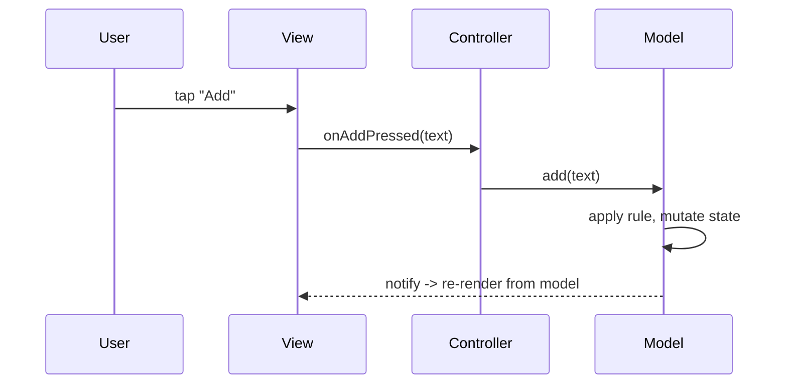

# MVC Fundamentals (The Three Roles & Data Flow)

> MVC splits a UI into three roles: the **Model** (data + business rules + state, ignorant of the UI), the **View** (renders the model, forwards user input), and the **Controller** (receives input, updates the model, and selects what the view shows). The classic flow is **input → Controller → Model → View updates** — the Controller mediates between a passive View and the Model, and the Model notifies observers when it changes. It's a **separation-of-concerns** pattern from 1970s Smalltalk, designed to keep UI, logic, and data from tangling.

## Introduction

Before mapping MVC to Flutter, you need the canonical definition: what each role owns, how data and control flow, and the (often blurry) variations. This file establishes the vocabulary so the Flutter-specific friction ([mvc_in_flutter.md](mvc_in_flutter.md)) is clear.

## Why this concept exists

Early GUIs tangled data, rendering, and input handling into unmaintainable blobs. MVC introduced **separation of concerns**: isolate the domain (Model) from its presentation (View) and from input handling (Controller), so each can change independently and the Model can drive multiple Views. It's the ancestor of nearly every UI-architecture pattern since.

## Real-world analogy

MVC is a **restaurant**: the **Model** is the kitchen + recipes + inventory (the real state and rules), the **View** is the dining room (what the customer sees), and the **Controller** is the **waiter** — takes your order (input), relays it to the kitchen (updates the model), and the dining room reflects the result. The kitchen doesn't know about table decor; the dining room doesn't cook.

## Problem Statement

For a simple feature (a task list), assign responsibilities to Model/View/Controller, define how a user action flows through them, and how the View learns of Model changes. You'll map the three roles and the data flow.

## Internal Working

```mermaid
flowchart TD
    User[user input] --> View[View: render + forward input]
    View --> Controller[Controller: interpret input]
    Controller --> Model[Model: data + rules + state]
    Model -->|notify (observer)| View
    View -->|reads state| Model
    Note[Controller mediates; Model is UI-agnostic; View is (classically) passive]
```

- **Model**: the app's **data, business rules, and state** — completely **UI-agnostic**. It validates, computes, and holds truth; it **notifies observers** (Views/Controllers) when it changes (Observer pattern — [Module 05](../05%20Design%20Patterns/README.md)). It does **not** import UI.
- **View**: **renders** the Model's state and **forwards user input** to the Controller. Classically **passive/dumb** — no business logic; it reflects the Model (often by observing it) and delegates actions.
- **Controller**: **handles input**, decides what to do, **updates the Model**, and may select which View/state to present. It's the **mediator** translating user gestures into Model operations.
- **Data/control flow (classic)**: user acts on the **View** → View notifies the **Controller** → Controller updates the **Model** → Model notifies observers → **View re-renders** from the Model. (Variants differ on whether input goes View→Controller directly or the View reads the Model directly.)
- **Variations (why it's fuzzy)**: many "MVC"s differ — some let the View observe the Model directly; some route everything through the Controller; web MVC (Rails) means something different again. MVC is more a **family** than a single spec, which is why "MVC in Flutter" is ambiguous.
- **Goal**: **separation of concerns** — Model reusable across Views, View swappable, Controller isolating input logic — for testability and maintainability.

## Memory Representation

Model holds state + an observer list; View holds a reference to the Model (to read/observe) and the Controller (to forward input); Controller holds a reference to the Model. Change propagates via notifications, not direct View mutation by the Controller (classically).

## Compiler Behavior

Not applicable — MVC is a design pattern, not a language feature.

## Runtime Behavior

Input flows View→Controller→Model; Model change notifies observers; Views re-render. The Model is the single source of truth; Views are projections of it.

## Flutter Engine Behavior

Not applicable here (framework mapping is in [mvc_in_flutter.md](mvc_in_flutter.md)).

## Dart VM Behavior

Not applicable.

## Examples

```dart
// MODEL — data + rules + notification (UI-agnostic). Observer via ChangeNotifier here.
class TaskModel extends ChangeNotifier {
  final List<String> _tasks = [];
  List<String> get tasks => List.unmodifiable(_tasks);
  void add(String t) {
    if (t.trim().isEmpty) return;      // business rule lives in the Model
    _tasks.add(t.trim());
    notifyListeners();                  // notify observers (Views)
  }
}

// CONTROLLER — interprets input, updates the model (no rendering, no rules of its own)
class TaskController {
  final TaskModel model;
  TaskController(this.model);
  void onAddPressed(String text) => model.add(text); // input -> model operation
}

// VIEW (conceptual) — renders model state, forwards input to controller
// build(): read model.tasks to render; button onPressed -> controller.onAddPressed(text)
```

## Diagrams



## Common Mistakes

| Mistake | Why it's wrong | Fix |
|---------|---------------|-----|
| Business rules in the View | View should be dumb | Rules in the Model |
| Model importing/knowing the UI | Breaks separation/reuse | Keep Model UI-agnostic |
| Controller holding state | State belongs to the Model | Controller mediates; Model holds state |
| Rendering logic in the Controller | Blurs roles | View renders; Controller orchestrates input |
| Assuming one true MVC | It's a family of variants | Define your variant explicitly |
| View mutating Model directly for everything | Bypasses Controller | Route input through the Controller |

## Best Practices

- Keep the **Model UI-agnostic** (data + rules + state + notification); keep the **View passive** (render + forward input); keep the **Controller** to **input→Model** mediation (no rendering, no owning state).
- Propagate change via **notification/Observer** (Model → Views), not the Controller pushing into the View.
- Define **which MVC variant** you mean (View observes Model? input via Controller?) since MVC is a family.
- Put **business rules in the Model** so it's reusable/testable independent of any View.

## Performance

Not a perf concern at this level; the Observer notifications' cost depends on how many Views observe and how granular updates are (relevant in Flutter — [mvc_in_flutter.md](mvc_in_flutter.md)).

## Advantages / Disadvantages

- **+** Separation of concerns, reusable/testable Model, swappable View, isolated input logic; foundational + widely understood.
- **−** Ambiguous (many variants), Controller can become a catch-all, classic imperative flow doesn't map cleanly to reactive UIs, View↔Controller↔Model coupling can grow.

## Interview Questions

1. **🟢 What are MVC's three roles?** — Model (data/rules/state, UI-agnostic), View (renders + forwards input), Controller (input→Model mediation).
2. **🟢 What's the classic MVC data flow?** — Input → View → Controller → Model → (notify) → View re-renders.
3. **🟡 Where do business rules live in MVC?** — In the Model — so it's reusable and testable independent of the View.
4. **🟡 How does the View learn about Model changes?** — Via notification/Observer (the Model notifies its observers), classically not by the Controller pushing to the View.
5. **🟡 Why is "MVC" ambiguous?** — It's a family of variants (Smalltalk vs web/Rails vs others) differing on input routing and whether the View observes the Model directly.
6. **🔴 What's the Controller's failure mode?** — Becoming a god-object holding state and logic that belong in the Model — degrading into a tangled mediator.
7. **🔴 Why does MVC's classic flow strain in reactive UIs?** — It assumes an imperative View the Controller updates; reactive frameworks rebuild the View from state, changing the flow (covered in the Flutter file).

## Senior Engineer Tips

- State your MVC variant explicitly before arguing about it — most "that's not real MVC" debates are just different variants talking past each other.
- Guard the Controller against becoming a state-holding god-object; state and rules belong in the Model, input mediation in the Controller.
- Keep the Model free of UI imports so it stays reusable and unit-testable — the single most valuable MVC discipline.

## Architect Perspective

MVC is the ancestral separation-of-concerns pattern: isolate data/rules (Model) from presentation (View) from input (Controller). Its core insight — a UI-agnostic Model driving swappable Views — survives in every descendant (MVP/MVVM/Clean). But its imperative "Controller updates View" flow predates reactive UIs, which is exactly why it fits Flutter awkwardly and why understanding the roles matters more than the label ([mvc_in_flutter.md](mvc_in_flutter.md), [Module 43](../43%20MVVM/README.md)).

## Summary

- MVC: Model (UI-agnostic data/rules/state + notify), View (render + forward input), Controller (input→Model mediation).
- Classic flow: input → View → Controller → Model → notify → View re-renders; Model is the source of truth.
- It's a family of variants; keep the Model pure, the View dumb, the Controller lean; the imperative flow strains in reactive UIs.

## Revision Notes

- Model = data + rules + state + observer notification (no UI); View = render + forward input (passive); Controller = input→Model mediation (no rendering/state).
- Flow: input → View → Controller → Model → notify → View re-render; Model = source of truth; Observer pattern for change.
- MVC is a family (Smalltalk/web/etc.); rules in Model; Controller can bloat; classic imperative flow ≠ reactive UI.

## Practice Questions

1. What does each MVC role own, and what must it not do?
2. Trace a user action through classic MVC.
3. Why is MVC considered a family rather than one pattern?

## Coding Questions

1. Model a feature's Model (data + rule + notify), Controller, and (conceptual) View roles.
2. Show change propagation from Model → View via notification.
3. Identify a role violation (rule in View / state in Controller) and fix it.

## Mini Project

**Role mapping (conceptual, Flutter):** For a task-list feature, define the Model (data + validation rule + `ChangeNotifier` notification), the Controller (input→Model), and a thin View (renders + forwards input), and document the data flow for "add task." Acceptance: Model is UI-agnostic with rules + notification; Controller only mediates input; View only renders + forwards; data flow documented; a role violation identified + corrected.
