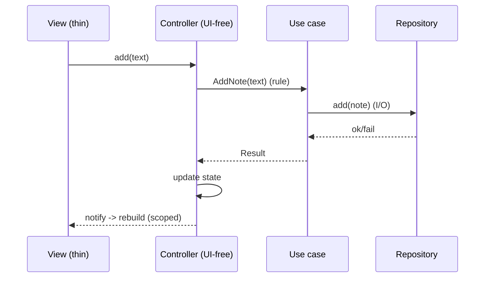

# MVC Integration (Capstone: A Pragmatic MVC-Style Feature)

> Build a feature the way "MVC in Flutter" actually works in practice: a **Model** (data + rules, ideally behind repositories/use cases), a **Controller** (UI-free state holder with operations + notification), and a **thin reactive View** — wired via DI, testable, and scoped. Acknowledge honestly that this reactive controller pattern **is essentially MVVM**; the value isn't the label but the **discipline**: thin views, focused UI-free controllers, rules delegated downward, and the reactive UI = f(state) flow respected.

## Introduction

This module capstone assembles the fundamentals, Flutter mapping, controller/view discipline, and tradeoffs into one pragmatic feature. It demonstrates the reactive controller pattern done well and documents where it sits relative to MVVM/Clean — the practical takeaway of the module.

## Why this concept exists

Seeing the roles individually isn't enough; the lesson lands when you build a clean, testable feature and recognize what pattern you actually produced. This closes the loop: use the familiar structure, respect the framework, keep it testable, and name it honestly.

## Real-world analogy

It's like being asked to build a "classic car" but with a modern electric drivetrain: you keep the recognizable shape (Model/Controller/View vocabulary) but the engine is inherently reactive (MVVM). Pretending it's a carburetor engine (imperative MVC) would break it; embracing the electric drivetrain (state → rebuild) makes it work — and you're honest that it's really an EV.

## Problem Statement

Build a "notes" feature as pragmatic MVC: Model (Note + validation, behind a repository/use cases), Controller (UI-free `ChangeNotifier` with load/add/delete + notify), and a thin reactive View (loading/data/empty/error + retry), wired by DI and unit-tested — with a note documenting its MVVM/Clean relationship. You'll compose the module's discipline into one slice.

## Internal Working

```mermaid
flowchart TD
    View[View: thin, reactive, forwards intents] -->|intents| Ctrl[Controller: UI-free state holder + notify]
    Ctrl --> UC[Use cases (domain): AddNote/LoadNotes (rules)]
    UC --> Repo[NoteRepository (data): persistence]
    Ctrl -->|notify| View
    DI[DI: inject use cases -> controller; controller -> view] --- Ctrl
    Note[reactive controller ≈ MVVM view model]
```

- **Model** ([mvc_fundamentals.md](mvc_fundamentals.md)): `Note` entity + validation rule; for anything real, put rules in **use cases** and persistence behind a **repository** ([Module 40](../40%20Clean%20Architecture/README.md)) rather than a monolithic model.
- **Controller** ([controllers_and_thin_views.md](controllers_and_thin_views.md)): a **UI-free `ChangeNotifier`** owning immutable view state + operations (`load`/`add`/`delete`), delegating rules/IO to use cases, notifying listeners, disposing resources — **no `BuildContext`, no rules, no raw I/O**.
- **View**: a **thin reactive widget** (`ListenableBuilder`) rendering loading/data/empty/error + retry and forwarding intents; **scoped rebuilds**; navigation/snackbars via reacting to state/events (has context).
- **Wiring (DI)**: inject use cases into the controller and the controller into the view ([Module 14](../14%20Dependency%20Injection/README.md)); the view depends on the controller, the controller on use cases (domain) — dependencies inward.
- **Testability**: unit-test the controller's **state transitions** with fake use cases (no widgets); widget-test the view per state.
- **Honesty about the label** ([mvc_tradeoffs_and_comparison.md](mvc_tradeoffs_and_comparison.md)): this is a **reactive controller pattern = MVVM**; the "Model/Controller/View" naming is the MVC vocabulary applied to a reactive framework. Document it so the team isn't confused, and note the easy path to full **Clean + MVVM**.
- **Right-sizing**: for a tiny feature you can collapse use cases (controller calls the repo directly); for a real app, keep the layers.

## Memory Representation

Controller holds immutable view state + injected use cases + listener list (+ resources to dispose). View observes the controller. Model/entities are plain data; repository holds persistence.

## Compiler Behavior

Controller compiles UI-free (no widget imports) — testable in plain Dart. View imports Flutter + controller; dependencies point inward (view → controller → use cases → domain).

## Runtime Behavior

Intent → controller op → use case (rules) → repo (I/O) → state update → notify → view rebuild (scoped). Errors surface as error state + retry. Reactive throughout.

## Flutter Engine Behavior

Only the view touches the engine; scoped notifications rebuild the listening subtree ([Module 09](../09%20Rendering%20Pipeline/README.md)).

## Dart VM Behavior

Controller/use case/model tests are fast plain Dart; only widget tests use the test binding.

## Examples

```dart
import 'package:flutter/foundation.dart';

// MODEL (domain): entity + rule via use case; persistence via repository
class Note { final String id, text; const Note(this.id, this.text); }
abstract class NoteRepository { Future<List<Note>> all(); Future<void> add(Note n); }

class AddNote {                                  // use case (rule lives here)
  final NoteRepository repo;
  AddNote(this.repo);
  Future<Result<void>> call(String text) async {
    if (text.trim().isEmpty) return Failure(ValidationFailure('empty'));
    await repo.add(Note(_id(), text.trim()));
    return const Success(null);
  }
}

// CONTROLLER (UI-free reactive state holder — really an MVVM view model)
class NotesController extends ChangeNotifier {
  final AddNote addNote; final NoteRepository repo;
  NotesController(this.addNote, this.repo);
  NotesState state = const NotesState.loading();

  Future<void> load() async {
    state = const NotesState.loading(); notifyListeners();
    state = NotesState.data(await repo.all()); notifyListeners();
  }
  Future<void> add(String text) async {
    final r = await addNote(text);              // rule delegated to use case
    if (r is Failure) { state = const NotesState.error('Note cannot be empty'); notifyListeners(); return; }
    await load();
  }
}
```

```dart
// VIEW — thin, reactive, forwards intents; navigation/snackbars via reacting to state
ListenableBuilder(
  listenable: controller,
  builder: (context, _) => switch (controller.state) {
    Loading() => const CenteredSpinner(),
    Data(:final notes) when notes.isEmpty => const EmptyState('No notes yet'),
    Data(:final notes) => NoteList(notes, onAdd: controller.add),
    Error(:final msg) => ErrorView(message: msg, onRetry: controller.load),
  },
);
```

```dart
// TEST — controller state transitions with fakes (no device)
test('add empty -> error state', () async {
  final c = NotesController(AddNote(FakeRepo()), FakeRepo());
  await c.add('   ');
  expect(c.state, isA<NotesError>());
});
```

## Diagrams



## Common Mistakes

| Mistake | Why | Fix |
|---------|-----|-----|
| Rules/I/O in the controller | Wrong layer, untestable | Delegate to use cases/repo |
| `BuildContext` in the controller | Leaks/untestable | View reacts to state/events |
| Fat view with logic | Untestable | Thin view: render + forward intents |
| Calling it classic MVC | Mislabels MVVM | Document it's MVVM-ish |
| Over-layering a tiny feature | Boilerplate | Right-size (controller→repo directly) |
| Unscoped rebuilds | Jank | Scope `ListenableBuilder` |
| No tests | Loses the payoff | Unit-test controller transitions |

## Best Practices

- Structure as **Model (domain/repos/use cases) + UI-free Controller (state+ops+notify) + thin reactive View**; wire via **DI** (dependencies inward).
- Keep the controller **UI-free** (no context/rules/IO), delegate to **use cases/repositories**, **dispose** resources, use **immutable state + scoped rebuilds**.
- **Unit-test** controller state transitions with fakes; handle **loading/data/empty/error + retry**; navigation via the **view reacting** to state/events.
- **Document the label honestly** (reactive controller = MVVM) and **right-size** the layering to the feature's complexity.

## Performance

Scoped reactive rebuilds + immutable state keep it efficient; delegating rules/IO keeps the controller light. No architectural overhead beyond negligible DI/indirection. God-controllers/unscoped rebuilds are the pitfalls to avoid ([Module 21](../21%20Performance/README.md)).

## Advantages / Disadvantages

- **+** Familiar vocabulary, clean testable controller, thin views, framework-aligned (reactive), easy path to Clean + MVVM.
- **−** It's MVVM under an MVC label (potential confusion), controller-god risk, layering/DI + test boilerplate, right-sizing judgment needed.

## Interview Questions

1. **🟢 How is a pragmatic "Flutter MVC" feature structured?** — Model (domain/repos/use cases) + UI-free controller (state + ops + notify) + thin reactive view, wired by DI.
2. **🟢 Where do business rules and I/O go?** — In use cases/repositories (domain/data) — not the controller or view.
3. **🟡 Why is this really MVVM?** — The controller is a state holder the view binds to (a view model); the MVC naming is applied to a reactive framework.
4. **🟡 How do you keep the controller testable?** — UI-free (no context), inject use cases, unit-test state transitions with fakes.
5. **🟡 How is navigation handled without context in the controller?** — The controller emits state/events; the view (with context) reacts.
6. **🔴 How would you evolve this to full Clean + MVVM?** — Formalize domain (entities/use cases/interfaces) + data (repo impls) layers behind the controller (view model), keeping the reactive view.
7. **🔴 When would you collapse the layers?** — For a tiny feature — let the controller call the repository directly, skipping use cases, to avoid ceremony.

## Senior Engineer Tips

- Build it reactive and honest: a bound state-holder controller is MVVM — use it, document it, and don't contort it toward imperative classic MVC.
- Keep rules/IO out of the controller (use cases/repos) and context out entirely; that's what makes the controller unit-testable and the feature maintainable.
- Right-size the layering per feature and standardize the structure across features so the codebase reads consistently.

## Architect Perspective

This capstone shows the practical resolution of the MVC-in-Flutter question: the reactive controller pattern (MVVM in substance) with rules delegated to a domain and a thin bound view. It respects the framework, stays testable, and upgrades cleanly to full Clean + MVVM as complexity grows. The transferable lesson — thin views, focused UI-free controllers, downward delegation, honest naming — carries into every presentation pattern that follows ([Module 43](../43%20MVVM/README.md), [Module 40](../40%20Clean%20Architecture/README.md)).

## Summary

- Pragmatic "Flutter MVC" = Model (domain/repos/use cases) + UI-free reactive Controller (state+ops+notify) + thin reactive View, wired by DI.
- It's MVVM in substance; keep the controller UI-free and delegating downward, views thin, rebuilds scoped, and unit-test transitions.
- Document the label honestly; right-size layering; upgrade path is Clean + MVVM.

## Revision Notes

- Structure: Model (domain/repos/use cases) + UI-free Controller (`ChangeNotifier`: state+ops+notify, no context/rules/IO) + thin reactive View (loading/data/empty/error+retry); DI-wired inward.
- Substance = MVVM (controller = bound view model); delegate rules→use cases, IO→repo; dispose; scoped rebuilds; navigation via view reacting.
- Unit-test controller transitions with fakes; right-size layering; upgrade to Clean + MVVM.

## Practice Questions

1. What's in the Model vs Controller vs View here, and what's excluded from each?
2. Why is this pattern really MVVM, and does the label matter?
3. How do you test the controller without a device?

## Coding Questions

1. Build the notes feature: use case + repo + UI-free controller + thin reactive view.
2. Wire it via DI and handle all UI states + retry.
3. Unit-test controller state transitions (empty→error, load→data) with fakes.

## Mini Project

**Pragmatic MVC feature (capstone — Flutter):** Build a "notes" feature: Model (Note + `AddNote`/`LoadNotes` use cases + `NoteRepository`), a UI-free `ChangeNotifier` controller (state + load/add + notify, delegating rules/IO), and a thin reactive view (loading/data/empty/error + retry, scoped rebuilds, navigation via reacting), wired by DI. Unit-test controller transitions with fakes and document its MVVM/Clean relationship. Acceptance: controller UI-free + delegating (no context/rules/IO); view thin + all states + scoped rebuilds; DI-wired inward; transitions unit-tested; label documented honestly; right-sizing noted.
