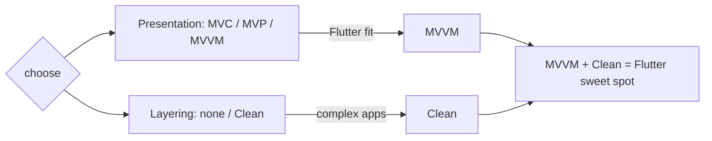

# MVC Tradeoffs & Comparison (MVC vs MVP/MVVM/Clean)

> MVC's strength is **familiarity + simplicity** for small apps; its weakness in Flutter is that **classic MVC doesn't fit the reactive model** (it degrades into MVVM or god-controllers). The presentation-pattern family differs mainly in **how the view learns of changes and how tightly it's coupled to presentation logic**: **MVC** (controller mediates, view often reads model), **MVP** (presenter drives a passive view via an interface — good testability, more boilerplate), **MVVM** (view **binds** to an observable view model — the natural fit for reactive Flutter). **Clean Architecture** is orthogonal — a **layering** scheme these presentation patterns plug into. Choose by fit, not fashion.

## Introduction

This file weighs MVC's pros/cons in Flutter and compares it to MVP, MVVM, and Clean Architecture so you can choose deliberately. It's the decision-making capstone-context before building a pragmatic MVC feature ([mvc_integration.md](mvc_integration.md)).

## Why this concept exists

Teams pick architecture by habit or hype. Knowing precisely how these patterns differ — and that Clean Architecture is a different axis (layering) than MVC/MVP/MVVM (presentation) — lets you combine them correctly (e.g., MVVM presentation + Clean layering) and avoid forcing classic MVC onto a reactive framework.

## Real-world analogy

The patterns are **different ways a shop floor talks to the back office**: **MVC** — a waiter relays orders and the floor peeks at the kitchen board; **MVP** — a manager (presenter) tells each passive display exactly what to show through a strict script (interface); **MVVM** — displays **subscribe to a live status board** (view model) and auto-update. **Clean Architecture** isn't a floor-to-office style at all — it's **how the whole building is organized into departments** (layers), regardless of which floor-talk style you use.

## Problem Statement

Given a Flutter feature, decide among MVC/MVP/MVVM and whether/how to combine with Clean Architecture, justifying by testability, fit with reactivity, boilerplate, and team size. You'll compare the patterns and pick appropriately.

## Internal Working

```mermaid
flowchart TD
    subgraph Presentation patterns (how view gets updates)
      MVC[MVC: controller mediates; view reads model]
      MVP[MVP: presenter drives passive view via interface]
      MVVM[MVVM: view binds to observable view model]
    end
    Clean[Clean Architecture: LAYERING (domain/data/presentation)] --- Presentation[plug a presentation pattern into the presentation layer]
    MVVM -->|natural fit| Flutter[reactive Flutter]
```

- **MVC**:
  - **+** Simple, familiar, minimal ceremony; fine for small apps/prototypes.
  - **−** In Flutter it doesn't map cleanly (reactive vs imperative → becomes MVVM or a god-controller); ambiguous variants; controller-view coupling can grow; testability depends on how you build it.
- **MVP** (Model-View-Presenter — [Module 42](../42%20MVP/README.md)):
  - **+** Highly **testable** (presenter talks to a **view interface** → mock the view); explicit contract; passive view.
  - **−** More **boilerplate** (view interfaces + wiring); the presenter↔view interface feels unnatural in reactive Flutter; less popular here.
- **MVVM** (Model-View-ViewModel — [Module 43](../43%20MVVM/README.md)):
  - **+** **Natural fit for Flutter** — the view **binds** to an observable **view model** (state holder), matching UI = f(state); testable view model; scoped rebuilds. This is what most "Flutter MVC/GetX/Provider/Riverpod" apps actually are.
  - **−** Binding/observability plumbing; risk of fat view models (mitigated by delegating to use cases).
- **Clean Architecture** (different axis — [Module 40](../40%20Clean%20Architecture/README.md)):
  - It's **layering** (domain/data/presentation + dependency rule), **not** a view-update style. You **combine** it with a presentation pattern: e.g., **MVVM view models in the presentation layer** calling **use cases** in the domain. "Clean + MVVM" is the common Flutter combo.
- **Decision guide**:
  - Small/prototype → **MVC/MVVM-lite** (a controller + reactive view), minimal layering.
  - Typical app → **MVVM** presentation (state holder + reactive view).
  - Complex/long-lived/team → **Clean Architecture layering + MVVM presentation** (+ DDD in the domain if warranted — [Module 46](../46%20Domain%20Driven%20Design/README.md)).
  - MVP → when you want strict view-interface testability (rarer in Flutter).
- **Key insight**: pick a **presentation pattern** (MVC/MVP/MVVM) *and* decide **how much layering** (Clean) — they're **orthogonal** choices; MVVM + Clean is the Flutter sweet spot.

## Memory Representation

Not applicable — architectural comparison. The differences are structural (who holds state, how updates propagate, how layers are organized).

## Compiler Behavior

Not applicable.

## Runtime Behavior

MVVM/reactive: state change → binding → scoped rebuild. MVP: presenter calls view-interface methods. MVC: controller mutates model → notify → view reads. Clean layering adds indirection (use cases/interfaces) regardless.

## Flutter Engine Behavior

Reactive patterns (MVVM) align with the rebuild-from-state engine model; imperative view updates (classic MVC/MVP interface calls) fit less naturally.

## Dart VM Behavior

All presentation logic (controller/presenter/view model) is plain Dart → unit-testable; MVP/MVVM emphasize this most.

## Examples

```text
Decision cheat-sheet (Flutter):
  Prototype / tiny app        -> MVVM-lite (controller + reactive view), little layering
  Standard app                -> MVVM (state holder binds to view), repositories
  Complex / long-lived / team -> Clean Architecture (layers + dependency rule) + MVVM presentation (+DDD if needed)
  Need strict view-mock tests -> MVP (presenter + view interface) — rarer in Flutter
  "We use MVC" (GetX/Provider) -> usually MVVM in disguise — fine, name it correctly

  Orthogonal axes:
    Presentation pattern: MVC | MVP | MVVM   (how the view updates)
    Layering:             none | Clean       (how code is organized)
    Common Flutter combo: MVVM + Clean
```

```dart
// Same feature, MVVM (natural Flutter) + Clean (layering): view model calls a use case
class ProfileViewModel extends ChangeNotifier {   // presentation (MVVM)
  final GetProfile getProfile;                    // domain use case (Clean)
  ProfileViewModel(this.getProfile);
  // ... holds observable state; view binds; delegates rules/IO downward
}
```

## Diagrams



## Common Mistakes

| Mistake | Why | Fix |
|---------|-----|-----|
| Treating Clean vs MVVM as either/or | They're orthogonal | Combine (MVVM presentation + Clean layers) |
| Forcing classic MVC on reactive Flutter | Friction/god-controllers | Use MVVM (reactive fit) |
| Picking by hype/habit | Wrong fit for app size | Choose by testability/fit/complexity |
| Over-layering a tiny app | Boilerplate w/o payoff | Right-size (MVVM-lite) |
| Under-structuring a complex app | Tangles, untestable | Add Clean layering |
| Mislabeling MVVM as MVC | Confusion | Name the pattern correctly |
| Fat view models/presenters | Untestable god-objects | Delegate to use cases/services |

## Best Practices

- Choose a **presentation pattern** (MVC/MVP/**MVVM**) and, **separately**, how much **Clean layering** — they're orthogonal; **MVVM + Clean** is the Flutter sweet spot.
- Prefer **MVVM** for Flutter (matches reactive UI = f(state)); use **MVP** only when strict view-interface testability is worth the boilerplate; use **MVC/MVVM-lite** for tiny apps.
- **Right-size**: minimal structure for prototypes, full Clean layering for complex/long-lived/team apps; **name patterns honestly**.
- Regardless of pattern, keep **presentation logic testable** (plain Dart) and **delegate rules/IO downward** (Model/use cases) to avoid god-objects.

## Performance

No inherent perf differences among patterns; MVVM's scoped bindings can be very efficient. Over-layering adds negligible runtime cost but real dev cost — the perf-relevant concern is scoping rebuilds, not the pattern label ([Module 21](../21%20Performance/README.md)).

## Advantages / Disadvantages

- **+** (Choosing well) right-sized, testable, framework-aligned architecture; clear combination of presentation + layering.
- **−** (Choosing poorly) friction (classic MVC on reactive), boilerplate (MVP), or tangles (under-structuring); confusion from mislabeling.

## Interview Questions

1. **🟢 How do MVC, MVP, and MVVM differ?** — By how the view is updated/coupled: MVC (controller mediates, view reads model), MVP (presenter drives a passive view via an interface), MVVM (view binds to an observable view model).
2. **🟢 Which fits Flutter best and why?** — MVVM — the view binds to observable state, matching Flutter's UI = f(state) reactive model.
3. **🟡 Is Clean Architecture an alternative to MVVM?** — No — Clean is layering (a different axis); you combine it with a presentation pattern (commonly MVVM).
4. **🟡 When would you use MVP in Flutter?** — When you want strict, view-interface-mockable testability and accept the extra boilerplate (uncommon in Flutter).
5. **🟡 Why does classic MVC strain in Flutter?** — Its imperative "controller updates view" flow conflicts with declarative rebuild-from-state; it tends to become MVVM or a god-controller.
6. **🔴 How do you decide the architecture for a new app?** — By size/complexity/longevity/team: prototype → MVVM-lite; standard → MVVM; complex → Clean + MVVM (+DDD if warranted).
7. **🔴 What's the common failure mode across all these patterns?** — Fat presenters/controllers/view models (god-objects) — fixed by delegating rules/IO to use cases/services.

## Senior Engineer Tips

- Separate the two decisions explicitly — "which presentation pattern?" and "how much layering?" — most architecture arguments conflate them; MVVM + Clean answers both well for Flutter.
- Default to MVVM in Flutter and add Clean layering as complexity grows; don't force classic MVC or adopt MVP's boilerplate without a testability reason.
- Name your pattern honestly (a bound view model is MVVM, not MVC); mislabeling breeds confused code reviews and onboarding.

## Architect Perspective

MVC/MVP/MVVM answer "how does the view stay in sync?"; Clean Architecture answers "how is the code layered?" — orthogonal concerns you compose. In Flutter, reactivity makes **MVVM** the natural presentation choice, and **Clean layering** scales it for complex apps, with DDD deepening the domain when warranted. MVC's lasting value is conceptual (separation of concerns); its literal form is superseded by MVVM in reactive frameworks. Choose by fit and complexity, combine the axes, and keep presentation logic testable ([Module 43](../43%20MVVM/README.md), [Module 40](../40%20Clean%20Architecture/README.md), [Module 46](../46%20Domain%20Driven%20Design/README.md)).

## Summary

- MVC (simple, familiar; strains in reactive Flutter → MVVM/god-controller), MVP (testable via view interface, more boilerplate), MVVM (natural reactive fit — view binds to view model).
- Clean Architecture is orthogonal **layering**, combined with a presentation pattern; **MVVM + Clean** is the Flutter sweet spot.
- Choose by testability/fit/complexity/team, right-size, name honestly, delegate to avoid god-objects.

## Revision Notes

- MVC: controller mediates/view reads model (simple; reactive-Flutter friction). MVP: presenter drives passive view via interface (testable; boilerplate). MVVM: view binds observable view model (Flutter-natural).
- Clean = layering (orthogonal), combine with presentation pattern (MVVM+Clean common). Choose by size/complexity/team; right-size; name honestly; delegate to avoid god-objects.

## Practice Questions

1. How do MVC/MVP/MVVM differ in view updating/coupling?
2. Why is Clean Architecture not an alternative to MVVM?
3. Which pattern(s) would you pick for a prototype vs a complex team app?

## Coding Questions

1. Express the same feature in MVC-reactive and MVVM and note the difference.
2. Combine MVVM presentation with a Clean use case call.
3. Justify a pattern choice for three app scenarios.

## Mini Project

**Architecture decision doc (Flutter):** For three scenarios (prototype, standard app, complex team app), recommend a presentation pattern (MVC/MVP/MVVM) and layering level (none/Clean), justify by testability/fit/complexity, and show a small code sketch of the recommended combo (e.g., MVVM + Clean) for the standard app. Acceptance: presentation vs layering treated as orthogonal axes; MVVM identified as the reactive fit; recommendations justified per scenario; combo sketch (view model → use case) correct; honest naming.
