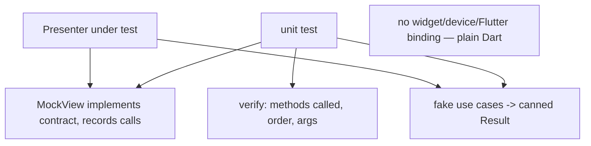
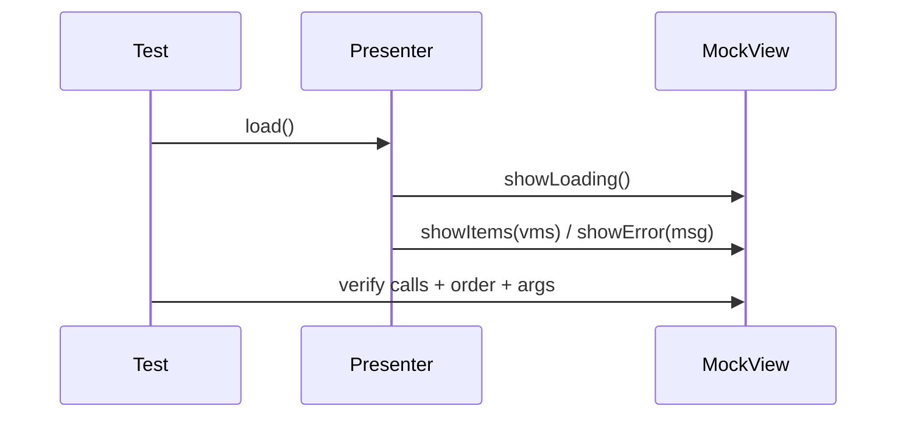

# MVP Testability (Mock the View, Test the Presenter)

> MVP's headline benefit: because the presenter depends on a **view interface**, you **mock the view** and unit-test the presenter in **plain Dart** — asserting it calls the right contract methods, in the right order, with the right arguments (`verify(view.showLoading())` then `verify(view.showItems(...))`). All presentation logic is testable **without a widget, device, or Flutter binding**, and the passive view has **no logic to test** (only a thin widget test that it renders contract calls). This is MVP's strongest selling point — and exactly the capability MVVM achieves differently.

## Introduction

This file shows how MVP's view contract turns presentation logic into fast, device-free unit tests via a mocked view, what to assert (calls/order/args), and how it splits testing responsibilities (presenter = logic tests; view = thin render tests). It's the payoff of the contract ([02_presenter_and_view_contract.md](02_presenter_and_view_contract.md)).

## Why this concept exists

Presentation logic (loading→data/error sequencing, mapping, decisions) is where UI bugs live, and testing it through the real UI is slow and flaky. MVP isolates that logic in the presenter behind a mockable interface, so you can test it exhaustively and quickly — the reason MVP was created (to make MVC's logic testable).

## Real-world analogy

Testing the presenter with a mock view is like **rehearsing a director with a stand-in crew that just writes down every cue called**. You don't need the real, expensive stage (device/UI) — you verify the director calls "lights, curtain, slide 3" in the correct order for each scenario. If the director's logic is right against the stand-in, it's right on the real stage.

## Problem Statement

Unit-test a `ProductListPresenter`: verify that `load()` calls `showLoading()` then `showItems(...)` on success and `showError(...)` on failure, and that a tap triggers `navigateToDetail(id)` — all with a **mock view**, no device. You'll write presenter tests using a mocked contract.

## Internal Working



- **Mock the view**: create a **mock implementing the view interface** (via `mockito`/`mocktail` or a hand-written recorder) that captures which methods were called with what args ([Module 49](../49%20Testing/README.md)).
- **Fake the dependencies**: inject **fake use cases/repositories** returning canned `Result`s so you control the scenario (success/empty/failure).
- **Drive the presenter**: `attach(mockView)`, call presenter methods (`load()`, `onItemTapped(id)`), then **assert on the mock**:
  - **Which methods** were called (`showLoading`, `showItems`/`showError`).
  - **Order** (loading before data/error).
  - **Arguments** (correct view models/messages, mapped correctly).
  - **Effects** (navigate called once with the right id).
- **No Flutter binding**: presenter + interface + fakes are **plain Dart** → tests run in the fast unit tier (no `WidgetsFlutterBinding`, no device) ([Module 40](../40%20Clean%20Architecture/README.md)).
- **View tests are thin**: the passive view has no logic, so its test is a **small widget test** verifying it renders the right UI when contract methods are invoked (or is skipped if trivial). The bulk of testing is on the presenter.
- **What you get**: exhaustive, fast coverage of presentation logic (sequencing, mapping, decisions, error handling) — MVP's core value.
- **Same idea in MVVM**: MVVM gets equivalent testability by asserting the **view model's emitted state sequence** (no mock view needed) — a more reactive-friendly variant ([Module 43](../43%20MVVM/README.md)).

## Memory Representation

The mock view records call events (method + args) for assertions; fakes hold canned results. The presenter holds the mock (as the interface) + fakes. No widget tree/element tree exists in these tests.

## Compiler Behavior

The mock must implement the full view interface (compile-checked). The presenter compiles against the interface, so the mock substitutes seamlessly.

## Runtime Behavior

Tests run synchronously/async in the Dart VM: call presenter method → it calls mock contract methods → assertions inspect recorded calls. Fast and deterministic (no I/O, no UI).

## Flutter Engine Behavior

None — these are pure Dart unit tests (no engine/binding). Only optional thin view tests use the Flutter test binding.

## Dart VM Behavior

Fastest test tier (no Flutter binding); mocks/fakes are cheap objects.

## Examples

```dart
import 'package:mocktail/mocktail.dart';
import 'package:test/test.dart';

class MockView extends Mock implements ProductListView {} // mock the contract
class FakeGetProducts extends Fake implements GetProducts {
  final Result<List<Product>> result;
  FakeGetProducts(this.result);
  @override
  Future<Result<List<Product>>> call() async => result;
}

void main() {
  test('load: shows loading then items on success', () async {
    final view = MockView();
    final presenter = ProductListPresenter(FakeGetProducts(Success([Product('1','A')])));
    presenter.attach(view);

    await presenter.load();

    verifyInOrder([                       // assert methods + ORDER
      () => view.showLoading(),
      () => view.showItems(any()),        // (could capture + assert mapped view models)
    ]);
    verifyNever(() => view.showError(any()));
  });

  test('load: shows error on failure', () async {
    final view = MockView();
    final presenter = ProductListPresenter(FakeGetProducts(Failure(NetworkFailure())));
    presenter.attach(view);

    await presenter.load();

    verify(() => view.showLoading()).called(1);
    verify(() => view.showError(any())).called(1);   // mapped message
  });

  test('tap navigates once with id', () {
    final view = MockView();
    final presenter = ProductListPresenter(FakeGetProducts(Success([])))..attach(view);
    presenter.onItemTapped('42');
    verify(() => view.navigateToDetail('42')).called(1); // effect fired once
  });
}
```

## Diagrams



## Common Mistakes

| Mistake | Why | Fix |
|---------|-----|-----|
| Testing through the real widget | Slow/flaky | Mock the view; unit-test the presenter |
| Presenter depends on the concrete widget | Can't mock | Depend on the view interface |
| Logic in the view | Untestable via presenter tests | Keep view passive; logic in presenter |
| Not asserting order/args | Misses sequencing/mapping bugs | `verifyInOrder` + capture args |
| Real I/O in tests | Slow/nondeterministic | Fake use cases/repositories |
| Not testing effect-once | Re-fire bugs slip through | Assert effect called exactly once |
| Skipping failure/empty scenarios | Unhappy paths untested | Cover success/empty/error |

## Best Practices

- **Mock the view** (implement the contract) and **fake the dependencies** (canned `Result`s); **unit-test the presenter** in plain Dart (no device).
- Assert **which methods, in what order, with what arguments** (`verifyInOrder`, arg capture) — covering **loading→data/error** sequencing, **mapping** correctness, and **effects fired once**.
- Cover **success/empty/failure** scenarios; keep the **view passive** so presenter tests cover the logic and view tests stay thin.
- Recognize MVVM offers the **same testability** by asserting view-model **state sequences** — choose the reactive variant for Flutter.

## Performance

Presenter tests are the fast unit tier (no binding/UI/I/O) — run in milliseconds, ideal for CI. This test speed is MVP's practical payoff. Thin view tests (if any) are the slower widget tier but minimal since the view has no logic.

## Advantages / Disadvantages

- **+** Fast, exhaustive, device-free tests of all presentation logic; unhappy paths easy to cover; clear split (presenter logic vs thin view).
- **−** Requires interface + mocks (boilerplate); imperative call-verification can be verbose; MVVM achieves the same with less ceremony in Flutter.

## Interview Questions

1. **🟢 How do you test presentation logic in MVP?** — Mock the view (implement the contract), fake the dependencies, drive the presenter, and verify the contract calls (methods/order/args) — plain Dart, no device.
2. **🟢 Why is the presenter easy to test?** — It depends on the view interface and injected fakes, so it runs without a widget/device and its behavior is fully observable via the mock.
3. **🟡 What should presenter tests assert?** — Which contract methods were called, in what order (loading before data/error), with what (mapped) arguments, and that effects fire exactly once.
4. **🟡 How much do you test the view?** — Little — it's passive (no logic); a thin widget test that it renders contract calls, if anything.
5. **🟡 Why fake dependencies instead of using real I/O?** — For fast, deterministic tests; you control success/empty/failure scenarios.
6. **🔴 How does MVVM achieve similar testability differently?** — By asserting the view model's emitted state sequence (loading→data/error) instead of verifying imperative view calls — more reactive-friendly.
7. **🔴 What bug class does asserting "effect called once" catch?** — Re-firing navigation/snackbars on re-render (effects mismodeled as state).

## Senior Engineer Tips

- Verify order and arguments, not just that a method was called — most presentation bugs are wrong sequencing (data before loading cleared) or wrong mapping, which only order/arg assertions catch.
- Cover the unhappy paths (empty, network failure, validation) explicitly; MVP makes them trivial to test, so there's no excuse to skip them.
- If the ceremony of mocking imperative view calls feels heavy, that's a signal MVVM (state-sequence assertions) may suit your Flutter app better — same testability, less boilerplate.

## Architect Perspective

MVP's testability is a direct dividend of the view contract + DIP: isolate presentation logic behind a mockable interface and it becomes fast, exhaustive, device-free unit tests. This is MVP's enduring lesson — testable presentation logic — and it's why the pattern mattered. In reactive Flutter, MVVM inherits the lesson while fitting the framework, asserting state sequences instead of mocked calls; either way, the principle is: **presentation logic belongs in a plain-Dart, testable unit, not the widget** ([02_presenter_and_view_contract.md](02_presenter_and_view_contract.md), [Module 43](../43%20MVVM/README.md), [Module 49](../49%20Testing/README.md)).

## Summary

- MVP's key benefit: mock the view (contract) + fake dependencies → unit-test the presenter in plain Dart (fast, device-free).
- Assert methods/order/args (loading→data/error, mapping, effect-once); cover success/empty/failure; view tests stay thin (passive view).
- MVVM achieves the same testability via state-sequence assertions — the reactive-friendly variant.

## Revision Notes

- Mock the view (implements contract) + fake use cases (canned `Result`); drive presenter; `verifyInOrder`/arg capture (methods/order/args, effect-once).
- Plain-Dart fast tier (no binding/device); passive view → thin/no view tests; cover success/empty/failure.
- Same testability in MVVM via view-model state-sequence assertions (less ceremony, reactive fit).

## Practice Questions

1. What exactly do you assert in a presenter unit test?
2. Why can these tests run without a device or Flutter binding?
3. How does MVVM test the same logic differently?

## Coding Questions

1. Write presenter tests with a mock view for success, empty, and failure.
2. Assert method order and mapped arguments (`verifyInOrder` + capture).
3. Verify a one-off effect (navigation) fires exactly once.

## Mini Project

**Presenter test suite (Flutter):** For the product-list presenter, write a plain-Dart test suite using a mocked view + fake use cases covering: `load` → `showLoading` then `showItems` (success), `showEmpty` (empty), `showError` (failure), and tap → `navigateToDetail(id)` once — asserting order and mapped arguments. Acceptance: presenter tested via mock view (no device); order + args asserted; success/empty/failure covered; effect-once verified; runs in the fast unit tier.
