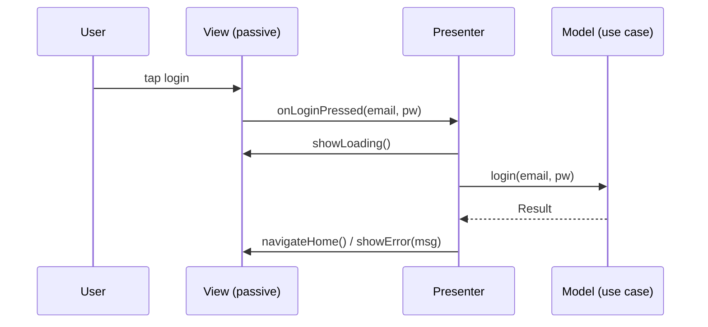

# MVP Fundamentals (Passive View & Presenter)

> MVP splits UI into **Model** (data + rules), **View** (a *passive* UI that implements a **view interface** and does nothing but display what it's told), and **Presenter** (holds all presentation logic, handles input, calls the Model, and **drives the view explicitly** via the interface: `view.showLoading()`, `view.showData(...)`). Unlike MVC, the **View and Presenter have a 1:1 relationship** and the View is **fully passive** — it never reads the Model directly; the Presenter pushes everything to it. This tight, interface-mediated coupling is what makes MVP exceptionally testable.

## Introduction

This file establishes MVP's roles and its distinctive **passive-view + presenter-drives-view** flow, contrasting it with MVC. It's the foundation for the view-contract and testability files.

## Why this concept exists

MVP evolved from MVC to make presentation logic **fully testable** and the View **truly dumb**. By routing *all* view updates through the Presenter via an interface, the View has zero logic (so nothing untestable lives in the UI) and the Presenter can be tested against a **fake view**. It trades some boilerplate for a clean, mockable seam.

## Real-world analogy

MVP is a **puppeteer (Presenter) and a puppet (View)**: the puppet has no will of its own — it only moves exactly as the puppeteer pulls its strings (`showData`, `showError`). The puppeteer consults the script/props (Model) and decides every movement. Because the puppet is completely passive, you can swap it for a **test dummy** and verify the puppeteer pulls the right strings in the right order — that's MVP's testability.

## Problem Statement

For a login feature, assign roles: a passive View interface (methods the presenter calls), a Presenter (input handling + logic + Model calls + driving the view), and a Model (auth rules). Trace the flow of "tap login." You'll map MVP's roles and its presenter-driven data flow.

## Internal Working

```mermaid
flowchart TD
    User[user input] --> View[View (passive): implements interface]
    View -->|forwards event| Presenter[Presenter: logic + input handling]
    Presenter --> Model[Model: data + rules]
    Model -->|result| Presenter
    Presenter -->|drives via interface| View
    Note[View is passive: never reads Model; Presenter pushes everything. 1 View : 1 Presenter]
```

- **Model**: data + business rules + state (UI-agnostic), same as MVC ([Module 41](../41%20MVC/README.md)) — validates, computes, persists (often behind repositories/use cases — [Module 40](../40%20Clean%20Architecture/README.md)).
- **View (passive)**: implements a **view interface** exposing methods the Presenter calls (`showLoading`, `showData(list)`, `showError(msg)`, `navigateHome`). It **forwards user events** to the Presenter and **does nothing else** — no logic, no direct Model access, no formatting decisions. It's a **dumb rendering surface**.
- **Presenter**: holds **all presentation logic** — receives forwarded events, calls the **Model**, decides what to show, and **explicitly drives the View** through the interface. It holds a **reference to the View interface** (not the concrete widget) and typically maps Model data into display form before pushing it.
- **Key differences from MVC**:
  - **Passive View**: MVP's View **never reads the Model**; the Presenter **pushes** everything (in MVC the View often observes/reads the Model).
  - **1:1 View–Presenter**: each View has its own Presenter (MVC controllers can serve multiple views).
  - **Interface-mediated**: the Presenter talks to a **view interface**, enabling mocking ([mvp_testability.md](mvp_testability.md)).
- **Data flow**: input → View forwards to Presenter → Presenter calls Model → Presenter drives View via interface. **Imperative** ("show this now"), not reactive.
- **Presenter lifecycle**: attach/detach the View (`attach(view)`/`detach()`) to avoid calling a disposed view — an explicit lifecycle concern.

## Memory Representation

Presenter holds a reference to the **View interface** + Model/use cases. View holds a reference to the Presenter (to forward events). Communication is method calls both ways (View→Presenter events; Presenter→View interface methods) — no observer/binding.

## Compiler Behavior

The view interface is a normal Dart `abstract class`/interface; the Presenter compiles against it (not the widget), enabling a mock implementation for tests.

## Runtime Behavior

Input triggers presenter methods; the presenter imperatively calls view-interface methods to update the UI. There's no automatic reactivity — the presenter must call the right view methods.

## Flutter Engine Behavior

Covered in [mvp_in_flutter_and_comparison.md](mvp_in_flutter_and_comparison.md) — imperative view-driving conflicts with Flutter's rebuild-from-state model.

## Dart VM Behavior

Presenter is plain Dart (fast tests); the view interface + mock enable device-free testing.

## Examples

```dart
// VIEW INTERFACE — the contract the Presenter drives (passive view implements it)
abstract class LoginView {
  void showLoading();
  void showError(String message);
  void navigateHome();
}

// MODEL side — rules via a use case (domain)
class LoginUser {
  final AuthRepository auth;
  LoginUser(this.auth);
  Future<Result<void>> call(String email, String password) => auth.login(email, password);
}

// PRESENTER — all logic; drives the view through the interface (imperative)
class LoginPresenter {
  final LoginUser loginUser;
  LoginView? _view;                                  // holds the INTERFACE, not the widget
  LoginPresenter(this.loginUser);

  void attach(LoginView view) => _view = view;       // lifecycle: attach/detach
  void detach() => _view = null;

  Future<void> onLoginPressed(String email, String password) async {
    _view?.showLoading();                            // drive the view explicitly
    final r = await loginUser(email, password);
    if (r is Success) { _view?.navigateHome(); }
    else { _view?.showError('Login failed'); }       // push result to the passive view
  }
}
```

## Diagrams



## Common Mistakes

| Mistake | Why it's wrong | Fix |
|---------|---------------|-----|
| View reads the Model directly | Breaks passive-view rule | Presenter pushes all data to the view |
| Logic in the View | Untestable UI | All logic in the Presenter |
| Presenter references the concrete widget | Can't mock/test | Depend on the view interface |
| No attach/detach | Calling a disposed view → errors | Manage presenter/view lifecycle |
| One presenter for many views | Breaks 1:1 relationship | One presenter per view |
| Presenter importing Flutter UI | Couples/untestable | Presenter plain Dart + interface |
| Business rules in the Presenter | Belongs in Model/use case | Delegate rules downward |

## Best Practices

- Keep the **View fully passive** (implements the interface, forwards events, **never reads the Model**) and put **all presentation logic in the Presenter**.
- Have the Presenter **depend on the view interface** (not the widget) and **drive it explicitly**; maintain **attach/detach** lifecycle.
- Keep the **Presenter plain Dart** (no Flutter UI imports) and **delegate business rules** to the Model/use cases ([Module 40](../40%20Clean%20Architecture/README.md)).
- Maintain **1:1 View↔Presenter**; map Model data to display form in the Presenter before pushing.

## Performance

Not a perf concern at this level; imperative updates are direct method calls. (Flutter-specific efficiency/friction is in [mvp_in_flutter_and_comparison.md](mvp_in_flutter_and_comparison.md).)

## Advantages / Disadvantages

- **+** Fully testable presentation logic (mock the view), truly dumb view, explicit contract, clear separation.
- **−** Boilerplate (view interfaces + attach/detach), imperative (doesn't fit reactive UIs), 1:1 rigidity, presenter can bloat.

## Interview Questions

1. **🟢 What are MVP's three roles?** — Model (data/rules), passive View (implements an interface, forwards events), Presenter (all logic, drives the view via the interface).
2. **🟢 What makes MVP's View "passive"?** — It has no logic and never reads the Model; the Presenter pushes everything to it via the interface.
3. **🟡 How does MVP differ from MVC?** — Passive view (vs view reading the model), 1:1 view–presenter, and interface-mediated presenter→view calls (vs controller mediation).
4. **🟡 Why does the Presenter depend on a view interface?** — So it can be tested against a mock view and isn't coupled to the concrete widget.
5. **🟡 What lifecycle concern does MVP add?** — attach/detach — the presenter must not call a detached/disposed view.
6. **🔴 Where do business rules live in MVP?** — In the Model/use cases; the Presenter holds presentation logic and delegates rules downward.
7. **🔴 Why is MVP's flow "imperative"?** — The Presenter explicitly calls view methods (`showX`) to update the UI, rather than the view reacting to observable state.

## Senior Engineer Tips

- Keep the presenter free of Flutter imports and depending only on the view interface; that single rule is what unlocks MVP's whole testability story.
- Enforce the passive-view rule ruthlessly — the moment a widget reads the model or formats data, MVP's benefit evaporates.
- Manage attach/detach carefully (null-safe `_view?.`) so async results never call into a disposed widget.

## Architect Perspective

MVP's insight is the **explicit view contract**: routing all view updates through an interface makes presentation logic fully mockable and the view truly dumb. That testability idea is MVP's lasting contribution — but its **imperative presenter-drives-view** flow predates reactive UIs, which is why MVVM (achieving similar testability via observable state) fits Flutter better. Understand MVP for the contract/testability concept; reach for MVVM in practice ([presenter_and_view_contract.md](presenter_and_view_contract.md), [Module 43](../43%20MVVM/README.md)).

## Summary

- MVP: Model (data/rules) + passive View (implements interface, forwards events, never reads Model) + Presenter (all logic, drives view via interface).
- 1:1 view–presenter, interface-mediated, imperative flow; presenter plain Dart + attach/detach lifecycle; rules delegated to Model/use cases.
- Passive view + interface = MVP's testability foundation.

## Revision Notes

- Model = data/rules (UI-agnostic); View = passive (implements interface, forwards events, no Model access/logic); Presenter = all logic, drives view via interface (imperative), plain Dart, attach/detach.
- 1:1 view↔presenter; presenter depends on view interface (mockable); rules → Model/use cases.
- Flow: input → view forwards → presenter → Model → presenter drives view (`showLoading/showData/showError`).

## Practice Questions

1. What does "passive view" mean and why does it matter?
2. How does the presenter update the UI, and how is that different from MVC?
3. Why does the presenter depend on an interface, not the widget?

## Coding Questions

1. Define a view interface + a presenter that drives it for a login flow.
2. Add attach/detach lifecycle and null-safe view calls.
3. Delegate the auth rule to a use case (keep the presenter presentation-only).

## Mini Project

**MVP role mapping (Flutter):** For a login feature, define a `LoginView` interface (`showLoading/showError/navigateHome`), a `LoginPresenter` (plain Dart, drives the view, calls a `LoginUser` use case, attach/detach), and a widget implementing the view (passive: forwards events, renders what it's told). Acceptance: view passive (no logic/Model access); presenter holds logic + drives via interface (no Flutter imports); attach/detach lifecycle; rules in the use case; imperative flow correct.
