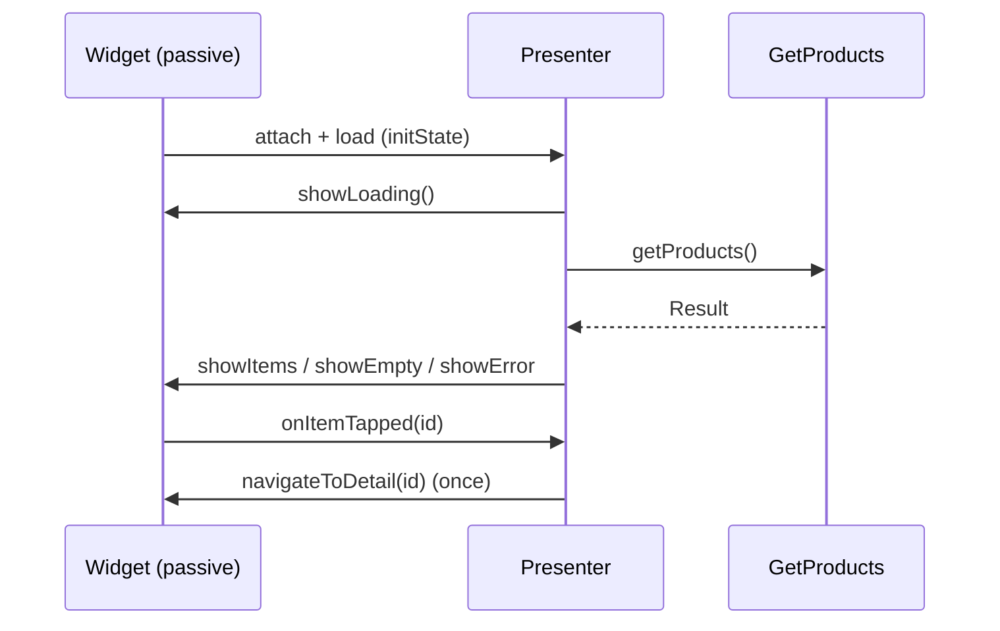

# MVP Integration (Capstone: An MVP Feature + Mocked-View Test)

> Build one complete MVP feature — **Model** (use cases/repository), **view contract** (interface), **Presenter** (drives the view, plain Dart, attach/detach, effect-once), and a **passive widget** implementing the contract — then write the **hallmark test**: unit-test the presenter against a **mocked view**, asserting the contract calls (order/args) for success/empty/failure. Finish with an honest note that in reactive Flutter you'd usually pick **MVVM** (same testability, less friction), making this capstone a demonstration of the **pattern + its testability**, not a production recommendation.

## Introduction

This module capstone assembles fundamentals, the view contract, testability, and the Flutter comparison into one working MVP feature with its defining test. It shows MVP done correctly (so you understand it fully) and closes with the practical recommendation.

## Why this concept exists

Seeing MVP end-to-end — especially the mocked-view presenter test — cements both its mechanics and its core value (testable presentation logic). Building it also makes the imperative friction tangible, reinforcing why MVVM is the idiomatic Flutter choice while carrying MVP's testability lesson forward.

## Real-world analogy

This is a **full dress rehearsal with a stand-in crew**: you stage the whole production (Model/contract/presenter/view), then rehearse the director (presenter) against a stand-in that records every cue (mock view) to prove the logic — while noting that on this particular (digital/reactive) stage, a live-preview workflow (MVVM) would be the natural way to run the show.

## Problem Statement

Build a "products" feature in MVP: `GetProducts` use case + repository (Model), a `ProductListView` contract, a `ProductListPresenter` (drives the view, attach/detach, effect-once navigation), and a passive widget implementing the contract — then unit-test the presenter with a mocked view for success/empty/failure/tap. You'll compose the module into one slice + its test.

## Internal Working

```mermaid
flowchart TD
    Widget[Passive Widget: implements contract, forwards events] -->|events| Presenter[Presenter: plain Dart, drives view]
    Presenter --> UC[GetProducts use case (Model/domain)]
    UC --> Repo[ProductRepository (data)]
    Presenter -->|showLoading/showItems/showError/navigate| Contract[ProductListView contract]
    Contract -.implemented by.-> Widget
    Contract -.mocked in.-> Test[Presenter unit test]
    DI[DI: inject use case -> presenter; attach view] --- Presenter
```

- **Model** ([Module 40](../40%20Clean%20Architecture/README.md)): `GetProducts` use case over a `ProductRepository`; rules/IO live here, returning `Result`.
- **View contract** ([presenter_and_view_contract.md](presenter_and_view_contract.md)): `ProductListView` with presentation-only methods — state (`showLoading/showItems(vm)/showEmpty/showError(msg)`) + effect (`navigateToDetail(id)`).
- **Presenter** ([mvp_fundamentals.md](mvp_fundamentals.md)): plain Dart; `attach/detach`; on `load()` drives `showLoading` → maps `Result` → `showItems`/`showEmpty`/`showError`; on tap → `navigateToDetail` (once). No Flutter imports, no rules/IO (delegated).
- **Passive widget**: implements `ProductListView`, translating contract calls into UI (`setState`/controllers), and forwards events (`initState`→`presenter.attach(this)`+`load()`; `dispose`→`detach()`; button→`presenter.onItemTapped(id)`). No logic beyond rendering.
- **Wiring (DI)**: inject the use case into the presenter; the widget owns/attaches the presenter ([Module 14](../14%20Dependency%20Injection/README.md)).
- **The hallmark test** ([mvp_testability.md](mvp_testability.md)): mock `ProductListView`, fake `GetProducts`, drive the presenter, and `verify` the contract calls (order/args) for success/empty/failure + effect-once — plain Dart, no device.
- **Honest note** ([mvp_in_flutter_and_comparison.md](mvp_in_flutter_and_comparison.md)): document the imperative friction (contract-call translation, effect-once, attach/detach) and that **MVVM** would give equal testability with better fit — so MVP here is educational/legacy, not the default.

## Memory Representation

Presenter holds the view interface + use case (+ attach state). Widget holds the presenter + local UI state it sets from contract calls. Test holds a mock (records calls) + fakes (canned results).

## Compiler Behavior

Presenter compiles UI-free (against the interface); widget + mock must implement the full contract. DI wires use case → presenter.

## Runtime Behavior

`initState` attaches + loads → presenter calls `showLoading`/`showItems`/etc. → widget updates; tap → `navigateToDetail` once; `dispose` detaches (no calls to a gone view). Imperative throughout.

## Flutter Engine Behavior

The widget translates contract calls into `setState`/rebuilds — the adaptation of MVP's imperative model to Flutter's reactive engine ([mvp_in_flutter_and_comparison.md](mvp_in_flutter_and_comparison.md)).

## Dart VM Behavior

Presenter/use case/model tests are fast plain Dart; only the (thin) widget test uses the Flutter binding.

## Examples

```dart
// PRESENTER — drives the contract; plain Dart; attach/detach; effect-once
class ProductListPresenter {
  final GetProducts getProducts;
  ProductListView? _view;
  ProductListPresenter(this.getProducts);
  void attach(ProductListView v) => _view = v;
  void detach() => _view = null;

  Future<void> load() async {
    _view?.showLoading();
    final r = await getProducts();
    switch (r) {
      case Success(:final value) when value.isEmpty: _view?.showEmpty();
      case Success(:final value): _view?.showItems(value.map(ProductVm.from).toList());
      case Failure(:final error): _view?.showError(messageFor(error));
    }
  }
  void onItemTapped(String id) => _view?.navigateToDetail(id); // one-off effect
}
```

```dart
// PASSIVE WIDGET — implements the contract, translates calls to UI, forwards events
class ProductListScreen extends StatefulWidget { /* ... */ }
class _State extends State<ProductListScreen> implements ProductListView {
  late final ProductListPresenter presenter = ProductListPresenter(getIt());
  Widget _body = const SizedBox();
  @override void initState() { super.initState(); presenter.attach(this); presenter.load(); }
  @override void dispose() { presenter.detach(); super.dispose(); }         // lifecycle
  @override void showLoading() => setState(() => _body = const CenteredSpinner());
  @override void showItems(List<ProductVm> v) => setState(() => _body = ProductList(v,
      onTap: presenter.onItemTapped));
  @override void showEmpty() => setState(() => _body = const EmptyState('No products'));
  @override void showError(String m) => setState(() => _body = ErrorView(message: m, onRetry: presenter.load));
  @override void navigateToDetail(String id) => Navigator.pushNamed(context, '/product/$id'); // effect once
  @override Widget build(BuildContext c) => Scaffold(body: _body);
}
```

```dart
// HALLMARK TEST — mock the view, verify contract calls (no device)
test('load success: showLoading then showItems', () async {
  final view = MockProductListView();
  final p = ProductListPresenter(FakeGetProducts(Success([Product('1','A')])))..attach(view);
  await p.load();
  verifyInOrder([() => view.showLoading(), () => view.showItems(any())]);
  verifyNever(() => view.showError(any()));
});
```

## Diagrams



## Common Mistakes

| Mistake | Why | Fix |
|---------|-----|-----|
| Logic in the widget | View not passive | All logic in the presenter |
| Presenter imports Flutter/holds widget | Untestable/coupled | Plain Dart + view interface |
| No attach/detach | Calls to disposed view | Lifecycle in initState/dispose |
| Effect re-fires | Navigate on rebuild | One-off effect handling |
| Rules/IO in presenter | Wrong layer | Delegate to use cases/repo |
| Only happy-path tests | Misses unhappy paths | Test success/empty/failure/effect |
| Presenting MVP as the Flutter default | Ignores reactive friction | Note MVVM is idiomatic |

## Best Practices

- Compose **Model (use cases/repo) + view contract + plain-Dart Presenter (attach/detach, effect-once) + passive widget**; wire via DI.
- Keep the **presenter UI-free** (drives the interface, delegates rules/IO) and the **widget passive** (translate contract calls, forward events).
- Write the **mocked-view presenter test** covering **success/empty/failure + effect-once** (order/args) — MVP's defining payoff.
- **Document the friction + recommend MVVM** for reactive Flutter; treat this as understanding-the-pattern, not a production default.

## Performance

No architectural overhead; the widget still ultimately rebuilds via `setState`. Presenter tests are the fast unit tier. The costs are boilerplate/friction (dev-facing), which is exactly why MVVM is preferred in Flutter.

## Advantages / Disadvantages

- **+** Demonstrates a clean, fully-testable contract; passive view; strong mocked-view tests; conceptual clarity.
- **−** Imperative friction (contract→`setState` translation), boilerplate, effect/lifecycle handling; not idiomatic Flutter (MVVM preferred).

## Interview Questions

1. **🟢 What are the pieces of an MVP feature?** — Model (use cases/repo), view contract (interface), presenter (drives the view, plain Dart), passive widget implementing the contract.
2. **🟢 What's the hallmark MVP test?** — Unit-testing the presenter against a mocked view, verifying contract calls (order/args) for success/empty/failure/effect — no device.
3. **🟡 How does the passive widget adapt to Flutter?** — It translates contract calls (`showItems`, etc.) into `setState`/rebuilds and forwards events — the imperative-to-reactive adaptation.
4. **🟡 Where do rules/IO and effect-once handling live?** — Rules/IO in use cases/repo (delegated); effect-once handled so navigation fires once (not on rebuild).
5. **🟡 What lifecycle wiring is required?** — attach in `initState` (+ load), detach in `dispose`, null-safe view calls.
6. **🔴 Why is this educational rather than the default in Flutter?** — The imperative friction/boilerplate; MVVM gives equal testability with a natural reactive fit.
7. **🔴 How would you convert this to MVVM?** — Replace the contract+presenter with a view model exposing observable state; the widget binds and rebuilds; test by asserting the state sequence.

## Senior Engineer Tips

- Build the presenter test first (mock view, fakes) — it clarifies the contract and proves the logic before any widget exists; that's MVP's whole point realized.
- Keep the widget a pure translator of contract calls and event forwarder; the instant it holds logic, MVP's benefit is gone.
- Ship the honest recommendation: understand MVP, prefer MVVM in Flutter — and know how to convert one to the other.

## Architect Perspective

This capstone demonstrates MVP's mechanics and its enduring value (mockable, testable presentation logic) while making its reactive-Flutter friction concrete. The transferable takeaway — presentation logic in a plain-Dart testable unit, a dumb view reflecting it — is exactly what MVVM realizes idiomatically. Combined with Clean layering underneath, the pattern choice becomes: **MVVM presentation + Clean layering** for Flutter, with MVP understood as the explicit-contract ancestor ([mvp_testability.md](mvp_testability.md), [Module 43](../43%20MVVM/README.md), [Module 40](../40%20Clean%20Architecture/README.md)).

## Summary

- MVP feature = Model (use cases/repo) + view contract + plain-Dart presenter (attach/detach, effect-once) + passive widget; wired by DI.
- Hallmark test: mock the view, verify contract calls (order/args) for success/empty/failure/effect — fast, device-free.
- Document the imperative friction and recommend MVVM for Flutter; know the MVP→MVVM conversion.

## Revision Notes

- Pieces: use case/repo (Model) + view contract (interface) + presenter (drives view, plain Dart, attach/detach, effect-once, delegates rules/IO) + passive widget (translate calls, forward events); DI-wired.
- Test: mock view + fake use case; `verifyInOrder`/args for success/empty/failure + effect-once (no device).
- Friction (imperative→`setState`, effect-once, lifecycle) → document; prefer MVVM in Flutter; MVP→MVVM = contract/presenter → observable state/view model.

## Practice Questions

1. Trace load() through the MVP pieces and its contract calls.
2. What exactly does the presenter test assert, and why no device?
3. How would you convert this feature to MVVM?

## Coding Questions

1. Build the full MVP products feature (Model/contract/presenter/passive widget) + DI.
2. Write the mocked-view presenter test (success/empty/failure/effect).
3. Convert the presenter+contract to an MVVM view model + bound view.

## Mini Project

**MVP feature + presenter test (capstone — Flutter):** Build a "products" feature in MVP — `GetProducts` use case + repository, a `ProductListView` contract, a plain-Dart `ProductListPresenter` (attach/detach, effect-once navigation, delegates rules/IO), and a passive widget implementing the contract — wired by DI. Write the hallmark presenter unit test with a mocked view (success/empty/failure/effect, order/args). Document the imperative friction and sketch the MVVM conversion. Acceptance: view passive; presenter UI-free + drives contract + delegates; attach/detach + effect-once handled; presenter unit-tested via mock view (no device); friction documented + MVVM conversion sketched; runs end-to-end.
