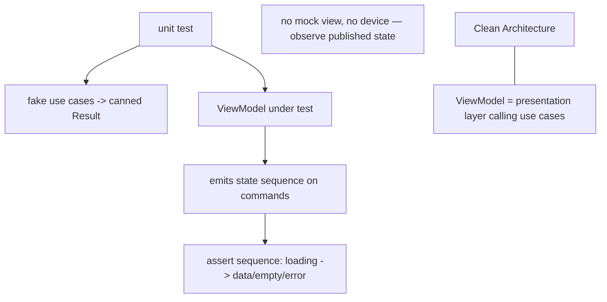

# MVVM Testing & Comparison

> MVVM's testability comes for free from its design: because the **ViewModel exposes observable state**, you test presentation logic by **driving commands and asserting the emitted state sequence** (`[loading, data]` / `[loading, error]`) with **fake use cases** — no mock view, no device (`blocTest`/`Notifier` tests/`ChangeNotifier` listeners). This matches **MVP's testability without MVP's mock-view ceremony or imperative friction**, and it's why MVVM is the recommended Flutter presentation pattern. It **combines with Clean Architecture** (ViewModel = presentation layer, calling use cases), giving the idiomatic **MVVM + Clean** stack.

## Introduction

This file covers how to test a ViewModel (state-sequence assertions) and positions MVVM against MVC/MVP and alongside Clean Architecture, delivering the module's recommendation. It's the decision + verification context before the capstone ([05_mvvm_integration.md](05_mvvm_integration.md)).

## Why this concept exists

The point of a presentation pattern is testable logic + a dumb view. MVVM achieves both via observable state: the state sequence *is* the behavior, so asserting it tests all presentation logic directly — no imperative mock-view choreography. Knowing this (and how MVVM compares/combines with the others) lets you choose and verify architecture confidently.

## Real-world analogy

Testing a ViewModel is like **checking a machine by reading its status display over time**: you press buttons (commands) and confirm the display shows the right sequence (`heating → ready`, or `heating → error`). You don't need to wire up sensors to a mock operator (MVP mock view) — the machine *publishes* its status, so you just watch it. Same confidence, less rigging.

## Problem Statement

Unit-test a `SearchViewModel` by asserting its state sequence for success/empty/failure with fake use cases (no device), then decide: MVVM vs MVC/MVP, and how to combine with Clean. You'll write state-sequence tests and justify the architecture.

## Internal Working



- **Test by state sequence**: inject **fake use cases** (canned `Result`s), invoke **commands** (`search`, `retry`), and assert the **emitted state sequence** matches expectations (`[SearchLoading, SearchResults]`, `[SearchLoading, SearchError]`, `[SearchLoading, SearchEmpty]`). The sequence is the contract ([02_viewmodel_design.md](02_viewmodel_design.md)).
- **Tool support**: **Bloc** → `blocTest` (`act`/`expect` a state list); **Riverpod** → override providers with fakes, listen to state; **`ChangeNotifier`** → add a listener that records states (or check `state` after awaiting). All plain Dart, fast, device-free ([Module 49](../49%20Testing/README.md)).
- **No mock view / no imperative choreography**: unlike MVP (verify `showLoading` then `showItems` on a mock), MVVM just asserts published state — less ceremony, and it tests exactly what the View will render.
- **Cover scenarios**: success/empty/failure, sequencing (loading first), mapping correctness (view model fields, error messages), debounce, and one-off effects (via the effect channel).
- **Comparison recap**:
  - **MVC** ([Module 41](../41%20MVC/README.md)): loose; in Flutter → reactive controller (≈ MVVM). Simpler, less rigorous.
  - **MVP** ([Module 42](../42%20MVP/README.md)): mock-view testability but **imperative friction + boilerplate**; MVVM gives **equal testability, reactive fit, less ceremony**.
  - **MVVM**: **recommended for Flutter** — reactive-native, testable via state, dumb views.
- **MVVM + Clean (the idiomatic stack)** ([Module 40](../40%20Clean%20Architecture/README.md)): the **ViewModel is the presentation layer**, calling **use cases** (domain) that use **repositories** (data). Presentation pattern (MVVM) and layering (Clean) are **orthogonal** and compose: test the VM with fake use cases, the use cases with fake repos, the repos with fake sources — each layer isolated.
- **When to simplify**: tiny apps can skip use cases (VM calls repo directly) — right-size ([Module 40](../40%20Clean%20Architecture/README.md)).

## Memory Representation

Tests hold fakes (canned results) + the VM + a recorded state list. The VM emits immutable snapshots the test collects/asserts. No widget/element tree.

## Compiler Behavior

Sealed state enables exhaustive assertion + exhaustive View rendering. VM + fakes are plain Dart (compile without Flutter binding).

## Runtime Behavior

Test: command → VM emits sequence → assert. Fast/deterministic (no I/O/UI). In the app, the same state drives real rebuilds — so tests verify exactly what users see.

## Flutter Engine Behavior

None in VM tests (pure Dart). Only optional widget tests (rendering per state) use the binding.

## Dart VM Behavior

Fastest test tier; the state sequence is directly observable, so tests are simple and stable.

## Examples

```dart
// Bloc/Cubit — assert the state sequence with blocTest + fake use case
blocTest<SearchCubit, SearchState>(
  'emits [loading, results] on success',
  build: () => SearchCubit(FakeSearchProducts(Success([Product('1','A')]))),
  act: (c) => c.search('a'),
  wait: const Duration(milliseconds: 350),           // debounce
  expect: () => [isA<SearchLoading>(), isA<SearchResults>()],
);
blocTest<SearchCubit, SearchState>(
  'emits [loading, error] on failure',
  build: () => SearchCubit(FakeSearchProducts(Failure(NetworkFailure()))),
  act: (c) => c.search('a'), wait: const Duration(milliseconds: 350),
  expect: () => [isA<SearchLoading>(), isA<SearchError>()],
);
```

```dart
// ChangeNotifier — record emitted states via a listener (no mock view, no device)
test('emits loading then results', () async {
  final vm = SearchViewModel(FakeSearchProducts(Success([Product('1','A')])));
  final states = <SearchState>[];
  vm.addListener(() => states.add(vm.state));
  await vm.search('a'); // (await debounce/work)
  expect(states, [isA<SearchLoading>(), isA<SearchResults>()]);
});
```

## Diagrams

```mermaid
flowchart LR
    MVP[MVP: verify mock-view calls (imperative)] --> Same[same testability]
    MVVM[MVVM: assert state sequence (reactive)] --> Same
    Same --> Fit{Flutter fit?}
    Fit -->|MVVM wins| Rec[recommended: MVVM + Clean]
```

## Common Mistakes

| Mistake | Why | Fix |
|---------|-----|-----|
| Testing via the widget/device | Slow/flaky | Assert VM state sequence (plain Dart) |
| Not asserting the full sequence | Misses loading-first/ordering bugs | Assert `[loading, ...]` sequence |
| Real I/O in tests | Nondeterministic/slow | Fake use cases |
| Ignoring debounce timing | Flaky search tests | `wait`/pump the debounce |
| Treating Clean as a MVVM alternative | Orthogonal | Combine: VM = presentation over use cases |
| Over-layering a tiny app | Boilerplate | Right-size (VM→repo directly) |
| Not testing effects/empty/failure | Unhappy paths untested | Cover all scenarios |

## Best Practices

- **Test the ViewModel by asserting its state sequence** (loading→data/empty/error) with **fake use cases** — no mock view, no device; cover **success/empty/failure**, mapping, debounce, and effects.
- Use the tool's support (`blocTest`, Riverpod overrides, `ChangeNotifier` listeners); keep the VM **plain Dart** for fast tests.
- **Prefer MVVM** in Flutter (equal testability to MVP, reactive fit, less ceremony); **combine with Clean** (VM = presentation over use cases) and **right-size** layering.
- Test **each layer in isolation** (VM/use case/repo with fakes) — the Clean payoff realized through MVVM.

## Performance

Not a runtime concern — this is about test speed (fast unit tier) and confidence. State-sequence tests are quick + stable, ideal for CI. The architecture's runtime perf depends on rebuild scoping ([03_data_binding_and_state.md](03_data_binding_and_state.md)).

## Advantages / Disadvantages

- **+** Easy, fast, device-free tests (state sequences); tests exactly what the View renders; no mock-view ceremony; composes with Clean; reactive fit.
- **−** Must handle async/debounce timing in tests; sealed-state boilerplate; requires disciplined VM design to keep tests meaningful.

## Interview Questions

1. **🟢 How do you test presentation logic in MVVM?** — Drive the ViewModel's commands with fake use cases and assert the emitted state sequence (loading→data/empty/error) — plain Dart, no device.
2. **🟢 How does MVVM testing differ from MVP's?** — MVP verifies imperative calls on a mock view; MVVM asserts published state sequences — same guarantee, no mock view, reactive-friendly.
3. **🟡 What tool support exists?** — `blocTest` (Bloc), provider overrides + listeners (Riverpod), listener recording (`ChangeNotifier`).
4. **🟡 How does MVVM combine with Clean Architecture?** — The ViewModel is the presentation layer calling use cases (domain) over repositories (data); presentation pattern and layering are orthogonal and composed.
5. **🟡 What scenarios must VM tests cover?** — Success/empty/failure, loading-first sequencing, mapping correctness, debounce, and one-off effects.
6. **🔴 Why is MVVM recommended over MVP/MVC in Flutter?** — Equal testability with a natural reactive fit and less imperative friction/boilerplate.
7. **🔴 When would you skip use cases under the ViewModel?** — For tiny apps — let the VM call the repository directly (right-sizing) rather than adding ceremony.

## Senior Engineer Tips

- Make the state sequence your test contract; asserting `[loading, data]`/`[loading, error]` catches the ordering/mapping bugs users actually see, and it's trivial with `blocTest`/listeners.
- Fake use cases (not repos/HTTP) in VM tests so you test presentation logic in isolation; test the layers below separately — that's the Clean + MVVM payoff.
- Right-size: MVVM + Clean for real apps, MVVM-lite (VM→repo) for prototypes; don't add use cases that only pass through.

## Architect Perspective

MVVM's testability is intrinsic: observable state means the behavior is directly assertable, giving MVP-level confidence without its ceremony and matching Flutter's reactivity. Composed with Clean Architecture — VM as the presentation layer over use cases — it yields the idiomatic Flutter stack where every layer is isolated and testable. This is the arc's conclusion: **choose MVVM for presentation, Clean for layering, and test by state sequences** ([Module 42](../42%20MVP/README.md), [Module 40](../40%20Clean%20Architecture/README.md), [05_mvvm_integration.md](05_mvvm_integration.md)).

## Summary

- Test MVVM by asserting the ViewModel's state sequence (loading→data/empty/error) with fake use cases — no mock view/device; cover all scenarios.
- MVVM matches MVP's testability with reactive fit + less ceremony → recommended for Flutter; MVC is looser (≈ reactive controller).
- Combine MVVM (presentation) with Clean (layering): VM over use cases over repos; test each layer isolated; right-size.

## Revision Notes

- Test: fake use cases + drive commands + assert emitted state sequence (`blocTest`/Riverpod overrides/`ChangeNotifier` listener); cover success/empty/failure/mapping/debounce/effects; plain Dart, fast.
- MVVM = MVP testability (state sequence) + reactive fit + less ceremony → recommended; MVC looser (reactive controller).
- MVVM + Clean: VM = presentation over use cases (domain) over repos (data), orthogonal + composed; test each layer isolated; right-size (skip use cases for tiny apps).

## Practice Questions

1. What do you assert to test a ViewModel, and why is it device-free?
2. How does this compare to MVP's mock-view tests?
3. How do MVVM and Clean Architecture combine?

## Coding Questions

1. Write state-sequence tests (success/empty/failure) with fake use cases.
2. Handle debounce timing in a search VM test.
3. Show the MVVM + Clean wiring (VM → use case → repo) and test each layer.

## Mini Project

**MVVM test suite + architecture note (Flutter):** For the search ViewModel, write state-sequence tests (loading→results/empty/error) with fake use cases (handling debounce), and document the MVVM-vs-MVC/MVP decision plus the MVVM + Clean layering (VM→use case→repo) with a per-layer test strategy. Acceptance: VM tested via state sequences (no mock view/device); success/empty/failure + debounce covered; MVVM recommended with justification; MVVM + Clean composition + per-layer test plan documented.
