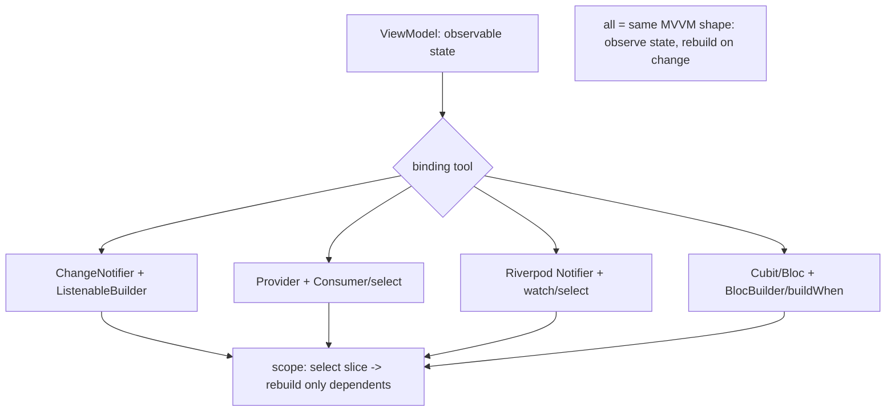

# Data Binding & State (Provider / Riverpod / Bloc / ChangeNotifier)

> MVVM's "View binds to ViewModel state" isn't one API — it's a **shape** that Flutter's state tools all realize: **`ChangeNotifier` + `ListenableBuilder`** (built-in), **Provider** (`ChangeNotifierProvider` + `Consumer`/`select`), **Riverpod** (`Notifier`/`AsyncNotifier` + `ref.watch`/`select`), or **Bloc/Cubit** (`Cubit`/`Bloc` + `BlocBuilder`/`buildWhen`) — all expose observable state a View **watches** and **rebuilds** from. The critical craft across all of them is **scoping rebuilds**: bind to the **narrowest slice** (via `select`/`buildWhen`/granular builders) so a state change rebuilds only the widgets that depend on it, not the whole screen.

## Introduction

This file connects MVVM to concrete Flutter state tools, showing each as a binding mechanism, and focuses on the cross-cutting skill: scoping rebuilds for performance. It's the "how do I actually wire the binding" companion to the conceptual fundamentals ([mvvm_fundamentals.md](mvvm_fundamentals.md)).

## Why this concept exists

Teams argue over Provider vs Riverpod vs Bloc, but at the MVVM level they're **interchangeable realizations of the same pattern** — each provides observable state + binding. What actually determines performance and maintainability is **how you scope subscriptions**. Understanding the shared shape (and the rebuild-scoping discipline) lets you use any of them well and switch without re-architecting.

## Real-world analogy

The tools are **different subscription services delivering the same newspaper**: `ChangeNotifier` (self-print), Provider (local newsstand), Riverpod (modern app), Bloc (structured event→state press). What matters isn't the delivery brand — it's whether you **subscribe to just the section you read** (scoped rebuild) or have the **entire paper reprinted and re-read every time one word changes** (whole-tree rebuild).

## Problem Statement

Realize the MVVM search feature with a chosen tool, binding the View to the ViewModel's state, and ensure a change to one part of state (e.g., a result count) rebuilds only the relevant widget — not the whole screen. You'll wire binding + scope rebuilds in each idiom.

## Internal Working



- **`ChangeNotifier` + `ListenableBuilder`** (built-in, no package): VM extends `ChangeNotifier`, `notifyListeners()` on change; View wraps the reactive part in `ListenableBuilder(listenable: vm, ...)`. Simple; scope by placing builders narrowly.
- **Provider**: `ChangeNotifierProvider(create: (_) => vm)` exposes the VM; `Consumer<VM>`/`context.watch<VM>()` rebuilds on change. **`Selector`/`context.select`** subscribes to a **derived slice** → rebuild only when that slice changes (scoping).
- **Riverpod**: define a `Notifier`/`AsyncNotifier` (the ViewModel) exposing state; the View `ref.watch(provider)` to bind. **`ref.watch(provider.select((s) => s.slice))`** scopes rebuilds; `AsyncValue` models loading/data/error ergonomically; compile-safe, testable providers.
- **Bloc/Cubit**: `Cubit`/`Bloc` emits state; View uses `BlocBuilder<Cubit, State>` (+ **`buildWhen`** to scope) and `BlocListener`/`BlocSelector` for effects/slices. Event→state is explicit; the Cubit/Bloc *is* the ViewModel.
- **They're the same MVVM shape**: each exposes **observable state** the View **watches** and **rebuilds** from, with **commands** (methods/events) — differing in ergonomics (boilerplate, compile-safety, event modeling), not architecture. Choose by team/needs ([Module 11](../11%20State%20Management/README.md)); the ViewModel design ([viewmodel_design.md](viewmodel_design.md)) stays the same.
- **Scoping rebuilds (the key skill)**: bind to the **narrowest state slice** — `Selector`/`select`/`buildWhen`/`BlocSelector` or narrowly-placed builders — so one field's change rebuilds one widget, not the page. This is the difference between smooth and janky MVVM ([Module 21](../21%20Performance/README.md)).
- **Effects channel**: one-off effects (nav/snackbar) via `BlocListener`/`ref.listen`/a stream the View listens to — separate from the rebuild binding ([viewmodel_design.md](viewmodel_design.md)).
- **Provisioning/DI**: the VM is provided/scoped to the widget subtree (Provider/Riverpod scope, or DI + `ChangeNotifierProvider`); disposed with the subtree.

## Memory Representation

The tool holds the VM instance (scoped to a subtree) + a subscription registry mapping widgets → the state slices they watch. Only widgets watching a changed slice rebuild. Immutable state snapshots enable cheap equality checks for scoping.

## Compiler Behavior

Riverpod offers compile-time-safe provider access; Bloc/Provider are runtime-resolved. All keep the VM plain Dart (testable).

## Runtime Behavior

State change → tool notifies subscribers → **only widgets watching the changed slice rebuild** (if scoped) → element diff → repaint. Unscoped watches rebuild the whole subtree on any change.

## Flutter Engine Behavior

Scoped rebuilds minimize the widget/element diff + repaint work ([Module 09](../09%20Rendering%20Pipeline/README.md)); unscoped binding inflates it.

## Dart VM Behavior

The VM/state logic is plain Dart (fast tests); equality on immutable snapshots drives selective rebuilds.

## Examples

```dart
// ChangeNotifier + ListenableBuilder (built-in) — scope by placing builders narrowly
ListenableBuilder(listenable: vm, builder: (_, __) => ResultsView(vm.state));

// Provider — Selector scopes rebuild to a slice (only rebuilds when count changes)
Selector<SearchViewModel, int>(
  selector: (_, vm) => vm.state is SearchResults ? (vm.state as SearchResults).items.length : 0,
  builder: (_, count, __) => Text('$count results'),
);

// Riverpod — watch a selected slice
final count = ref.watch(searchVmProvider.select((s) => s.resultCount)); // scoped rebuild
// AsyncNotifier models loading/data/error via AsyncValue

// Bloc/Cubit — buildWhen / BlocSelector scope; BlocListener handles one-off effects
BlocSelector<SearchCubit, SearchState, int>(
  selector: (s) => s is SearchResults ? s.items.length : 0,
  builder: (_, count) => Text('$count results'),
);
BlocListener<SearchCubit, SearchState>(
  listenWhen: (a, b) => b is SearchError,
  listener: (_, s) => showSnackbar((s as SearchError).message), // effect, not rebuild
  child: const SizedBox(),
);
```

## Diagrams

```mermaid
flowchart LR
    Change[state slice changes] --> Scoped{scoped binding?}
    Scoped -->|yes select/buildWhen| One[rebuild one widget]
    Scoped -->|no whole watch| Page[rebuild whole subtree (jank)]
```

## Common Mistakes

| Mistake | Why | Fix |
|---------|-----|-----|
| Watching the whole VM everywhere | Whole-subtree rebuilds/jank | `select`/`Selector`/`buildWhen`/`BlocSelector` |
| Effects via rebuild binding | Re-fire on rebuild | `BlocListener`/`ref.listen`/stream (effects channel) |
| Thinking tool = architecture | They're all MVVM | Same VM design; pick tool by ergonomics |
| Mutable state without new snapshots | Broken equality/selection | Immutable snapshots (`copyWith`/sealed) |
| VM not scoped/disposed | Leaks/stale | Provide to subtree; dispose with it |
| Rebuilding heavy widgets on any change | Perf | Scope + `const` + boundaries ([Module 21](../21%20Performance/README.md)) |
| Coupling widgets to a specific tool's types | Hard to switch | Keep VM plain; thin binding layer |

## Best Practices

- Treat Provider/Riverpod/Bloc/`ChangeNotifier` as **interchangeable MVVM realizations**; keep the **ViewModel design identical** and pick the tool by team/ergonomics ([Module 11](../11%20State%20Management/README.md)).
- **Scope rebuilds** to the narrowest slice (`select`/`Selector`/`buildWhen`/`BlocSelector`, narrow builders) — the key perf discipline.
- Handle **one-off effects via a listener channel** (`BlocListener`/`ref.listen`/stream), separate from rebuild binding; use **immutable state** for reliable selection.
- **Scope/provide + dispose** the VM to its subtree; keep the VM **plain Dart** so switching tools doesn't touch logic.

## Performance

Scoped binding is the single biggest MVVM perf lever: rebuild one widget, not the page. Immutable snapshots + equality make selection cheap. Combine with `const`, repaint boundaries, and list virtualization ([Module 21](../21%20Performance/README.md)). Unscoped watches are the classic MVVM jank source.

## Advantages / Disadvantages

- **+** Flexible tool choice (same architecture), efficient scoped rebuilds, ergonomic loading/error (AsyncValue/BlocBuilder), separable effects.
- **−** Each tool has its own API/boilerplate, scoping requires discipline, effect handling differs per tool, over-watching pitfalls.

## Interview Questions

1. **🟢 How do Provider/Riverpod/Bloc relate to MVVM?** — They're interchangeable realizations: each exposes observable state a View binds to + commands/events — i.e., MVVM; the architecture is the same.
2. **🟢 How does a View bind to a ViewModel in each tool?** — `ListenableBuilder` (ChangeNotifier), `Consumer`/`select` (Provider), `ref.watch`/`select` (Riverpod), `BlocBuilder`/`buildWhen` (Bloc).
3. **🟡 What's the key skill for MVVM performance?** — Scoping rebuilds to the narrowest state slice (`select`/`Selector`/`buildWhen`/`BlocSelector`) so only dependent widgets rebuild.
4. **🟡 How do you handle one-off effects vs rebuilds?** — Rebuilds via the binding (watch/builder); effects via a listener channel (`BlocListener`/`ref.listen`/stream) so they fire once.
5. **🟡 Why keep the ViewModel plain Dart regardless of tool?** — So it's testable and you can switch binding tools without changing the logic.
6. **🔴 Why do immutable snapshots matter for binding?** — They enable reliable equality checks so selectors can decide whether a slice changed and skip rebuilds.
7. **🔴 What's the classic MVVM jank source and fix?** — Watching the whole VM everywhere (whole-subtree rebuilds); fix by scoping bindings to slices.

## Senior Engineer Tips

- Keep the ViewModel tool-agnostic (plain Dart state + commands) and put only a thin binding layer in widgets; then Provider↔Riverpod↔Bloc is a swap, not a rewrite.
- Default to selecting slices (`select`/`buildWhen`/`BlocSelector`); "watch the whole thing" is the number-one reason MVVM screens jank.
- Route effects through a listener channel from day one; mixing them into rebuildable state is the recurring "fires twice / on rebuild" bug.

## Architect Perspective

This file demystifies the state-management debate: at the MVVM level, Provider/Riverpod/Bloc/`ChangeNotifier` are the **same pattern** with different ergonomics — the architecture (ViewModel design) is invariant. The decisions that matter are **rebuild scoping** (performance) and **effect channeling** (correctness), plus keeping the VM tool-agnostic for swappability. This lets teams choose tools pragmatically while the presentation architecture — and its Clean-layer backing — stays stable ([mvvm_fundamentals.md](mvvm_fundamentals.md), [viewmodel_design.md](viewmodel_design.md), [Module 11](../11%20State%20Management/README.md), [Module 21](../21%20Performance/README.md)).

## Summary

- MVVM binding is realized by `ChangeNotifier`/Provider/Riverpod/Bloc alike — same pattern, different ergonomics; keep the VM design identical + tool-agnostic.
- Scope rebuilds to the narrowest slice (`select`/`Selector`/`buildWhen`/`BlocSelector`) — the key perf discipline; use immutable snapshots.
- Handle one-off effects via a listener channel (separate from rebuild binding); scope/provide + dispose the VM to its subtree.

## Revision Notes

- Realizations: `ChangeNotifier`+`ListenableBuilder`; Provider (`Consumer`/`Selector`/`context.select`); Riverpod (`Notifier`/`AsyncNotifier`+`ref.watch`/`select`); Bloc/Cubit (`BlocBuilder`/`buildWhen`/`BlocSelector`). All = MVVM.
- Scope rebuilds to slices (select/buildWhen); immutable snapshots for equality; effects via `BlocListener`/`ref.listen`/stream (fire once).
- VM tool-agnostic (plain Dart) → swappable; provide/scope + dispose to subtree; combine with `const`/repaint boundaries for perf.

## Practice Questions

1. In what sense are Provider, Riverpod, and Bloc the same at the MVVM level?
2. How do you scope a rebuild to a single state slice in each tool?
3. How do you handle a one-off effect separate from rebuilds?

## Coding Questions

1. Bind a View to a ViewModel in two tools (e.g., Provider + Bloc), same VM.
2. Scope a rebuild to one slice (`Selector`/`buildWhen`/`select`).
3. Wire a one-off effect via a listener channel.

## Mini Project

**Binding + scoping (Flutter):** Realize the search MVVM feature with a chosen tool (Provider/Riverpod/Bloc), binding the View to the ViewModel's state, scoping a rebuild to a single slice (e.g., result count) via `select`/`buildWhen`/`Selector`, and handling a one-off "no network" effect via a listener channel — keeping the VM plain Dart/tool-agnostic. Acceptance: View binds + rebuilds reactively; a slice change rebuilds only its widget (scoped); effect fires once via a listener (not state); VM tool-agnostic (swappable); VM provided/disposed to subtree.
