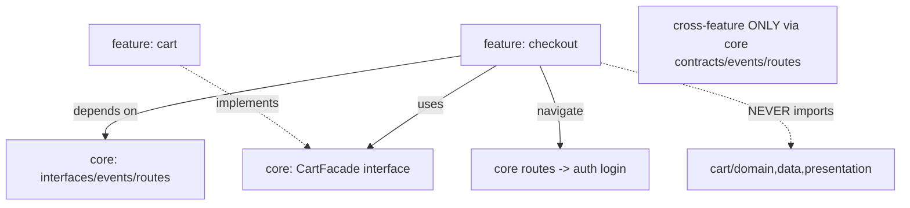

# Feature Boundaries & Cross-Feature Dependencies

> The value of feature-first evaporates if features reach into each other's internals, so **boundaries must be explicit**: a feature may depend on **`core`** and on other features **only through a published contract** (an interface in `core`, an event, or a route) — **never** by importing another feature's `domain/data/presentation` directly. When feature A needs something from feature B, invert the dependency (B implements a core interface A depends on), communicate via **events/messages**, or navigate via **routes** with parameters. This keeps features **loosely coupled, independently evolvable, and extractable into packages**.

## Introduction

This file addresses the hard part of feature-first: how features interact **without** coupling. It covers boundary rules, the patterns for cross-feature communication (interfaces-in-core, events, routing), circular-dependency avoidance, and enforcement. It's what keeps the slices from silently re-tangling ([structuring_features_and_core.md](structuring_features_and_core.md)).

## Why this concept exists

Real features aren't fully independent — checkout needs the cart, profile needs auth. If they satisfy those needs by importing each other's internals, you get a tangled graph (circular deps, ripple changes, un-extractable features) — layer-first coupling under a feature-first tree. Explicit boundaries + inversion patterns let features cooperate while staying decoupled.

## Real-world analogy

Features are **neighboring shops in a mall**. They cooperate — the coffee shop's customers use the bookstore — but they don't **walk into each other's stockrooms** (import internals). They interact through the **mall's shared facilities** (core), **public counters** (published contracts), and **the mall directory** (routing). If the coffee shop needs a book delivered, it uses the mall's **standard delivery service** (a core interface the bookstore fulfills), not by rummaging in the bookstore's back office.

## Problem Statement

Checkout (feature) needs the current cart (from the cart feature) and to send the user to login (auth feature) if unauthenticated — without importing cart's or auth's internals. Design the boundaries and interaction so features stay decoupled and extractable. You'll apply interface-inversion, events, and routing.

## Internal Working



- **Boundary rule**: a feature may import **its own code** + **`core`**. It must **not** import another feature's `domain/data/presentation` internals. Cross-feature interaction goes **through contracts published in `core`** (or events/routes).
- **Patterns for cross-feature dependency** (pick per case):
  1. **Interface in `core` (dependency inversion)**: define the needed capability as an **interface in core** (`CartFacade { Future<Cart> current(); }`); the **cart feature implements** it and registers it in DI; **checkout depends on the interface** (in core), not on cart. Checkout doesn't know cart exists — just the contract ([Module 04](../04%20SOLID/README.md)).
  2. **Events / message bus**: features publish/subscribe to **domain events** via a core event bus (`UserLoggedOut`, `CartCleared`) — fully decoupled, good for reactions/notifications.
  3. **Routing**: to *go to* another feature's screen, **navigate by route** (`context.go('/login?redirect=...')`) via the core router — no import of that feature's widgets ([Module 13](../13%20Routing/README.md)).
- **Shared data/models**: if two features share an entity/value object, it belongs in **`core`** (shared kernel — [Module 46](../46%20Domain%20Driven%20Design/README.md)); don't reach into one feature's domain for it.
- **Circular dependencies (forbidden)**: A→B and B→A (even via core if sloppy) is a red flag; invert one direction (interface in core), or extract the shared piece to core. The dependency graph among features should be **acyclic** (ideally features depend only on core, forming a star).
- **Composition root**: cross-feature wiring (which impl fulfills which interface) happens in **core's DI composition root**, keeping features unaware of each other's concretes ([Module 14](../14%20Dependency%20Injection/README.md)).
- **Enforcement**: **import lints/analysis** (or package boundaries — [Module 45](../45%20Modular%20Architecture/README.md)) to forbid `features/x/**` importing `features/y/**`; a barrel exposes only a feature's public API.
- **Extractability payoff**: with clean boundaries, a feature can be **lifted into its own package** with minimal changes — the ultimate test that boundaries are real.

## Memory Representation

Not runtime — a **feature dependency graph** that must be **acyclic** and (ideally) star-shaped around `core`. Contracts live in core; implementations register at the composition root; features hold references to interfaces, not each other.

## Compiler Behavior

Import boundaries are compile-time-checkable (lints/analysis; hard-enforced once features are packages). Depending on a core interface compiles without knowing the implementing feature — the inversion.

## Runtime Behavior

DI wires the implementing feature's concrete to the core interface at startup; at runtime checkout calls the interface (resolved to cart's impl) or emits/handles events or navigates by route — all without a static cross-feature import.

## Flutter Engine Behavior

Not applicable (routing aside — navigation by route avoids widget imports).

## Dart VM Behavior

Not applicable (until package boundaries enforce it at the module level — [Module 45](../45%20Modular%20Architecture/README.md)).

## Examples

```dart
// core/contracts/cart_facade.dart — the published contract (in CORE)
abstract class CartFacade { Future<Cart> current(); }

// features/cart — cart IMPLEMENTS the core contract + registers it
class CartFacadeImpl implements CartFacade {
  final GetCurrentCart getCart;
  CartFacadeImpl(this.getCart);
  @override Future<Cart> current() async => (await getCart()).valueOrThrow();
}
// cart_di.dart: di.registerLazySingleton<CartFacade>(() => CartFacadeImpl(di()));

// features/checkout — depends on the CORE interface, NOT on the cart feature
class CheckoutViewModel {
  final CartFacade cart;               // core contract (checkout doesn't import cart internals)
  final Router router;                 // core router
  CheckoutViewModel(this.cart, this.router);
  Future<void> start() async {
    final c = await cart.current();     // cross-feature via contract
    if (!authed) router.go('/login?redirect=/checkout'); // cross-feature via route
  }
}
// ANTI-PATTERN: import 'package:app/features/cart/domain/cart_repository.dart'; // ❌ internal import
```

## Diagrams

```mermaid
flowchart LR
    Checkout --> Contract[CartFacade (core)]
    Cart -. implements .-> Contract
    Checkout --> Events[core event bus]
    Checkout --> Routes[core router -> auth]
    Checkout -.forbidden.-> CartInternals[cart internals]
```

## Common Mistakes

| Mistake | Why it's bad | Fix |
|---------|-------------|-----|
| Feature A imports feature B internals | Coupling, re-tangling | Depend on a core contract/event/route |
| Circular feature dependency | Un-buildable/extractable | Invert via core interface; keep acyclic |
| Shared entity inside one feature | Others reach in | Move to core (shared kernel) |
| Concrete cross-feature refs | Tight coupling | DI to a core interface (inversion) |
| Navigating by importing widgets | Widget coupling | Navigate by route |
| No import enforcement | Boundaries erode silently | Lints/package boundaries |
| Everything through events | Hard to trace | Use interfaces for direct needs; events for reactions |

## Best Practices

- A feature depends on **its own code + `core`**, and on other features **only via published contracts** (core interface), **events**, or **routes** — **never** internal imports.
- **Invert** direct cross-feature needs: define the capability as an **interface in core**, implemented by the providing feature, depended on by the consumer; wire at the **composition root**.
- Keep the **feature graph acyclic** (ideally star-shaped around core); put **shared entities in core**; **navigate by route**, not widget imports.
- **Enforce boundaries** with import lints/analysis (and later package boundaries); expose only a feature's **public API** via a barrel.

## Performance

No runtime cost; DI/interface indirection is negligible. Clean boundaries improve build times when features become packages (parallel/incremental builds — [Module 45](../45%20Modular%20Architecture/README.md)) and dramatically improve change-locality (developer performance).

## Advantages / Disadvantages

- **+** Loose coupling, independently evolvable/deletable/extractable features, acyclic graph, enforceable boundaries, team autonomy.
- **−** Contract/DI boilerplate for interactions, judgment on interface-vs-event-vs-route, discipline/tooling to enforce, shared-kernel decisions.

## Interview Questions

1. **🟢 What may a feature import?** — Its own code and `core` — not another feature's internals.
2. **🟢 How should features interact?** — Via published contracts (interfaces in core), events, or routes — never by importing each other's domain/data/presentation.
3. **🟡 How do you let checkout use the cart without coupling?** — Define a `CartFacade` interface in core, have cart implement + register it, and let checkout depend on the interface (dependency inversion).
4. **🟡 Where do shared entities go?** — In `core` (shared kernel) — not inside one feature that others reach into.
5. **🟡 How do you avoid circular feature dependencies?** — Invert one direction via a core interface (or extract shared code to core); keep the feature graph acyclic (star around core).
6. **🔴 When use events vs interfaces vs routes?** — Interfaces for direct capability needs, events for decoupled reactions/notifications, routes for navigating to another feature's screen.
7. **🔴 How do you enforce boundaries?** — Import lints/analysis (forbid `features/x`→`features/y`), public-API barrels, and eventually package boundaries.

## Senior Engineer Tips

- Make "no cross-feature internal imports" a lint rule from day one; boundaries that aren't enforced silently erode until you're back to a tangled monolith.
- Prefer interface-in-core + DI for direct needs (traceable, testable) and reserve the event bus for genuine fan-out reactions; all-events is hard to follow.
- Use "could I extract this feature into its own package with minimal changes?" as your boundary litmus test — if not, something's leaking.

## Architect Perspective

Feature boundaries are Dependency Inversion applied at the feature scale: consumers depend on contracts (in the stable core), providers implement them, and the composition root wires concretes — so features cooperate without knowing each other. Keeping the feature graph acyclic and star-shaped around core, communicating via contracts/events/routes, and enforcing import boundaries is exactly what makes features independently evolvable and later extractable into packages/modules. Coupling here is the failure that turns feature-first back into a scattered monolith ([structuring_features_and_core.md](structuring_features_and_core.md), [Module 04](../04%20SOLID/README.md), [Module 45](../45%20Modular%20Architecture/README.md)).

## Summary

- Features import only their own code + `core`; cross-feature interaction via published contracts (core interfaces), events, or routes — never internal imports.
- Invert direct needs (interface-in-core, provider implements, consumer depends), keep the feature graph acyclic (star around core), put shared entities in core.
- Navigate by route (not widget imports); enforce boundaries with lints/packages; the test is "extractable into a package."

## Revision Notes

- Boundary: feature imports own code + core only; cross-feature via core interface (DIP) / events / routes; no internal imports; acyclic feature graph (star around core).
- Patterns: interface-in-core (provider implements + DI-registers, consumer depends), event bus (decoupled reactions), routing (navigate w/o widget import); shared entities → core (shared kernel).
- Wire cross-feature at composition root; enforce with import lints/package boundaries + public-API barrels; litmus test = extractable to a package.

## Practice Questions

1. How does checkout use the cart without importing it?
2. When do you use an interface vs an event vs a route for cross-feature interaction?
3. Why must the feature dependency graph be acyclic?

## Coding Questions

1. Define a core `CartFacade`, implement it in cart, depend on it from checkout.
2. Add a core event bus and publish/subscribe to a `UserLoggedOut` event.
3. Add an import lint forbidding cross-feature internal imports.

## Mini Project

**Decoupled cross-feature interaction (Flutter):** Wire checkout↔cart↔auth without internal cross-feature imports: a `CartFacade` interface in core (implemented + registered by cart, depended on by checkout), a core event/route for redirecting to auth login, and an import rule forbidding `features/x`→`features/y` internals. Verify the feature graph is acyclic (star around core). Acceptance: no cross-feature internal imports; direct need via core interface (DIP + DI); navigation via route; shared entities in core; acyclic graph; boundary enforced (lint); a feature is plausibly extractable to a package.
