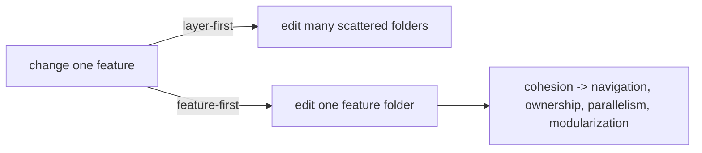

# Feature-First Fundamentals (Feature vs Layer)

> Two ways to organize a codebase: **layer-first** (group by technical role across the whole app — `models/`, `views/`, `controllers/`, `repositories/`) or **feature-first** (group by business capability — `features/cart/`, `features/auth/`, each containing *its own* domain/data/presentation). Feature-first wins at scale because it maximizes **cohesion** (everything a feature needs is together) and minimizes **scatter** (a change to "cart" lives in one place, not five distant folders). It follows the principle: **"things that change together should live together."**

## Introduction

This file establishes the core distinction — layer-first vs feature-first — and *why* co-locating by feature (cohesion) beats grouping by layer (scatter) as an app grows. It's the conceptual foundation for structuring slices and boundaries in the rest of the module.

## Why this concept exists

Small apps tolerate layer-first folders; large apps don't. When every feature's pieces are spread across global `models/`/`views/`/`controllers/` folders, understanding or changing one feature means hopping across the tree, unrelated features share folders (merge conflicts, accidental coupling), and no folder maps to a team's ownership. Feature-first fixes this by making the **feature the unit of organization**.

## Real-world analogy

Layer-first is a **warehouse organized by material type**: all screws in one aisle, all wood in another, all paint in another — so building one piece of furniture means running across the whole warehouse. Feature-first is a **workshop with a kit per project**: everything for the "bookshelf" (its screws, wood, paint) is in one labeled bin. When you work on the bookshelf, you go to one place; when a new person joins, you hand them the whole bin.

## Problem Statement

For a growing app (auth, feed, cart, profile), decide how to organize folders so a change to one feature is localized, teams can own features, and new features slot in cleanly — and articulate why feature-first scales better than layer-first. You'll compare the two layouts and justify the choice.

## Internal Working

```mermaid
flowchart TD
    subgraph Layer-first (scatters a feature)
      M[models/] --- V[views/] --- C[controllers/] --- R[repositories/]
      Cart1[cart pieces spread across all four]
    end
    subgraph Feature-first (co-locates a feature)
      F1[features/cart/ (domain+data+presentation)]
      F2[features/auth/ ...]
      Core[core/ (shared)]
    end
    Note[cohesion: things that change together live together]
```

- **Layer-first (package-by-layer)**: top-level folders by **technical role** — `models/`, `views/`, `controllers/`/`viewmodels/`, `repositories/`, `services/`. A single feature's code is **scattered** across all of them.
  - **+** Familiar; fine for **tiny apps/tutorials**.
  - **−** At scale: **low cohesion** (feature spread out), **navigation friction** (jump across folders to understand one feature), **coupling risk** (unrelated features share folders), **no ownership mapping** (folders don't map to teams), **merge conflicts** (many people editing shared layer folders).
- **Feature-first (package-by-feature)**: top-level `features/<name>/`, each a **self-contained vertical slice** with its **own** `domain/`, `data/`, `presentation/` (Clean layers *inside* the feature — [Module 40](../40%20Clean%20Architecture/README.md)), plus a **shared `core/`** for cross-cutting concerns ([structuring_features_and_core.md](structuring_features_and_core.md)).
  - **+** **High cohesion** (all of a feature in one place), **easy navigation** (feature = folder), **independent evolvability** (change/delete a feature locally), **team ownership** (a team owns a feature folder), **parallel work** (fewer conflicts), **modularization-ready** (a feature folder → a package — [Module 45](../45%20Modular%20Architecture/README.md)).
  - **−** Slight upfront structure; need discipline on **shared code (core)** and **cross-feature boundaries** ([feature_boundaries_and_dependencies.md](feature_boundaries_and_dependencies.md)).
- **The principle — cohesion**: **"things that change together should live together."** A feature's UI, logic, and data change together → co-locate them. Technical layers *within* a feature still exist (Clean), but the **top-level axis is the feature**, not the layer.
- **Layers still exist — inside features**: feature-first ≠ abandoning layers. Each feature has domain/data/presentation *internally*; feature-first just makes **feature** the outer grouping and **layer** the inner grouping.
- **When layer-first is OK**: throwaway prototypes / single-screen demos. Beyond that, feature-first scales far better.

## Memory Representation

Not runtime — a **source-tree organization**. The mental model: the top-level tree is a list of features + a core; each feature is a mini Clean app. Cohesion is measured by "how many folders must I touch to change one feature?" (ideally one).

## Compiler Behavior

Feature-first enables **import-boundary discipline**: a feature imports its own code + `core`, not other features' internals — lintable/enforceable ([feature_boundaries_and_dependencies.md](feature_boundaries_and_dependencies.md)), and a stepping stone to package boundaries.

## Runtime Behavior

Not applicable — organization doesn't change runtime; it changes maintainability, navigation, and team velocity.

## Flutter Engine Behavior

Not applicable.

## Dart VM Behavior

Not applicable (until features become packages — [Module 45](../45%20Modular%20Architecture/README.md)).

## Examples

```text
Layer-first (scatters "cart"):                Feature-first (co-locates "cart"):
  lib/                                          lib/
    models/       cart_item.dart  ...             features/
    views/        cart_screen.dart ...              cart/
    controllers/  cart_vm.dart    ...                 domain/    (entities, use cases, interfaces)
    repositories/ cart_repo.dart  ...                 data/      (dtos, sources, repo impl)
    services/     ...                                 presentation/ (view model, widgets)
  # a "cart" change touches 4-5 folders            auth/  home/  profile/  ...
                                                  core/       (theme, di, routing, Result, shared widgets)
  # a "cart" change lives in features/cart/
```

```text
Cohesion test:
  "To change the cart feature, how many top-level folders do I edit?"
    layer-first  -> many (models + views + controllers + repositories)   [low cohesion]
    feature-first-> one  (features/cart/)                                [high cohesion]
```

## Diagrams



## Common Mistakes

| Mistake | Why it's a problem | Fix |
|---------|-------------------|-----|
| Layer-first for a large app | Scatter, coupling, conflicts | Feature-first (feature = top-level) |
| Thinking feature-first drops layers | Loses Clean benefits | Keep layers *inside* each feature |
| No shared `core` | Duplication of cross-cutting code | Add a `core`/`shared` module |
| Features importing each other's internals | Coupling | Boundaries via core/interfaces |
| One giant "feature" | Low cohesion again | Split by real capability |
| Full feature-first for a 1-screen demo | Overkill | Right-size (layer-first ok tiny) |

## Best Practices

- Organize **top-level by feature** (`features/<name>/`), each a **cohesive vertical slice** with its **own domain/data/presentation** (Clean *inside*), plus a shared **`core`**.
- Apply the principle **"things that change together live together"**; measure by the **cohesion test** (one feature = one folder to edit).
- Keep **feature boundaries explicit** (a feature imports its own code + `core`, not other features' internals) — lint/enforce imports.
- **Right-size**: feature-first for real/growing apps; layer-first only for throwaway demos; split by **real business capability**, not size.

## Performance

No runtime performance impact — this is a maintainability/velocity concern. The "performance" gained is **developer performance**: faster navigation, safer parallel work, easier onboarding, and readiness to modularize.

## Advantages / Disadvantages

- **+** High cohesion, easy navigation, independent/deletable features, team ownership, parallel work, modularization-ready.
- **−** Slight upfront structure, requires `core` + boundary discipline, overkill for trivial apps, risk of ill-defined "features."

## Interview Questions

1. **🟢 Feature-first vs layer-first — what's the difference?** — Feature-first groups top-level by business capability (each feature has its own layers); layer-first groups by technical role across the whole app.
2. **🟢 Why does feature-first scale better?** — Cohesion: a feature's code lives together, so changes are localized, features are independently evolvable, and teams can own folders — vs layer-first scatter.
3. **🟡 Does feature-first mean no layers?** — No — layers (domain/data/presentation) exist *inside* each feature; feature-first just makes feature the outer axis and layer the inner.
4. **🟡 What's the guiding principle?** — "Things that change together should live together" — a feature's UI/logic/data change together, so co-locate them.
5. **🟡 What's the cohesion test?** — "To change one feature, how many top-level folders must I edit?" — ideally one (feature-first) vs many (layer-first).
6. **🔴 When is layer-first acceptable?** — Throwaway prototypes/single-screen demos; beyond that, feature-first is preferable.
7. **🔴 How does feature-first prepare for modularization?** — A cohesive feature folder maps naturally to a package/module later ([Module 45](../45%20Modular%20Architecture/README.md)).

## Senior Engineer Tips

- Make the top-level tree read like the product ("auth, cart, feed, profile"), not like a framework glossary ("models, views, controllers"); that alignment is the whole point.
- Keep Clean layers *inside* each feature — feature-first and Clean are complementary axes, not alternatives.
- Define "feature" by business capability and enforce import boundaries early; ill-defined or leaky features erode the cohesion you organized for.

## Architect Perspective

Feature-first is the organizational expression of cohesion and the Common Closure Principle: group by reason-to-change (the feature), not by technical role (the layer). It scales Clean/MVVM across many features, aligns folders with teams and product capabilities, keeps changes local, and sets up the clean boundaries that later become package/module boundaries. Layers live inside features; the feature is the unit of organization, ownership, and (eventually) deployment ([structuring_features_and_core.md](structuring_features_and_core.md), [Module 40](../40%20Clean%20Architecture/README.md), [Module 45](../45%20Modular%20Architecture/README.md)).

## Summary

- Feature-first groups top-level by business capability (each feature = a vertical slice with its own domain/data/presentation + a shared `core`); layer-first groups by technical role across the app.
- Feature-first wins at scale via cohesion ("things that change together live together") — localized changes, team ownership, parallelism, modularization-readiness.
- Layers persist *inside* features; right-size (layer-first only for trivial demos); define features by real capability.

## Revision Notes

- Layer-first: top-level by role (models/views/controllers) → scatter, coupling, conflicts (ok for tiny apps). Feature-first: top-level `features/<name>/` (own domain/data/presentation) + `core/` → cohesion.
- Principle: "things that change together live together"; cohesion test = folders touched per feature change (one = good).
- Layers live inside features (feature = outer axis, layer = inner); enforce import boundaries; feature folder → future package (Module 45).

## Practice Questions

1. Why does layer-first scatter a feature, and why does that hurt at scale?
2. Does feature-first eliminate layers? Where do they go?
3. Apply the cohesion test to a "cart" change in both layouts.

## Coding Questions

1. Convert a layer-first tree sketch to feature-first for 3 features + core.
2. Show where a feature's domain/data/presentation live inside its folder.
3. Identify a cross-feature import that would violate boundaries.

## Mini Project

**Layout comparison (Flutter):** For an app with auth/feed/cart/profile, sketch both a layer-first and a feature-first folder tree, apply the cohesion test to a "cart" change in each, and justify feature-first (cohesion, ownership, scaling). Show that Clean layers live *inside* each feature and a `core` holds shared code. Acceptance: both layouts sketched; cohesion test applied; feature-first justified (cohesion/ownership/scale); layers-inside-features + `core` shown; features defined by capability.
