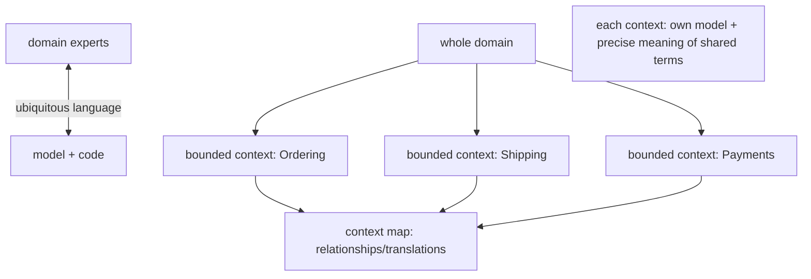
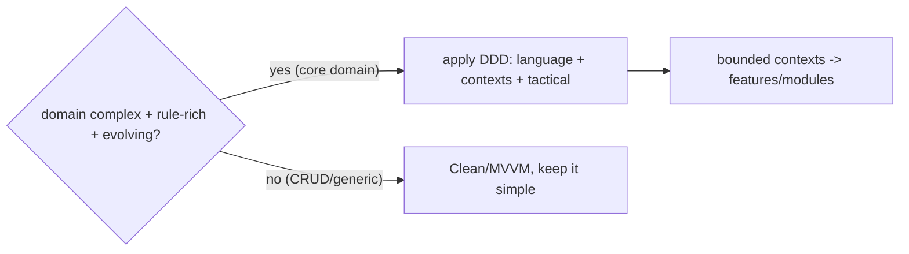

# DDD Fundamentals (Language, Contexts, When)

> DDD's strategic core is about **taming complexity through language and boundaries**: build a **ubiquitous language** (one shared vocabulary used by domain experts, code, and conversations — no translation layer), split the domain into **bounded contexts** (explicit boundaries where a term has *one* precise meaning, each with its own model), and map how contexts relate (**context map**). The tactical patterns (aggregates, value objects) serve this. The essential judgment: DDD pays for **complex, rule-rich domains**, and is **overkill for CRUD** — so apply it where the domain complexity justifies the investment.

## Introduction

This file covers strategic DDD — ubiquitous language, bounded contexts, context mapping — and the when-it-pays decision. These strategic ideas are more important than any single pattern; the tactical building blocks (later files) exist to serve them.

## Why this concept exists

Complex domains fail not from missing patterns but from **ambiguous language** ("order" means five different things) and **one giant model** trying to serve every use. DDD fixes this by aligning code with a precise shared language and carving the domain into contexts, each internally consistent. Without this, models tangle, terms collide, and business rules scatter.

## Real-world analogy

A **hospital** has many contexts using the word "patient" differently: in **billing** a patient is an account with insurance; in **clinical care** a patient is a body with symptoms; in **scheduling** a patient is a time-slot occupant. Forcing one "Patient" model to serve all three creates a monstrosity. DDD says: **each department (bounded context) keeps its own precise meaning**, everyone in that department speaks the **same words** (ubiquitous language), and a **directory (context map)** describes how departments hand off.

## Problem Statement

For an e-commerce domain, identify bounded contexts (catalog, ordering, shipping, payments), define the ubiquitous language within one, note where the same term means different things across contexts, and decide whether the domain is complex enough to justify DDD. You'll do strategic modeling + a go/no-go call.

## Internal Working



- **Ubiquitous language**: a **single, rigorous vocabulary** shared by developers and domain experts, used in **conversation, docs, and code** (class/method names *are* the language). No dev-vs-business translation. When a term is fuzzy, you refine it *with the experts* — the language and model co-evolve. This is DDD's beating heart.
- **Bounded context**: an **explicit boundary** within which a model + language are **internally consistent** — a term has **one precise meaning**. The same word ("customer," "product," "order") may mean **different things in different contexts**, and that's fine *because* they're separate models. A bounded context is where you'd draw a **feature/module boundary** ([Module 44](../44%20Feature%20First%20Architecture/README.md)/[Module 45](../45%20Modular%20Architecture/README.md)).
- **Why boundaries**: one universal model for a big domain collapses under conflicting meanings/rules. Splitting into contexts lets each model be **small, precise, and consistent**, evolving independently.
- **Context mapping**: describe **how contexts relate** and translate across boundaries — patterns like **Shared Kernel** (shared subset), **Customer/Supplier**, **Conformist**, **Anti-Corruption Layer (ACL)** (translate an external/other context's model so it doesn't pollute yours), **Open Host/Published Language**. The map is the strategic architecture of the domain.
- **Strategic > tactical**: getting **language + boundaries** right matters more than any aggregate/value-object detail; tactical patterns implement a well-chosen context.
- **When DDD pays (the judgment)**:
  - **Yes**: **complex, rule-rich, evolving** domains (finance, logistics, insurance, healthcare, marketplaces) with domain experts and long lifespan — where miscommunication + tangled rules are the real cost.
  - **No / overkill**: **CRUD**, simple/technical, or short-lived apps — the language/boundary/aggregate ceremony exceeds the payoff; use straightforward Clean/MVVM.
  - **Partial**: apply DDD **only to the complex core** ("core domain"), keep supporting/generic subdomains simple.
  - **Core vs supporting vs generic subdomains**: invest DDD effort in the **core domain** (competitive differentiator); buy/simplify **generic** ones (auth, notifications).
- **Flutter angle**: a Flutter client often models a **subset/view** of the domain; full DDD tactical modeling is usually most valuable when the app owns significant domain logic (offline-first, rich client rules) — otherwise the client mirrors server contexts. Bounded contexts still guide **feature/module** decomposition.

## Memory Representation

Not runtime — a **conceptual map**: the ubiquitous language (glossary), the set of bounded contexts (each a self-consistent model), and the context map (relationships/ACLs). Code names embody the language.

## Compiler Behavior

Ubiquitous-language naming makes code self-documenting; bounded contexts become module/package boundaries the compiler can enforce ([Module 45](../45%20Modular%20Architecture/README.md)).

## Runtime Behavior

Not applicable — strategic modeling shapes structure/communication, not runtime.

## Flutter Engine Behavior

Not applicable.

## Dart VM Behavior

Not applicable.

## Examples

```text
E-commerce bounded contexts (same word, different meaning per context):
  Catalog context:   "Product" = sellable listing (name, price, description, images)
  Ordering context:  "Product" = an ordered line item (sku, qty, price-at-time)
  Shipping context:  "Product" = a physical package (weight, dimensions, fragile?)
  -> three DIFFERENT models; do NOT force one universal "Product"

Ubiquitous language (Ordering): Order, LineItem, place(), cancel(), OrderPlaced (event)
  -> these exact terms appear in code, docs, and expert conversations.
```

```text
When-DDD-pays checklist:
  complex + rule-rich + evolving + long-lived + domain experts  -> YES (esp. the CORE domain)
  CRUD / simple / technical / short-lived                       -> NO (Clean/MVVM is enough)
  mixed -> apply DDD to the core domain only; keep generic subdomains simple
```

## Diagrams



## Common Mistakes

| Mistake | Why it's wrong | Fix |
|---------|---------------|-----|
| Applying full DDD to a CRUD app | Overkill ceremony | Use Clean/MVVM; DDD only for complex domains |
| One universal model for the whole domain | Terms collide, model collapses | Split into bounded contexts |
| Dev/business translation layer | Miscommunication, drift | Ubiquitous language everywhere (code included) |
| Ignoring context relationships | Uncontrolled coupling | Context map + ACL at boundaries |
| DDD everywhere equally | Wasted effort on generic parts | Invest in the core domain; simplify generic |
| Tactical patterns without strategy | Aggregates around a wrong model | Get language + boundaries first |
| Letting an external model pollute yours | Foreign concepts leak in | Anti-Corruption Layer translates |

## Best Practices

- Build a **ubiquitous language** with domain experts and use it **in code, docs, and conversation**; refine language + model together.
- Split the domain into **bounded contexts** (each a precise, consistent model); accept that shared terms mean **different things** across contexts; draw the **context map** (+ ACLs at boundaries).
- **Get strategy right before tactics**; map **bounded contexts to features/modules** ([Module 44](../44%20Feature%20First%20Architecture/README.md)/[Module 45](../45%20Modular%20Architecture/README.md)).
- **Apply DDD proportionally**: to the **complex core domain**, not CRUD/generic subdomains — decide with the when-it-pays judgment.

## Performance

Not a runtime concern. The "performance" is **communication + change-velocity**: a shared language reduces miscommunication defects; clean contexts localize change and evolve independently. Over-applying DDD *slows* teams (ceremony) — proportionality is the efficiency lever.

## Advantages / Disadvantages

- **+** Tames complex domains, shared precise language (fewer defects), independent evolvable contexts, aligns code with business, guides module boundaries.
- **−** Significant investment (experts, modeling), overkill for simple domains, requires ongoing language discipline, easy to misapply (tactics without strategy).

## Interview Questions

1. **🟢 What is a ubiquitous language?** — One rigorous vocabulary shared by developers and domain experts, used in code, docs, and conversation — no translation layer between business and code.
2. **🟢 What is a bounded context?** — An explicit boundary where a model + language are internally consistent (a term has one meaning); the same word can mean different things in different contexts.
3. **🟡 Why not one universal model for the whole domain?** — Conflicting meanings/rules make it collapse; bounded contexts keep each model small, precise, and consistent.
4. **🟡 What is context mapping (and an ACL)?** — Describing how contexts relate/translate; an Anti-Corruption Layer translates another context's/external model so it doesn't pollute yours.
5. **🟡 When is DDD worth it, and when overkill?** — Worth it for complex, rule-rich, evolving core domains with experts; overkill for CRUD/simple/generic — use Clean/MVVM there.
6. **🔴 Why is strategy more important than tactics in DDD?** — Aggregates/value objects around the wrong language/boundaries don't help; getting language + contexts right is what tames complexity.
7. **🔴 How do bounded contexts relate to features/modules in Flutter?** — A bounded context is a natural feature/module boundary; the context map guides decomposition and cross-module contracts.

## Senior Engineer Tips

- Start with the language and the boundaries, with domain experts in the room; the tactical patterns are worthless if they model the wrong words or straddle contexts.
- Resist one-model-to-rule-them-all: let "customer/product/order" mean different things per context — that separation is the feature, not a bug.
- Apply DDD to the core domain only and keep generic subdomains (auth, notifications) simple; spending DDD effort uniformly is a classic waste.

## Architect Perspective

Strategic DDD is domain architecture: a shared language that eliminates translation loss, and bounded contexts that keep each model precise and independently evolvable — mapping directly onto features/modules and their contracts. It's the intellectual complement to Clean/feature-first/modular: those give you *where* code lives; DDD gives you *what the domain actually is* and *how to carve it*. Its power is proportional to domain complexity, so the architect's job is to apply it to the complex core and keep the rest simple ([02_tactical_building_blocks.md](02_tactical_building_blocks.md), [Module 44](../44%20Feature%20First%20Architecture/README.md), [Module 45](../45%20Modular%20Architecture/README.md)).

## Summary

- Strategic DDD: a **ubiquitous language** (shared, in-code) + **bounded contexts** (precise, consistent models; same term differs across contexts) + a **context map** (relationships/ACLs).
- Strategy > tactics; bounded contexts map to features/modules.
- Apply DDD to **complex, rule-rich core domains**; it's **overkill for CRUD/generic** — decide proportionally.

## Revision Notes

- Ubiquitous language: one vocabulary in code/docs/conversation (names = language), co-evolved with experts.
- Bounded context: explicit boundary, internally consistent model, one meaning per term (differs across contexts); maps to feature/module.
- Context map: Shared Kernel/Customer-Supplier/Conformist/ACL/Published Language; strategy > tactics.
- When DDD pays: complex/rule-rich/evolving core domain → yes; CRUD/simple/generic → no (Clean/MVVM); invest in core, simplify generic.

## Practice Questions

1. How does the same term differ across bounded contexts, and why is that OK?
2. Why is the ubiquitous language central to DDD?
3. When is DDD overkill, and what do you use instead?

## Coding Questions

1. Draft a ubiquitous-language glossary for one bounded context.
2. Split a domain into bounded contexts + a context map (with an ACL).
3. Make a go/no-go DDD decision for two given apps with justification.

## Mini Project

**Strategic model (Flutter/domain):** For an e-commerce domain, identify bounded contexts (catalog/ordering/shipping/payments), write a ubiquitous-language glossary for the Ordering context, note where shared terms (product/customer) mean different things across contexts, draw a context map (with one ACL), and make a DDD go/no-go call for the core vs a generic subdomain. Acceptance: contexts identified + a context map; ubiquitous glossary for one context; cross-context term differences noted; ACL identified; proportional DDD decision (core vs generic) justified.
