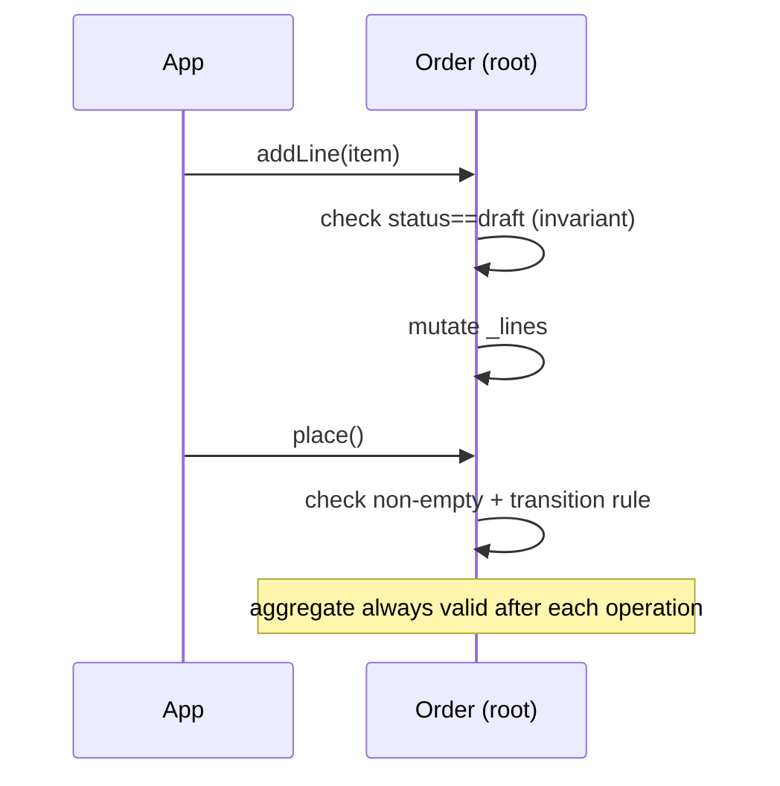

# Aggregates & Invariants

> An **aggregate** is a cluster of entities + value objects treated as **one consistency boundary**, accessed only through its **aggregate root** (a single entity that guards the whole cluster's **invariants**). Outsiders hold references to the **root only**; all changes go **through root methods** that keep the aggregate valid at all times (`order.addLine(...)` enforces "total = sum of lines," "can't modify a shipped order"). The design rules: keep aggregates **small**, enforce **invariants inside the boundary transactionally**, and reference **other aggregates by id** (not object) — so each aggregate is an independently consistent, loadable, savable unit.

## Introduction

This file covers the pivotal DDD pattern: aggregates as consistency boundaries, the aggregate root as the single entry point and invariant guardian, and the rules for sizing aggregates and referencing across them. It organizes the tactical building blocks ([02_tactical_building_blocks.md](02_tactical_building_blocks.md)) into consistency units.

## Why this concept exists

In a rich model, "which objects must always be consistent together, and who enforces that?" is the hard question. Without aggregates, invariants (an order's total, a project's task limits) get enforced ad hoc across the codebase and drift. Aggregates answer it: draw a **consistency boundary**, funnel changes through **one root**, and guarantee the cluster is **always valid** — making consistency a structural property, not a hope.

## Real-world analogy

An aggregate is a **shopping cart with a single checkout clerk (the root)**: you can't reach into the cart and rearrange items directly — every add/remove goes **through the clerk**, who re-checks the rules (item limits, price totals) on every change and never lets the cart reach an invalid state. Other carts (aggregates) are referenced by **their receipt number (id)**, not by physically holding them. Keep each cart manageable (small); a cart holding the entire store is unmanageable.

## Problem Statement

Model an `Order` aggregate: the `Order` root guards line items + status, enforcing invariants (total = sum of lines; only `draft` orders can add lines; `placed`→`shipped` transitions are valid), exposing only intent methods, referencing `Customer` by id, and keeping the aggregate small. You'll define the boundary, root, invariants, and cross-aggregate references.

## Internal Working

```mermaid
flowchart TD
    Root[Aggregate Root: Order] -->|owns| Lines[LineItems (internal entities/VOs)]
    Root -->|guards| Inv[invariants: total, status transitions, limits]
    Outside[outside world] -->|references + calls| Root
    Outside -. NEVER touches .-> Lines
    Root -->|by id| OtherAgg[other aggregate: Customer (ref by id)]
    Note[all changes via root methods; aggregate always valid; small boundary]
```

- **Aggregate**: a **cluster of related entities + VOs** that must stay **consistent together**, treated as a **single unit** for loading, saving, and rule-enforcement — the **consistency/transaction boundary**.
- **Aggregate root**: **one entity** that is the **sole entry point**. Outsiders reference/obtain **only the root**; **internal members are not directly accessible** from outside. The root **enforces all invariants** for the aggregate.
- **All changes through the root**: mutations happen via **root methods** (intent-named: `addLine`, `place`, `ship`), each of which **checks/preserves invariants**. No external code mutates internal parts directly — that's how consistency is guaranteed.
- **Invariants (the point)**: business rules that must **always** hold within the aggregate (an order's total equals its lines; can't add lines to a shipped order; a project can't exceed N members). The root guarantees they hold **after every operation** — the aggregate is **never invalid**.
- **Keep aggregates small**: prefer **small aggregates** (often just a root + a few VOs/child entities). Large aggregates cause contention, big loads, and blurred consistency. If two things don't need to be **immediately consistent**, they belong in **separate aggregates** (eventual consistency between them).
- **Reference other aggregates by id, not by object**: an `Order` holds a `customerId`, **not** a `Customer` object. This keeps aggregates **independently loadable/savable**, prevents huge object graphs, and clarifies boundaries. Cross-aggregate consistency is **eventual** (via domain events — [04_repositories_and_domain_events.md](04_repositories_and_domain_events.md)), not transactional.
- **One transaction per aggregate**: a single transaction should modify **one aggregate**; changes spanning aggregates happen across transactions (eventually consistent). This bounds locking/contention.
- **Repositories are aggregate-granular**: you get/save **whole aggregates** through a repository per aggregate root ([04_repositories_and_domain_events.md](04_repositories_and_domain_events.md)).
- **Dart implementation**: the root is an entity whose **internal collections are encapsulated** (private lists, `UnmodifiableListView` getters), mutations only via methods that **validate invariants** (throw or return `Result`), holding **ids** to other aggregates.

## Memory Representation

An aggregate is an object graph rooted at the root entity: the root + owned child entities/VOs (encapsulated), plus **ids** (not objects) to other aggregates. It's loaded/saved as a unit; internals aren't exposed. Invariants are code in the root guarding state transitions.

## Compiler Behavior

Encapsulation (private fields, unmodifiable getters, no setters) makes bypassing the root a compile-time impossibility for outsiders. Invariant checks run in root methods (throw/`Result`).

## Runtime Behavior

Every mutation passes through the root and re-establishes invariants, so the aggregate is **always valid** at rest. A rule violation is rejected (throw/`Result`) rather than producing an invalid state. Cross-aggregate updates happen in separate steps (eventual consistency).

## Flutter Engine Behavior

None — pure domain.

## Dart VM Behavior

Pure-Dart aggregates give fast, exhaustive invariant tests (no device). Small aggregates keep object graphs and loads light.

## Examples

```dart
// AGGREGATE ROOT — Order guards its lines + status; all changes via methods; refs by id
class Order {
  final String id;
  final String customerId;              // reference OTHER aggregate by id (not Customer object)
  final List<LineItem> _lines = [];     // encapsulated internal members
  OrderStatus _status = OrderStatus.draft;

  Order.newFor(this.id, this.customerId);

  List<LineItem> get lines => List.unmodifiable(_lines);   // no external mutation
  OrderStatus get status => _status;
  Money get total => _lines.fold(Money(0,'USD'), (s, l) => s + l.amount); // derived invariant

  void addLine(LineItem line) {          // intent method enforces invariants
    if (_status != OrderStatus.draft) {
      throw StateError('Cannot modify a $_status order');   // invariant: only draft is editable
    }
    _lines.add(line);
  }

  void place() {
    if (_lines.isEmpty) throw StateError('Cannot place an empty order');   // invariant
    _transition(OrderStatus.placed);
  }
  void ship() => _transition(OrderStatus.shipped);

  void _transition(OrderStatus to) {     // valid status transitions only (invariant)
    const allowed = {
      OrderStatus.draft: {OrderStatus.placed},
      OrderStatus.placed: {OrderStatus.shipped, OrderStatus.cancelled},
    };
    if (!(allowed[_status]?.contains(to) ?? false)) {
      throw StateError('Illegal transition $_status -> $to');
    }
    _status = to;
  }
}
// Outsiders hold an Order (root) and call addLine/place/ship — never touch _lines directly.
```

## Diagrams



## Common Mistakes

| Mistake | Why it's wrong | Fix |
|---------|---------------|-----|
| Mutating internal members from outside | Bypasses invariants → invalid state | All changes via root methods; encapsulate internals |
| Referencing other aggregates by object | Huge graphs, blurred boundaries | Reference by id |
| Huge aggregates | Contention, big loads, unclear consistency | Keep small; split by immediate-consistency need |
| Multiple aggregates per transaction | Contention/coupling | One aggregate per transaction (eventual across) |
| Exposing internal collections (mutable) | External mutation | Unmodifiable getters, no setters |
| Anemic root (rules elsewhere) | Invariants drift | Invariants enforced in the root |
| Expecting immediate cross-aggregate consistency | Not the model | Eventual consistency (domain events) |

## Best Practices

- Define an **aggregate = consistency boundary**; expose **only the root**, encapsulate internals, and route **all changes through root methods** that **enforce invariants** (always-valid).
- Keep aggregates **small** (root + a few members); put things that need **immediate consistency** together, everything else in **separate aggregates**.
- **Reference other aggregates by id** (not object); target **one aggregate per transaction**; use **eventual consistency + domain events** across aggregates.
- Enforce invariants **inside the boundary** (throw/`Result`); make repositories **aggregate-granular** ([04_repositories_and_domain_events.md](04_repositories_and_domain_events.md)); keep it **pure Dart** + unit-tested.

## Performance

Small aggregates keep loads/saves and locking light (one aggregate per transaction reduces contention). By-id references avoid loading giant object graphs. Invariant checks are cheap. Large aggregates are the main perf/consistency hazard — split them.

## Advantages / Disadvantages

- **+** Structural consistency (always-valid aggregate), clear boundaries, encapsulated invariants, bounded transactions/loads, testable rules.
- **−** Boundary-sizing judgment, by-id references (no navigation convenience), eventual consistency across aggregates (more complex flows), encapsulation discipline.

## Interview Questions

1. **🟢 What is an aggregate and its root?** — A cluster of entities/VOs forming one consistency boundary, accessed only through a single aggregate root that guards its invariants.
2. **🟢 How are aggregates changed?** — Only through root methods (intent-named), each enforcing invariants — outsiders never mutate internal members directly.
3. **🟡 Why reference other aggregates by id, not object?** — To keep aggregates independently loadable/savable, avoid huge graphs, and keep boundaries clear (cross-aggregate consistency is eventual).
4. **🟡 Why keep aggregates small?** — Large aggregates cause contention, big loads, and blurred consistency; only immediately-consistent data belongs together.
5. **🟡 What's the transaction rule?** — One transaction should modify one aggregate; changes across aggregates happen in separate transactions (eventual consistency).
6. **🔴 How do you guarantee an aggregate is never invalid?** — All mutations go through root methods that check/preserve invariants and reject violations (throw/`Result`) — encapsulation prevents bypass.
7. **🔴 How does cross-aggregate consistency work then?** — Eventually, coordinated via domain events rather than a single transaction spanning aggregates.

## Senior Engineer Tips

- Draw the consistency boundary by asking "what must be true together at all times?" — that set is one aggregate; everything else is another aggregate reached by id.
- Encapsulate ruthlessly (private collections, unmodifiable getters, no setters); an aggregate that leaks its internals can't guarantee its invariants.
- Default to small aggregates and eventual consistency across them; the instinct to make one big aggregate for convenience is the top cause of contention and invariant drift.

## Architect Perspective

Aggregates turn invariants into a structural guarantee: a consistency boundary with a single guardian root, changed only through intent methods, referencing peers by id, kept small and transactionally bounded. This is where DDD's "always-valid model" lives, and it directly shapes persistence (aggregate-granular repositories), transactions (one aggregate each), and cross-aggregate flows (events, eventual consistency). Getting aggregate boundaries right is the most consequential tactical-design decision in a complex domain ([02_tactical_building_blocks.md](02_tactical_building_blocks.md), [04_repositories_and_domain_events.md](04_repositories_and_domain_events.md)).

## Summary

- Aggregate = consistency boundary accessed only via its root, which guards invariants; all changes go through root methods (always-valid).
- Keep aggregates small (only immediately-consistent data together); reference other aggregates by id; one aggregate per transaction; eventual consistency across.
- Encapsulate internals; enforce invariants inside; repositories are aggregate-granular; pure Dart + unit-tested.

## Revision Notes

- Aggregate = cluster + consistency boundary; **root** = sole entry point + invariant guardian; all mutations via root methods (intent-named), always-valid.
- Keep small (immediate-consistency set only); reference other aggregates **by id**; **one aggregate per transaction**; cross-aggregate = eventual (domain events).
- Encapsulate internals (private, unmodifiable getters); enforce invariants (throw/`Result`); aggregate-granular repositories; pure Dart, unit-tested.

## Practice Questions

1. What determines which objects belong in one aggregate?
2. Why reference other aggregates by id and use one transaction per aggregate?
3. How does the root guarantee the aggregate is never invalid?

## Coding Questions

1. Implement an `Order` aggregate root guarding line + status invariants (via methods).
2. Encapsulate internal collections (unmodifiable getters, no setters) and reference `Customer` by id.
3. Unit-test that illegal operations (add to shipped, empty place, bad transition) are rejected.

## Mini Project

**Order aggregate (Flutter/domain):** Model an `Order` aggregate with a root enforcing invariants (total = sum of lines, only `draft` editable, valid status transitions, no empty place), exposing only intent methods (`addLine`/`place`/`ship`/`cancel`), encapsulating internal line items (unmodifiable getters), and referencing `Customer` by id. Unit-test that valid ops succeed and every invariant violation is rejected. Acceptance: single root entry point (internals encapsulated); all changes via methods enforcing invariants (always-valid); small aggregate; by-id cross-aggregate reference; illegal operations rejected in tests; pure Dart.
