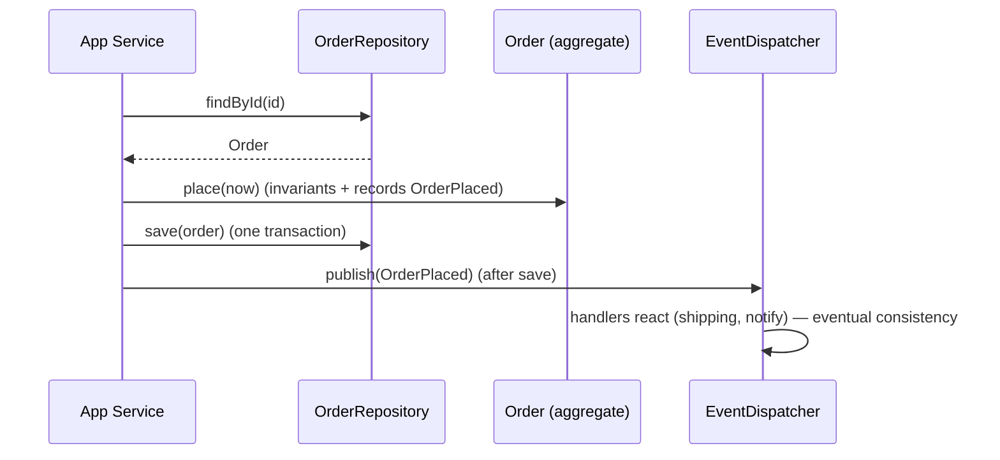

# Repositories & Domain Events

> Two DDD patterns connect the aggregate model to the wider system: a **repository** provides the illusion of an **in-memory collection of aggregates** — one repository **per aggregate root**, getting/saving **whole aggregates** by identity (`orders.findById(id)` / `orders.save(order)`), hiding persistence entirely. **Domain events** capture **something meaningful that happened** in the domain (`OrderPlaced`, `PaymentReceived`) as immutable facts an aggregate emits; other parts of the system (often other aggregates/contexts) **react** to them — the mechanism for **eventual consistency** across aggregate boundaries. **Application services** orchestrate use cases (load aggregate → call its methods → save → publish events) without holding domain rules.

## Introduction

This file covers the domain's boundary to persistence (repositories) and to the rest of the system (domain events), plus the thin orchestration layer (application services) that ties a use case together. It completes the tactical toolkit begun in the aggregates file ([03_aggregates_and_invariants.md](03_aggregates_and_invariants.md)).

## Why this concept exists

Aggregates need to be **persisted/retrieved** without leaking storage into the domain (repositories), and complex domains need to **coordinate across aggregate boundaries** without giant transactions (domain events → eventual consistency). Application services provide a place for **orchestration** so the domain stays pure and the presentation stays thin.

## Real-world analogy

A **repository** is a **librarian for a specific kind of item**: you ask for a book by its id or hand one back to be shelved — you never see the shelving system (storage). A **domain event** is an **announcement on the PA** ("Order #42 has been placed") — a fact broadcast so interested departments (shipping, notifications) can react in their own time (eventual consistency). An **application service** is the **front-desk coordinator** who takes a request, fetches the right item from the librarian, has it do its thing, files it back, and posts the announcement — without knowing the item's internal rules.

## Internal Working

```mermaid
flowchart TD
    App[Application Service (orchestration)] --> Repo[Repository<Order> (per aggregate root)]
    Repo --> Store[(persistence — hidden)]
    App --> Root[Order aggregate: methods enforce invariants]
    Root -->|emits| Event[Domain Event: OrderPlaced]
    Event --> Handlers[handlers / other aggregates / contexts (react)]
    Handlers --> Eventual[eventual consistency across aggregates]
```

- **Repository (DDD sense)**: an abstraction that behaves like an **in-memory collection of aggregates** — `findById`, `save`, sometimes query methods returning aggregate roots. **One repository per aggregate root** (Orders, Customers), operating on **whole aggregates** (load/save the root + its internals as a unit). The **interface lives in the domain**; the **impl in the data layer** (maps to DB/API — [Module 40](../40%20Clean%20Architecture/README.md)). It **hides persistence** so the domain never knows about SQL/HTTP.
  - *(Note: this is the DDD repository — collection-of-aggregates. The Clean-Architecture "repository" ([Module 40](../40%20Clean%20Architecture/README.md)) is a broader data-access abstraction; in a DDD app they align: aggregate-granular, domain-defined interface.)*
- **Domain event**: an **immutable fact** representing **something significant that happened** (`OrderPlaced(orderId, at)`, `FundsTransferred`). Named in **past tense** (ubiquitous language). An aggregate **records/emits** events as part of its behavior; a dispatcher **publishes** them after the aggregate is saved; **handlers react** (update another aggregate, notify, integrate). Events are the backbone of **eventual consistency** across aggregates/contexts (no giant cross-aggregate transaction — [03_aggregates_and_invariants.md](03_aggregates_and_invariants.md)).
- **Emitting events**: the aggregate root appends events to an internal list during operations; the application service **collects + dispatches** them **after a successful save** (so events reflect committed facts). Keep event payloads **small** (ids + key data), not whole aggregates.
- **Application service (use-case orchestration)**: a thin coordinator for a use case: **load** aggregate(s) via repositories → **invoke** aggregate methods (domain rules run there) → **save** → **publish** domain events. It **holds no domain rules** (those are in aggregates/domain services) and **no presentation** (that's the ViewModel). It's the DDD analog of a Clean **use case/interactor** ([Module 40](../40%20Clean%20Architecture/README.md)).
- **Transaction alignment**: an application-service operation typically = **one transaction on one aggregate** + emitting events; reactions to those events run in **their own transactions** (eventual).
- **Consistency model**: **inside an aggregate = strong/immediate** (root invariants); **across aggregates = eventual** (via events). This split is what keeps aggregates small + transactions bounded.
- **Dart fit**: repository = abstract class in domain (`Future<Order?> findById`, `Future<void> save(Order)`), impl in data; domain events = immutable classes; a simple event dispatcher/bus publishes to handlers; application service = plain Dart class using repositories + dispatcher, returning `Result`.

## Memory Representation

Repository interface = domain abstraction; impl holds data sources/mappers. An aggregate holds a small list of pending domain events. The dispatcher holds handler registrations. Application services are stateless orchestrators holding injected repos + dispatcher.

## Compiler Behavior

Repository/domain-event/handler are plain Dart types; the domain compiles without persistence/framework (interfaces only). Events are immutable value classes.

## Runtime Behavior

App service: load → mutate aggregate (invariants enforced) → save (transaction) → publish collected events → handlers react (separate transactions/eventual). A failed save means no events are published (facts must be committed first).

## Flutter Engine Behavior

None — domain/application layer is pure Dart; the client may subscribe to events for UI reactions if it owns domain logic.

## Dart VM Behavior

Pure-Dart repositories (interface)/events/services give fast unit tests (with fake repos + captured events); event dispatch is in-process (or bridged to a message bus in distributed systems).

## Examples

```dart
// REPOSITORY — domain interface, one per aggregate root, whole-aggregate granularity
abstract class OrderRepository {
  Future<Order?> findById(String id);
  Future<void> save(Order order);       // persists the whole aggregate (root + internals)
}

// DOMAIN EVENT — immutable, past-tense fact
class OrderPlaced {
  final String orderId; final DateTime placedAt;
  const OrderPlaced(this.orderId, this.placedAt);
}

// AGGREGATE records events as part of behavior (from aggregates file)
class Order {
  final _events = <Object>[];
  List<Object> pullEvents() { final e = List.of(_events); _events.clear(); return e; }
  void place(DateTime now) {
    if (lines.isEmpty) throw StateError('empty order'); // invariant (strong, inside aggregate)
    _transition(OrderStatus.placed);
    _events.add(OrderPlaced(id, now));                  // record the fact
  }
  // ...
}

// APPLICATION SERVICE — orchestrates: load -> call -> save -> publish (no domain rules here)
class PlaceOrderService {
  final OrderRepository orders; final EventDispatcher events; final Clock clock;
  PlaceOrderService(this.orders, this.events, this.clock);

  Future<Result<void>> call(String orderId) async {
    final order = await orders.findById(orderId);
    if (order == null) return Failure(NotFoundFailure('order'));
    order.place(clock.now());          // domain rules run in the aggregate
    await orders.save(order);          // one transaction, one aggregate
    for (final e in order.pullEvents()) events.publish(e); // publish AFTER save (committed facts)
    return const Success(null);
  }
}
// Handler (elsewhere) reacts to OrderPlaced -> schedule shipping (its own aggregate/transaction) = eventual consistency
```

## Diagrams



## Common Mistakes

| Mistake | Why it's wrong | Fix |
|---------|---------------|-----|
| Repository per entity (not per aggregate) | Breaks aggregate consistency | One repo per aggregate root; whole-aggregate ops |
| Persistence details in the domain | Couples domain to storage | Interface in domain, impl in data |
| Publishing events before save | Broadcasts uncommitted facts | Publish after successful save |
| Fat event payloads (whole aggregates) | Coupling/bloat | Small events (ids + key data) |
| Domain rules in the application service | Anemic domain | Rules in aggregates/domain services |
| Presentation logic in app service | Wrong layer | Presentation in ViewModel |
| Cross-aggregate strong consistency (big txn) | Contention/coupling | Events → eventual consistency |

## Best Practices

- Define **one repository per aggregate root**, operating on **whole aggregates**, with the **interface in the domain** and impl in data (hides persistence).
- Emit **small, immutable, past-tense domain events** from aggregate behavior; **publish after a successful save**; use events for **cross-aggregate eventual consistency**.
- Keep **application services thin** (load → invoke aggregate → save → publish); **no domain rules** (aggregates/domain services) and **no presentation** (ViewModel).
- Align **one transaction ≈ one aggregate**; strong consistency **inside** aggregates, eventual **across**; keep it **pure Dart** + testable (fake repos, capture events).

## Performance

Aggregate-granular repos + one-aggregate transactions bound locking/contention; small events keep dispatch cheap; eventual consistency avoids expensive cross-aggregate transactions. In-process events are near-free; distributed buses add latency but decouple. Pure-Dart layer = fast tests.

## Advantages / Disadvantages

- **+** Persistence-ignorant domain, aggregate-consistent saves, decoupled cross-aggregate coordination (events), thin testable orchestration, bounded transactions.
- **−** Eventual-consistency complexity (ordering, retries, idempotent handlers), event/dispatcher plumbing, discipline to keep rules out of app services, publish-after-save care.

## Interview Questions

1. **🟢 What is a DDD repository?** — An abstraction that behaves like an in-memory collection of aggregates (findById/save), one per aggregate root, operating on whole aggregates, hiding persistence.
2. **🟢 What is a domain event?** — An immutable, past-tense fact that something significant happened in the domain, emitted by an aggregate for others to react to.
3. **🟡 Why publish events after save, not before?** — Events represent committed facts; publishing before a successful save could broadcast something that didn't actually happen.
4. **🟡 How do domain events enable eventual consistency?** — Cross-aggregate reactions run in their own transactions triggered by events, avoiding a single transaction spanning aggregates.
5. **🟡 What belongs in an application service vs the domain?** — App service orchestrates (load/invoke/save/publish) with no domain rules; rules live in aggregates/domain services; presentation lives in the ViewModel.
6. **🔴 Why one repository per aggregate root, not per entity?** — Aggregates are the consistency/loading unit; per-entity repos would let you save internals independently and break invariants.
7. **🔴 How does the DDD repository relate to the Clean-Architecture repository?** — They align: aggregate-granular, domain-defined interface, data-layer impl — DDD just specifies the granularity (per aggregate root) and semantics (collection of aggregates).

## Senior Engineer Tips

- Make repositories aggregate-granular and load/save whole aggregates; per-entity repos silently reintroduce the invariant drift aggregates exist to prevent.
- Record events inside aggregate methods but publish them from the application service only after the save commits; and make handlers idempotent, since events may be redelivered.
- Keep application services skeletal (orchestration only); the moment a rule creeps in there, the domain is going anemic — push it back into the aggregate/domain service.

## Architect Perspective

Repositories and domain events are the aggregate model's connections outward: repositories hide persistence and preserve aggregate-granular consistency; domain events + application services coordinate across aggregates via eventual consistency without giant transactions. Together with aggregates they complete the tactical toolkit — strong consistency inside boundaries, eventual across, orchestration thin, domain pure. This maps cleanly onto Clean Architecture (repos/use cases) and modular/bounded-context boundaries (events crossing contexts, often via an ACL) ([03_aggregates_and_invariants.md](03_aggregates_and_invariants.md), [Module 40](../40%20Clean%20Architecture/README.md), [Module 45](../45%20Modular%20Architecture/README.md)).

## Summary

- Repository = in-memory-collection-of-aggregates abstraction, one per aggregate root, whole-aggregate ops, interface in domain / impl in data (hides persistence).
- Domain events = immutable past-tense facts emitted by aggregates; published after save; drive cross-aggregate eventual consistency.
- Application services orchestrate (load→invoke→save→publish), holding no domain rules/presentation; one transaction ≈ one aggregate.

## Revision Notes

- Repository: per aggregate root, `findById`/`save` whole aggregates; interface in domain, impl in data (hides persistence); aligns with Clean repo.
- Domain event: immutable, past-tense fact; recorded in aggregate methods, published by app service **after save**; small payloads (ids); drives eventual consistency across aggregates.
- Application service: thin orchestration (load→invoke aggregate→save→publish), no domain rules/presentation; one txn ≈ one aggregate; strong inside/eventual across; idempotent handlers; pure Dart.

## Practice Questions

1. Why one repository per aggregate root operating on whole aggregates?
2. Why publish domain events after save, and how do they enable eventual consistency?
3. What does an application service do, and what must it not contain?

## Coding Questions

1. Define an `OrderRepository` interface (domain) + an application `PlaceOrderService`.
2. Emit an `OrderPlaced` event from the aggregate and publish it after save.
3. Unit-test the service with a fake repository + captured events (no device).

## Mini Project

**Repository + events + service (Flutter/domain):** For the Order aggregate, define an `OrderRepository` interface (domain; whole-aggregate `findById`/`save`), have the aggregate emit `OrderPlaced`, and write a thin `PlaceOrderService` that loads → `place()` → saves → publishes the event (after save), returning `Result`. Add a handler reacting to `OrderPlaced` (eventual consistency). Unit-test with a fake repo + captured events. Acceptance: aggregate-granular repo (domain interface); events immutable/past-tense, published after save; app service orchestrates only (no rules/presentation); one-aggregate transaction + eventual cross-aggregate reaction; unit-tested with fakes.
