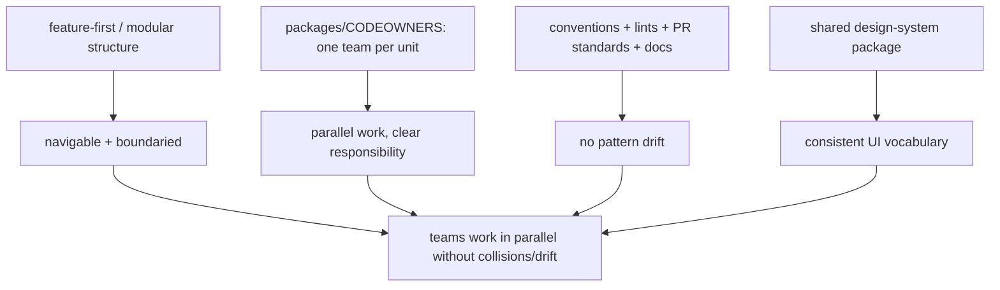

# Codebase & Team Scaling

> As code and contributors grow, two dimensions must be managed together: **codebase** (keep it navigable, low-coupling, buildable) and **team** (keep contributors coordinated, unblocked, consistent). The levers overlap: **feature-first → modular structure** (cohesion + enforced boundaries), **clear ownership** (packages/CODEOWNERS = one team per unit), **governance** (shared conventions, lints/analysis, PR standards, docs), and a **shared design system** (one consistent UI vocabulary). The goal is **parallel work without collisions or drift** — teams own modules, boundaries prevent stepping on each other, and conventions keep the codebase coherent.

## Introduction

This file covers scaling the codebase and team dimensions jointly: structure for navigability + boundaries, ownership mapping, governance to prevent drift, and a design system for UI consistency. It applies the feature-first/modular structure ([44](../44%20Feature%20First%20Architecture/README.md)/[45](../45%20Modular%20Architecture/README.md)) to the human/organizational problem.

## Why this concept exists

A big codebase with many contributors and no structure becomes unnavigable, conflict-ridden, and inconsistent — each dev invents patterns, changes ripple unpredictably, and no one owns anything. Structure + ownership + governance + a design system turn a growing crowd into coordinated teams working in parallel on cohesive, boundaried units with a shared style.

## Real-world analogy

It's running a **large construction firm**: work is divided into **crews owning specific buildings** (module ownership), with **blueprints/building codes everyone follows** (conventions/lints), **inspections before work is accepted** (PR review/CI), and a **shared catalog of standard fixtures** (design system) so every building looks coherent. Without these, 40 workers on one site produce chaos, mismatched fittings, and constant collisions.

## Internal Working



- **Structure (codebase)**: **feature-first** organization (cohesive vertical slices) graduating to **modular packages** with **enforced boundaries** as size/teams grow ([44](../44%20Feature%20First%20Architecture/README.md)/[45](../45%20Modular%20Architecture/README.md)). Cohesion makes code findable; boundaries limit blast radius + enable parallel work + incremental builds.
- **Ownership (team)**: map **modules/packages to owning teams** (CODEOWNERS); a unit has **one clear owner** responsible for its API, quality, and reviews. This aligns Conway's Law deliberately (module boundaries ≈ team boundaries) and removes "everyone and no one" responsibility. Cross-team interaction goes through **contracts** ([Module 45](../45%20Modular%20Architecture/README.md)).
- **Governance (team + codebase)** — prevents drift as contributors multiply:
  - **Conventions**: agreed patterns (architecture, naming, folder layout, state management) documented and applied uniformly.
  - **Automated enforcement**: **lints/analysis** (custom + `analysis_options.yaml`), **import-boundary rules**, formatters, pre-commit hooks, **CI gates** ([Module 50](../50%20CI%20CD/README.md)) — machines enforce so reviews focus on substance.
  - **PR standards + review**: size limits, required reviewers (via CODEOWNERS), templates, definition-of-done.
  - **Docs/onboarding**: architecture guide, ADRs (architecture decision records), a runnable example slice as the template, onboarding docs — so new devs ramp fast and follow patterns.
- **Design system (team + feature consistency)**: a **shared `design_system`/`core/ui` package** of tokens (colors/spacing/typography) + reusable components (buttons, inputs, cards) + theming, owned by a platform/design team. It gives every feature **one consistent UI vocabulary**, prevents each team reinventing widgets, and makes global restyling one change. It's the UI analog of shared `core` ([Module 25](../25%20Adaptive%20UI/README.md)/[Module 44](../44%20Feature%20First%20Architecture/README.md)).
- **The joint goal**: **parallel work without collisions (boundaries + ownership) or drift (governance + design system)** — the codebase stays coherent and buildable as the team grows.
- **Right-sizing**: solo/small → light conventions + feature-first folders; growing/multi-team → modular packages + CODEOWNERS + strict governance + a design system. Introduce as the team/codebase pressure appears ([01_scaling_dimensions.md](01_scaling_dimensions.md)).

## Memory Representation

Not runtime — an **org + repo structure**: modules/packages ↔ owning teams, a conventions/ADR corpus, automated-enforcement config, and a design-system package. The invariant: cohesive owned units with enforced boundaries + shared conventions/UI.

## Compiler Behavior

Lints/analysis + import-boundary rules (→ package boundaries) enforce conventions at build time; the design-system package's public API constrains UI usage. Governance becomes partly compiler-enforced, not just review-enforced.

## Runtime Behavior

Not applicable — these are dev/build/org concerns. (A shared design system does yield consistent runtime UI.)

## Flutter Engine Behavior

Design-system components render like any widgets; consistency reduces bespoke, error-prone UI.

## Dart VM Behavior

Modular packages enable incremental builds (codebase-scale benefit — [Module 45](../45%20Modular%20Architecture/README.md)).

## Examples

```text
Governance stack (automated first, review second):
  analysis_options.yaml   -> lints + custom rules (enforce patterns)
  import boundary rules    -> features -> core/contracts only (no feature->feature)
  formatter + pre-commit   -> consistent style, no bikeshedding
  CI gates                 -> analyze + test (scoped) must pass (Module 50)
  CODEOWNERS               -> per-package owners; required reviewers
  ADRs + architecture doc  -> decisions recorded; example slice = the template
```

```yaml
# CODEOWNERS — modules mapped to owning teams (Conway's Law, on purpose)
/packages/design_system/   @team-platform
/packages/feature_cart/    @team-commerce
/packages/feature_auth/    @team-identity
/packages/contracts/       @team-architecture   # cross-team contracts gated
```

```dart
// Design system: one UI vocabulary every feature reuses (owned centrally)
// package: design_system
class AppButton extends StatelessWidget { /* token-driven, themed, consistent */ }
class AppTextField extends StatelessWidget { /* ... */ }
// features import design_system for UI; they don't reinvent buttons/inputs.
```

## Diagrams

```mermaid
flowchart LR
    Team[growing team] --> Own[module ownership (CODEOWNERS)]
    Team --> Gov[governance (conventions/lints/CI/docs)]
    Team --> DS[design system (shared UI)]
    Own & Gov & DS --> Parallel[parallel work, no collisions/drift]
```

## Common Mistakes

| Mistake | Why it's a problem | Fix |
|---------|-------------------|-----|
| No ownership (shared everything) | Diffuse responsibility, conflicts | Module/package owners (CODEOWNERS) |
| Conventions unenforced (docs only) | Drift as team grows | Automate (lints/CI/import rules) |
| Each team reinventing UI | Inconsistent UX, duplication | Shared design-system package |
| No boundaries between teams' code | Collisions, ripple changes | Modular boundaries + contracts |
| Manual review for style/patterns | Slow, inconsistent | Automate enforcement; review substance |
| No onboarding docs/ADRs/example | Slow ramp, pattern divergence | Architecture guide + ADRs + template slice |
| Heavy governance on a tiny team | Overhead | Right-size (light for small teams) |

## Best Practices

- Use **feature-first → modular** structure with **enforced boundaries**; map **modules/packages to owning teams** (CODEOWNERS) so each unit has one clear owner.
- **Automate governance** (lints, import-boundary rules, formatter, CI gates) so patterns can't drift; reserve **review** for substance; record decisions in **ADRs** + an architecture guide + an **example slice** as the template.
- Provide a **shared design-system package** (tokens + components + theming) so features share one UI vocabulary (owned centrally); cross-team interaction via **contracts**.
- **Right-size** governance/ownership to team size; grow structure as codebase/team pressure appears ([01_scaling_dimensions.md](01_scaling_dimensions.md)).

## Performance

Developer-velocity performance: cohesion + boundaries speed navigation + incremental builds; automated governance removes review bottlenecks; a design system removes UI reinvention; ownership removes coordination stalls. No runtime cost (design system yields consistent runtime UI).

## Advantages / Disadvantages

- **+** Parallel work without collisions/drift, clear ownership, consistent UI, fast onboarding, incremental builds, coherent large codebase.
- **−** Governance/design-system setup + maintenance, ownership boundaries to define + respect, overhead if applied to a tiny team, cross-team contract discipline.

## Interview Questions

1. **🟢 How do you keep a large codebase navigable with many contributors?** — Feature-first → modular structure (cohesion + enforced boundaries), module/package ownership, governance (conventions/lints/CI), and a shared design system.
2. **🟢 How does ownership scale a team?** — Map modules/packages to owning teams (CODEOWNERS) so each unit has one responsible owner, enabling parallel work + clear accountability; interact across teams via contracts.
3. **🟡 Why automate governance instead of relying on review?** — Manual style/pattern review doesn't scale and drifts; lints/import-rules/CI enforce consistently and free reviews for substance.
4. **🟡 What does a design system provide at scale?** — One shared UI vocabulary (tokens + components + theming) so features are consistent, aren't reinvented, and can be restyled globally in one place.
5. **🟡 How does Conway's Law apply here?** — Module/team boundaries tend to mirror each other; align them deliberately (one team per module) so structure matches org.
6. **🔴 How do you prevent pattern drift as the team grows?** — Automated enforcement (lints/boundaries/CI) + documented conventions/ADRs + a template example slice + required reviewers.
7. **🔴 How do you right-size this?** — Light conventions + feature-first for small teams; modular packages + CODEOWNERS + strict governance + design system for large/multi-team — introduce as pressure appears.

## Senior Engineer Tips

- Automate every convention you can (lints, import boundaries, format, CI); documented-but-unenforced conventions drift the moment the team grows past a handful.
- Align module ownership with team boundaries and route cross-team needs through contracts; that's how you get true parallel work instead of constant merge collisions.
- Invest early in a shared design system and an example slice as the canonical template; both pay back massively in consistency and onboarding as headcount rises.

## Architect Perspective

Codebase and team scaling are two faces of the same problem, solved by the same structural moves: cohesive, boundaried, owned modules + automated governance + a shared design system. This deliberately aligns architecture with organization (Conway's Law), enabling many teams to work in parallel on a coherent codebase without collisions or drift — the human-scaling payoff of the feature-first/modular backbone. Right-sized to team size and enforced by tooling, it's what keeps a growing app buildable, consistent, and ownable ([Module 44](../44%20Feature%20First%20Architecture/README.md), [Module 45](../45%20Modular%20Architecture/README.md), [Module 50](../50%20CI%20CD/README.md)).

## Summary

- Scale codebase + team together via feature-first/modular structure (cohesion + enforced boundaries), module ownership (CODEOWNERS), automated governance (lints/CI/docs/ADRs), and a shared design system.
- Goal: parallel work without collisions (boundaries + ownership) or drift (governance + design system); align module ≈ team (Conway's Law).
- Automate enforcement, provide a template slice + onboarding, and right-size to team size.

## Revision Notes

- Structure: feature-first→modular + enforced boundaries; ownership: modules/packages ↔ teams (CODEOWNERS), contracts across teams; align module≈team (Conway).
- Governance: conventions + automated lints/import-rules/format/CI gates + ADRs + architecture doc + example-slice template; automate (not just docs).
- Design system: shared package (tokens + components + theming), central ownership, one UI vocabulary, global restyle in one place; right-size to team size.

## Practice Questions

1. Which levers scale codebase and team together?
2. Why automate governance rather than rely on review?
3. What problems does a shared design system solve at scale?

## Coding Questions

1. Write a CODEOWNERS mapping modules to teams (gated contracts).
2. Configure lints/import-boundary rules enforcing feature→core-only.
3. Sketch a design-system package API (tokens + a couple of components).

## Mini Project

**Codebase + team governance plan (Flutter):** For a growing multi-team app, produce: a modular structure + CODEOWNERS mapping (modules↔teams, gated contracts/design-system), a governance stack (lints + import-boundary rules + CI gates + ADRs + example-slice template), and a shared design-system package outline (tokens + components + theming, central ownership). Right-size to team size. Acceptance: module/package ownership (aligned to teams); automated governance (not docs-only) + boundary enforcement; design system as shared UI vocabulary; onboarding/ADR/template noted; right-sizing to team scale; parallel-work-without-drift rationale.
