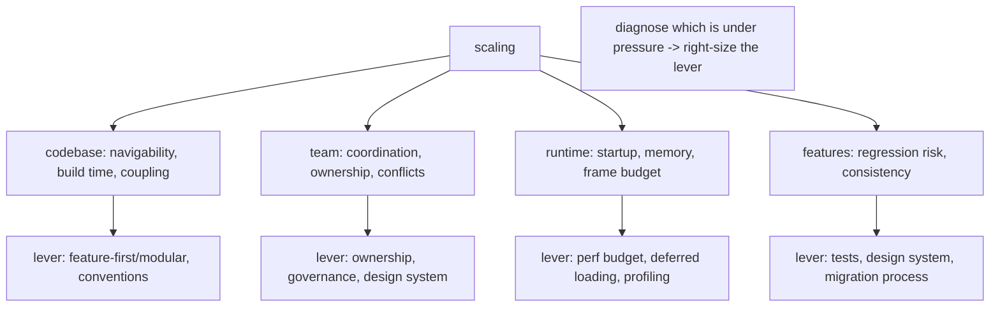
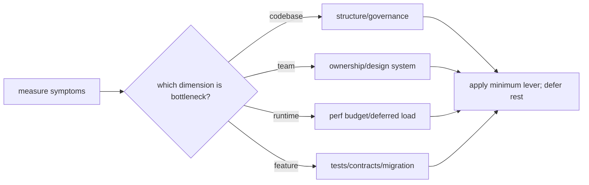

# The Four Dimensions of Scale

> "Scaling" isn't one thing — a Flutter app scales along **four independent dimensions**, each with its own pressure points and levers: **codebase** (files/features → navigability, build time, coupling), **team** (contributors → coordination, ownership, merge conflicts), **runtime** (features/data/users → startup, memory, frame budget), and **features** (capability growth → regression risk, consistency). The scaling mistake is treating them as one: you over-engineer one dimension while another silently degrades. The discipline is to **diagnose which dimension is under pressure** and apply the **right-sized lever** — not maximal architecture everywhere.

## Introduction

This file frames scaling as four distinct dimensions, their symptoms, their levers, and — most importantly — **right-sizing**: applying just enough of each lever for the app's current stage. It's the diagnostic lens for the rest of the module.

## Why this concept exists

Teams conflate scaling with "more architecture," then either gold-plate a small app (wasted effort) or bolt on structure reactively when one dimension is already on fire. Naming the four dimensions lets you diagnose the *actual* pressure and respond proportionally — the difference between deliberate growth and thrash.

## Real-world analogy

Scaling a city has independent dimensions: **road network** (codebase — navigability/throughput), **workforce/governance** (team — coordination), **utilities capacity** (runtime — power/water under load), and **new districts** (features — growth without breaking existing ones). A city that only widens roads while the power grid fails hasn't scaled. You **monitor each system, find the bottleneck, and invest there** — not pour concrete everywhere.

## Internal Working



- **Codebase scale** (more files/features/lines):
  - *Symptoms*: hard to find/understand code, slow builds, tangled dependencies, wide-blast-radius changes.
  - *Levers*: **feature-first → modular** structure ([44](../44%20Feature%20First%20Architecture/README.md)/[45](../45%20Modular%20Architecture/README.md)), conventions, import boundaries/lints, incremental builds.
- **Team scale** (more contributors):
  - *Symptoms*: merge conflicts, unclear ownership, inconsistent patterns, coordination overhead, onboarding pain.
  - *Levers*: **ownership** (CODEOWNERS/packages), **governance** (conventions, lints, review), a **design system** (consistency), parallelizable module boundaries, docs/onboarding.
- **Runtime scale** (more features/data/users on-device):
  - *Symptoms*: slow startup, high memory, jank on big lists/many features, large app size.
  - *Levers*: **performance budget** (startup/memory/frame), deferred/lazy loading, profiling, list virtualization, scoped rebuilds ([Module 21](../21%20Performance/README.md)).
- **Feature scale** (adding capability safely):
  - *Symptoms*: new features break old ones, inconsistent UX, fear of changing shared code.
  - *Levers*: **tests** (regression safety — [Module 49](../49%20Testing/README.md)), **design system** (consistent UX), **stable contracts** + **migration process**, feature flags.
- **Dimensions are independent**: an app can be codebase-heavy but low-team (solo dev with 300 files), or high-team but simple-runtime. **Optimize the dimension under pressure**, not all at once.
- **Right-sizing (the core skill)**: apply the **minimum lever** that relieves the current bottleneck; **defer** the rest. A 3-screen prototype needs none of this; a 50-feature multi-team app needs most. **Grow into** structure ([Module 44](../44%20Feature%20First%20Architecture/README.md)) rather than pre-building it.
- **Diagnosis first**: measure/observe the symptom (build times, conflict rate, frame stats, regression frequency) to identify the pressured dimension, then invest there — data over dogma.
- **The dimensions interact**: modularization (codebase) also helps team (ownership) + build (runtime tooling); a design system helps team + feature consistency — pick levers that relieve multiple dimensions when possible.

## Memory Representation

Not runtime — a **diagnostic model**: four dimensions × current-pressure × available levers. The mental artifact is "which dimension is the bottleneck now, and what's the smallest lever?"

## Compiler Behavior

Codebase-scale levers (modular boundaries, lints) are compile/build-enforced; the others are process/runtime concerns.

## Runtime Behavior

Only the runtime dimension has direct runtime effects (startup/memory/frame); the others affect build/dev/team velocity.

## Flutter Engine Behavior

Runtime-scale levers interact with the engine (rebuilds, rasterization, memory — [Module 21](../21%20Performance/README.md)); the rest don't.

## Dart VM Behavior

Codebase modularization enables incremental builds; runtime scaling touches GC/isolates; others are org/process.

## Examples

```text
Diagnose-then-lever (right-sizing) examples:
  Symptom: builds take 8 min, changes ripple widely  -> dimension: CODEBASE -> lever: modularize (Module 45)
  Symptom: constant merge conflicts, unclear owners   -> dimension: TEAM    -> lever: CODEOWNERS + module boundaries + design system
  Symptom: 3s cold start, jank on the feed            -> dimension: RUNTIME -> lever: perf budget + deferred loading + list virtualization (Module 21)
  Symptom: every release breaks something old         -> dimension: FEATURE -> lever: tests + stable contracts + migration process (Module 49)

Anti-pattern: a 4-screen prototype adopting melos monorepo + DDD -> over-engineering (no dimension under pressure)
```

## Diagrams



## Common Mistakes

| Mistake | Why it's wrong | Fix |
|---------|---------------|-----|
| Treating scale as one thing | Over-build one, neglect another | Diagnose per dimension |
| Pre-building max architecture on a small app | Wasted effort, slower delivery | Right-size; grow into structure |
| Reactive scaling (fix when on fire) | Painful, risky | Monitor symptoms; invest proactively-but-proportionally |
| Dogma over data | Wrong lever for the bottleneck | Measure symptoms, then act |
| Ignoring dimension interactions | Miss multi-benefit levers | Prefer levers that relieve several |
| Scaling runtime by adding architecture | Wrong lever | Runtime → profiling/budget, not folders |
| Never scaling ("it works") | Slow collapse at growth | Watch for symptoms; invest in time |

## Best Practices

- Treat scale as **four independent dimensions** (codebase, team, runtime, feature); **diagnose which is under pressure** from real symptoms before acting.
- Apply the **minimum lever** that relieves the current bottleneck; **defer** the rest; **grow into** structure rather than pre-building it.
- Prefer levers that **relieve multiple dimensions** (modularization → codebase + team + build; design system → team + feature).
- **Measure** (build times, conflict rate, frame/startup/memory stats, regression frequency) to guide investment — **data over dogma**; re-diagnose as the app grows.

## Performance

Only the runtime dimension is about runtime performance; the others are about **developer/team performance** (velocity, safety, coordination). Right-sizing is itself a performance discipline — avoiding wasted effort on non-bottleneck dimensions.

## Advantages / Disadvantages

- **+** (Right-sizing per dimension) targeted investment, sustained velocity, no over/under-engineering, healthy growth on all fronts.
- **−** Requires ongoing diagnosis/measurement + judgment; easy to misjudge the bottleneck; no one-size formula.

## Interview Questions

1. **🟢 What are the four dimensions of scaling an app?** — Codebase, team, runtime, and feature — each with distinct symptoms and levers.
2. **🟢 Why is treating scaling as one thing a mistake?** — You over-engineer one dimension while another silently degrades; each needs its own diagnosis + lever.
3. **🟡 How do you decide what to invest in?** — Diagnose which dimension is under pressure from real symptoms (build times, conflicts, frame/startup stats, regressions), then apply the minimum lever.
4. **🟡 Give a symptom→dimension→lever example.** — Slow builds + wide-ripple changes → codebase → modularize; constant conflicts + unclear owners → team → CODEOWNERS + boundaries + design system.
5. **🟡 What does right-sizing mean here?** — Applying just enough of each lever for the app's current stage, deferring the rest — growing into structure, not pre-building it.
6. **🔴 Which levers relieve multiple dimensions?** — Modularization (codebase + team + build), design system (team + feature consistency) — prefer these.
7. **🔴 How is scaling the runtime dimension different from the others?** — It's the only one about runtime perf (startup/memory/frame → profiling/budget/deferred loading); the others are dev/team/process levers.

## Senior Engineer Tips

- Diagnose before you architect: name the pressured dimension from real symptoms, then reach for the smallest lever — most "we need to re-architect" urges are one dimension, fixable with one targeted change.
- Grow into structure; a 4-screen app adopting melos + DDD is as much a scaling failure as a 50-feature app with everything in one file.
- Favor levers with cross-dimension payoff (modular boundaries, a design system) and keep measuring — the bottleneck moves as the app grows, so re-diagnose periodically.

## Architect Perspective

Scaling is portfolio management across four dimensions: you continuously diagnose which is the bottleneck and invest the minimum lever there, using the architecture band's tools (feature-first/modular for codebase+team, performance discipline for runtime, tests+contracts for features) proportionally. The architect's value is judgment — right-sizing over dogma, cross-dimension levers, and data-driven re-diagnosis — so the app grows sustainably instead of over-engineering one axis while another collapses ([codebase_and_team_scaling.md](codebase_and_team_scaling.md), [performance_and_runtime_scaling.md](performance_and_runtime_scaling.md), [Module 21](../21%20Performance/README.md)).

## Summary

- Apps scale on four independent dimensions: codebase, team, runtime, feature — each with its own symptoms and levers.
- Diagnose the bottleneck from real symptoms, apply the minimum lever, defer the rest; grow into structure; prefer multi-dimension levers.
- Only the runtime dimension is about runtime perf; the rest are dev/team/process — right-size with data, not dogma.

## Revision Notes

- Dimensions: codebase (navigability/build/coupling → feature-first/modular/lints), team (conflicts/ownership → CODEOWNERS/governance/design system), runtime (startup/memory/frame → perf budget/deferred load/profiling), feature (regressions/consistency → tests/contracts/migration).
- Independent → diagnose the bottleneck (measure symptoms), apply minimum lever, defer rest, grow into structure; prefer multi-dimension levers (modular, design system).
- Right-sizing = data over dogma; only runtime dimension = runtime perf; re-diagnose as app grows.

## Practice Questions

1. Name the four dimensions and a symptom of each.
2. How do you decide which dimension to invest in?
3. Why is pre-building maximal architecture a scaling failure?

## Coding Questions

1. Given a set of symptoms, map each to a dimension + a right-sized lever.
2. Identify a lever that relieves multiple dimensions and explain how.
3. Justify deferring a scaling investment for a given app stage.

## Mini Project

**Scale diagnosis (Flutter):** For three app scenarios (a prototype, a growing single-team app, a large multi-team app), diagnose which scaling dimension(s) are under pressure from given symptoms, choose right-sized levers (deferring the rest), and identify any multi-dimension levers. Acceptance: four dimensions applied; symptoms → dimension → minimum-lever mapping per scenario; right-sizing (defer non-bottlenecks) justified; multi-dimension levers noted; data-over-dogma stance.
