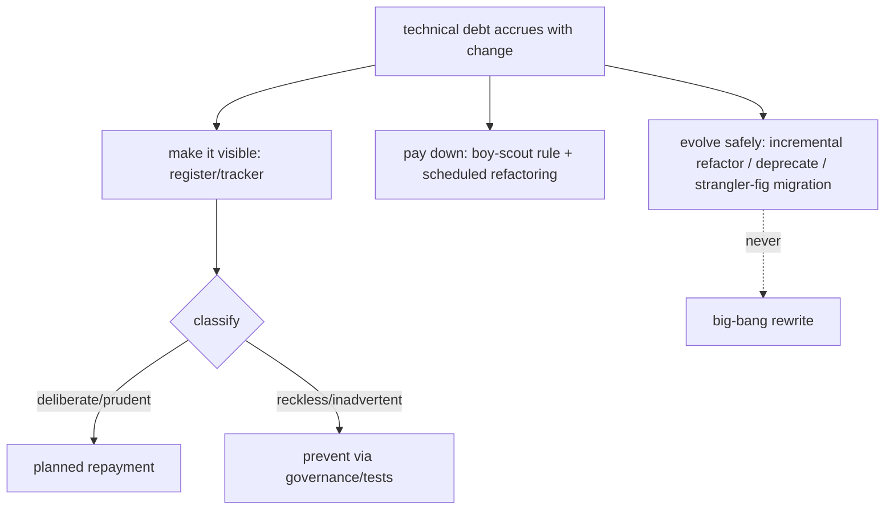

# Technical Debt & Evolution

> Scaling is continuous change, and change accrues **technical debt** — shortcuts, outdated patterns, duplicated code, and deferred fixes that slow future work. Managing it is a discipline: **make debt visible** (a register/tracker, not tribal memory), **distinguish deliberate/prudent debt** (a conscious tradeoff you'll repay) from **reckless/inadvertent debt** (accidental rot), **pay it down continuously** (the boy-scout rule + scheduled refactoring, not a mythical "rewrite later"), and **evolve safely at scale** via **incremental refactoring, deprecation cycles, and strangler-fig migrations** — never big-bang rewrites. Debt isn't inherently bad; **unmanaged, invisible debt** is.

## Introduction

This file covers the feature-scale + longevity dimension: tracking and classifying debt, paying it down, and evolving a large codebase safely (refactoring, deprecation, migration) — so growth doesn't calcify into un-changeable software. It complements the migration mechanics of [Module 44](../44%20Feature%20First%20Architecture/README.md)/[Module 45](../45%20Modular%20Architecture/README.md).

## Why this concept exists

Every scaling app accumulates debt; the question is whether it's **managed** (visible, classified, repaid) or **ignored** (until velocity collapses and everyone fears touching the code). Unmanaged debt is the silent killer of large apps. A deliberate practice keeps the codebase changeable as it grows — turning "we can't touch that" into "we evolve it safely."

## Real-world analogy

Tech debt is like **financial debt**: taken deliberately for leverage (ship now, refactor next sprint) it's a tool; ignored, the **interest compounds** until you can't afford new purchases (features). You keep a **ledger** (debt register), **make interest payments** (continuous refactoring), and **restructure large loans carefully** (planned migrations) — you don't declare bankruptcy and rebuild the whole company (big-bang rewrite), which usually fails.

## Internal Working



- **Make debt visible**: track it explicitly — a **debt register/backlog** (tickets tagged `tech-debt`), `// TODO`/`// DEBT` with links, ADRs recording deliberate shortcuts. Invisible debt (tribal knowledge) can't be prioritized or repaid.
- **Classify debt** (the quadrant — deliberate/inadvertent × prudent/reckless):
  - **Deliberate + prudent**: "we ship now with a known shortcut and a plan to repay" — legitimate leverage; record + schedule.
  - **Deliberate + reckless**: "no time for design" — dangerous; avoid.
  - **Inadvertent + prudent**: "now we know a better way" — learning; refactor as you go.
  - **Inadvertent + reckless**: incompetence/rot — prevent via governance/tests/review.
  - Knowing *which* kind guides response (repay planned vs prevent vs learn).
- **Pay it down continuously**:
  - **Boy-scout rule**: leave code a little better than you found it (small refactors alongside feature work).
  - **Scheduled capacity**: dedicate a % of each cycle to debt (not a mythical "big refactor later" that never comes).
  - **Tests first**: add tests around debt-laden code **before** refactoring so changes are safe ([Module 49](../49%20Testing/README.md)).
- **Refactoring safely (change structure, not behavior)**: small, behavior-preserving steps under test coverage; use tooling; keep PRs small; verify via tests/CI. Big untested refactors are the risk.
- **Deprecation cycles**: to evolve/replace an API, **deprecate** (mark `@Deprecated('use X')`, warn, document), migrate callers **incrementally**, then remove — never break consumers abruptly (esp. in modular apps where contracts have many consumers — [Module 45](../45%20Modular%20Architecture/README.md)).
- **Large migrations = strangler-fig, not big-bang**: replace old with new **incrementally** (new grows around old until old is gone), shipping throughout — the same pattern as layer→feature-first migration ([Module 44](../44%20Feature%20First%20Architecture/README.md)). **Big-bang rewrites** are high-risk, long-freeze, and frequently fail — avoid them.
- **Prevent new debt**: governance (lints, review, architecture guide), tests, and design-system/contracts reduce the rate debt accrues ([codebase_and_team_scaling.md](codebase_and_team_scaling.md)).
- **Right-sizing**: don't chase zero debt (uneconomical) or ignore it (fatal); **manage** it — repay high-interest debt (in hot, frequently-changed areas), tolerate low-interest debt (stable, rarely-touched code).

## Memory Representation

Not runtime — a **debt ledger** (tracked items, classified, prioritized by interest/impact) + an evolution process (deprecation timelines, migration plans). The invariant: debt is visible, classified, and being repaid faster than it accrues in hot areas.

## Compiler Behavior

`@Deprecated` surfaces deprecation warnings guiding migration; lints/analysis prevent classes of new debt; tests + CI gate refactors.

## Runtime Behavior

Not applicable — debt/evolution are dev-time concerns (though unmanaged debt indirectly causes runtime bugs/regressions and slows fixes).

## Flutter Engine Behavior

Not applicable.

## Dart VM Behavior

Not applicable.

## Examples

```dart
// Making deliberate debt visible + planned
// DEBT(#1234, deliberate+prudent): hardcoded pricing; replace with PricingService by Q3.
// See ADR-017. Interest: HIGH (pricing changes weekly) -> prioritize repayment.

// Deprecation cycle: evolve an API without breaking consumers
@Deprecated('Use OrderRepository.findById. Removed in v3.0.')
Future<Order?> getOrder(String id) => findById(id);   // keep old, warn, migrate callers, then remove
```

```text
Strangler-fig migration (incremental, ship throughout) — NOT big-bang:
  1) add the new implementation behind the same interface/contract
  2) route a slice of traffic/callers to the new path (flag/one feature)
  3) migrate callers incrementally; keep old working
  4) delete the old once no callers remain
  # coexist during transition; never a long code freeze

Refactor-safely loop:
  add tests around the debt -> small behavior-preserving change -> CI green -> repeat
```

## Diagrams

```mermaid
flowchart LR
    Track[track debt (register/ADR/TODO)] --> Prioritize[prioritize by interest (hot areas)]
    Prioritize --> TestFirst[add tests]
    TestFirst --> Refactor[small behavior-preserving refactor]
    Refactor --> Migrate[deprecate + strangler-fig migrate]
    Migrate -. never .-> Rewrite[big-bang rewrite]
```

## Common Mistakes

| Mistake | Why it's a problem | Fix |
|---------|-------------------|-----|
| Invisible debt (tribal memory) | Can't prioritize/repay | Debt register + ADRs + tagged TODOs |
| "Big refactor later" (never happens) | Debt compounds | Continuous paydown (boy-scout + scheduled capacity) |
| Refactoring without tests | Behavior regressions | Add tests first; small steps |
| Big-bang rewrite | High risk, long freeze, often fails | Strangler-fig incremental migration |
| Breaking APIs abruptly | Breaks consumers (esp. contracts) | Deprecation cycle (mark → migrate → remove) |
| Chasing zero debt | Uneconomical | Manage by interest; tolerate low-interest debt |
| Ignoring debt in hot areas | Velocity collapse | Prioritize high-interest (frequently-changed) debt |

## Best Practices

- **Make debt visible** (register/tracker + ADRs + linked TODOs) and **classify** it (deliberate/prudent vs reckless/inadvertent) to guide response.
- **Pay down continuously** — boy-scout rule + scheduled capacity + **tests before refactoring**; prioritize **high-interest debt** in hot, frequently-changed areas.
- **Evolve safely at scale**: **deprecation cycles** for API changes (mark → migrate → remove), **incremental strangler-fig migrations** — **never big-bang rewrites**.
- **Prevent new debt** via governance/tests/design-system/contracts; **right-size** — manage debt (not zero, not ignored) by interest/impact.

## Performance

Not runtime — the "performance" is **sustained development velocity**: managed debt keeps change cheap; unmanaged debt makes every change slow and risky. Prioritizing high-interest debt (hot areas) maximizes velocity ROI; refactoring stable low-interest code is low-value.

## Advantages / Disadvantages

- **+** Sustained changeability + velocity, safe evolution, deliberate tradeoffs, no fear of touching code, avoided failed rewrites.
- **−** Requires discipline (tracking, scheduled capacity, tests), deprecation/migration overhead, judgment on interest/priority, ongoing effort.

## Interview Questions

1. **🟢 What is technical debt and is it always bad?** — Shortcuts/outdated patterns/deferred fixes that slow future work; not inherently bad — deliberate, prudent, managed debt is leverage; unmanaged/invisible debt is the problem.
2. **🟢 How do you make debt manageable?** — Make it visible (register/ADRs/TODOs), classify it, and pay it down continuously (boy-scout rule + scheduled capacity) rather than a mythical big refactor.
3. **🟡 How do you refactor safely at scale?** — Add tests around the code first, then make small behavior-preserving changes gated by CI — no big untested rewrites.
4. **🟡 How do you change/replace an API without breaking consumers?** — A deprecation cycle: mark `@Deprecated` (with the replacement), migrate callers incrementally, then remove.
5. **🟡 Why avoid big-bang rewrites?** — High risk, long code freeze, and frequent failure; use incremental strangler-fig migration and ship throughout.
6. **🔴 How do you prioritize which debt to repay?** — By "interest": high-interest debt in hot, frequently-changed areas first; tolerate low-interest debt in stable code.
7. **🔴 How do the debt quadrants guide response?** — Deliberate+prudent → schedule repayment; deliberate+reckless → avoid; inadvertent+prudent → refactor as you learn; inadvertent+reckless → prevent via governance/tests.

## Senior Engineer Tips

- Track debt like tickets and repay it continuously (boy-scout rule + a fixed capacity slice); the "we'll do a big cleanup later" plan is how codebases calcify.
- Always add tests before refactoring and change behavior in small, CI-gated steps; untested refactors are how "cleanup" becomes an outage.
- Evolve via deprecation + strangler-fig and prioritize by interest (hot areas); big-bang rewrites and abrupt API breaks are the two most expensive mistakes at scale.

## Architect Perspective

Managing technical debt and enabling safe evolution is what keeps a scaling app *changeable* over years: visible, classified debt repaid continuously by interest, APIs evolved through deprecation, and large changes made via incremental strangler-fig migration rather than doomed rewrites. It's the temporal dimension of scaling — complementing structure (codebase/team) and runtime — and it's sustained by the same governance/tests/contracts that prevent debt from accruing. The architect institutionalizes the ledger + paydown + evolution process so growth compounds capability instead of calcifying it ([codebase_and_team_scaling.md](codebase_and_team_scaling.md), [Module 44](../44%20Feature%20First%20Architecture/README.md), [Module 49](../49%20Testing/README.md)).

## Summary

- Tech debt is inevitable with change; manage it — make it visible (register/ADRs), classify it, and pay it down continuously (boy-scout + scheduled capacity, tests first).
- Evolve safely: deprecation cycles for APIs, incremental strangler-fig migrations — never big-bang rewrites.
- Prioritize by interest (hot areas), prevent new debt via governance/tests/contracts; manage (not zero, not ignored).

## Revision Notes

- Make debt visible (register/tracker + ADRs + linked TODOs); classify (deliberate/prudent vs reckless/inadvertent → guides response); not inherently bad.
- Pay down continuously (boy-scout rule + scheduled capacity + tests-before-refactor); prioritize high-interest debt (hot/frequently-changed areas); tolerate low-interest.
- Evolve: `@Deprecated` cycles (mark→migrate→remove), strangler-fig incremental migration (ship throughout), never big-bang; prevent new debt via governance/tests/contracts.

## Practice Questions

1. When is technical debt acceptable, and when is it dangerous?
2. How do you refactor a debt-laden module safely?
3. Why deprecation + strangler-fig over a big-bang rewrite?

## Coding Questions

1. Record a deliberate debt item (register/ADR/TODO) with interest + repayment plan.
2. Add a deprecation cycle to evolve an API without breaking callers.
3. Outline a strangler-fig migration (with test-first refactoring) for a legacy module.

## Mini Project

**Debt + evolution plan (Flutter):** For a scaling app, create a technical-debt register (a few items, classified by quadrant + interest, with repayment plans), a continuous-paydown policy (boy-scout rule + scheduled capacity + tests-first), a deprecation-cycle example for an evolving API, and a strangler-fig migration plan for a legacy module (incremental, ship-throughout, no big-bang). Acceptance: debt made visible + classified + prioritized by interest; continuous paydown policy (not "later"); safe refactoring (tests-first, small steps); deprecation cycle; strangler-fig migration (no big-bang); prevention via governance/tests noted.
