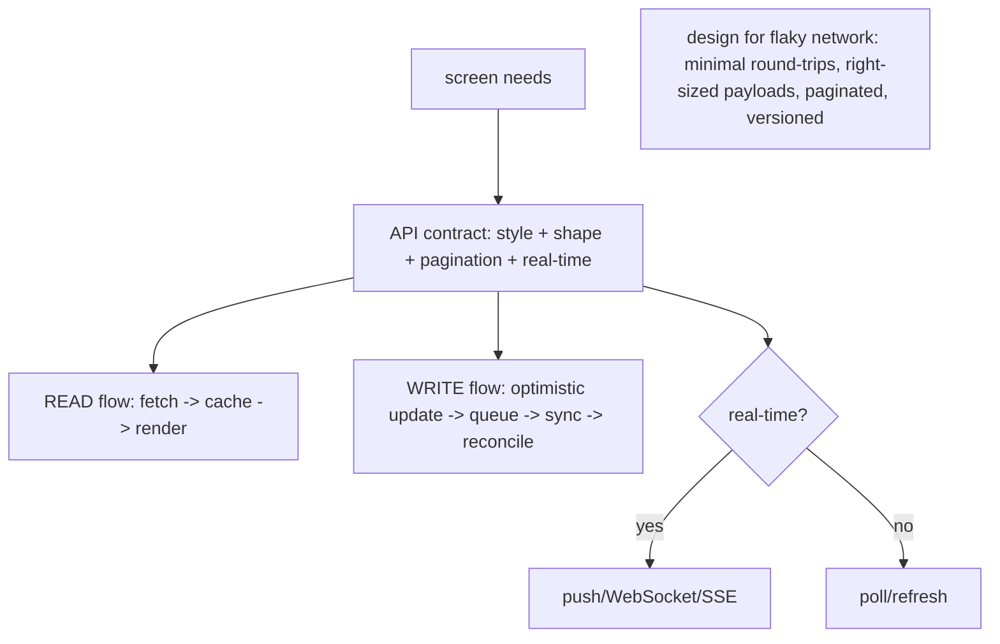

# Client-Server Contract & Data Flow

> The heart of mobile system design is the **client-server contract** — the API shape, protocols, and data flow between app and backend. Key decisions: the **API style** (REST vs GraphQL vs gRPC/WebSocket), **pagination** (cursor vs offset — cursor wins for feeds), **real-time** delivery (push/WebSocket/SSE vs polling), the **data shape** (tailored to the screen vs generic + client assembly), and how data **flows in and out** (fetch → cache → render; write → optimistic → sync). Design the contract to be **efficient over flaky networks** (minimal round-trips, right-sized payloads), **paginated**, and **evolvable** (versioned, additive).

## Introduction

This file covers designing the contract + data flow: API style, pagination, real-time vs polling, payload shaping, and the read/write flows. It's the "how app and backend talk" layer of the design process ([01_system_design_fundamentals.md](01_system_design_fundamentals.md)), building on networking ([Module 16](../16%20Networking/README.md)).

## Why this concept exists

Over a mobile network, the contract determines perceived performance, battery/data use, and resilience. Poor choices (chatty APIs, offset pagination on a live feed, polling for real-time) cause jank, drain, and bugs. Designing the contract deliberately — for the screen's needs, minimal round-trips, and correct pagination/real-time — is where mobile system design earns its keep.

## Real-world analogy

The contract is the **radio protocol between an expedition and base camp**: you choose the **channel type** (a chatty voice line = REST, a precise data burst = GraphQL/gRPC, an always-open line = WebSocket), send **minimal, well-formed messages** (right-sized payloads — bandwidth is precious), request **in manageable batches** (pagination), and decide whether base **calls you when news breaks** (push) or you **check in periodically** (polling). A bad protocol wastes battery and drops messages in bad weather (flaky network).

## Internal Working



- **API style** (choose per needs):
  - **REST**: simple, cacheable, ubiquitous; can be **chatty** (multiple calls per screen) or **over/under-fetch**.
  - **GraphQL**: **client requests exactly the fields it needs** (great for varied mobile screens, reduces over-fetch/round-trips); more server/tooling complexity.
  - **gRPC**: efficient binary, typed contracts, streaming; great for performance/typed contracts, less browser-friendly.
  - **WebSocket/SSE**: for **real-time** streams (chat, live updates).
  - Often a **mix** (REST/GraphQL for CRUD + WebSocket for real-time).
- **Pagination** (essential for lists/feeds):
  - **Offset/page** (`?page=2&size=20`): simple but **breaks on live data** (items shift → duplicates/skips) and is slow deep in.
  - **Cursor/keyset** (`?after=<cursor>`): **stable for live feeds**, efficient — **preferred** for infinite-scroll feeds ([Module 21](../21%20Performance/README.md)).
  - Return **`nextCursor`/`hasMore`**; the client requests pages on scroll; cache pages.
- **Real-time vs polling**:
  - **Push (FCM/APNs)** for out-of-app events ([Module 32](../32%20Notifications/README.md)); **WebSocket/SSE** for in-app live streams (chat, presence, live scores); **polling** only when real-time isn't needed (battery cost — use long intervals/conditional GETs).
  - Design **which events are real-time** vs **pull-on-demand** (e.g., new-post *badge* via push, full content on open).
- **Payload/data shape**:
  - **Tailor to the screen** (BFF/aggregated endpoints or GraphQL) to minimize round-trips, **or** generic endpoints + client assembly (more calls). Right-size payloads (no over-fetching huge objects for a list row).
  - Use **DTOs** mapped to domain entities at the boundary ([Module 40](../40%20Clean%20Architecture/README.md)); images via **CDN** with sized variants.
- **Read flow**: request → (cache-first check) → network → **cache** → map DTO→entity → render; show cached data immediately, refresh in background (stale-while-revalidate — [03_caching_offline_and_scale.md](03_caching_offline_and_scale.md)).
- **Write flow**: **optimistic update** (update UI + local store) → **queue** the mutation (outbox) → **sync** to server → **reconcile** (confirm/rollback on failure); use **idempotency keys** so retries don't duplicate ([Module 19](../19%20Offline%20First/README.md)/[Module 31](../31%20Payments/README.md)).
- **Efficiency + resilience** (mobile-critical): **minimize round-trips** (batch/aggregate), **right-size payloads**, **compress** (gzip), support **conditional GET/ETag** (skip unchanged — [Module 34](../34%20File%20Handling/README.md)), **retry with backoff** on failure ([Module 38](../38%20Error%20Handling/README.md)), and **time out** hung requests.
- **Evolvability**: **version** the API (or additive-only changes), tolerate unknown fields, and keep the contract stable for shipped clients (old app versions linger) — treat it as a **published contract** ([Module 45](../45%20Modular%20Architecture/README.md)).
- **Security**: TLS + pinning, auth tokens, no secrets client-side, server-authoritative ([Module 37](../37%20Security/README.md)).

## Memory Representation

The contract is a spec (endpoints/messages/schemas). At runtime: DTOs on the wire → entities in the app; pages cached; the write outbox holds queued mutations; real-time streams push events into app state.

## Compiler / Runtime / Engine / VM Behavior

Design-level (the implementation lives in networking/offline modules). Runtime characteristics you *design for*: round-trip latency, payload size, real-time event delivery, and sync/reconcile behavior — all shaped by the contract choices above.

## Examples

```text
Feed contract (design):
  GET /feed?after=<cursor>&limit=20  -> { items:[PostDto...], nextCursor, hasMore }   [cursor pagination]
  POST /posts (Idempotency-Key: <uuid>) { text, mediaId } -> PostDto                  [optimistic + idempotent write]
  WS /events  -> {type:'new_post', postId} (badge signal; fetch content on open)      [real-time signal, not full payload]
  Images: https://cdn.example.com/media/<id>?w=640  (sized variants)                  [CDN, right-sized]
  ETag/If-None-Match on /feed for unchanged pages (304)                               [conditional GET]
```

```text
Style decision matrix:
  varied screens, avoid over/under-fetch, many field combos -> GraphQL
  simple CRUD, cacheable, ubiquitous                        -> REST
  high-perf typed contracts / streaming                     -> gRPC
  in-app live updates (chat/presence/live)                  -> WebSocket/SSE
  out-of-app events                                         -> push (FCM/APNs)
  -> often REST/GraphQL + WebSocket + push together
```

## Diagrams

```mermaid
sequenceDiagram
    participant App
    participant Cache
    participant API
    participant WS as Realtime (WS/push)
    App->>Cache: read (cache-first)
    Cache-->>App: cached feed (instant)
    App->>API: GET /feed?after=cursor (refresh)
    API-->>App: page + nextCursor -> cache + render
    WS-->>App: new_post signal -> badge; fetch on open
    App->>API: POST /posts (optimistic UI + idempotency key) -> reconcile
```

## Common Mistakes

| Mistake | Why it's wrong | Fix |
|---------|---------------|-----|
| Offset pagination on a live feed | Duplicates/skips as data shifts | Cursor/keyset pagination |
| Polling for real-time | Battery/data drain, lag | Push/WebSocket/SSE; poll only if acceptable |
| Chatty API (many calls/screen) | Latency/battery over flaky net | Aggregate/BFF/GraphQL; minimize round-trips |
| Over-fetching huge payloads for lists | Bandwidth/memory | Right-size payloads (list vs detail shapes) |
| No idempotency on writes | Duplicate mutations on retry | Idempotency keys |
| Breaking the API for shipped clients | Old apps break | Version/additive; treat as published contract |
| No conditional GET/compression | Wasted bandwidth | ETag/If-None-Match + gzip |
| No retry/backoff/timeout | Hangs/failures on flaky net | Backoff retries + timeouts |

## Best Practices

- Choose the **API style per needs** (REST/GraphQL/gRPC + WebSocket/push, often mixed); design the **payload shape to the screen** (minimize over/under-fetch + round-trips).
- Use **cursor pagination** for feeds; **push/WebSocket** for real-time (not polling); design **which events are real-time vs pull-on-demand**.
- Design **read (cache-first + refresh)** and **write (optimistic + queue + sync + reconcile, idempotent)** flows; make the contract **efficient over flaky networks** (compression, conditional GET, retry/backoff, timeouts).
- Keep the contract **evolvable** (versioned/additive, tolerate unknown fields — shipped clients linger) and **secure** (TLS/pinning/auth, server-authoritative).

## Performance

The contract *is* perceived performance: fewer round-trips + right-sized payloads + cursor pagination + cache-first reads = fast, resilient UX on flaky networks; conditional GET + compression save bandwidth; push beats polling on battery. Poor contracts are the top cause of sluggish, battery-hungry apps ([Module 21](../21%20Performance/README.md)).

## Advantages / Disadvantages

- **+** (Well-designed contract) fast/resilient over flaky networks, battery/data-efficient, correct pagination/real-time, evolvable, secure.
- **−** Requires deliberate design + backend cooperation (BFF/GraphQL), real-time infra (WebSocket) adds complexity, versioning discipline, optimistic/sync complexity.

## Interview Questions

1. **🟢 Which pagination for a live feed, and why?** — Cursor/keyset — it's stable as data shifts (offset causes duplicates/skips) and efficient deep in the list.
2. **🟢 Real-time: push/WebSocket vs polling?** — Push (out-of-app) / WebSocket/SSE (in-app streams) for real-time; polling only when real-time isn't needed (battery/data cost).
3. **🟡 REST vs GraphQL vs gRPC for mobile?** — REST (simple/cacheable/chatty), GraphQL (client picks fields → fewer round-trips/over-fetch), gRPC (efficient typed/streaming); often mixed with WebSocket for real-time.
4. **🟡 Design the write flow for offline resilience.** — Optimistic UI + local write → queue (outbox) → sync with idempotency key → reconcile (confirm/rollback) on reconnect.
5. **🟡 How do you make the contract efficient over flaky networks?** — Minimize round-trips (aggregate/BFF/GraphQL), right-size payloads, compress, conditional GET (ETag), retry+backoff, timeouts.
6. **🔴 How do you keep the API evolvable for shipped clients?** — Version or additive-only changes, tolerate unknown fields, keep it stable (old app versions persist) — treat it as a published contract.
7. **🔴 How do you decide which events are real-time vs pull-on-demand?** — By UX need + cost: send lightweight real-time *signals* (e.g., new-post badge) and fetch full content on demand, reserving heavy real-time for genuinely live features.

## Senior Engineer Tips

- Default feeds to cursor pagination + cache-first reads + a lightweight real-time signal (fetch-on-open); it's the resilient, battery-friendly pattern for the most common prompt.
- Design writes optimistic + queued + idempotent from the start; naive "POST and wait" breaks on flaky networks and duplicates on retry.
- Shape payloads to the screen (list vs detail), minimize round-trips, and treat the API as a versioned published contract — shipped clients live for months.

## Architect Perspective

The client-server contract is the pivotal design surface in mobile system design: it dictates perceived performance, battery/data cost, resilience, and evolvability. Designing it deliberately — right API style, cursor pagination, push/WebSocket for real-time, screen-shaped payloads, and robust read/write (cache-first + optimistic/queued/idempotent) flows over flaky networks — is what makes an app feel fast and reliable. It feeds directly into the caching/offline/sync strategy and maps onto the client's Clean/repository architecture ([03_caching_offline_and_scale.md](03_caching_offline_and_scale.md), [Module 16](../16%20Networking/README.md), [Module 40](../40%20Clean%20Architecture/README.md)).

## Summary

- Design the client-server contract: API style (REST/GraphQL/gRPC + WebSocket/push), cursor pagination for feeds, real-time via push/WebSocket (not polling), screen-shaped payloads.
- Read flow = cache-first + background refresh; write flow = optimistic + queued + synced + reconciled (idempotent).
- Make it efficient over flaky networks (few round-trips, right-sized, compressed, conditional GET, retry/backoff), evolvable (versioned/additive), and secure.

## Revision Notes

- API style: REST (simple/cacheable/chatty), GraphQL (field-precise, fewer round-trips), gRPC (typed/streaming), WebSocket/SSE (in-app real-time), push (out-of-app) — often mixed.
- Pagination: cursor/keyset for feeds (stable/efficient) > offset (duplicates/skips). Real-time: push/WS > polling; design real-time-signal vs pull-on-demand.
- Read: cache-first + refresh (SWR). Write: optimistic + outbox queue + sync + reconcile + idempotency key. Efficiency: minimize round-trips, right-size payloads, gzip, ETag/conditional GET, retry/backoff, timeouts. Evolvable (versioned/additive), secure (TLS/pinning/auth, server-authoritative).

## Practice Questions

1. Why cursor over offset pagination for a live feed?
2. When do you use WebSocket vs push vs polling?
3. How do you design a resilient, idempotent write flow?

## Coding Questions

1. Specify a feed API contract (cursor pagination + real-time signal + write).
2. Choose an API style for a given app and justify it.
3. Design the read + write data flows (cache-first read; optimistic/queued write).

## Mini Project

**Contract & data flow design (Flutter/design):** For a feed app, design the client-server contract — API style choice (justified), cursor-paginated feed endpoint (`nextCursor`/`hasMore`), a real-time new-post signal (push/WebSocket), screen-shaped payloads (list vs detail) + CDN images, and the read (cache-first + refresh) and write (optimistic + queued + idempotent + reconcile) flows — plus efficiency (conditional GET/compression/backoff) and evolvability (versioning). Acceptance: API style justified; cursor pagination; real-time via push/WS (signal + fetch-on-open); read/write flows designed (cache-first; optimistic/queued/idempotent); flaky-network efficiency + versioning + security addressed.
