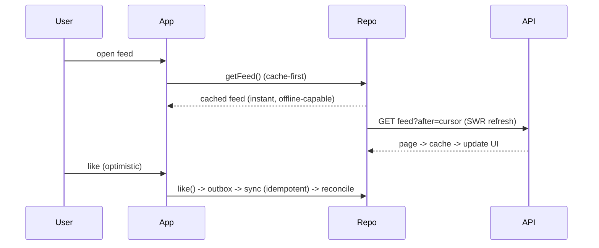

# System Design Integration (Capstone: Design an App End-to-End)

> Put it all together by designing one app **end-to-end**: **clarify requirements** (functional + non-functional), define the **client-server contract + data flow** (API style, cursor pagination, real-time), choose a **per-data-type caching/offline/sync strategy** with **conflict resolution**, address **mobile constraints** (network/battery/memory/untrusted client), **map it onto the client architecture** (Clean/feature-first/MVVM + repositories/cache), and **present the trade-offs + bottlenecks** — delivered as both a **design doc** and a **whiteboard-style walkthrough**. This is the synthesis of the module (and much of the handbook) into one coherent, defensible mobile system design.

## Introduction

This module capstone integrates the fundamentals, contract/data-flow, caching/offline/scale, and interview framework into a complete end-to-end design for a realistic app (a feed or chat). It demonstrates the full process producing a coherent artifact — the deliverable a senior mobile engineer/architect is expected to produce.

## Why this concept exists

Knowing the pieces isn't enough; the value is composing them into **one coherent design** for a real app, with the contract, caching/offline, architecture, and trade-offs all consistent and justified. This capstone provides that integrated exemplar and cements the repeatable process.

## Real-world analogy

It's delivering a **complete expedition plan**: the mission goals + conditions (requirements), the radio protocol with base (contract), the supply/off-grid strategy (caching/offline/sync), the vehicle's internal organization (client architecture), and a briefing that **explains the trade-offs and risks** (bottlenecks) — coherent enough that the team can execute and stakeholders can evaluate.

## Internal Working

```mermaid
flowchart TD
    R[1. Requirements: functional + non-functional + scope] --> Contract[2. Client-server contract + data flow]
    Contract --> Cache[3. Caching + offline + sync (per data type) + conflict resolution]
    Cache --> Arch[4. Client architecture mapping (Clean/feature-first/MVVM + repos/cache)]
    Arch --> Constraints[5. Mobile constraints (network/battery/memory/untrusted)]
    Constraints --> Tradeoffs[6. Trade-offs + bottlenecks + next steps]
    Tradeoffs --> Deliver[design doc + whiteboard walkthrough]
```

- **Step 1 — Requirements** ([system_design_fundamentals.md](system_design_fundamentals.md)): functional (feed/chat features) + **non-functional** (offline? real-time? scale? latency? consistency? security?) + scope/assumptions.
- **Step 2 — Contract + data flow** ([client_server_and_data_flow.md](client_server_and_data_flow.md)): API style (REST/GraphQL + WebSocket/push), **cursor pagination**, real-time signal vs pull-on-demand, screen-shaped payloads + CDN media, and **read (cache-first/SWR)** + **write (optimistic/queued/idempotent)** flows.
- **Step 3 — Caching/offline/sync** ([caching_offline_and_scale.md](caching_offline_and_scale.md)): a **per-data-type table** (where cached, freshness strategy, offline model), **offline model** (snapshot vs offline-first + **conflict resolution**), bounded caches + eviction.
- **Step 4 — Client architecture**: map onto **feature-first** slices ([Module 44](../44%20Feature%20First%20Architecture/README.md)) with **Clean layers** ([Module 40](../40%20Clean%20Architecture/README.md)) + **MVVM** presentation ([Module 43](../43%20MVVM/README.md)); **repositories** own caching/offline/sync ([Module 40](../40%20Clean%20Architecture/README.md)/[Module 19](../19%20Offline%20First/README.md)); DI wires it. Show where the contract, cache, DB, real-time channel, and sync live in the architecture.
- **Step 5 — Mobile constraints**: flaky/offline network (cache-first + retry), battery (push not poll, batch sync), memory (pagination + virtualization + bounded image cache), untrusted client (server-authoritative, TLS/pinning, no secrets — [Module 37](../37%20Security/README.md)), background/store limits.
- **Step 6 — Trade-offs + bottlenecks**: consistency vs availability (eventual for feed), freshness vs battery, optimistic vs pessimistic, real-time vs cost; bottlenecks (network latency, image memory); **what you'd measure/do next** (frame/startup/memory, cache-hit rate, sync-failure rate — [Module 52](../52%20Monitoring/README.md)).
- **Deliverable**: a concise **design doc** (the six sections + diagrams) and a **whiteboard walkthrough** (the interview framework — [mobile_system_design_interview.md](mobile_system_design_interview.md)), communicating structure + trade-offs.
- **Coherence + justification**: every choice traces to a requirement/constraint; alternatives acknowledged; **no single right answer** — the design is defensible for the stated requirements.

## Memory Representation

The artifact: a six-section design doc (requirements → contract → caching/offline → architecture → constraints → trade-offs) + diagrams (data flow, architecture, per-data caching table). It's a static, justified plan.

## Compiler / Runtime / Engine / VM Behavior

Design-level; the implementation spans the handbook's modules. The design *specifies* runtime characteristics (latency, offline behavior, memory/battery budgets, consistency) the implementation must meet.

## Examples

```text
End-to-end design (feed app) — the six sections, condensed:
  1. Requirements: infinite feed, likes, detail; offline read=yes, real-time=new-post badge,
                   scale=10M, feed<1s, eventual consistency, auth + no PII logs. Backend=given REST/GraphQL API.
  2. Contract: GraphQL feed(after,limit)->{items,nextCursor,hasMore}; WS new_post signal; POST like (idempotent);
               CDN sized images; read=cache-first/SWR; write=optimistic+queued.
  3. Caching/offline: feed=DB+SWR+offline snapshot; images=disk TTL/LRU/size cap; likes=offline-first outbox+LWW;
               token=secure storage. Bounded + evict; eventual consistency.
  4. Architecture: feature-first (features/feed) + Clean (domain/data/presentation) + MVVM;
               FeedRepository owns cache/network/sync; DI-wired; WS+push in a service.
  5. Constraints: cache-first+retry (flaky net); push not poll (battery); virtualized list + bounded image cache (memory);
               server-authoritative + TLS/pinning (untrusted client).
  6. Trade-offs: eventual consistency for feed (ok); freshness vs battery; optimistic likes reconcile;
               bottlenecks: image memory, network latency; measure: frame/startup/memory, cache-hit, sync-failure.
```

```mermaid
flowchart LR
    App[Flutter app: feature-first + MVVM] --> Repo[FeedRepository (cache/offline/sync)]
    Repo --> Cache[local DB + image cache]
    Repo --> API[REST/GraphQL API]
    App --> RT[WebSocket/push (new-post signal)]
    API --> Backend[(backend — given)]
    Repo -->|outbox| Sync[sync + conflict resolution]
```

## Diagrams



## Common Mistakes

| Mistake | Why | Fix |
|---------|-----|-----|
| Skipping requirements/assumptions | Designs the wrong system | Clarify F + NFR + scope first |
| No data-flow/architecture diagrams | Hard to communicate | Draw contract + architecture + caching table |
| One caching strategy for all data | Wrong freshness per datum | Per-data-type strategy |
| Over-engineering (full offline-first everywhere) | Needless complexity | Right-size (snapshot unless writes-offline needed) |
| Ignoring mobile constraints | Misses the essence | Address network/battery/memory/untrusted |
| Not mapping to client architecture | Design floats abstractly | Map onto feature-first/Clean/MVVM + repos |
| Presenting without trade-offs/bottlenecks | Incomplete design | State trade-offs + bottlenecks + next steps |

## Best Practices

- Deliver the **six-section design** (requirements → contract/data flow → caching/offline/sync → client architecture → constraints → trade-offs) as a **doc + whiteboard walkthrough**, with **diagrams**.
- **Clarify requirements first**; choose a **per-data-type caching/offline strategy**; **right-size** the offline model + conflict resolution; **map onto feature-first/Clean/MVVM + repositories**.
- **Address mobile constraints explicitly** (network/battery/memory/untrusted client) and **justify every trade-off** against requirements; note **bottlenecks + what you'd measure**.
- Ensure **coherence** (every choice traces to a requirement/constraint) and acknowledge **alternatives** — defensible, not canonical.

## Performance

The design bakes in performance: cache-first/SWR + cursor pagination + virtualization + bounded image cache + push-over-poll = fast, resilient, battery-friendly UX, with explicit budgets + metrics to verify ([Module 21](../21%20Performance/README.md)/[Module 52](../52%20Monitoring/README.md)). Performance is a design output, traced to requirements.

## Advantages / Disadvantages

- **+** Coherent, justified, mobile-centric end-to-end design; implementable; communicates well (doc + whiteboard); synthesizes the handbook.
- **−** Requires broad synthesis + judgment; time-consuming to do fully; no single correct answer (must defend choices).

## Interview Questions

1. **🟢 What are the sections of an end-to-end mobile design?** — Requirements, client-server contract/data flow, caching/offline/sync, client architecture, mobile constraints, trade-offs/bottlenecks.
2. **🟢 How do you present the design?** — As a concise doc + a whiteboard walkthrough with diagrams (data flow, architecture, per-data caching), communicating structure + trade-offs.
3. **🟡 How does the design map onto the client architecture?** — Feature-first slices + Clean layers + MVVM; repositories own caching/offline/sync; DI wires it; real-time via a service.
4. **🟡 How do you decide caching/offline per data type?** — By freshness need + offline requirement: SWR/snapshot for feed, network-first for must-be-fresh, offline-first (outbox + conflict policy) only where offline writes are required.
5. **🟡 Which mobile constraints must the design address, and how?** — Flaky net (cache-first + retry), battery (push/batch), memory (pagination/virtualization/bounded caches), untrusted client (server-authoritative + TLS/pinning).
6. **🔴 How do you keep the design coherent and defensible?** — Trace every choice to a requirement/constraint, articulate trade-offs, acknowledge alternatives — coherent for the clarified requirements, not a canonical answer.
7. **🔴 What bottlenecks/metrics would you call out?** — Network latency + image memory as bottlenecks; measure frame/startup/memory, cache-hit rate, and sync-failure rate to verify/iterate.

## Senior Engineer Tips

- Structure the deliverable as the six sections with diagrams; a coherent doc + whiteboard that traces every decision to a requirement is what reads as senior.
- Right-size the caching/offline design per data type and reserve full offline-first for genuine offline-write needs; over-engineering the sync engine is as much a failure as ignoring offline.
- Always close with trade-offs, bottlenecks, and what you'd measure next; a design without acknowledged tensions and metrics looks naive.

## Architect Perspective

This capstone is the synthesis the whole handbook builds toward: turning requirements + mobile constraints into a coherent, justified end-to-end system — contract, caching/offline/sync, client architecture, and trade-offs — communicated clearly. It composes networking, offline-first, storage, performance, security, and the architecture band into a single design discipline. The mark of a senior mobile architect is exactly this: given an ambiguous prompt, produce a defensible, mobile-centric design that a team can build and stakeholders can evaluate ([system_design_fundamentals.md](system_design_fundamentals.md), [Module 40](../40%20Clean%20Architecture/README.md), [Module 19](../19%20Offline%20First/README.md), [Module 47](../47%20Scalable%20Applications/README.md)).

## Summary

- Design end-to-end in six sections: requirements → contract/data flow → caching/offline/sync → client architecture → constraints → trade-offs; deliver as a doc + whiteboard with diagrams.
- Clarify requirements first; per-data-type caching/offline (right-sized); map onto feature-first/Clean/MVVM + repositories; address mobile constraints; justify trade-offs + bottlenecks + metrics.
- Coherent + defensible for the stated requirements — the synthesis of the module and much of the handbook.

## Revision Notes

- Six sections: requirements (F+NFR+scope) → contract/data flow (API style, cursor pagination, real-time, read/write flows) → caching/offline/sync (per-data-type + conflict resolution, bounded) → client architecture (feature-first + Clean + MVVM + repositories/DI) → mobile constraints (network/battery/memory/untrusted) → trade-offs/bottlenecks/metrics.
- Deliver doc + whiteboard with diagrams (data flow, architecture, caching table); every choice traces to a requirement/constraint; right-size; acknowledge alternatives; no single right answer.
- Synthesizes networking/offline/storage/performance/security/architecture band.

## Practice Questions

1. What are the six sections, and what goes in each?
2. How do you map the design onto the client architecture?
3. How do you keep the design coherent and defensible?

## Coding Questions

1. Produce a six-section end-to-end design doc for a given app.
2. Draw the data-flow + architecture + per-data caching diagrams.
3. Write the trade-offs/bottlenecks/metrics section.

## Mini Project

**End-to-end design (capstone — Flutter/design):** Design a feed or chat app end-to-end as a six-section doc + whiteboard walkthrough: (1) requirements (F + NFR + scope), (2) client-server contract + data flow (API style, cursor pagination, real-time, read/write flows), (3) per-data-type caching/offline/sync + conflict resolution, (4) client architecture mapping (feature-first + Clean + MVVM + repositories/DI), (5) mobile constraints, (6) trade-offs + bottlenecks + metrics — with diagrams. Acceptance: all six sections with diagrams; requirements-first + assumptions; deliberate contract (cursor pagination, real-time); per-data-type caching/offline (right-sized + conflict policy); mapped onto client architecture; mobile constraints addressed; trade-offs/bottlenecks/metrics stated; coherent + defensible; presentable as a whiteboard walkthrough.
