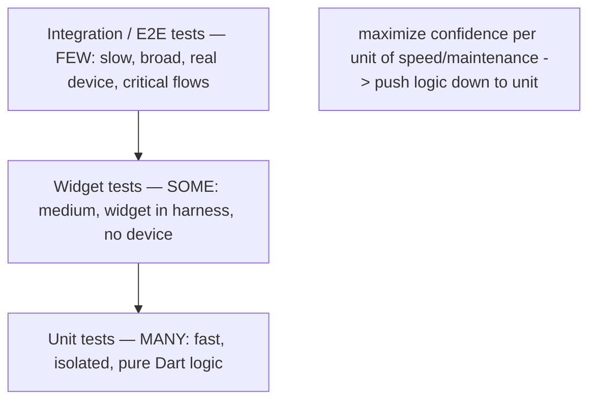
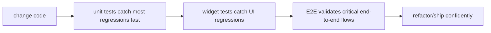

# Testing Fundamentals & the Pyramid

> Tests exist to let you **change code with confidence** — they document behavior, catch regressions, and gate CI. The **testing pyramid** prescribes the right *mix*: **many fast, isolated unit tests** (the base), **fewer widget tests** (the middle), and **few slow, broad integration/E2E tests** (the tip). Flutter maps this to **unit tests** (pure Dart logic — fastest), **widget tests** (a widget in a test harness, no device — medium), and **integration tests** (the real app on a device/emulator — slowest). The goal: **maximize confidence per unit of speed/maintenance** by pushing logic down to fast unit tests and reserving slow E2E for critical end-to-end flows.

## Introduction

This file establishes *why* to test, the pyramid and its Flutter mapping, what each test type covers, and what to test (behavior, not implementation). It's the strategic frame for the tool-specific files.

## Why this concept exists

Two failure modes plague testing: **too few tests** (can't refactor/ship safely) and **the wrong mix** (all slow, brittle E2E tests → slow CI, flaky, expensive to maintain). The pyramid encodes decades of experience: most confidence should come from **fast, isolated** tests, with expensive E2E used sparingly for critical paths. Getting the *shape* right is more important than raw count.

## Real-world analogy

Testing a car: you **bench-test individual components** cheaply and exhaustively (unit — spark plugs, sensors), **test subsystems** on a rig (widget — the dashboard cluster), and only **road-test the whole car** occasionally (E2E — slow, expensive, but validates the real experience). A factory that *only* road-tests every car (all E2E) is slow and can't pinpoint faults; one that never assembles and drives one (no E2E) ships cars that don't actually work. The **pyramid** balances them.

## Internal Working



- **Why test** (the payoff):
  - **Regression safety**: catch breakage when changing code (the #1 reason).
  - **Confident refactoring**: restructure freely with tests as the safety net ([Module 47](../47%20Scalable%20Applications/README.md)).
  - **Living documentation**: tests describe intended behavior.
  - **CI gating**: tests block bad merges ([Module 50](../50%20CI%20CD/README.md)).
  - **Design pressure**: hard-to-test code reveals bad design (untestable = tightly coupled).
- **The pyramid (the right mix)**:
  - **Base — many unit tests**: fast (ms), isolated, deterministic; test **logic** (use cases, view models, repositories, pure functions). The bulk of your tests + confidence.
  - **Middle — some widget tests**: test **UI behavior** (rendering per state, interactions) in a test harness (no device); slower than unit, faster than E2E.
  - **Tip — few integration/E2E tests**: test **critical end-to-end flows** on a real device/emulator (login → browse → checkout); slow, broad, higher-maintenance — use **sparingly** for what unit/widget can't cover.
  - **Anti-shapes**: **ice-cream cone** (mostly E2E — slow/flaky/expensive) and **hourglass** (E2E + unit, no widget). Aim for the pyramid.
- **Flutter test types (map to pyramid)**:
  - **Unit test** (`package:test`/`flutter_test`): pure Dart, no `WidgetsFlutterBinding` (unless using `flutter_test` matchers); fastest.
  - **Widget test** (`flutter_test` + `testWidgets`): pumps a widget tree in a test binding, no device; medium.
  - **Integration test** (`integration_test`): runs the real app on device/emulator; slowest.
  - **Golden test** (widget-level): pixel-snapshot comparison of rendered UI ([03_widget_and_golden_tests.md](03_widget_and_golden_tests.md)).
- **What to test (behavior, not implementation)**: assert **observable behavior/outputs** (given input → expected output/state/render), **not** private internals or exact call sequences beyond what matters — so tests survive refactors. Cover **happy + unhappy paths** (errors, empty, edge cases — [Module 38](../38%20Error%20Handling/README.md)).
- **What NOT to over-test**: trivial getters, framework code, generated code; and don't chase 100% coverage for its own sake ([05_testing_integration.md](05_testing_integration.md)).
- **Testable architecture enables the pyramid**: Clean/MVVM (pure domain, view-model state, repository interfaces + fakes) lets most logic be tested by **fast unit tests** — the payoff of the architecture band ([Module 40](../40%20Clean%20Architecture/README.md)/[Module 43](../43%20MVVM/README.md)).

## Memory Representation

Not runtime — a **test suite shape**: a large base of unit tests, a medium band of widget tests, a small tip of E2E. The mental metric: **confidence per (speed × maintenance cost)** — favor fast, isolated tests.

## Compiler Behavior

Tests are code; unit tests compile against pure Dart/interfaces (fakes injected), enabling isolation. Test files live in `test/` (unit/widget) and `integration_test/` (E2E).

## Runtime Behavior

Unit tests run in the Dart VM (ms); widget tests in the Flutter test binding (no real device); integration tests on a device/emulator (seconds+). Speed differences are why the pyramid is shaped as it is.

## Flutter Engine Behavior

Widget tests use a **test binding** (fake engine — no real rendering to a screen, controllable time via `pump`); integration tests use the real engine on-device. Unit tests don't touch the engine.

## Dart VM Behavior

Unit tests are the fast tier (no binding/IO); parallelizable in CI. Integration tests are serial + slow (real app lifecycle).

## Examples

```dart
// UNIT (fastest) — pure logic, no device; assert behavior (given -> expected)
test('total = sum of line subtotals', () {
  final order = Order('1', [LineItem('p', 2, 500), LineItem('q', 1, 300)]);
  expect(order.total, Money(1300, 'USD'));        // behavior, not internals
});

// WIDGET (medium) — widget in a test harness, no device
testWidgets('shows error + retry on failure state', (tester) async {
  await tester.pumpWidget(wrap(ProfileView(state: ProfileError('Failed'))));
  expect(find.text('Failed'), findsOneWidget);
  expect(find.text('Retry'), findsOneWidget);
});

// INTEGRATION/E2E (slow, few) — real app, critical flow only
// integration_test: launch app -> login -> see home -> logout
```

```text
Aim for the PYRAMID, avoid the ICE-CREAM CONE:
  GOOD (pyramid):   ~70% unit, ~20% widget, ~10% integration/E2E
  BAD (cone):       mostly E2E -> slow CI, flaky, hard to pinpoint failures
```

## Diagrams



## Common Mistakes

| Mistake | Why it's wrong | Fix |
|---------|---------------|-----|
| Too few tests | Can't refactor/ship safely | Build the pyramid (unit-heavy) |
| Ice-cream cone (mostly E2E) | Slow, flaky, expensive, imprecise | Push logic to fast unit tests |
| Testing implementation details | Brittle; breaks on refactor | Test observable behavior/outputs |
| Only happy paths | Bugs live in errors/edges | Cover unhappy paths too |
| No isolation (real I/O in unit tests) | Slow, flaky, nondeterministic | Fakes/mocks at boundaries |
| Chasing 100% coverage | Wastes effort, false confidence | Meaningful coverage of behavior |
| Over-testing trivia/framework | Low value, maintenance | Skip trivial getters/generated code |

## Best Practices

- Build the **pyramid**: **many fast isolated unit tests** (logic), **some widget tests** (UI behavior), **few integration/E2E** (critical flows) — maximize confidence per speed/maintenance.
- **Test observable behavior** (given input → expected output/state/render), **not implementation details**; cover **happy + unhappy paths** ([Module 38](../38%20Error%20Handling/README.md)).
- Keep unit tests **isolated + deterministic** (fakes/mocks at boundaries — [02_unit_and_mocking.md](02_unit_and_mocking.md)); leverage **testable architecture** (Clean/MVVM) to push logic into fast unit tests.
- Avoid the **ice-cream cone**; don't over-test trivia/framework or chase 100% coverage; run tests in **CI** ([Module 50](../50%20CI%20CD/README.md)).

## Performance

Test *suite* speed is the point: unit tests (ms) give fast feedback + CI; E2E (seconds+) is the slow tail. A pyramid keeps CI fast + reliable; a cone makes CI slow + flaky. Push logic down to keep feedback loops tight ([Module 47](../47%20Scalable%20Applications/README.md)).

## Advantages / Disadvantages

- **+** Regression safety, confident refactoring, living docs, CI gating, design pressure; fast feedback (pyramid).
- **−** Writing/maintaining tests costs effort; wrong shape (cone) is slow/flaky; over-testing wastes time; requires testable design.

## Interview Questions

1. **🟢 Why write tests?** — Regression safety, confident refactoring, living documentation, CI gating, and design pressure (untestable code signals bad design).
2. **🟢 What is the testing pyramid?** — Many fast unit tests (base), fewer widget tests (middle), few slow integration/E2E tests (tip) — maximize confidence per speed/maintenance.
3. **🟡 How does the pyramid map to Flutter test types?** — Unit (pure Dart logic, fastest), widget (`testWidgets` in a test binding, no device, medium), integration (`integration_test` on device, slowest).
4. **🟡 Why is the ice-cream cone an anti-pattern?** — Mostly-E2E suites are slow, flaky, expensive, and can't pinpoint failures; push logic to fast unit tests.
5. **🟡 Should you test implementation details?** — No — test observable behavior/outputs so tests survive refactors; avoid asserting private internals.
6. **🔴 What should you NOT over-test, and why not chase 100% coverage?** — Trivial getters/framework/generated code; coverage % doesn't equal confidence — aim for meaningful behavior coverage including unhappy paths.
7. **🔴 How does architecture enable the pyramid?** — Clean/MVVM (pure domain, view-model state, repository interfaces + fakes) lets most logic be covered by fast unit tests.

## Senior Engineer Tips

- Push logic down: make it testable by a fast unit test (pure domain/view-model), and reserve E2E for the two or three flows that truly must work end-to-end — that shape keeps CI fast and reliable.
- Assert behavior, not internals; a test that breaks every refactor is testing the wrong thing and will get deleted or ignored.
- Treat "this is hard to test" as a design smell, not a testing problem — usually a missing seam (interface/DI) you should add.

## Architect Perspective

The pyramid is the strategic shape that makes testing sustainable: fast, isolated unit tests carry most of the confidence, widget tests guard UI behavior, and a thin E2E tip validates critical journeys. It's the direct payoff of the architecture band — testable layers mean logic lands in the fast base — and the foundation for CI gating and confident evolution. Getting the shape and the behavior-not-implementation discipline right matters more than any single tool ([02_unit_and_mocking.md](02_unit_and_mocking.md), [Module 40](../40%20Clean%20Architecture/README.md), [Module 50](../50%20CI%20CD/README.md)).

## Summary

- Tests enable confident change (regression safety, refactoring, docs, CI gating, design pressure).
- The pyramid: many fast unit tests, some widget tests, few integration/E2E — Flutter: unit (pure Dart) / widget (`testWidgets`) / integration (`integration_test`).
- Test behavior not implementation, cover unhappy paths, keep unit tests isolated/deterministic, avoid the ice-cream cone and 100%-coverage chasing.

## Revision Notes

- Why: regression safety, confident refactor, docs, CI gate, design pressure. Pyramid: many unit (fast/isolated/logic) > some widget (UI behavior, `testWidgets`, no device) > few integration/E2E (`integration_test`, device, critical flows).
- Flutter types: unit (pure Dart, VM), widget (test binding, `pump`/finders), integration (real app/device), golden (pixel snapshot).
- Test behavior not internals; happy + unhappy paths; isolate unit (fakes/mocks); avoid ice-cream cone; don't over-test trivia / chase 100% coverage; architecture (Clean/MVVM) enables the fast base.

## Practice Questions

1. What are the three pyramid layers and their Flutter test types?
2. Why is testing behavior better than testing implementation?
3. Why is an all-E2E (ice-cream cone) suite bad?

## Coding Questions

1. Classify a set of concerns into unit/widget/integration tests.
2. Write a behavior-focused unit test (given input → expected output).
3. Identify an implementation-detail test and rewrite it to assert behavior.

## Mini Project

**Test strategy (Flutter):** For a feature, produce a testing plan mapping concerns to pyramid layers (which are unit/widget/integration), justify the mix (unit-heavy), and write one behavior-focused unit test + one widget test stub + identify the single critical flow worth an E2E test. Acceptance: pyramid-shaped plan (unit-heavy, thin E2E); concerns mapped to the right type; behavior-not-implementation assertions; unhappy paths considered; one justified critical E2E flow; ice-cream cone avoided.
