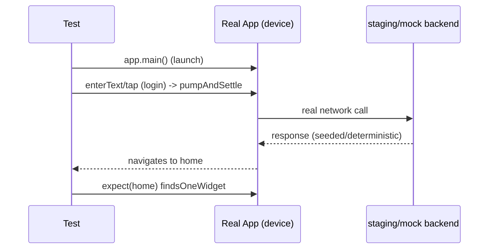

# Integration & E2E Testing

> Integration/E2E tests are the pyramid's **thin tip**: they run the **real app on a real device/emulator** (via the **`integration_test`** package), driving actual user flows end-to-end (launch → login → navigate → act → verify) across the whole stack — real widgets, real navigation, often a **test/staging backend** or seeded fakes. They give the **highest-fidelity confidence** ("the app actually works") but are **slow, broad, and flakier**, so you write **few** of them, only for **critical journeys**. `patrol` extends them to native interactions (permissions, notifications, webviews) `integration_test` can't reach.

## Introduction

This file covers E2E/integration testing: `integration_test` setup, driving real flows, test data/backends, `patrol` for native interactions, and the discipline of keeping E2E few, focused, and reliable. It's the pyramid tip ([01_testing_fundamentals_and_pyramid.md](01_testing_fundamentals_and_pyramid.md)).

## Why this concept exists

Unit + widget tests verify pieces in isolation but not that **the whole app works together** on a real device (real navigation, plugins, platform behavior). E2E tests validate the **actual end-to-end experience** — the ultimate confidence — but their cost (slow, flaky, maintenance) means they must be **rationed** to the flows that truly matter, sitting atop a solid unit/widget base.

## Real-world analogy

E2E is the **full road test of the assembled car**: you actually **drive it through the real route** (start → highway → parking) to confirm the whole thing works as a driver experiences it. It's the most convincing test, but you don't road-test every bolt combination — you road-test the **key journeys**, relying on bench/rig tests (unit/widget) for the rest. Too many road tests = slow, expensive, and every pothole (flake) stalls the line.

## Internal Working

```mermaid
flowchart TD
    Setup[integration_test binding + real app] --> Launch[launch app on device/emulator]
    Launch --> Drive[drive flow: tap/enterText/scroll -> pumpAndSettle]
    Drive --> Verify[assert end-state (finders/matchers)]
    Data[test data: staging backend / seeded fakes / mock server] --> Launch
    Patrol[patrol] --> Native[native: permissions, notifications, webviews, deep links]
    Note[FEW, critical journeys; slow/broad/flakier; highest fidelity]
```

- **`integration_test` package**: the official E2E tool. Tests live in `integration_test/`, use `IntegrationTestWidgetsFlutterBinding.ensureInitialized()`, and drive the **real app** (`app.main()` then interact) on a **device/emulator** — real widgets, navigation, plugins. Run with `flutter test integration_test/...` or on devices/`flutter drive`; runs in CI on emulators/device farms (Firebase Test Lab).
- **Driving flows**: same `WidgetTester` API as widget tests (`tap`/`enterText`/`scrollUntilVisible` + `pumpAndSettle`), but against the **full running app** — so you traverse **multiple screens/features** (login → home → detail → action → verify), exercising the real stack.
- **Test data / backend** (a key decision):
  - **Staging/test backend**: highest fidelity, but slower/flakier + needs seeded, isolated data (reset between runs) to be deterministic.
  - **Seeded fakes / mock server**: swap in a fake network layer or a **local mock server** for determinism/speed while still exercising app integration — a common, more reliable choice.
  - **Reset state** between tests (fresh login/data) to avoid order-dependence + flakiness.
- **`patrol`** (extends `integration_test`): drives **native OS interactions** that `integration_test` can't — **granting/denying permissions**, tapping **system notifications**, interacting with **native webviews**, handling **native dialogs/deep links**, and more robust element selection. Use it when a critical flow crosses into native territory (e.g., "grant camera permission → capture").
- **Keep E2E few + focused (the discipline)**: only **critical user journeys** (onboarding/login, core purchase/checkout, primary feature happy path). E2E is **slow (seconds-minutes), broad (fails don't pinpoint), and flakier** (real async/network/timing) — so a small, curated set, not comprehensive coverage. Everything else → unit/widget.
- **Reliability practices** (E2E is flaky by nature): deterministic test data, `pumpAndSettle`/explicit waits for async (avoid arbitrary `sleep`), retry policy for known-flaky infra, stable finders (keys), isolated/reset state, and running on consistent emulators. Quarantine + fix flaky tests fast (flaky E2E erodes trust).
- **What E2E validates that lower tests can't**: real navigation/routing, plugin/platform behavior, DI wiring end-to-end, cross-feature flows, and "does the assembled app actually work."
- **Performance/other E2E**: `integration_test` can also capture **performance traces** (frame timings) for perf regression checks ([Module 21](../21%20Performance/README.md)).

## Memory Representation

E2E runs the full app process on a device/emulator (real memory/lifecycle). Test data lives in a staging backend or seeded fake/mock server. The test drives the real widget tree and asserts on real rendered elements.

## Compiler Behavior

Integration tests compile the real app + test driver; `patrol` adds native test infrastructure. Tests reference real app entry points (`app.main()`).

## Runtime Behavior

The real app launches + runs on-device; the test drives it via the binding; real async/network/navigation occur (hence slower + flakier). `pumpAndSettle` waits for real frames/async. Perf traces can be collected.

## Flutter Engine Behavior

Uses the **real engine** on a real device/emulator (real rendering/vsync/plugins) — unlike widget tests' fake binding. This is what gives high fidelity and also the slowness/flakiness.

## Dart VM Behavior

Runs the full app in AOT/JIT on-device; serial + slow relative to unit/widget; the reason to keep E2E few.

## Examples

```dart
// integration_test/app_test.dart — drive the REAL app end-to-end
import 'package:integration_test/integration_test.dart';
import 'package:flutter_test/flutter_test.dart';
import 'package:myapp/main.dart' as app;

void main() {
  IntegrationTestWidgetsFlutterBinding.ensureInitialized();

  testWidgets('critical journey: login -> see home', (tester) async {
    app.main();                                   // launch the real app
    await tester.pumpAndSettle();

    await tester.enterText(find.byKey(const Key('email')), 'test@example.com');
    await tester.enterText(find.byKey(const Key('password')), 'secret');
    await tester.tap(find.byKey(const Key('loginBtn')));
    await tester.pumpAndSettle();                 // wait for real navigation/async

    expect(find.byKey(const Key('homeScreen')), findsOneWidget); // end-state assertion
  });
}
// Backend: point at a seeded staging env OR a local mock server for determinism; reset state per run.
```

```dart
// patrol — native interactions integration_test can't do (permissions/notifications)
// patrolTest('grant camera permission then capture', ($) async {
//   await $.native.grantPermissionWhenInUse();   // native permission dialog
//   await $(#capture).tap();
//   expect($(#photoPreview), findsOneWidget);
// });
```

## Diagrams



## Common Mistakes

| Mistake | Why it's wrong | Fix |
|---------|---------------|-----|
| Too many E2E tests | Slow CI, flaky, high maintenance | Few, critical journeys only; push down to unit/widget |
| Non-deterministic test data | Flaky/order-dependent | Seeded/reset staging or mock server |
| Arbitrary `sleep()` for async | Flaky + slow | `pumpAndSettle`/explicit waits |
| Text finders in E2E | Break on copy/localization | Stable `Key` finders |
| Ignoring flaky E2E | Erodes trust in the suite | Quarantine + fix fast; retry known-infra flakes |
| Using E2E for logic coverage | Slow/imprecise | Unit tests for logic |
| Needing native interaction with plain integration_test | Can't grant permissions/tap notifications | Use `patrol` |
| No state reset between tests | Cross-test contamination | Reset app/backend state per test |

## Best Practices

- Keep E2E **few and focused** on **critical journeys** (onboarding/login, checkout, core happy path); rely on the **unit/widget base** for everything else.
- Use **`integration_test`** to drive the **real app** on device/emulator; make it **deterministic** (seeded/reset staging **or** a local mock server, stable `Key` finders, `pumpAndSettle`/explicit waits — no `sleep`).
- Use **`patrol`** when a critical flow needs **native interactions** (permissions, notifications, webviews, deep links).
- **Manage flakiness aggressively** (reset state, consistent emulators, quarantine + fix); run in **CI** (device farm/emulator); optionally capture **perf traces**.

## Performance

E2E is the slow tail (seconds-minutes/test, serial, real device) — the reason for its thin tip. In CI it runs on emulators/device farms, often in parallel across devices but still the pipeline's slow part. Keep the set minimal; push coverage down to fast unit/widget tests to keep CI quick ([01_testing_fundamentals_and_pyramid.md](01_testing_fundamentals_and_pyramid.md)).

## Advantages / Disadvantages

- **+** Highest fidelity ("the app really works"), real navigation/plugins/platform, cross-feature flows, DI wiring validated end-to-end, native flows via patrol, perf traces.
- **−** Slow, broad (imprecise failures), flakier (real async/network/timing), high maintenance, needs test-data strategy + consistent devices; must be rationed.

## Interview Questions

1. **🟢 What do integration/E2E tests verify, and where in the pyramid?** — That the assembled app works end-to-end on a real device (real navigation/plugins/stack); the thin tip — few tests for critical journeys.
2. **🟢 What tool does Flutter use for E2E?** — The `integration_test` package (drives the real app on device/emulator with the `WidgetTester` API); `patrol` extends it for native interactions.
3. **🟡 Why keep E2E tests few?** — They're slow, broad (imprecise failures), and flaky (real async/network/timing) with high maintenance — reserve for critical flows, push the rest to unit/widget.
4. **🟡 How do you make E2E deterministic?** — Seeded/reset staging data or a local mock server, stable `Key` finders, `pumpAndSettle`/explicit waits (no `sleep`), consistent emulators, per-test state reset.
5. **🟡 When do you need `patrol` over `integration_test`?** — For native OS interactions integration_test can't do: granting permissions, tapping system notifications, native webviews/dialogs/deep links.
6. **🔴 What does E2E validate that unit/widget tests can't?** — Real navigation/routing, plugin/platform behavior, end-to-end DI wiring, and cross-feature journeys on the real engine.
7. **🔴 How do you handle E2E flakiness?** — Deterministic data + waits + stable finders + consistent devices; quarantine and fix flaky tests fast (and retry only genuine infra flakes) — flaky E2E erodes trust.

## Senior Engineer Tips

- Ration E2E to the handful of journeys that must never break (login, checkout, core flow); comprehensive E2E coverage is a slow, flaky trap — that's what the unit/widget base is for.
- Kill flakiness at the source: deterministic seeded/mock data, `pumpAndSettle`/explicit conditions instead of `sleep`, stable `Key` finders, and consistent emulators; one ignored flaky test rots the whole suite's credibility.
- Reach for `patrol` only when a critical flow genuinely crosses into native (permissions/notifications); otherwise keep E2E in plain `integration_test`.

## Architect Perspective

Integration/E2E is the confidence capstone of the pyramid: it validates that the assembled app — navigation, plugins, DI, cross-feature flows — actually works on a real device, which no isolated test can. Its cost mandates discipline: a thin, curated set of critical journeys, made deterministic and reliable, atop a broad fast base of unit/widget tests, with `patrol` for native reach. Run in CI, it's the final gate that "it really works" before release — the top of the testing strategy the whole handbook's testable architecture supports ([05_testing_integration.md](05_testing_integration.md), [Module 50](../50%20CI%20CD/README.md), [Module 51](../51%20Deployment/README.md)).

## Summary

- E2E/integration = pyramid tip: `integration_test` drives the real app on a device/emulator through critical journeys (highest fidelity, slow/broad/flakier) — keep them few.
- Make deterministic (seeded/reset staging or mock server, stable `Key` finders, `pumpAndSettle`/explicit waits, consistent emulators, per-test reset); manage flakiness aggressively.
- Use `patrol` for native interactions (permissions/notifications/webviews); run in CI; validates end-to-end navigation/plugins/DI that unit/widget can't.

## Revision Notes

- `integration_test`: `IntegrationTestWidgetsFlutterBinding.ensureInitialized()`, `app.main()`, drive with `WidgetTester` across real screens on device/emulator; run via `flutter test integration_test`/device farm (Firebase Test Lab); can capture perf traces.
- Few + critical journeys only (slow/broad/flaky); deterministic (seeded/reset staging OR mock server, `Key` finders, `pumpAndSettle`/explicit waits — no `sleep`, consistent emulators, reset per test); quarantine/fix flakes.
- `patrol` for native (permissions/notifications/webviews/deep links); validates navigation/plugins/DI/cross-feature end-to-end; run in CI atop a fast unit/widget base.

## Practice Questions

1. Why are E2E tests kept few, and what do they uniquely validate?
2. How do you make an E2E test deterministic?
3. When do you reach for `patrol` instead of `integration_test`?

## Coding Questions

1. Write an `integration_test` driving a login → home critical journey.
2. Make it deterministic (seeded/mock backend + stable finders + waits).
3. Sketch a `patrol` test granting a permission then using the feature.

## Mini Project

**E2E critical journey (Flutter):** Write an `integration_test` driving one critical journey (e.g., login → browse → open detail → back), pointing at a seeded staging env or local mock server for determinism, using `Key` finders + `pumpAndSettle` (no `sleep`) with per-test state reset — and sketch a `patrol` test for a native-permission flow. Keep it to the single critical journey (rely on unit/widget for the rest). Acceptance: real-app E2E of one critical journey; deterministic (seeded/mock data, stable finders, proper waits, reset); flakiness managed; `patrol` used only for native; sits atop a fast unit/widget base (thin tip); runnable in CI.
