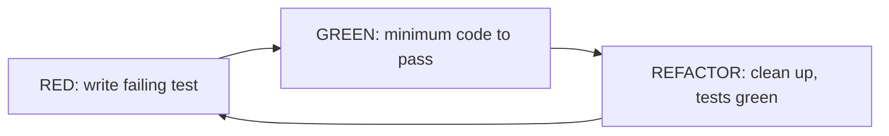

# Unit Testing, Mocking & TDD

> Unit tests verify a **single unit** (a function/class) in **isolation**, fast and deterministic — which requires **replacing its dependencies** with **test doubles**: **fakes** (working lightweight implementations — preferred), **mocks** (record/verify interactions — `mocktail`/`mockito`), and **stubs** (canned return values). The structure is **Arrange-Act-Assert** (`test('...', () { setup; act; expect })`), with `group` for organization and `setUp`/`tearDown` for shared fixtures. **TDD** (red → green → refactor) writes the test first to drive design. The golden rules: **isolate** (no real I/O), assert **behavior**, and **prefer fakes over mocks** where practical (less brittle).

## Introduction

This file covers writing fast, isolated unit tests: structure (AAA, groups, setup), test doubles (fakes/mocks/stubs) and when to use each, mocktail basics, and the TDD cycle. It's the base of the pyramid ([testing_fundamentals_and_pyramid.md](testing_fundamentals_and_pyramid.md)) — where most tests and confidence live.

## Why this concept exists

To test a unit in isolation you must remove its real dependencies (network, DB, other classes) — otherwise tests are slow, flaky, and non-deterministic, and a failure doesn't pinpoint the unit. Test doubles provide controlled stand-ins so you can drive the unit through every scenario (success/failure/edge) fast and deterministically. TDD uses tests to shape the code before writing it.

## Real-world analogy

Unit testing with doubles is **bench-testing a car's ECU with a signal simulator**: you don't hook it to a real running engine (slow, dangerous, non-deterministic) — you feed it **simulated sensor inputs** (fakes/stubs) and verify its outputs, and sometimes check it **sent the right command** to a simulated actuator (mock). TDD is **writing the acceptance criteria before building the part**, so the part is built to pass.

## Internal Working

```mermaid
flowchart TD
    Unit[unit under test] --> Doubles{replace dependencies}
    Doubles -->|working lightweight impl| Fake[Fake (preferred)]
    Doubles -->|record/verify calls| Mock[Mock (mocktail/mockito)]
    Doubles -->|canned returns| Stub[Stub]
    Unit --> AAA[Arrange -> Act -> Assert]
    AAA --> Behavior[assert observable behavior/output/state]
    TDD[TDD: red -> green -> refactor] --> Unit
```

- **Unit test structure (AAA)**: **Arrange** (set up the unit + doubles + inputs), **Act** (call the method), **Assert** (`expect(actual, matcher)`). Use `group('...', () {...})` to organize and `setUp`/`tearDown` for shared fixtures. `flutter_test`/`package:test` provide `test`, `expect`, and rich **matchers** (`equals`, `isA<T>`, `throwsA`, `contains`, `predicate`).
- **Async tests**: mark the callback `async` and `await`; use `expectLater(future, completion(...))`/`emitsInOrder([...])` for futures/streams.
- **Test doubles**:
  - **Fake** (**preferred**): a **working, lightweight implementation** (an in-memory repository, a fixed `Clock`). Behaves like the real thing for the test, isn't brittle, and often reusable. Best default.
  - **Stub**: returns **canned values** for calls (no verification) — for driving scenarios.
  - **Mock**: records calls and lets you **verify interactions** (`verify(() => x.foo(any())).called(1)`) and stub returns (`when(() => x.foo()).thenAnswer(...)`) — use when the **interaction itself is the behavior** (e.g., "the repository's save was called").
  - **Dummy**: passed but unused.
  - **Prefer fakes/stubs over mocks** where practical — mock-heavy tests couple to implementation (which methods were called) and become brittle; verify interactions only when they *are* the contract.
- **mocktail** (null-safe, no codegen — common choice): `class MockRepo extends Mock implements Repo {}`; `when(() => repo.get(any())).thenAnswer((_) async => Success(x));`; `verify(() => repo.save(any())).called(1);`; `registerFallbackValue(...)` for custom `any()` types. (`mockito` is similar but needs codegen.)
- **Isolation is mandatory**: **no real network/DB/file/time** in unit tests — inject fakes at the boundaries (repository interfaces, `Clock`, etc.), which the architecture provides ([Module 40](../40%20Clean%20Architecture/README.md)/[Module 14](../14%20Dependency%20Injection/README.md)). Isolated → fast, deterministic, parallelizable.
- **TDD (red-green-refactor)**: (1) **red** — write a failing test for the desired behavior; (2) **green** — write the minimum code to pass; (3) **refactor** — clean up with the test as a safety net. Drives simple, testable design and full coverage of intended behavior. Use it where design is unclear/logic is important; pragmatic (not dogmatic) — not every line needs strict TDD.
- **Cover scenarios**: success, failure/errors, empty, boundary/edge cases — the unhappy paths where bugs live ([Module 38](../38%20Error%20Handling/README.md)).
- **Good tests**: **fast, isolated, deterministic, readable, one behavior per test**, descriptive names (`emits error when repository fails`).

## Memory Representation

Test doubles are objects: fakes hold in-memory state, mocks record call events + stubbed responses, stubs hold canned returns. The test holds the unit + its doubles; assertions inspect returned values/state (or, for mocks, recorded calls). No real I/O objects.

## Compiler Behavior

Mocks/fakes implement the dependency's interface (compile-checked). mocktail needs no codegen; mockito generates mock classes (`build_runner`). Injecting fakes requires the unit to depend on **abstractions** (interfaces) — the DIP payoff.

## Runtime Behavior

Unit tests run in the Dart VM in milliseconds, deterministically (no I/O/time/randomness unless faked). Async tests await futures/streams. Failures pinpoint the unit.

## Flutter Engine Behavior

Not applicable — pure unit tests don't touch the engine (that's widget/integration tests).

## Dart VM Behavior

Fastest test tier (no binding); parallelizable in CI. Fakes/mocks are cheap objects.

## Examples

```dart
import 'package:mocktail/mocktail.dart';
import 'package:flutter_test/flutter_test.dart';

// FAKE (preferred) — a working in-memory repository
class FakeOrderRepo implements OrderRepository {
  final _store = <String, Order>{};
  @override Future<Order?> findById(String id) async => _store[id];
  @override Future<void> save(Order o) async => _store[o.id] = o;
}

// MOCK (for interaction verification) — mocktail, no codegen
class MockOrderRepo extends Mock implements OrderRepository {}

void main() {
  group('PlaceOrder use case', () {
    late FakeOrderRepo repo;
    setUp(() => repo = FakeOrderRepo());              // shared fixture

    test('saves a placed order (fake: assert state)', () async {   // AAA
      await repo.save(Order.draft('1'));                            // Arrange
      final uc = PlaceOrder(repo);
      final r = await uc('1');                                      // Act
      expect(r, isA<Success>());                                    // Assert (behavior)
      expect((await repo.findById('1'))!.status, OrderStatus.placed);
    });

    test('returns Failure on empty order (unhappy path)', () async {
      final uc = PlaceOrder(FakeOrderRepo());
      expect(await uc('missing'), isA<Failure>());
    });

    test('mock: verifies save was called once (interaction is the contract)', () async {
      final mock = MockOrderRepo();
      when(() => mock.findById(any())).thenAnswer((_) async => Order.draftWithLines('1'));
      when(() => mock.save(any())).thenAnswer((_) async {});
      await PlaceOrder(mock)('1');
      verify(() => mock.save(any())).called(1);       // verify interaction
    });
  });
}
```

```text
TDD cycle (red -> green -> refactor):
  1. RED:      write `test('applies 10% discount over $100', ...)` -> fails (no code)
  2. GREEN:    implement the minimum discount logic -> test passes
  3. REFACTOR: clean up the code; tests stay green (safety net)
```

## Diagrams



## Common Mistakes

| Mistake | Why it's wrong | Fix |
|---------|---------------|-----|
| Real network/DB/time in unit tests | Slow, flaky, non-deterministic | Inject fakes at boundaries |
| Mock-heavy tests (verify everything) | Brittle; couples to implementation | Prefer fakes; verify only true-contract interactions |
| Testing implementation details | Breaks on refactor | Assert behavior/output/state |
| Only happy-path tests | Bugs live in errors/edges | Cover failure/empty/boundary |
| Multiple behaviors per test | Hard to diagnose | One behavior per test |
| Shared mutable state across tests | Flaky, order-dependent | Fresh fixtures in `setUp` |
| Vague test names | Poor docs | Descriptive (`emits error when repo fails`) |
| Forgetting async await | False passes | `async`/`await`, `expectLater` |

## Best Practices

- Structure tests **AAA** (Arrange-Act-Assert), one **behavior per test**, descriptive names, `group` + `setUp`/`tearDown` for fixtures; use rich **matchers** and `expectLater`/`emitsInOrder` for async/streams.
- **Isolate**: no real I/O/time/randomness — inject **fakes** at boundaries (repository interfaces, `Clock`); **prefer fakes/stubs over mocks**, verifying interactions only when the interaction **is** the contract.
- Cover **happy + unhappy paths** (success/failure/empty/edge); assert **behavior, not internals**; keep tests fast + deterministic (parallelizable in CI).
- Use **TDD (red-green-refactor)** to drive design where logic/design is important — pragmatically, not dogmatically.

## Performance

Unit tests are the fast tier (ms) and parallelize in CI — the whole point of isolation. Fakes/mocks are cheap. Real I/O in "unit" tests is the classic slowdown/flakiness source; keep it out. Fast unit tests = tight feedback loops ([Module 47](../47%20Scalable%20Applications/README.md)).

## Advantages / Disadvantages

- **+** Fast, isolated, deterministic, precise-failure, parallelizable; exhaustive scenario coverage; TDD-driven design.
- **−** Requires testable design (interfaces/DI); mock overuse → brittleness; writing/maintaining tests costs effort; TDD has a learning curve.

## Interview Questions

1. **🟢 What makes a good unit test?** — Fast, isolated (no real I/O), deterministic, one behavior per test, descriptive name, asserting observable behavior.
2. **🟢 Fake vs mock vs stub?** — Fake = working lightweight impl (preferred); stub = canned returns; mock = records/verifies interactions — use mocks only when the interaction is the contract.
3. **🟡 Why prefer fakes over mocks?** — Mocks couple tests to implementation (which methods were called) → brittle; fakes behave like the real thing and survive refactors.
4. **🟡 How do you isolate a unit that uses network/DB/time?** — Depend on abstractions (repository interface, `Clock`) and inject fakes — the DIP/DI payoff.
5. **🟡 What is the AAA structure?** — Arrange (setup + doubles + inputs), Act (call the method), Assert (`expect`).
6. **🔴 Describe the TDD cycle and when to use it.** — Red (failing test) → green (minimum code) → refactor (clean up, tests green); use where logic/design matters, pragmatically.
7. **🔴 What scenarios must unit tests cover beyond happy path?** — Failure/errors, empty, boundary/edge cases — where most bugs live.

## Senior Engineer Tips

- Reach for a fake before a mock; write a small reusable in-memory fake for each repository interface, and only use mocks/`verify` when "it called save once" is genuinely the behavior you're asserting.
- Keep unit tests hermetic — no real clock, network, DB, or randomness; inject a `Clock`/fakes so tests are deterministic and parallel-safe.
- Name tests as behaviors and cover the unhappy paths first; those are where regressions actually happen, and good names make the suite double as documentation.

## Architect Perspective

Unit tests + test doubles are the base of the pyramid and the direct dividend of a testable architecture: because domain/data/presentation depend on abstractions, you inject fakes and drive every scenario fast and deterministically. Preferring fakes over mocks keeps tests behavior-focused and refactor-resilient; TDD uses them to shape design. This fast, isolated base is what makes CI quick, refactoring safe, and the whole pyramid work ([testing_fundamentals_and_pyramid.md](testing_fundamentals_and_pyramid.md), [Module 40](../40%20Clean%20Architecture/README.md), [Module 43](../43%20MVVM/README.md)).

## Summary

- Unit tests verify one unit in isolation (fast/deterministic) via AAA, using test doubles — prefer fakes (working impls) over mocks (interaction verification), stubs for canned returns.
- Isolate (no real I/O/time) by injecting fakes at abstraction boundaries; assert behavior; cover happy + unhappy paths; use mocktail (no codegen).
- TDD (red-green-refactor) drives design pragmatically; keep tests fast, deterministic, one-behavior, well-named.

## Revision Notes

- Structure: AAA + `group`/`setUp`/`tearDown`; matchers (`isA`, `throwsA`, `equals`), async `await`/`expectLater`/`emitsInOrder`.
- Doubles: fake (working impl, preferred) > stub (canned) > mock (verify interactions — mocktail: `when(...).thenAnswer`, `verify(...).called(n)`, `registerFallbackValue`). Prefer fakes; verify only true-contract interactions.
- Isolate (no real I/O/time → inject fakes at interfaces/`Clock`); assert behavior not internals; cover happy + unhappy; TDD red-green-refactor (pragmatic); fast/deterministic/parallelizable.

## Practice Questions

1. When do you use a mock vs a fake?
2. How do you keep a unit test deterministic when the unit uses the network?
3. Walk through a TDD cycle for a small feature.

## Coding Questions

1. Write AAA unit tests (success + failure) for a use case using a fake repo.
2. Use mocktail to verify a repository interaction where the interaction is the contract.
3. Implement a small feature via TDD (red-green-refactor).

## Mini Project

**Unit test suite + TDD (Flutter):** For a use case + repository, write an in-memory **fake** repository and unit tests (AAA) covering success/failure/empty/edge, plus one **mock**-based test where verifying an interaction (`save` called once) is the contract, all isolated (no real I/O). Then TDD one new rule (red → green → refactor). Acceptance: fake-based isolated tests (no real I/O/time); AAA + descriptive names + one behavior each; happy + unhappy paths; mock used only for a true-contract interaction; a TDD'd rule with passing tests; fast + deterministic.
