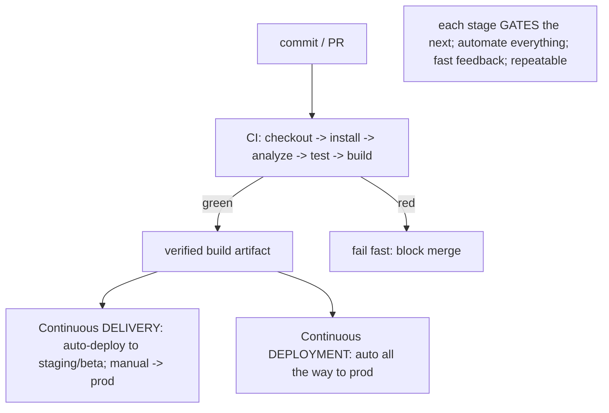
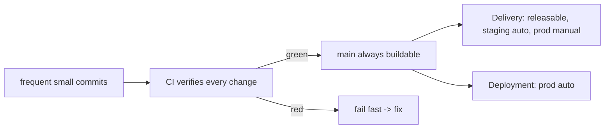

# CI/CD Fundamentals

> **CI (Continuous Integration)** = every change is **automatically integrated + verified** (analyze/test/build) on a shared branch, frequently, so problems surface immediately. **CD** means either **Continuous Delivery** (every green build is **releasable**, deployed to a staging/beta track automatically, with a manual push to production) or **Continuous Deployment** (every green build goes **all the way to production** automatically). The pipeline is a sequence of **stages** (checkout → install → analyze → test → build → sign → deploy) where **each stage gates the next** — a failure stops the line. The principles: **automate everything, fast feedback, fail fast, and make it repeatable/reproducible**.

## Introduction

This file defines CI, CD (delivery vs deployment), the pipeline-stage model, and the guiding principles — the conceptual frame before building actual pipelines. It clarifies the terminology teams constantly conflate.

## Why this concept exists

Manual integration + release is slow, inconsistent, and risky: bugs merge undetected, "works on my machine" diverges from production, and releases become fragile rituals. CI/CD encodes the build-test-release path as **automated, gated, repeatable** stages so integration problems surface in minutes and releases become routine — the foundation of modern delivery.

## Real-world analogy

CI/CD is an **automated assembly line with quality gates**: each part is **checked as it's added** (CI — analyze/test), and a car only advances to the next station if it **passes inspection** (stage gating); a failed inspection **stops the line** (fail fast). **Continuous Delivery** = every finished car is ready to ship but a manager gives the final "ship it"; **Continuous Deployment** = finished cars roll straight to customers automatically. The line is **repeatable** — every car built the same way.

## Internal Working



- **Continuous Integration (CI)**: developers **integrate frequently** (small, frequent merges) into a shared branch; **every change triggers an automated pipeline** (analyze/lint → test → build) that **verifies** it. Goal: catch integration problems **immediately**, keep the main branch **always green + buildable**.
- **Continuous Delivery vs Deployment (CD — know the difference)**:
  - **Continuous Delivery**: every green build is **automatically made releasable** and deployed to a **staging/beta** environment; **promotion to production is a manual (one-click) decision**. Most mobile teams do this (store review + business timing).
  - **Continuous Deployment**: every green build goes **automatically to production** — no manual gate. Common on the web/backend; **rarer for mobile** (app-store review, release cadence) but achievable for staged rollouts.
- **Pipeline stages (each gates the next)**: **checkout** → **install deps** (`pub get`) → **static analysis** (`flutter analyze`/lint) → **test** (unit/widget, then integration) → **build** (per platform/flavor) → **sign** → **deploy** (track/store). A failure at any stage **stops the pipeline** (fail fast) — no bad artifact proceeds.
- **Triggers**: pipelines run on events — **PR** (analyze + fast tests), **push to main/merge** (full build), **tag/release** (build + sign + deploy), **schedule** (nightly E2E). Different triggers → different stages ([02_ci_pipeline_and_automation.md](02_ci_pipeline_and_automation.md)).
- **Core principles**:
  - **Automate everything** (build/test/sign/release) — no manual, error-prone steps.
  - **Fast feedback**: PR pipelines must be **quick** (analyze + unit/widget) so devs learn in minutes; heavy stages (E2E, full builds) run later/less often.
  - **Fail fast**: stop on the first failure; surface it clearly.
  - **Repeatable/reproducible**: same inputs → same result (pinned tool versions, clean environments, no hidden local state) — kills "works on my machine."
  - **Merge gating**: a PR can't merge unless the pipeline is green (protected branches).
  - **Small, frequent integrations**: reduce merge pain + risk.
- **Tools (overview)**: **GitHub Actions**/**GitLab CI** (general, config-as-code), **Codemagic**/**Bitrise** (Flutter/mobile-specialized: signing, store deploy built-in), **Fastlane** (build/sign/release automation, often invoked by the above). Choice is covered in [02_ci_pipeline_and_automation.md](02_ci_pipeline_and_automation.md)/[04_cd_release_automation.md](04_cd_release_automation.md).
- **Why it matters at scale**: CI/CD makes **testing enforceable** (gate), **releases routine** (automated), and **team scaling possible** (parallel work verified continuously — [Module 47](../47%20Scalable%20Applications/README.md)).

## Memory Representation

Not runtime — a **pipeline definition** (config-as-code: stages, triggers, gates) + a run history (each commit's pipeline result). The invariant: main is always green + buildable; each stage gates the next.

## Compiler Behavior

Pipelines invoke the compiler/build (`flutter build`, `analyze`); reproducibility requires **pinned tool versions** (Flutter/Dart SDK) so builds are deterministic across environments.

## Runtime Behavior

Stages run sequentially (or with parallel jobs), gating on exit codes; a non-zero exit stops the pipeline. Delivery deploys to staging automatically; deployment continues to production automatically.

## Flutter Engine Behavior

Not applicable (pipelines build/test Flutter; they don't run its engine specially — except integration tests on emulators — [Module 49](../49%20Testing/README.md)).

## Dart VM Behavior

Not applicable beyond running Dart tests/builds; incremental/monorepo builds speed pipelines ([Module 45](../45%20Modular%20Architecture/README.md)).

## Examples

```text
Pipeline stages (each gates the next):
  checkout -> pub get -> flutter analyze -> flutter test -> flutter build (flavor) -> sign -> deploy
  (fail at any stage -> STOP the pipeline)

Trigger -> stages:
  PR              -> analyze + unit/widget tests            (fast feedback, merge gate)
  merge to main   -> + build signed artifact + deploy beta  (Continuous Delivery)
  tag v1.2.0      -> + deploy to production track (staged)   (Delivery: manual promote / Deployment: auto)
  nightly         -> integration/E2E on emulators
```

```text
Delivery vs Deployment:
  Continuous Delivery:   green build -> auto to staging/beta -> MANUAL one-click to prod  (typical mobile)
  Continuous Deployment: green build -> AUTO all the way to prod                          (rarer for mobile)
```

## Diagrams



## Common Mistakes

| Mistake | Why it's wrong | Fix |
|---------|---------------|-----|
| Conflating Delivery and Deployment | Different automation of prod | Delivery = manual prod gate; Deployment = auto prod |
| No merge gating | Bad code lands on main | Protected branch requires green pipeline |
| Slow PR pipelines | Poor feedback, devs bypass | Fast stages on PR; heavy stages later |
| Non-reproducible builds | "Works on my machine" | Pin tool versions, clean environments |
| Manual build/sign/release steps | Error-prone, not scalable | Automate everything |
| One giant stage (no gating) | Can't fail fast/pinpoint | Distinct gated stages |
| Rare, big integrations | Merge hell, late bugs | Small, frequent integrations |

## Best Practices

- **Integrate frequently** (small merges) and **verify every change** with an automated pipeline; keep **main always green + buildable** via **merge gating**.
- Model the pipeline as **gated stages** (checkout → install → analyze → test → build → sign → deploy) that **fail fast**; run **fast stages on PRs** (analyze + unit/widget) and **heavy stages** (E2E, full builds/deploy) on merge/tag/nightly.
- **Automate everything** (build/test/sign/release) and make it **reproducible** (pinned tool versions, clean environments).
- Choose **Delivery vs Deployment** deliberately (mobile usually Delivery: auto-to-staging, manual prod); pick tools (GH Actions/Codemagic/Fastlane) to fit.

## Performance

Pipeline speed is the KPI: fast PR feedback (analyze + unit/widget in minutes) keeps developers in flow; caching + incremental/monorepo runs keep CI fast at scale ([02_ci_pipeline_and_automation.md](02_ci_pipeline_and_automation.md)/[Module 45](../45%20Modular%20Architecture/README.md)). Slow pipelines get bypassed; fast, reliable ones get trusted.

## Advantages / Disadvantages

- **+** Immediate integration feedback, always-green main, repeatable + automated builds/releases, faster + safer shipping, enables team scaling.
- **−** Setup + maintenance (pipelines, secrets, signing), CI infra cost/time, requires discipline (frequent small merges, green-before-merge), mobile prod-gate nuances.

## Interview Questions

1. **🟢 What is Continuous Integration?** — Frequently integrating changes into a shared branch, each automatically verified (analyze/test/build), so integration problems surface immediately and main stays green.
2. **🟢 Continuous Delivery vs Continuous Deployment?** — Delivery: every green build is releasable + auto-deployed to staging, with a manual push to prod; Deployment: every green build goes automatically to prod.
3. **🟡 What are the typical pipeline stages, and how do they relate?** — checkout → install → analyze → test → build → sign → deploy; each gates the next, and a failure fails fast (stops the line).
4. **🟡 Why do different triggers run different stages?** — Fast feedback: PRs run fast stages (analyze + unit/widget); merges/tags run heavy stages (full build, deploy); nightly runs E2E — keeping PR pipelines quick.
5. **🟡 What makes a pipeline reproducible, and why care?** — Pinned tool versions + clean environments + no hidden local state → deterministic builds, eliminating "works on my machine."
6. **🔴 Why is Continuous Deployment rarer for mobile?** — App-store review, release cadence, and business timing usually require a manual production gate (Delivery), though staged rollouts approximate automation.
7. **🔴 What are the core CI/CD principles?** — Automate everything, fast feedback, fail fast, reproducibility, merge gating, and small frequent integrations.

## Senior Engineer Tips

- Get the terminology right and design intent accordingly: most mobile teams do Continuous Delivery (auto-to-staging, manual prod), not full Continuous Deployment — say which you mean.
- Keep PR pipelines fast (analyze + unit/widget) and push heavy work (E2E, full builds, deploy) to merge/tag/nightly; a slow PR pipeline is the fastest way to get developers to route around CI.
- Make builds reproducible (pin the Flutter/Dart SDK, clean runners) from day one; non-deterministic CI is a trust-destroyer that surfaces at the worst time.

## Architect Perspective

CI/CD is the delivery backbone: it turns the build-test-release path into automated, gated, reproducible stages so integration problems surface instantly and releases become routine. The fundamentals — automate everything, fast feedback, fail fast, reproducibility, merge gating — are what make testing enforceable, releases safe, and team scaling viable. Getting the stage model + Delivery-vs-Deployment intent right sets up the concrete pipeline, signing, and release automation that follow ([02_ci_pipeline_and_automation.md](02_ci_pipeline_and_automation.md), [04_cd_release_automation.md](04_cd_release_automation.md), [Module 49](../49%20Testing/README.md), [Module 47](../47%20Scalable%20Applications/README.md)).

## Summary

- CI = auto-integrate + verify every change (analyze/test/build), keep main green; CD = Delivery (auto-to-staging, manual prod) or Deployment (auto-to-prod).
- Pipeline = gated stages (checkout→install→analyze→test→build→sign→deploy) that fail fast; different triggers (PR/merge/tag/nightly) run different stages.
- Principles: automate everything, fast feedback, fail fast, reproducible, merge-gated, small frequent integrations.

## Revision Notes

- CI = frequent integration + automated verify (analyze/test/build), main always green + gated merges. CD: Delivery (green→staging auto, prod manual — typical mobile) vs Deployment (green→prod auto).
- Stages (gate next, fail fast): checkout → pub get → analyze → test → build (flavor) → sign → deploy. Triggers→stages: PR (fast: analyze+unit/widget), merge (build+beta), tag (prod/staged), nightly (E2E).
- Principles: automate everything, fast feedback, fail fast, reproducible (pin SDK/clean env), merge gating, small frequent integrations. Tools: GH Actions/GitLab CI (general), Codemagic/Bitrise (mobile), Fastlane (build/sign/release).

## Practice Questions

1. Distinguish Continuous Delivery from Continuous Deployment.
2. What are the pipeline stages, and what does "each gates the next" mean?
3. Why run different stages on PR vs tag vs nightly?

## Coding Questions

1. List the stages for a Flutter PR pipeline vs a release pipeline.
2. Define which triggers run which stages for a mobile app.
3. Identify a non-reproducible-build risk and how to fix it.

## Mini Project

**Pipeline design (Flutter/CI-CD):** Design (on paper) a CI/CD pipeline: define the stages (checkout→install→analyze→test→build→sign→deploy), map triggers to stages (PR fast feedback, merge→beta, tag→prod, nightly→E2E), decide Delivery vs Deployment (with the prod gate), and list the principles you're applying (fast feedback, fail fast, reproducibility, merge gating). Acceptance: gated stages with fail-fast; trigger→stage mapping (fast PR, heavier later); Delivery-vs-Deployment decision justified; reproducibility + merge-gating addressed; principles applied.
